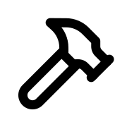

  

# Hephaestus - A Framework to Support Novice Software Engineers in Collaborative Environments

Hephaestus /hɪˈfɛstəs/ is the Greek god of blacksmiths, craftsmen, and artisans, symbolizing the fusion of creativity and technical skill.

## Documentation

Technical/user docs: [Read the Docs](https://ls1intum.github.io/Hephaestus/)  
UI component docs: [Storybook](https://develop--66a8981a27ced8fef3190d41.chromatic.com/)
