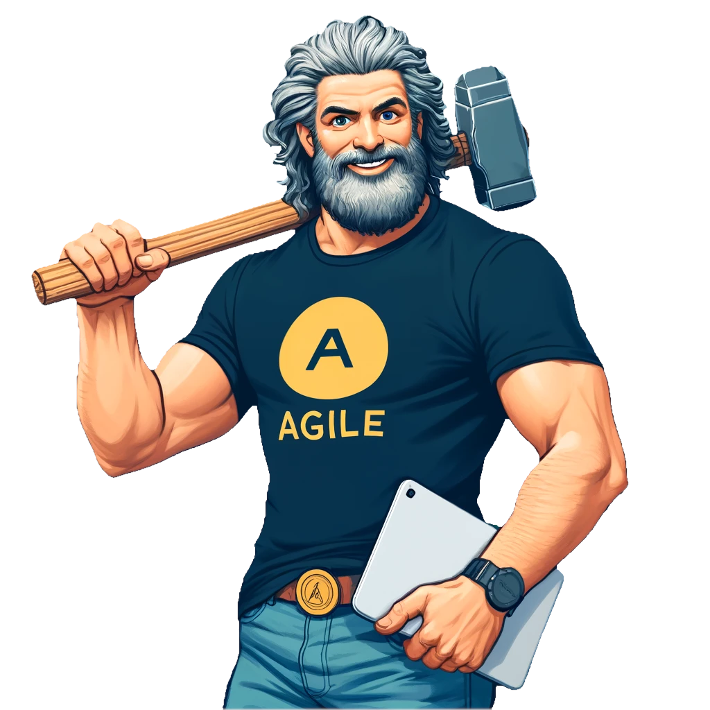

<div align="center">
  

  [](https://github.com/ls1intum/Hephaestus/actions/workflows/cicd.yml)
  [](https://github.com/ls1intum/Hephaestus/blob/main/LICENSE)
  [](https://ls1intum.github.io/Hephaestus/)
  [](https://github.com/ls1intum/Hephaestus/blob/main/CONTRIBUTING.md)
</div>

# Hephaestus — How You Build Matters

Hephaestus is an open-source practice analytics platform that detects anti-patterns in how teams collaborate, coaches individual contributors, and tracks improvement over time — not dashboards for managers. Currently ingests GitHub activity (PRs, reviews, commits, issues) and delivers feedback through an AI mentor, Slack digests, and in-app notifications. Grounded in Cognitive Apprenticeship theory (Collins et al., 1989).



Hephaestus /hɪˈfɛstəs/ is the Greek god of blacksmiths, craftsmen, and artisans, symbolizing the fusion of creativity and technical skill.

> Currently deployed for software engineering teams using GitHub, with a domain model designed for cross-domain extension.

## How It Works

```
Observe  →  Detect  →  Guide  →  Grow
```

1. **Observe**: Ingest activity from development platforms into a unified stream (currently: GitHub via webhooks)
2. **Detect**: Rule-based and LLM-powered checks flag anti-patterns (e.g., empty PR descriptions, rubber-stamp approvals)
3. **Guide**: Findings surface via AI mentor chat, Slack digests, email, or achievement unlocks
4. **Grow**: Leaderboards, achievement tiers, and league rankings track engagement over time

### Four Health Dimensions

| Dimension | What it measures | Example |
|-----------|-----------------|---------|
| **Technical** | Code and review quality | Are reviews thorough? Are bad practices declining? |
| **Process** | Workflow effectiveness | Are PRs timely? Is work-in-progress manageable? |
| **Social** | Collaboration patterns | Is review load shared? Do people collaborate across teams? |
| **Cognitive** | Understanding and growth | Are contributors building understanding — not just shipping faster? |

## Features

### Practice Detection

LLM-powered checks flag anti-patterns in how contributors collaborate and document their work — currently analyzing PR descriptions, review comments, and commit patterns. Early-stage work gets lighter checks; finished work gets rigor. Contributors stay in control: accept, dismiss, or challenge any finding.

### AI Mentor (Heph)

A chat-based AI mentor that helps contributors reflect on their work, set goals, and plan improvement — grounded in their actual activity data (PRs, reviews, leaderboard standing). Generates shareable session summaries.

### Recognition & Growth

Leaderboards rank contributors by engagement and practice quality. A league system tracks longer-term progression. Weekly Slack digests highlight standout contributors.

### Agent Orchestration

Run AI coding agents (Claude Code, Codex, OpenCode) in sandboxed containers with configurable LLM providers, resource limits, and concurrency caps. Agents participate in the same activity stream as other contributors, receiving project context to produce better artifacts.

## Domain Model

Eight domain-independent concepts form the analytical pipeline — **Observe → Detect → Guide → Grow**:

```
Participant → performs → Activity → on → Artifact
                              ↓
                     aggregates into → Signal ← detects ← Practice
                              ↓                               ↓
                   triggers → Guidance → targets → Participant
                              ↓
                        feeds → Trajectory ← tracked over ← Practice

All scoped to: Project
```

| Concept | Description | Software instance |
|---------|-------------|-------------------|
| **Project** | Bounded endeavor with goals and norms | Workspace / Repository |
| **Participant** | Person or agent developing practice | Developer, Bot |
| **Artifact** | Tangible work product | PR, Review, Issue, Comment |
| **Activity** | Immutable record of what happened | ActivityEvent |
| **Practice** | Named behavioral pattern | "Gives substantive reviews" |
| **Signal** | Quantified health measure along a dimension | Review thoroughness: 0.85 |
| **Guidance** | Coaching response grounded in a CA method | PR comment, mentor prompt |
| **Trajectory** | Developmental arc over time | Improving social health |

See the full [Conceptual Model](https://ls1intum.github.io/Hephaestus/contributor/conceptual-model) for cross-domain instantiation, architecture diagrams, and the Cognitive Apprenticeship mapping.

## Architecture

```
┌──────────────────────────────────────────────────────┐
│  Hephaestus Platform                                 │
│                                                      │
│  Web App          Application Server   Webhook Ingest│
│  (React 19)  ───▶ (Spring Boot 3.5) ◀── (Hono)     │
│       │                  │                    ▲      │
│       ▼                  ▼                    │      │
│  Intelligence Service (Hono · LangGraph)      │      │
└───────────────────────┬───────────────────────┘      │
                        │                              │
    ┌───────────────────┼──────────────────┐           │
    ▼                   ▼                  ▼           │
 Data Infra       Platform Services    Code Platforms──┘
 PostgreSQL       Keycloak · Slack     GitHub · GitLab
 NATS             LLM · Langfuse
```

## Roadmap

- **Practice Detection**: Broaden practice coverage beyond description quality to include review depth, commit patterns, and issue management
- **PR Comments**: Post coaching feedback directly on pull requests (CA coaching at point of work)
- **Good Practice Recognition**: Detect and reinforce beneficial patterns, not just flag anti-patterns
- **Health Signals**: Explicit multi-dimensional health model with confidence scores
- **Trajectories**: Track developmental arcs with phase detection and adaptive fading
- **GitLab Integration**: Full parity with GitHub for self-hosted educational deployments
- **Generalization**: Validate the framework beyond software engineering (design, research, course projects)

## Documentation

Technical & user docs (GitHub Pages): [https://ls1intum.github.io/Hephaestus/](https://ls1intum.github.io/Hephaestus/)
UI component docs: [Storybook](https://main--66a8981a27ced8fef3190d41.chromatic.com/)

### Setup

Read the [local development guide](https://ls1intum.github.io/Hephaestus/contributor/local-development) for server, intelligence service, and the React client in `webapp`.

## Contributing

We welcome contributions from both members of our organization and external contributors. To maintain transparency and trust:

- **Members**: Must use their full real names and upload a professional and authentic profile picture. Members can directly create branches and PRs in the repository.
- **External Contributors**: Must adhere to our identity guidelines, using real names and authentic profile pictures. Contributions will only be considered if these guidelines are followed.

We adhere to best practices as recommended by [GitHub's Open Source Guides](https://opensource.guide/) and their [Acceptable Use Policies](https://docs.github.com/en/site-policy/acceptable-use-policies). Thank you for helping us create a respectful and professional environment for everyone involved.

We follow a pull request contribution model. For detailed guidelines, please refer to our [CONTRIBUTING.md](./CONTRIBUTING.md).
