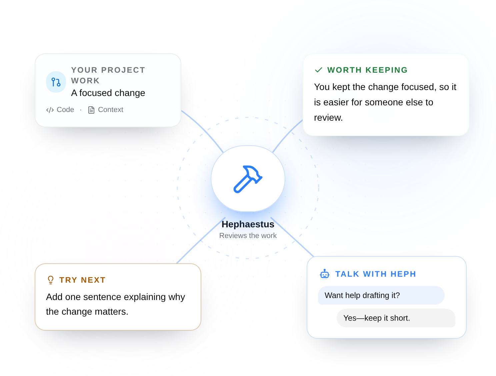
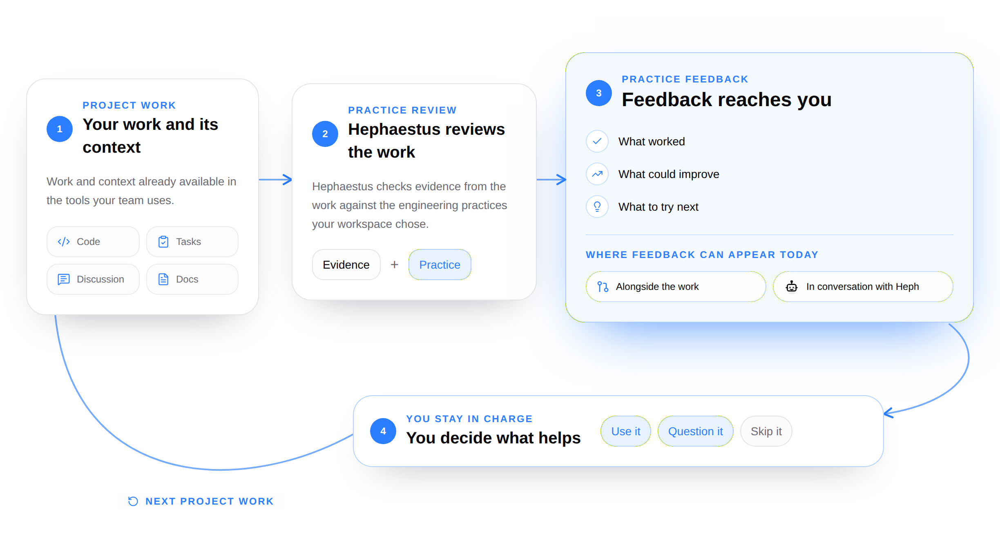

  <picture>
    <source media="(prefers-color-scheme: dark)" srcset="./docs/static/img/brand/hammer_bg_dark.svg">
    <source media="(prefers-color-scheme: light)" srcset="./docs/static/img/brand/hammer_bg.svg">
    
  </picture>

  <h1>Hephaestus</h1>
  
<strong>Feedback on how you work</strong>

  

    
    
    
  

  

    
    
    
  

Hephaestus gives developers feedback on the engineering practices they use in software projects. It draws on evidence from tools the team already uses — including GitHub or GitLab activity, selected Slack channels, and Outline documents — to explain what worked, what could improve, and what to try next.

  <picture>
    <source media="(max-width: 520px) and (prefers-color-scheme: dark)" srcset="./docs/images/readme/landing-feedback-preview-mobile-dark.png">
    <source media="(max-width: 520px) and (prefers-color-scheme: light)" srcset="./docs/images/readme/landing-feedback-preview-mobile-light.png">
    <source media="(prefers-color-scheme: dark)" srcset="./docs/images/readme/landing-feedback-preview-dark.png">
    <source media="(prefers-color-scheme: light)" srcset="./docs/images/readme/landing-feedback-preview-light.png">
    
  </picture>
  
One example of practice feedback and a follow-up with Heph.

Hephaestus is built for software engineering courses, open-source projects, and teams where mentors and maintainers cannot review every contribution themselves.

## What Hephaestus does

- **Practice feedback.** Hephaestus uses AI to review pull requests, merge requests, and issues against the engineering practices configured for a workspace. It can post the feedback as comments on the work.
- **Heph, the AI mentor.** Developers can talk with Heph about feedback and recent issues, commits, reviews, and pull or merge requests. Heph is available in the web app and, when connected, in Slack.
- **Project context.** Workspace admins can let Hephaestus use messages from selected, visibly monitored Slack channels and documents from selected Outline collections. Outline is a source of context; Hephaestus does not write to it.
- **Workspaces.** Each workspace connects its own repositories, chooses its practice catalog, connects an AI model through any OpenAI-compatible endpoint, sets a monthly spending cap, and manages its members and teams.
- **Optional recognition.** Workspace admins can enable achievements, leagues, a weekly leaderboard, and Slack digests of review activity.

## How feedback works

The loop starts with a developer's project work and the context around it. Hephaestus reviews the work against the engineering practices configured for the workspace, turns what it finds into feedback, and delivers that feedback where it can help.

<picture>
  <source media="(max-width: 640px) and (prefers-color-scheme: dark)" srcset="./docs/images/readme/feedback-loop-mobile-dark.png">
  <source media="(max-width: 640px) and (prefers-color-scheme: light)" srcset="./docs/images/readme/feedback-loop-mobile-light.png">
  <source media="(max-width: 1024px) and (prefers-color-scheme: dark)" srcset="./docs/images/readme/feedback-loop-tablet-dark.png">
  <source media="(max-width: 1024px) and (prefers-color-scheme: light)" srcset="./docs/images/readme/feedback-loop-tablet-light.png">
  <source media="(prefers-color-scheme: dark)" srcset="./docs/images/readme/feedback-loop-dark.png">
  <source media="(prefers-color-scheme: light)" srcset="./docs/images/readme/feedback-loop-light.png">
  
</picture>

Developers decide what helps: use the feedback, question it, or skip it. The cycle continues with their next piece of project work. Hephaestus supports mentors, teachers, and maintainers by covering routine feedback. It does not replace their judgement or the relationships they build with developers.

## Project status

> [!IMPORTANT]
> **Hephaestus is still pre-1.0.** Until 1.0, a minor release can change configuration or APIs in ways that require action. If you self-host it, use the [latest release](https://github.com/ls1intum/Hephaestus/releases/latest), read its release notes and the [migration guide](./MIGRATION.md), and test upgrades in staging.
>
> We are aiming for a stable **v1.0.0 in mid-September 2026**. Here, stable means [predictable rules](./docs/admin/compatibility-policy.mdx) for upgrades, configuration, Docker Compose, and the REST API — not that development stops.
>
> Parts of this model already ship. For v1.0, the goal is to support them together as a stable product:
>
> - **Project context:** work in GitHub and GitLab, selected Slack channels, and selected Outline documents.
> - **Feedback delivery:** alongside work in GitHub or GitLab, in a personal view across projects, and in conversation with Heph in the web app or Slack.
>
> Release gates take priority over the date. Follow the [v1.0 milestone](https://github.com/ls1intum/Hephaestus/milestone/5) and [release plan](https://github.com/ls1intum/Hephaestus/issues/1377) for current scope and progress.

## Get started

- **TUM deployment:** [open the web app](https://hephaestus.aet.cit.tum.de).
- **Documentation:** read the [user, administrator, and contributor guides](https://ls1intum.github.io/Hephaestus/).
- **Self-hosting:** follow the [install guide](https://ls1intum.github.io/Hephaestus/admin/install) ([INSTALL.md](INSTALL.md)) for the supported Docker Compose path.
- **Development:** use the [local development guide](https://ls1intum.github.io/Hephaestus/contributor/local-development), and explore the web interface in [Storybook](https://main--66a8981a27ced8fef3190d41.chromatic.com/).

## Get help

- Ask questions and share ideas in [GitHub Discussions](https://github.com/ls1intum/Hephaestus/discussions).
- Report reproducible bugs in [GitHub Issues](https://github.com/ls1intum/Hephaestus/issues).
- Report security vulnerabilities privately as described in [SECURITY.md](./SECURITY.md).

## Contributing

Contributions are welcome. Before you start, read [CONTRIBUTING.md](./CONTRIBUTING.md) and the [Code of Conduct](./CODE_OF_CONDUCT.md). They cover the development workflow, pull request requirements, community expectations, and the project's identity requirements for contributors.

The project follows a pull request contribution model and GitHub's [Acceptable Use Policies](https://docs.github.com/en/site-policy/acceptable-use-policies).

The project is named after Hephaestus, the Greek god of blacksmiths and craftsmen.
