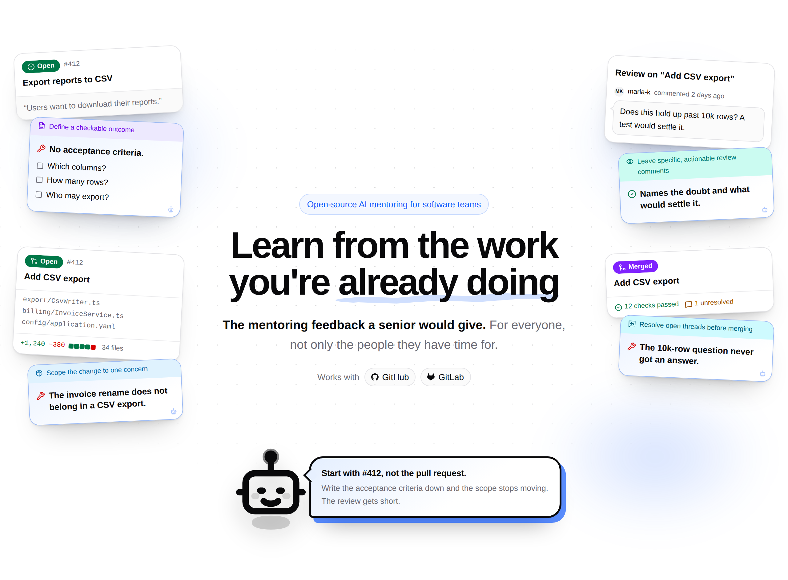

<div align="center">
  <h1>
    <picture>
      <source media="(prefers-color-scheme: dark)" srcset="./docs/static/img/brand/hephaestus-lockup-dark.png">
      <source media="(prefers-color-scheme: light)" srcset="./docs/static/img/brand/hephaestus-lockup-light.png">
      
    </picture>
  </h1>
  <p><strong>Learn from the work you're already doing</strong></p>

  <p>
    <a href="https://hephaestus.build"></a>
    <a href="https://docs.hephaestus.build/"></a>
    <a href="https://github.com/hephaestus-build/Hephaestus/releases/latest"></a>
    <a href="https://github.com/hephaestus-build/Hephaestus/actions/workflows/cicd.yml"></a>
    <a href="https://github.com/hephaestus-build/Hephaestus/blob/main/LICENSE"></a>
  </p>
</div>

Hephaestus is an open-source AI mentor for software teams. It reads the work developers already do —
issues, pull requests, reviews and the discussion around them — against the engineering practices
their project cares about, then says what went well, what could be better, and a way to get there.
Every piece of feedback names the practice it came from and points back to the work it saw, and
developers can ask why, push back, or talk through the next step.

Feedback on how you work is a mentor's job — a coach on a university capstone, an experienced
maintainer on an open-source project — and there is never enough of that attention to go round.
Hephaestus carries the routine part so that everyone gets some. The harder judgement and the
relationships stay with people.

<div align="center">
  <picture>
    <source media="(prefers-color-scheme: dark)" srcset="./docs/images/readme/landing-hero-dark.png">
    <source media="(prefers-color-scheme: light)" srcset="./docs/images/readme/landing-hero-light.png">
    
  </picture>
  <p><sub>An illustration of the feedback Hephaestus writes. See the <a href="https://docs.hephaestus.build/user/ai-code-review">user guide</a> for the real interface.</sub></p>
</div>

> [!IMPORTANT]
> **Hephaestus is pre-1.0.** It is released continuously and only the
> [latest release](https://github.com/hephaestus-build/Hephaestus/releases/latest) is supported — no
> maintenance branches, no backports. Until 1.0, a *minor* release can change configuration or the
> API in ways that need you to act, so read the release notes before every upgrade.
> Version 1.0 is what makes upgrades, configuration, Compose and the REST API predictable:
> [compatibility policy](https://docs.hephaestus.build/admin/compatibility-policy) ·
> [1.0 milestone](https://github.com/hephaestus-build/Hephaestus/issues/1378).

## What Hephaestus does

- **Reviews contributions against engineering practices.** A curated set of practices ships with it, covering
  how work is scoped and described, how issues are written, how reviews are given and answered,
  testing, failure handling, security, maintainability, recorded decisions, version control, planning
  and communicating in the open. A workspace adopts the groups it cares about and can rewrite any
  practice inside them.
- **Gets the feedback to the developer.** It can land on the work itself, on the developer's own
  practice pages, or in their next conversation with Hephaestus. Every piece names the practice it
  came from and points at the evidence behind it.
- **Answers follow-up questions.** Developers can ask why a suggestion matters or supply the context
  it did not have. In chat Hephaestus goes by Heph, in the web app and, when Slack is connected, in a
  direct message.
- **Uses only the project context you connect.** GitHub and GitLab repositories, plus optional
  selected Slack channels and Outline collections.
- **Puts admins in control.** They configure repositories, practices, members, integrations, the AI
  model through any OpenAI-compatible endpoint, and a monthly spending cap.
- **Ships optional recognition features.** Achievements, leagues, a weekly leaderboard, and a Slack
  digest of review activity, all separate from practice feedback.

## How feedback works

1. A workspace connects its GitHub or GitLab repositories and adopts the practices it cares about.
2. Hephaestus gathers a contribution together with the work around it: the issue, the change, the
   review thread, the conversation.
3. It records what it observed against those practices, and writes feedback from those observations.
4. The feedback goes where the developer will actually see it — on the work, on their own practice
   pages, or in conversation.
5. They act on it, push back with a reason, or let it pass. Their next contribution is read the same
   way.

The feedback is advisory: it does not approve a change for merge or grade anyone.

## Get started

- **Try the hosted app:** open the [TUM deployment](https://hephaestus.build).
- **Learn how it works:** read the [user guide](https://docs.hephaestus.build/user/overview).
- **Run your own deployment.** One 64-bit Linux host, 4 vCPUs / 8 GB RAM / 40 GB SSD recommended:

  ```bash
  VERSION=0.77.0   # the release you are installing, without the leading "v"
  sudo git clone --depth 1 --branch "v$VERSION" https://github.com/hephaestus-build/Hephaestus.git /opt/hephaestus
  sudo chown -R "$USER" /opt/hephaestus
  cd /opt/hephaestus/docker/self-host
  cp .env.example .env
  ```

  The stack refuses to start until `.env` is complete, so finish the
  [installation guide](https://docs.hephaestus.build/admin/install) before the first
  `docker compose up -d` — it covers the sign-in OAuth app, TLS, and the first admin account. Before
  upgrading, read the release notes and the [migration guide](./MIGRATION.md), then test the upgrade
  in staging.

- **Contribute:** start with the
  [local development guide](https://docs.hephaestus.build/contributor/local-development); the
  web app's components are browsable in
  [Storybook](https://main--66a8981a27ced8fef3190d41.chromatic.com/).

## Get help

- Ask questions and share ideas in [GitHub Discussions](https://github.com/hephaestus-build/Hephaestus/discussions).
- Report reproducible bugs in [GitHub Issues](https://github.com/hephaestus-build/Hephaestus/issues).
- Report security vulnerabilities privately as described in [SECURITY.md](./SECURITY.md).

## Contributing

Contributions are welcome. [CONTRIBUTING.md](./CONTRIBUTING.md) explains how to set up the project,
propose a change, run the quality checks and open a pull request, and what to expect from triage.
Participation in the project is governed by the [Code of Conduct](./CODE_OF_CONDUCT.md).

## Project origins

Hephaestus is an [MIT-licensed](./LICENSE) open-source project developed by
[Applied Education Technologies](https://aet.cit.tum.de/) at the
[Technical University of Munich](https://www.tum.de/en/). It is named after the Greek god of the
forge, whose craft — in the myth Plato tells — was stolen from his workshop and given to people so
they could make things for themselves.

<p align="center">
  <strong>Developed by</strong><br><br>
  <a href="https://aet.cit.tum.de/">
    <picture>
      <source media="(prefers-color-scheme: dark)" srcset="./docs/static/img/readme-brand/aet-mark-dark.svg">
      
    </picture>
  </a>
  <a href="https://www.tum.de/en/">
    <picture>
      <source media="(prefers-color-scheme: dark)" srcset="./docs/static/img/readme-brand/tum-logo-dark.svg">
      
    </picture>
  </a>
  <br>
  <sub><a href="https://aet.cit.tum.de/">Research Group for Applied Education Technologies</a> · <a href="https://www.tum.de/en/">Technical University of Munich</a></sub>
</p>
