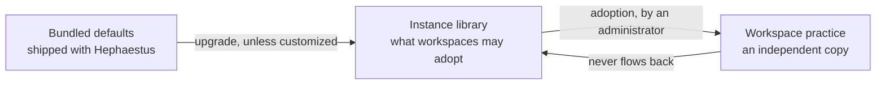

A practice is a habit Hephaestus reviews work against. Where a practice lives decides who owns it and
what changing it affects.

| Scope | Owner | Changing it affects |
|---|---|---|
| Bundled defaults | Hephaestus releases | Every instance that has not customized the entry |
| Instance library | Instance administrator | What workspaces may adopt **next** — never a copy already adopted |
| Workspace practice | Workspace administrator | Reviews in that one workspace |

The arrow only ever points right. A release can update an instance entry nobody customized, and an
instance change alters what is on offer — but **nothing rewrites a workspace practice**. That is the
whole point of adoption: a workspace can rely on its practices not changing under it.

## Adopt a practice into a workspace

In **Workspace administration → Practice setup**, select **Show library**. Available practices appear
beside the ones you already have, grouped by area.

Select one to read it before deciding. You get the habit and why it matters first, then what good
looks like, then — under disclosures — what the practice reads, how it decides, and what it measures
before the model sees anything.

:::note Adding never starts sending feedback
A practice Hephaestus can review starts at **Review before sending**. A practice it cannot review
stays **Off** until you connect what it needs to read. Moving a practice to **Send automatically** is
a separate decision you make later, on the **Review** screen.
:::

What you get is a copy. Edit it, move it, rename it, delete it — none of that touches the library, and
nothing in the library reaches back into it.

### Adopt a whole area

An area's action adopts everything in it that the workspace is missing. Hephaestus shows the full plan
first — what it will add, what is already there, and anything it cannot add — and then applies all of
it or none of it. If the library or your workspace changed while you were reading, the plan is
refused and you review the current one.

### Remove an area

Removing an area asks what should happen to the practices in it:

- **Keep practices unassigned** — they stay in the workspace, without an area.
- **Delete area and practices** — this also deletes their observations, and cannot be undone.

If you kept them, the library offers **Restore area**, which puts the matching unassigned copies back
without touching any edits you made to them.

### Adopt something again

Delete an adopted practice and the library offers it again immediately. Adoption is keyed on the
practice's slug in your workspace, so you cannot end up with two copies of the same practice.

## Read the badges

Most practices carry no badge. A badge means this entry and its source have diverged, and it is
always informational — Hephaestus never resolves drift for you.

**In a workspace**, comparing your copy against the library:

| Badge | Meaning | What to do |
|---|---|---|
| *(none)* | Your copy matches the library | Nothing |
| **Customized for this workspace** | You changed the review rules | Nothing, unless you meant to track the library |
| **Instance catalog changed** | The library moved on after you adopted | Read the library entry and copy anything you want by hand |
| **Not in the current instance catalog** | The source was excluded or removed | Nothing. Your copy keeps working |

**On the instance**, comparing the library against the bundled defaults:

| Badge | Meaning |
|---|---|
| **Customized on this instance** | You edited it; the bundled definition has not moved |
| **Hephaestus update available** | You edited it and a release changed the bundled definition |
| **No Hephaestus default** | You created it here |
| **Removed from Hephaestus defaults** | A release dropped it; your customization still applies |

An update never replaces a customization silently. Open the entry to see the complete bundled
definition and whether applying it would change review rules, guidance, or area appearance.

Drift compares only what changes review behaviour: slug, name, bindings, criteria, precompute script,
the automated-review policy, and area. **Why it matters** and **What good looks like** are guidance —
editing them never raises a drift badge.

## What "Not independently validated" means

Every practice today carries author-declared validation metadata, not measured reliability. The badge
says so rather than showing numbers nobody has earned. Treat it as "nobody has checked how often this
practice is right", and keep new practices at **Review before sending** until you have watched them.

## Curate what the instance offers

In **Instance administration → Practice library** you decide what workspaces may adopt.

- **Customize** an entry to change its definition for this instance.
- **Stop offering** an entry to take it off the menu. Workspaces that already adopted it keep their
  copies and notice nothing.
- **Use Hephaestus version** discards your customization and returns to the bundled definition.
- **Use Hephaestus order** discards custom positions.

Excluding an area also removes its practices from what workspaces may adopt.

## Where practices come from on a new instance

At startup, any workspace with no recorded catalog installation receives the whole library once. On a
fresh instance that means the workspaces provisioned at boot arrive already stocked; you adopt to add
what you passed over, and to add back anything you deleted.

## See also

- [Practice Review](practice-review.mdx) — switch reviews on, set autonomy and scope, find out why a
  workspace went quiet.
- [Practice Review Operations](practice-review-operations.mdx) — what it costs and what to watch.
- [Practice catalog curation](https://ls1intum.github.io/Hephaestus/contributor/practice-catalogue)
  — for contributors changing the bundled defaults.
