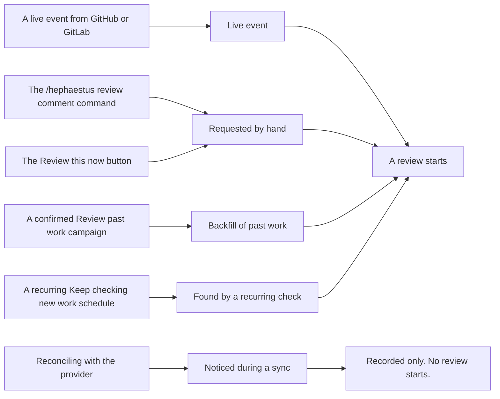

Practice review is the feature that reads a workspace's connected work — pull requests, merge requests,
issues, settled Slack threads — against the practices that workspace has installed, and posts what it
found. This page is how you switch it on, how you keep it from costing more than you meant, and what to do
when it silently stops.

**Nothing errors when practice review stops.** The workspace simply goes quiet. That single fact shapes the
whole page: every refusal is recorded, and the screen that shows you the recording is
**Review activity**, which every member can already see.

## What starts a review

Five doors. Reviews cost money at every one of them, so it is worth knowing who can open each.

The labels on the right are the ones **Review activity** prints, so you can read a trace back against this
diagram directly. Two things in it will bite you if you assume otherwise:

- **The comment command and the button are indistinguishable afterwards.** Both record
  `Requested by hand`. If you need to know which was used, the answer is not in the data.
- **Reconciling with the provider records the occurrence but starts no review.** For pull requests and
  issues this is a deliberate dead end: a sync tells us something happened, not when, and paying to review
  it later would spend money on a stale event. (Settled Slack threads are the exception — the thread sweep
  both records and starts.)

| Door | Who may use it | Rate limit | Spends from |
| --- | --- | --- | --- |
| Live event | Nobody — it is automatic, per the practices' occasions | The per-workspace cooldown between reviews of the same work | The workspace's AI budget |
| `/hephaestus review` in a **GitLab merge request** comment | The work's author or assignees, or a workspace admin | Per-person hourly allowance | The workspace's AI budget |
| **Review this now** on Review activity | The same people. Every member sees the button; anyone else is refused with an explanation on the page | Per-person hourly allowance | The workspace's AI budget |
| **Review past work** campaign | A workspace admin, and only after confirming a priced estimate | Bounded by the campaign's own scope | The workspace's AI budget |
| **Keep checking new work** schedule | A workspace admin | One campaign at a time per workspace | The workspace's AI budget |

There is no equivalent comment command on GitHub pull requests. Reviews there start from live events, from
the button, or from a campaign.

## Turn it on

Practice review is not one switch. It needs a deployment part and a per-workspace part, and a workspace is
quiet until both are done.

### Deployment

| Variable | Default | What it does |
| --- | --- | --- |
| `AGENT_ENABLED` | `false` | Enables the PostgreSQL-backed job queue: submission on the server, claiming and execution on the worker. Must be `true` on **both** roles |
| `GIT_CHECKOUT_ENABLED` | `false` | Enables the local repository checkout that supplies the repository-tree evidence |
| `PRACTICE_REVIEW_FOR_ALL` | `false` | Enables the feature flag and the review gate for all users |
| `PRACTICE_REVIEW_DELIVER_TO_MERGED` | `false` | Instance default for posting after merge; a workspace may override it |
| `PRACTICE_REVIEW_COOLDOWN_MINUTES` | `15` | Instance default for the minimum gap between reviews of the same work; a workspace may override it |
| `HEPHAESTUS_FABRIC_GC_RETENTION_DAYS` | `30` | Age after which replay directories and unreferenced evidence blobs become collectable |

:::caution Two of these do not behave the way the variable name suggests
- **`PRACTICE_REVIEW_RUN_FOR_ALL` is inert in the shipped Compose files.** The `application-server`
  service pins the underlying setting to `PRACTICE_REVIEW_FOR_ALL`, so setting the other name in
  `docker/.env` changes nothing. Use `PRACTICE_REVIEW_FOR_ALL`.
- **`GIT_CHECKOUT_ENABLED` is passed to `application-server` only.** The `application-worker` service's
  `environment:` block does not forward it — and evidence capture runs on the *worker*, not the server. On
  a split deployment, a worker without it captures a degraded repository tree and records that fact in the
  manifest rather than failing. Add the variable to the `application-worker` service's own `environment:`
  block, and mount the same fabric volume there.
:::

Repository checkouts, replay metadata, and content-addressed evidence live under the fabric root, which the
reference Compose stack pins to `/data/git-repos`. A split or multi-host deployment must mount the same
durable read-write filesystem on **every** server and worker, with cross-process file locks, atomic
rename, and appropriate access controls.

Which sources a review may read, and for which purpose, is not a deployment setting. It is fixed by the
reviewed source-use decisions shipped in the artifact-source contract, and a deployment cannot widen or
narrow them. A source a workspace has not connected is simply never captured. See
[Artifact-Source Governance](./dsms/artifact-source-governance) for the decision record.

### Per workspace, in screen order

1. **Administration → AI models.** On the **Practice reviews** card, bind a model. A workspace with no
   model bound runs no reviews at all — this is the expected state immediately after upgrading from named
   agent configurations, where everything is carried over switched off. The card's readiness indicator also
   tells you whether the bound model is still usable.
2. **Administration → Practices → Review settings → Practice review status.** Turn on
   **Start practice reviews**. The same card repeats the review model's readiness, so you can confirm step 1
   without leaving the page.
3. **Same page → Project review triggers.** **Automatic reviews** admits live events. **Manual reviews**
   admits `/hephaestus review`. **Time between reviews (minutes)** is the cooldown, 0 to 1,440.
4. **Same page → Project review rules.** **Post feedback after merge** decides whether a merged pull
   request still gets a comment. **Eligible work** chooses between *All matching work* and
   *Assigned review participants*.
5. **Same page → Review scope.** **Target branches** and **Repositories** narrow which work is reviewed at
   all. Leave both empty to review everything the workspace monitors.
6. **Administration → Practices → Practice setup.** Set each practice's loudness.

Whether a draft is reviewed is decided **per practice**, on the practice itself
(*Also while it is still a draft*), not by a workspace switch.

## How loud, and how wide

Two independent settings, and confusing them is the most common misconfiguration.

- **Loudness** is per practice: `Off`, `Measure`, `Coach`, `Engage`. Only `Off` stops the review. `Measure`
  and `Coach` run it and record every observation exactly as `Engage` does — they differ only in how far the
  result travels. Turning a noisy practice down therefore does not put a hole in the measurement, which is
  the entire reason the setting is a tier and not a checkbox.
- **Review scope** is per workspace: two exact-match lists, target branches and repositories, ANDed onto
  every practice. Exact names only, no patterns, and a branch list cannot narrow issue review because an
  issue has no target branch.

Both are defined in full, with their refusal semantics, in the
[practice review glossary](/contributor/practice-review-glossary). Do not re-derive them from this page.

## What costs money

Every started review is a model call, and there are exactly four things standing between a
misconfiguration and a bill.

1. **The monthly AI budget.** There are two, and they are never added together: the *instance* budget caps
   a workspace's spend on shared models you registered, and the *workspace's own* budget caps its spend on
   its own connected provider. Each pauses only the work it funds. Setting either to exactly `0` is the
   supported way to hard-stop that purse mid-month; clearing the field removes the cap.
2. **The cooldown.** The minimum gap between reviews of the same pull or merge request.
3. **The per-person hourly allowance** on hand-requested reviews.
4. **Review scope and loudness**, which decide how much work is eligible in the first place.

A budget pause is a **hold**, not a cancellation: queued jobs are released automatically when the cap is
raised or the month rolls over. A job still over cap seven days after it was queued is cancelled rather
than held forever.

**Practice reviews go silent when a budget is exhausted, and the mentor does not.** A queued review is
refused before it runs and nothing is posted, so no end user sees an error; a user who sends a mentor
message into an exhausted purse gets a reply naming the cap and who can lift it. Staff for the difference —
you will hear about the mentor and you will have to go looking for the reviews.

Full budget mechanics, including what an unverifiable month does, are on
[Integrations & Reference Deployment](./production-setup#instance-wide-llm-settings).

## Reviewing past work

Two instruments, and the difference between them is the difference between a purchase and a standing
order. Both live on **Administration → Practices → Review past work**.

**A campaign — *Review past work*.** You choose a kind of work and a lookback window, press
**Estimate this backfill**, and see how many pieces of work are in range and what they are estimated to
cost. Nothing is reviewed until you confirm. It is one bounded, priced, named decision, and it finishes.

**A schedule — *Keep checking new work*.** You choose a kind of work, a cadence, and how far back each
check reaches. This exists because work that never raised a notification is otherwise never reviewed and
nothing says so.

:::warning A recurring check is a standing authorisation to spend
A schedule opens each of its campaigns **directly in a running state**, using the authority of whoever
created the schedule. There is no per-run estimate and no per-run confirmation, and no cap that is specific
to sweeping — the only thing that stops it is the workspace's AI budget, the schedule's own scope, or
switching it off. The screen says as much before you commit: *"This authorises the AI spend for every
future check, not just the first."* Treat creating one as an ongoing budget decision, not a one-off.

Stop it by **Pause** or **Remove** on the schedule, or by cancelling the campaign it opened. Windows
overlap on purpose so that work missed once gets a second chance; work already reviewed is not paid for
twice.
:::

Findings from either instrument are **measured and never delivered**. Backfill observations are entitled
only to a delivery channel that has no producer, so they land in the read models and on Review activity and
nowhere else. That is by construction, not a setting you can change — and it is the right default, because
nobody wants a comment on a pull request from four months ago.

## When a workspace goes quiet

Work down this list. Step 0 is new and usually ends the investigation; steps 1 to 4 are per workspace and
5 to 7 are instance-wide, so if several workspaces went quiet at once, start at the bottom.

**0. Open Review activity and read the trace.** **Review activity** in the workspace sidebar lists every
piece of work Hephaestus recorded. Open one and you get two things: what was recorded about it and how it
was discovered, and what every practice made of it, each with a sentence saying what would change the
answer. A quiet workspace with rows here is configured differently from a quiet workspace with none. The
sentences the trace prints are the same reasons the rest of this list enumerates — reading them first tells
you which step to jump to.

If the trace says the review model is not set up, or the practices that watch this are set to off, or the
budget was used up, you are done; go fix that. If it says nothing was recorded at all, the problem is
upstream of practice review — check the integration's sync.

1. **Is a review model bound and enabled?** Administration → **AI models**, the **Practice reviews** card.
2. **Is the bound model still usable?** A model is usable only if the model *and* its connection are
   enabled, the protocol is supported, and — for a shared instance model — the workspace still has a grant.
   Revoking a grant or disabling a connection stops every workspace bound to it, and the binding stays in
   place looking correct.
3. **Is a budget exhausted?** Administration → **AI usage** names which purse paused the workspace and who
   can lift it. `agent.queue.held` counts jobs parked on a cap; `agent.queue.depth` counts only what a
   worker could claim now, so alert on held rather than reading depth.
4. **Is practice review, or the workspace, switched off?** The switch is **Start practice reviews** on
   Administration → Practices → **Review settings** — *not* on the Workspace settings page. A paused
   workspace runs nothing regardless of its AI configuration.
5. **Is `AGENT_ENABLED=true` on every role that needs it?** It defaults to `false` and gates submission,
   execution *and* orphan recovery independently of the worker role. Set on the worker only, nothing is
   submitted; set on the server only, jobs queue and are never claimed. Confirm by presence, not value: if
   the flag never reached a pod, `agent.queue.depth`, `agent.queue.oldest_age_seconds` and
   `agent.queue.running` are **absent** from that pod's metrics rather than reading zero.
6. **Are jobs being claimed at all?** Watch `agent.queue.oldest_age_seconds`. It should rise and fall.
   Climbing monotonically means the server is submitting and no worker is claiming.
7. **Is instance-wide silent mode engaged?** Instance admin → **Instance settings**. While it is on, every
   workspace's feedback is suppressed across the instance, and a banner says so on every instance-admin
   page.

The per-workspace review list under Administration → **Practices → Practice reviews** shows each review's
status, the model it ran on, and its error message — the fastest way to tell "never submitted" from
"submitted and failed".

## Reference

### Where each setting lives

| Setting | Where |
| --- | --- |
| Bind a model for reviews | Administration → AI models → **Practice reviews** card |
| Start or stop practice reviews | Administration → Practices → Review settings → **Start practice reviews** |
| Live events, comment command, cooldown | Administration → Practices → Review settings → **Project review triggers** |
| Post after merge, eligible work | Administration → Practices → Review settings → **Project review rules** |
| Target branches, repositories | Administration → Practices → Review settings → **Review scope** |
| Per-practice loudness | Administration → Practices → **Practice setup** |
| Draft handling | On the practice itself — *Also while it is still a draft* |
| One-off campaign, recurring schedule | Administration → Practices → **Review past work** |
| What actually ran, and why not | Administration → Practices → **Practice reviews**, or **Review activity** for any member |
| Workspace AI spend and cap | Administration → **AI usage** |
| Instance-wide budget cap | Instance admin → AI usage → **Set budget** |
| Instance-wide silent mode | Instance admin → **Instance settings** |

### Queue health

The job queue exposes its own signals — alert off these rather than reading application logs.

- **`agent.queue.oldest_age_seconds`** — age of the oldest eligible queued job, `0` when empty. **This is
  the one to alert on**: a briefly busy queue and a stuck one both show non-zero depth, but only a stuck
  queue shows a climbing age.
- **`agent.queue.depth`** — queued jobs eligible to run now.
- **`agent.queue.held`** — jobs parked on an exhausted budget.
- **`agent.queue.running`** — jobs running fleet-wide.
- **`agent.queue.health.sampler.failures`** — failed samples; the gauges keep their last-good value rather
  than reporting a false empty queue.
- **`agent.job.claim.latency`** — time between a job becoming eligible and being claimed.
- **`agent.job.execution.duration`** — tagged by `jobType` and outcome `status`.
- **`agent.job.delivery.recovered`** — deliveries stuck by an executor crash and successfully re-attempted.
- **`agent.job.retention.stripped`** / **`agent.job.retention.deleted`** — rows pruned by the retention
  sweep.
- **`llm.budget.exhausted`** / **`llm.budget.blocked`** — a cap crossed, and work refused at a cap.

Gauges are sampled every 30 seconds; timers and counters are recorded inline. None run on a request path.

**Retention.** Terminal job rows are pruned automatically. `AGENT_PAYLOAD_RETENTION` (default `P14D`)
strips container logs and output to `NULL`; `AGENT_ROW_RETENTION` (default `P90D`, must be at least the
payload retention) deletes the row and its durable evidence snapshot. **Neither is forwarded by the shipped
Compose files** — to change them, add them to the service's own `environment:` block. Tighten only against
the deployment's approved retention policy, and treat the fabric root volume as sensitive storage.

## Limits you should know about

These are current, deliberate, and none of them is configurable from `docker/.env`.

- **Three background cadences are fixed in code.** The recurring-sweep opener runs every 5 minutes, the
  campaign driver every 2 minutes, and the re-offer reaper every 15 minutes. Only their *thresholds* are
  properties; the cadences are not, so you cannot slow them down under load.
- **A refused-but-retryable occurrence is retried for seven days and then retired.** The retry interval
  (`hephaestus.signal-ledger.pending-retry-after`, default one hour) and the deadline
  (`pending-lapse-after`, default seven days) are properties with no environment wiring in the shipped
  Compose files. A workspace left misconfigured accumulates a week of retries and then goes quiet again
  with nothing new to see.
- **Nothing is ever deleted from the occurrence ledger**, in any state, including retired rows. It is the
  record of what was *not* done, and it only grows. Size it accordingly on a busy instance.
- **The repository-tree capture is bounded**, by file count, total size, and per-file size
  (`hephaestus.git.tree-max-files`, `tree-max-total-size`, `tree-max-file-size`). When a bound bites, the
  capture reports itself **partial** and names which bound it hit rather than silently truncating. The
  current values are the ones declared in the artifact-source catalog's selection scope for that source —
  read them there rather than from a copy. None of the three is forwarded by the shipped Compose files.
- **Linked Outline documents are retrieval-limited, and the mentor and review paths do not agree.** A
  review resolves documents *linked from* the work first and only tops up a small number by search; the
  mentor searches the whole corpus and truncates each document. Neither path can report that it found
  everything, and neither is a substitute for the other when you are diagnosing missing context.
- **Feedback wording is written by the detector, not composed at delivery.** Prompt and catalogue changes
  change the wording; nothing on these screens does.
