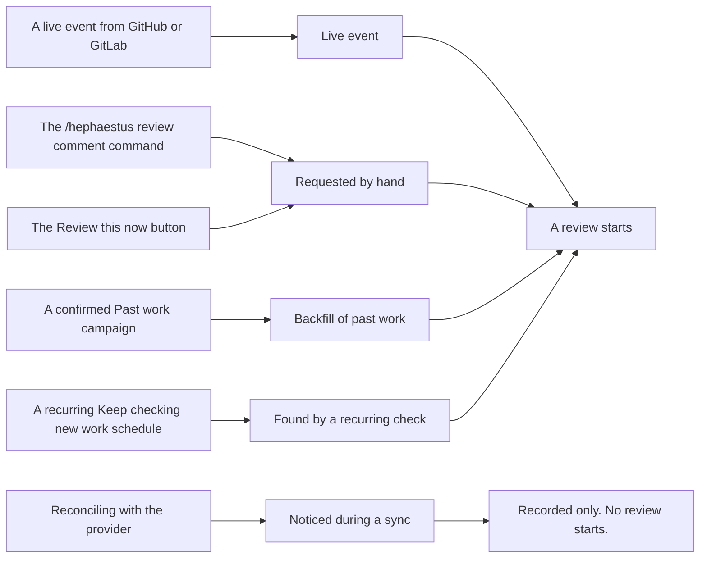

Practice review reads a workspace's connected work — pull requests, merge requests, issues, documents,
and settled Slack threads — against the practices that workspace has installed. It records grounded
observations first, and composes feedback only for pull or merge requests and issues — document and
settled-thread reviews record what they found and stop there. Feedback reaches the work itself, the
developer's private practice pages, or a later mentor conversation. This page is how you
switch it on, keep it from costing more than intended, and find out why it went quiet.

Many review gates refuse work without raising a user-facing error, so a workspace can simply go quiet.
Every refusal is recorded; **Review activity**, available to every member, is the first place to inspect it.

## First successful review

Use this short path before tuning coverage, campaigns, or per-practice overrides:

1. Connect GitHub or GitLab and confirm a recent pull or merge request appears under **Review activity**.
   If it does not, fix ingestion first; practice-review settings cannot make missing work appear.
2. Under **AI models**, assign a ready model to practice reviews.
3. On **Practices → Review → When and where**, turn on **Start practice reviews**, then turn on at least
   one way in under **How reviews start** — **Reviews the work starts**, **Reviews somebody asks for**, or
   both. The screen says *"Nothing can start a review"* when both are off.
4. On **Practices → Review → How much**, set the **Workspace default** to **Review before sending** for the
   first test. Back on **When and where**, keep coverage at **All monitored repositories** and **Every
   member of this workspace**, and leave **Send feedback** on.
5. Open a small pull or merge request whose author is a workspace member, then follow it in **Review
   activity**. The trace distinguishes ingestion, admission, observation, composition, withholding, and
   delivery; do not use the presence of a provider comment as the success test.

Once that works, narrow coverage, add practice overrides, or configure past-work reviews. The rest of
this page is reference and troubleshooting for those decisions.

### Follow one review end to end

Suppose a developer opens **Update dependencies** with no explanation in its description:

1. The provider event creates an occurrence visible under **Review activity**.
2. Coverage decides whether to look at all: the repository, the base branch and the author must all be
   admitted. Then the review gate selects practices whose occasions match that pull request, and capture must
   satisfy each selected practice's evidence requirements before that practice can run.
3. A practice about explaining why a change is needed can record that the explanation is absent, bounded
   to the description it searched. This is the observation; it is retained even if nobody is contacted.
4. Composition considers that observation alongside recent observations and feedback. It may propose a
   public summary, private process feedback, mentor context, or no feedback.
5. Server-side policy admits or refuses each proposal. Under **Delivery**, a workspace owner or administrator
   can inspect the exact in-context feedback and evidence, then approve and send it or reject it. A provider
   comment exists only after approval and a successful release-time policy check.

This is the smallest useful diagnostic slice: occurrence → readiness → observation → composition →
delivery. Stop at the first missing stage rather than changing downstream settings at random.

### Use the right screen

| Question                                                          | Open                                                          |
| ----------------------------------------------------------------- | ------------------------------------------------------------- |
| Did this piece of work enter the system, and why was it quiet?    | **Review activity**, then open the work                       |
| Did a job run, fail, or produce observations and feedback?        | **Practices → Practice reviews → Reviews**                    |
| Is in-context feedback waiting for approval?                      | **Practices → Practice reviews → Delivery**, then open a row  |
| Which work may start reviews, and may feedback be sent?           | **Practices → Review → When and where**                       |
| How far do reviews go without a person?                           | **Practices → Review → How much**                             |
| What does one practice review and which evidence does it require? | **Practices → Practice setup**                                |
| Who counts as a covered person?                                   | **Members**                                                   |
| Is the review model ready?                                        | **AI models**                                                 |
| Did a budget stop new work?                                       | **AI usage**                                                  |

## What starts a review

Five doors start reviews. Provider reconciliation is shown too because it records an occurrence but stops
before a review starts.

The labels on the right are the ones **Review activity** prints, so you can read a trace back against this
diagram directly. Two things in it will bite you if you assume otherwise:

- **The comment command and the button are indistinguishable afterwards.** Both record
  `Requested by hand`. If you need to know which was used, the answer is not in the data.
- **Reconciling with the provider records the occurrence but starts no review.** For pull requests and
  issues this is a deliberate dead end: a sync tells us something happened, not when, and paying to review
  it later would spend money on a stale event. (Settled Slack threads are the exception — the thread sweep
  both records and starts.)

All five spend from the workspace's AI budget.

| Door                                                       | Who may use it                                                                            | Rate limit                                                      |
| ---------------------------------------------------------- | ------------------------------------------------------------------------------------------- | ------------------------------------------------------------------ |
| Live event                                                 | Nobody — it is automatic, per the practices' occasions                                    | The per-workspace cooldown between reviews of the same work     |
| `/hephaestus review` in a **GitLab merge request** comment | The work's author or assignees, or a workspace admin                                      | Per-person hourly allowance, **and** the same per-work cooldown |
| **Review this now** on Review activity                     | The same people. Every member sees the button; anyone else is refused with a toast saying so | Per-person hourly allowance, **and** the same per-work cooldown |
| **Past work** campaign                                     | A workspace admin, and only after confirming a priced estimate                            | Bounded by the campaign's own scope                             |
| **Keep checking new work** schedule                        | A workspace admin                                                                         | One campaign at a time per workspace                            |

Two switches sit in front of the whole table. **Reviews the work starts** governs the first row;
**Reviews somebody asks for** governs the other four together, so turning it off silently stops the button,
the comment command, campaigns and schedules at once.

Every door goes through coverage. Asking by hand does not widen it: a review requested on work whose author
is not a covered person is refused just as a live event would be. The button appears only on pull request
and issue traces — documents and Slack threads are reviewed on the occasion their source produces, with
nothing to point at and ask about — and there is no comment command on GitHub pull requests at all.

## Deployment

The workspace steps are the five above, and they are not enough on their own. The deployment must enable
the agent runtime on both the submitting server and the claiming worker, and enable repository checkout
wherever evidence capture runs; until it does, every workspace on the instance is quiet however it is
configured. There is no instance-wide switch for practice review beyond those two — a workspace's own
**Start practice reviews** is the only other one. Variables, Compose forwarding, storage requirements,
queue metrics, retention, and fixed limits are in
[Practice review operations](./practice-review-operations.mdx).

Draft eligibility is the one thing you will look for on the workspace screens and not find: it belongs to
each practice, because it changes when that practice has a meaningful occasion.

## Autonomy, coverage, and delivery

Three independent controls answer different questions; confusing them is the most common misconfiguration.

- **Who authorizes release** — **Off**, **Review before sending**, or **Send automatically**. **Off** stops
  the review. **Review before sending** keeps measurement running and queues each new in-context feedback
  item for a workspace owner or administrator to approve or reject. **Send automatically** lets new feedback
  proceed without that decision, subject to the same delivery policy. Changing the setting never releases
  an existing proposal.
- **Coverage**, under **What gets reviewed**, is one workspace-wide intersection: all or selected monitored
  repositories × all or selected people. A selected list left empty covers nobody, which is why the screen
  warns you when one is. The people side is workspace membership — see
  [Who counts as a person](#who-counts-as-a-person).
- **Send feedback**, under **Sending feedback**, controls whether feedback may leave Hephaestus. It stops
  pull-request comments and the mentor; it does not stop measurement, does not discard configuration, and
  does not blank the developer's own feedback pages here, which are not something leaving. Pausing is the
  one control here that leaves work already in flight alone, so it is safe to reach for.

  The two lanes behave differently on resume, deliberately. Feedback that would have been **sent
  automatically** during the pause is dropped rather than held, so resuming never releases a backlog at
  your developers all at once. **Proposals waiting for approval** stay in the queue, because a human reads
  each one before it goes anywhere and is the right judge of whether it is still worth sending — and the
  usual checks still run at that point, so a proposal whose pull request has since closed or whose content
  has drifted is refused rather than posted.

The rest are prospective, and the price is worth knowing before you touch them: changing coverage,
**Post feedback after merge**, or the workspace default autonomy discards whatever was already reviewed
and not yet sent — narrowing as much as widening, and that work is not reviewed again until it next
changes. Changing the cooldown does not, and
neither does a group or practice override, which is why demoting one practice back to **Review before
sending** leaves existing proposals exactly where they were.

### Who counts as a person

The people side of coverage is **workspace membership**, and the count beside **People** on the review
screen is how many members are in scope. A member is somebody with a row on the **Members** screen, and
rows arrive in exactly three ways: the connected GitHub organization or GitLab group roster sync, the team
sync (which is what catches a GitLab user who is only in a subgroup and so never appears in the
organization roster), and workspace creation, which enrols the owner and any provisioned administrators.

Signing in to Hephaestus is not one of them, and the **Members** screen has no *Add member* button. To
cover somebody who is missing, add them to the connected organization or group and let the next sync pick
them up.

This is the change most likely to surprise you: an outside contributor who opens a pull request but is not
in the organization roster is not a covered person, so their work is not reviewed and no feedback is
prepared about them. The same is true when the work has no identifiable author, or the author is a bot.
Read the **People** count before concluding that reviews are broken — if it is lower than your
contributor list, the difference is the people who are not members.

### You set this once, not a hundred times

**Autonomy** is answered once for the **workspace**, and every group and every practice follows that
answer until you say otherwise. A group can override the workspace, and a practice can override its group:

> practice → its group → the workspace

Anything you have not decided shows as **inherited**, with the level it came from, and can be reset back to
inheriting at any time. Start with the one workspace answer, then override the handful of groups where it
is wrong; a workspace runs dozens of practices across a dozen groups, and a setting you have to apply per
row is a setting nobody applies. Coverage does not work this way and is not inherited — it is set once for
the whole workspace, on **When and where**.

**Review → How much** shows, above the list, how many practices sit at each setting — once for the
workspace and again on each group. Read that line before changing anything; it is the fastest way to see
whether an override somebody made long ago is still doing what you think. **Set by hand** filters the list
down to the overrides.

The exact refusal semantics of all three controls, and the order the delivery gates run in, are in the
[practice review glossary](/contributor/practice-review-glossary).

## What costs money

Every started review is a model call, and there are exactly four things standing between a
misconfiguration and a bill.

1. **The monthly AI budget.** There are two, and they are never added together: the *instance* budget caps
   a workspace's spend on shared models you registered, and the *workspace's own* budget caps its spend on
   its own connected provider. Each pauses only the work it funds. Setting either to exactly `0` is the
   supported way to hard-stop that purse mid-month; clearing the field removes the cap.
2. **The cooldown.** The minimum gap between reviews of the same pull or merge request.
3. **The per-person hourly allowance** on hand-requested reviews.
4. **Coverage and autonomy**, which decide how much work is eligible in the first place.

A budget pause is a **hold**, not a cancellation: queued jobs are released automatically when the cap is
raised or the month rolls over. A job still over cap seven days after it was queued is cancelled rather
than held forever.

**Practice reviews go silent when a budget is exhausted, and the mentor does not.** A queued review is
refused before it runs and nothing is posted, so no end user sees an error; a user who sends a mentor
message into an exhausted purse gets a reply naming the cap and who can lift it. Staff for the difference —
you will hear about the mentor and you will have to go looking for the reviews.

Full budget mechanics, including what an unverifiable month does, are on
[Integrations & Reference Deployment](./production-setup#instance-wide-llm-settings).

## Reviewing past work

Two instruments, and the difference between them is the difference between a purchase and a standing
order. The campaign is on
**Administration → Practices → Review → Past work**; the recurring check is on the same page's
**When and where** section, beside the other things that start a review.

**A campaign — *Past work*.** You choose a kind of work and a lookback window, press
**Estimate this backfill**, and see how many pieces of work are in range and what they are estimated to
cost. Nothing is reviewed until you confirm. It is one bounded, priced, named decision, and it finishes.

**A schedule — *Keep checking new work*.** You choose a kind of work, a cadence, and how far back each
check reaches. This exists because work that never raised a notification is otherwise never reviewed and
nothing says so.

:::warning A recurring check authorizes spending *and* speaking
A schedule opens each of its campaigns **directly in a running state**, using the authority of whoever
created the schedule. A cost estimate is still computed for each run, but nobody is asked to approve it,
and there is no cap specific to sweeping — the only thing that stops it is the workspace's AI budget, the
schedule's own scope, or switching it off. The screen says as much before you commit: *"Every check can
start reviews, so this authorises the AI spend for all of them — not just the first."*

**A swept review is a normal review.** Its observations are recorded as live, so they compose feedback and
deliver it: provider comments, practice-page cards, mentor context, exactly as an event-triggered review
would. The sweep is only a different way of *finding* current work that never raised a notification.
Treat creating one as an ongoing decision about spending and about what your team hears from Hephaestus,
not a one-off.

Stop it by **Pause** or **Remove** on the schedule, or by cancelling the campaign it opened. Windows
overlap on purpose so that work missed once gets a second chance; work already reviewed is not paid for
twice.
:::

**A campaign, by contrast, is measured and never delivered.** Backfilled runs do not enter the composition
stage at all, and the in-app lane separately refuses a pattern supported only by backfilled observations.
They land in the read models and on **Review activity**, never as comments, practice-page cards, or mentor
briefs. That is by construction, not a setting you can change: a campaign changes what you can read about
past work and does not contact the people whose work it measured.

## When a workspace goes quiet

Work down this list. Step 0 usually ends the investigation; steps 1 to 7 are per workspace and
8 to 10 are instance-wide, so if several workspaces went quiet at once, start at the bottom.

**0. Open Review activity and read the trace.** **Review activity** in the workspace sidebar lists every
piece of work Hephaestus recorded. Open one and you get two things: what was recorded about it and how it
was discovered, and what every practice made of it, each with a sentence saying what would change the
answer. A quiet workspace with rows here is configured differently from a quiet workspace with none. The
sentences the trace prints are the same reasons the rest of this list enumerates — reading them first tells
you which step to jump to.

If the trace says the review model is not set up, or the practices that watch this are set to off, or the
budget was used up, you are done; go fix that. If it says nothing was recorded at all, the problem is
upstream of practice review — check the integration's sync.

1. **Is a review model bound and enabled?** Administration → **AI models**, the **Practice reviews** card.
2. **Is the bound model still usable?** A model is usable only if the model *and* its connection are
   enabled, the protocol is supported, and — for a shared instance model offered to *selected* workspaces
   rather than to all of them — this workspace still has a grant. Revoking a grant or disabling a
   connection stops every workspace bound to it, and the binding stays in place looking correct.
3. **Is a budget exhausted?** Administration → **AI usage** names which purse paused the workspace and who
   can lift it. `agent.queue.held` counts jobs parked on a cap; `agent.queue.depth` counts only what a
   worker could claim now, so alert on held rather than reading depth.
4. **Is practice review, or the workspace, switched off?** The switch is **Start practice reviews** on
   Administration → Practices → **Review → When and where** — *not* on the Workspace settings page. A paused
   workspace runs nothing regardless of its AI configuration.
5. **Can anything still start a review?** Same screen, **How reviews start**. With both **Reviews the work
   starts** and **Reviews somebody asks for** off, the workspace is on and nothing reaches it; the screen
   says *"Nothing can start a review"*.
6. **Is the work covered?** Same screen, **What gets reviewed**. Both counts have to be non-zero, and the
   author of the quiet work has to be one of the covered people. The trace prints one reason for the whole
   of coverage — *"The author, repository, or base branch is outside the workspace's review coverage"* — so
   check all three before changing a repository list. A separate reason, *"Hephaestus could not tell whose
   work this is"*, means the work had no identifiable author at all.
7. **Is sending paused?** Same screen, **Sending feedback**. Reviews still run and **Review activity** still
   fills up, so the symptom is specifically that nothing reaches anybody. Resuming does not release what was
   withheld while it was paused.
8. **Is `AGENT_ENABLED=true` on every role that needs it?** It defaults to `false` and gates submission,
   execution *and* orphan recovery independently of the worker role. Set on the worker only, nothing is
   submitted; set on the server only, jobs queue and are never claimed. Confirm by presence, not value: if
   the flag never reached a pod, `agent.queue.depth`, `agent.queue.oldest_age_seconds` and
   `agent.queue.running` are **absent** from that pod's metrics rather than reading zero.
9. **Are jobs being claimed at all?** Watch `agent.queue.oldest_age_seconds`. It should rise and fall.
   Climbing monotonically means the server is submitting and no worker is claiming.
10. **Is instance-wide silent mode engaged?** Instance admin → **Instance settings**. While it is on, every
   workspace's feedback is suppressed across the instance, and a banner says so on every instance-admin
   page.

The per-workspace review list under Administration → **Practices → Practice reviews** shows each review's
status, the model it ran on, and its error message — the fastest way to tell "never submitted" from
"submitted and failed".

## Operational reference

For deployment variables, the workspace setting map, queue metrics, retention, and non-configurable limits,
see [Practice review operations](./practice-review-operations.mdx).
