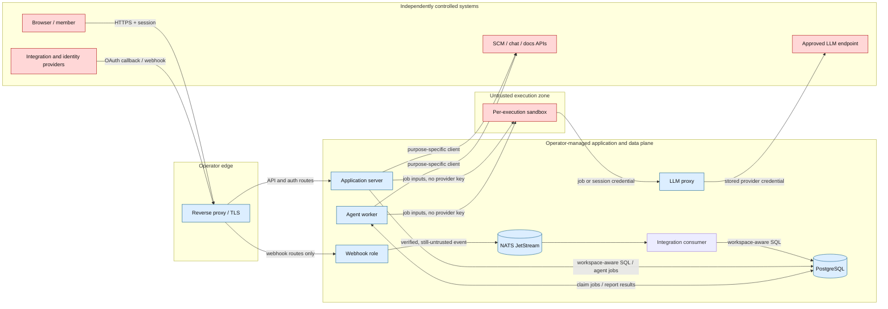

# Security threat model

This model applies to the supported self-hosted Compose topology in the documentation revision where it appears. It covers the four application trust boundaries below. Browser and identity-provider internals, host and database administration, backup custody, the CI/release supply chain, and edge DDoS protection are separate control planes owned by the [Security Policy](https://github.com/ls1intum/Hephaestus/blob/main/SECURITY.md), [Production Setup](./production-setup), [Backup & Restore](./backup-restore), and [Release Image Lock](./release-image-lock).

## Security objectives and protected assets

Hephaestus must:

1. prevent one workspace from reading or changing another workspace's data;
2. keep reusable integration, session, encryption, and model-provider credentials out of untrusted content and sandbox environments;
3. contain repository- and model-influenced execution without trusting its instructions or output; and
4. authenticate and bound public ingress and restrict outbound destinations and side effects.

| Asset | Examples |
| --- | --- |
| Reusable credentials | Provider keys, OAuth secrets, integration tokens, webhook secrets, encryption keys |
| Workspace-confidential data | Repository content, issues, messages, documents, feedback, membership |
| Untrusted content | Webhook bodies, diffs, files, comments, chat, documents, model output |
| Operational data | Job and delivery identifiers, metrics, sanitized error categories |

## System and data flow

Arrows show permitted logical flows, not network-level reachability. In particular, the application-server container joins each internal sandbox network; application route security remains part of that boundary. Runtime-role separation reduces reachable surface but is not authorization; see [Runtime Roles](./runtime-roles).

## Attacker assumptions

Assume an attacker can be:

- an unauthenticated internet client calling every route exposed by the reverse proxy;
- a legitimate member attempting horizontal or vertical privilege escalation;
- a compromised integration account sending correctly signed malicious content;
- a repository contributor placing prompt injection, malicious source, symlinks, or resource-exhaustion inputs in synchronized artifacts;
- a malicious or compromised model endpoint returning crafted output; or
- code executing inside a sandbox with full knowledge of the image and application design.

The Docker daemon, host root, running application processes, PostgreSQL administrator, instance encryption key, and configured instance administrators are trusted. Compromise of those principals is outside the isolation guarantees described here.

## Mitigations index

Each table links threats to enforcement, verification, and residual risk.

### Boundary 1: public webhook ingress

| ID and threat | Enforced control | Enforcement | Verification | Residual risk |
| --- | --- | --- | --- | --- |
| WH-1 — forged or unsupported provider event | Resolve a known integration kind and verify the provider-signed raw bytes before parsing. Missing routing, verifier, or subject derivation fails closed. | [`IntegrationKindRouting`](https://github.com/ls1intum/Hephaestus/blob/main/server/application/src/main/java/de/tum/cit/aet/hephaestus/integration/core/webhook/IntegrationKindRouting.java), [`WebhookIngestPipeline`](https://github.com/ls1intum/Hephaestus/blob/main/server/application/src/main/java/de/tum/cit/aet/hephaestus/integration/core/webhook/WebhookIngestPipeline.java) | [`IntegrationKindRoutingTest`](https://github.com/ls1intum/Hephaestus/blob/main/server/application/src/test/java/de/tum/cit/aet/hephaestus/integration/core/webhook/IntegrationKindRoutingTest.java), [`WebhookIngestPipelineTest`](https://github.com/ls1intum/Hephaestus/blob/main/server/application/src/test/java/de/tum/cit/aet/hephaestus/integration/core/webhook/WebhookIngestPipelineTest.java), provider signature-verifier tests for [GitHub](https://github.com/ls1intum/Hephaestus/blob/main/server/application/src/test/java/de/tum/cit/aet/hephaestus/integration/scm/github/webhook/GithubWebhookSignatureVerifierTest.java), [GitLab](https://github.com/ls1intum/Hephaestus/blob/main/server/application/src/test/java/de/tum/cit/aet/hephaestus/integration/scm/gitlab/webhook/GitlabWebhookSignatureVerifierTest.java), [Slack](https://github.com/ls1intum/Hephaestus/blob/main/server/application/src/test/java/de/tum/cit/aet/hephaestus/integration/slack/webhook/SlackWebhookSignatureVerifierTest.java), and [Outline](https://github.com/ls1intum/Hephaestus/blob/main/server/application/src/test/java/de/tum/cit/aet/hephaestus/integration/outline/webhook/OutlineWebhookSignatureVerifierTest.java) | A valid signature does not make content safe and cannot detect a compromised provider account. Replay resistance differs by provider; GitHub and GitLab rely on bounded deduplication, after which consumers can receive a replay again. |
| WH-2 — oversized input or queue overload | Require a declared request size within the configured limit and fail startup when the broker cannot accept that size. | [`WebhookPayloadSizeFilter`](https://github.com/ls1intum/Hephaestus/blob/main/server/application/src/main/java/de/tum/cit/aet/hephaestus/integration/core/webhook/WebhookPayloadSizeFilter.java), [`WebhookPayloadCapacityCheck`](https://github.com/ls1intum/Hephaestus/blob/main/server/application/src/main/java/de/tum/cit/aet/hephaestus/integration/core/webhook/WebhookPayloadCapacityCheck.java) | [`WebhookPayloadSizeFilterTest`](https://github.com/ls1intum/Hephaestus/blob/main/server/application/src/test/java/de/tum/cit/aet/hephaestus/integration/core/webhook/WebhookPayloadSizeFilterTest.java), [`WebhookPayloadCapacityCheckTest`](https://github.com/ls1intum/Hephaestus/blob/main/server/application/src/test/java/de/tum/cit/aet/hephaestus/integration/core/webhook/WebhookPayloadCapacityCheckTest.java) | Volumetric filtering and rate limiting remain edge responsibilities. |
| WH-3 — acknowledged loss or duplicate processing | Events selected for durable processing return success only after JetStream accepts them. Per-kind stable keys use provider delivery identifiers where available. | [`WebhookIngestPipeline`](https://github.com/ls1intum/Hephaestus/blob/main/server/application/src/main/java/de/tum/cit/aet/hephaestus/integration/core/webhook/WebhookIngestPipeline.java) | [`WebhookIngestPipelineTest`](https://github.com/ls1intum/Hephaestus/blob/main/server/application/src/test/java/de/tum/cit/aet/hephaestus/integration/core/webhook/WebhookIngestPipelineTest.java), [`WebhookIngestionCannotFailSilentlyTest`](https://github.com/ls1intum/Hephaestus/blob/main/server/application/src/test/java/de/tum/cit/aet/hephaestus/integration/core/webhook/WebhookIngestionCannotFailSilentlyTest.java) | Protocol challenges and deliberately filtered events respond without publishing. Deduplication expires with broker retention, so consumers must tolerate redelivery. |

Route only `/webhooks/**` to a separately exposed webhook role and operate its capacity and retry signals as described in [Webhook Ingestion Operations](./webhook-ingestion-operations).

### Boundary 2: LLM agent sandbox

Repository, chat, and model content is untrusted and can influence tool use. Model output remains untrusted; any path that persists it or creates an external write must apply that operation's validation and authorization.

| ID and threat | Enforced control | Enforcement | Verification | Residual risk |
| --- | --- | --- | --- | --- |
| SB-1 — privilege escalation, host escape, or resource exhaustion | Apply non-privileged execution, dropped capabilities, `no-new-privileges`, private cgroup/IPC namespaces, seccomp, CPU/memory/PID/file limits, disabled core dumps, and bounded `nosuid,nodev` tmpfs mounts with `noexec` where compatible. | [`ContainerSecurityPolicy`](https://github.com/ls1intum/Hephaestus/blob/main/server/application/src/main/java/de/tum/cit/aet/hephaestus/agent/sandbox/docker/ContainerSecurityPolicy.java) | [`SandboxArchitectureTest`](https://github.com/ls1intum/Hephaestus/blob/main/server/application/src/test/java/de/tum/cit/aet/hephaestus/agent/sandbox/SandboxArchitectureTest.java), [`DockerSandboxAdapterTest`](https://github.com/ls1intum/Hephaestus/blob/main/server/application/src/test/java/de/tum/cit/aet/hephaestus/agent/sandbox/docker/DockerSandboxAdapterTest.java), [`DockerSandboxLiveTest`](https://github.com/ls1intum/Hephaestus/blob/main/server/application/src/test/java/de/tum/cit/aet/hephaestus/agent/sandbox/docker/DockerSandboxLiveTest.java) | The root filesystem is writable and standard Docker shares the host kernel and daemon. Use gVisor and dedicated, patched worker hosts for hostile multi-tenant workloads. Never mount the Docker socket or secret-bearing host paths into a sandbox. |
| SB-2 — provider-secret theft or proxy abuse | Keep the provider key in the application catalog. Job credentials are accepted only while the job is running; mentor credentials follow the live session lifecycle. The proxy binds requests to the admitted connection, model, API, and path, serves it only on the worker's sandbox gateway connector, and bounds each authenticated principal's request rate and declared request size. | [ADR 0006](https://github.com/ls1intum/Hephaestus/blob/main/docs/decisions/0006-llm-proxy-on-coordinator-trust-model.md), [`JobTokenAuthenticationFilter`](https://github.com/ls1intum/Hephaestus/blob/main/server/application/src/main/java/de/tum/cit/aet/hephaestus/agent/proxy/JobTokenAuthenticationFilter.java), [`LlmProxyController`](https://github.com/ls1intum/Hephaestus/blob/main/server/application/src/main/java/de/tum/cit/aet/hephaestus/agent/proxy/LlmProxyController.java), [`LlmProxySecurityConfig`](https://github.com/ls1intum/Hephaestus/blob/main/server/application/src/main/java/de/tum/cit/aet/hephaestus/agent/proxy/LlmProxySecurityConfig.java) | [`JobTokenAuthenticationFilterTest`](https://github.com/ls1intum/Hephaestus/blob/main/server/application/src/test/java/de/tum/cit/aet/hephaestus/agent/proxy/JobTokenAuthenticationFilterTest.java), [`LlmProxyControllerTest`](https://github.com/ls1intum/Hephaestus/blob/main/server/application/src/test/java/de/tum/cit/aet/hephaestus/agent/proxy/LlmProxyControllerTest.java), [`LlmProxySecurityConfigTest`](https://github.com/ls1intum/Hephaestus/blob/main/server/application/src/test/java/de/tum/cit/aet/hephaestus/agent/proxy/LlmProxySecurityConfigTest.java), [`SandboxGatewayRateLimitFilterTest`](https://github.com/ls1intum/Hephaestus/blob/main/server/application/src/test/java/de/tum/cit/aet/hephaestus/agent/proxy/SandboxGatewayRateLimitFilterTest.java), [`SandboxGatewayPayloadSizeFilterTest`](https://github.com/ls1intum/Hephaestus/blob/main/server/application/src/test/java/de/tum/cit/aet/hephaestus/agent/proxy/SandboxGatewayPayloadSizeFilterTest.java), [`SandboxEnvBlocklistTest`](https://github.com/ls1intum/Hephaestus/blob/main/server/application/src/test/java/de/tum/cit/aet/hephaestus/agent/sandbox/docker/SandboxEnvBlocklistTest.java) | The worker-side application process holds catalog credentials. A third-party worker is outside the supported topology; [ADR 0041](https://github.com/ls1intum/Hephaestus/blob/main/docs/decisions/0041-compose-1x-kubernetes-2.md) owns that decision. |
| SB-3 — network exfiltration or cross-execution access | Create per-execution Docker resources. With internet access disabled, use an internal network with no external route and configure an unusable DNS resolver. | [`SandboxNetworkManager`](https://github.com/ls1intum/Hephaestus/blob/main/server/application/src/main/java/de/tum/cit/aet/hephaestus/agent/sandbox/docker/SandboxNetworkManager.java), [`ContainerSecurityPolicy`](https://github.com/ls1intum/Hephaestus/blob/main/server/application/src/main/java/de/tum/cit/aet/hephaestus/agent/sandbox/docker/ContainerSecurityPolicy.java) | [`SandboxNetworkManagerTest`](https://github.com/ls1intum/Hephaestus/blob/main/server/application/src/test/java/de/tum/cit/aet/hephaestus/agent/sandbox/docker/SandboxNetworkManagerTest.java), [`DockerSandboxLiveTest`](https://github.com/ls1intum/Hephaestus/blob/main/server/application/src/test/java/de/tum/cit/aet/hephaestus/agent/sandbox/docker/DockerSandboxLiveTest.java) | The job network can reach other application-server routes; those routes must independently authenticate and authorize sandbox-originated requests. `internetAccess=true` creates a normal bridge, not a hostname allow-list. |
| SB-4 — persistence after execution | Reconcile managed containers and networks against durable job state. | [`SandboxReconciler`](https://github.com/ls1intum/Hephaestus/blob/main/server/application/src/main/java/de/tum/cit/aet/hephaestus/agent/sandbox/docker/SandboxReconciler.java) | [`SandboxReconcilerTest`](https://github.com/ls1intum/Hephaestus/blob/main/server/application/src/test/java/de/tum/cit/aet/hephaestus/agent/sandbox/docker/SandboxReconcilerTest.java) | Host or daemon compromise is outside this control. |

### Boundary 3: outbound egress

Destination policy and delivery policy are distinct: one limits where a client may connect; the other limits whether Hephaestus may create an external side effect.

| ID and threat | Enforced control | Enforcement | Verification | Residual risk |
| --- | --- | --- | --- | --- |
| EG-1 — LLM-provider SSRF or DNS rebinding | Require a public HTTPS provider URL without userinfo, query, or fragment; apply the optional hostname allow-list; repeat the private-address check on the DNS result used to connect. | [`EgressPolicy`](https://github.com/ls1intum/Hephaestus/blob/main/server/application/src/main/java/de/tum/cit/aet/hephaestus/agent/catalog/EgressPolicy.java), [`LlmProxyWebClientConfig`](https://github.com/ls1intum/Hephaestus/blob/main/server/application/src/main/java/de/tum/cit/aet/hephaestus/agent/proxy/LlmProxyWebClientConfig.java) | [`EgressPolicyTest`](https://github.com/ls1intum/Hephaestus/blob/main/server/application/src/test/java/de/tum/cit/aet/hephaestus/agent/catalog/EgressPolicyTest.java), [`LlmProxyWebClientConfigTest`](https://github.com/ls1intum/Hephaestus/blob/main/server/application/src/test/java/de/tum/cit/aet/hephaestus/agent/proxy/LlmProxyWebClientConfigTest.java) | An allowed public service may itself proxy arbitrary destinations or become compromised. Keep the allow-list narrow. |
| EG-2 — unsafe integration origin | Reject non-HTTPS origins, embedded credentials, paths, queries, fragments, and literal non-public addresses for user-configured SCM, login-provider, and Outline origins. | [`ServerUrlValidator`](https://github.com/ls1intum/Hephaestus/blob/main/server/application/src/main/java/de/tum/cit/aet/hephaestus/core/security/ServerUrlValidator.java) | [`ServerUrlValidatorTest`](https://github.com/ls1intum/Hephaestus/blob/main/server/application/src/test/java/de/tum/cit/aet/hephaestus/core/security/ServerUrlValidatorTest.java) | This validator performs no DNS lookup. GitLab preflight, Outline API, and Outline identity calls use guarded connect-time resolution; this is not a uniform guarantee for every configurable login-provider client. |
| EG-3 — unapproved external write | Route supported delivery adapters through the instance silent-mode guard and reject unregistered adapter shapes in architecture tests. | [`OutboundEgressGuard`](https://github.com/ls1intum/Hephaestus/blob/main/server/application/src/main/java/de/tum/cit/aet/hephaestus/integration/core/egress/OutboundEgressGuard.java), [`@OutboundEgressGateway`](https://github.com/ls1intum/Hephaestus/blob/main/server/application/src/main/java/de/tum/cit/aet/hephaestus/integration/core/egress/OutboundEgressGateway.java) | [`OutboundEgressGuardTest`](https://github.com/ls1intum/Hephaestus/blob/main/server/application/src/test/java/de/tum/cit/aet/hephaestus/integration/core/egress/OutboundEgressGuardTest.java), [`OutboundEgressArchitectureTest`](https://github.com/ls1intum/Hephaestus/blob/main/server/application/src/test/java/de/tum/cit/aet/hephaestus/architecture/OutboundEgressArchitectureTest.java) | Silent mode governs supported writes; it is not a network kill switch and does not suppress reads or authentication traffic. |
| EG-4 — disclosure of stored integration credentials | Encrypt credential fields mapped through the converter with AES-GCM and bind their ciphertext to the owning row and purpose. | [ADR 0014](https://github.com/ls1intum/Hephaestus/blob/main/docs/decisions/0014-per-row-aes-gcm-aad-binding.md), [`EncryptedStringConverter`](https://github.com/ls1intum/Hephaestus/blob/main/server/application/src/main/java/de/tum/cit/aet/hephaestus/core/security/EncryptedStringConverter.java) | [`EncryptedStringConverterTest`](https://github.com/ls1intum/Hephaestus/blob/main/server/application/src/test/java/de/tum/cit/aet/hephaestus/core/security/EncryptedStringConverterTest.java), [`EncryptionContextTest`](https://github.com/ls1intum/Hephaestus/blob/main/server/application/src/test/java/de/tum/cit/aet/hephaestus/integration/core/connection/EncryptionContextTest.java) | Application or encryption-key compromise exposes decryptable values. Rotate credentials upstream after exposure; [#543](https://github.com/ls1intum/Hephaestus/issues/543) tracks encryption-key versioning and rotation. |

Application destination controls do not constrain a sandbox granted broad internet access. Enforce any such exception through an independent network egress policy.

### Boundary 4: SQL-layer workspace tenancy

Workspace authorization is the primary boundary. SQL inspection is a defect detector for recognized query shapes, not row-level authorization.

| ID and threat | Enforced control | Enforcement | Verification | Residual risk |
| --- | --- | --- | --- | --- |
| TN-1 — object-ID substitution or role escalation | Resolve the authenticated account's workspace membership and role before protected workspace operations. | [`WorkspaceSecurityExpressions`](https://github.com/ls1intum/Hephaestus/blob/main/server/application/src/main/java/de/tum/cit/aet/hephaestus/workspace/authorization/WorkspaceSecurityExpressions.java) | [`WorkspaceAccessServiceTest`](https://github.com/ls1intum/Hephaestus/blob/main/server/application/src/test/java/de/tum/cit/aet/hephaestus/workspace/authorization/WorkspaceAccessServiceTest.java), [`CrossTenantIsolationIntegrationTest`](https://github.com/ls1intum/Hephaestus/blob/main/server/application/src/test/java/de/tum/cit/aet/hephaestus/workspace/CrossTenantIsolationIntegrationTest.java) | This control applies only where membership is checked; a user-supplied identifier is not proof of ownership. |
| TN-2 — query accidentally omits tenant scope | With enforcement set to `throw`, reject recognized SQL shapes that reference dynamically inventoried workspace-scoped tables without a recognized tenancy shape. | [ADR 0004](https://github.com/ls1intum/Hephaestus/blob/main/docs/decisions/0004-sql-layer-tenancy-via-statement-inspector.md), [`TenancyConfiguration`](https://github.com/ls1intum/Hephaestus/blob/main/server/application/src/main/java/de/tum/cit/aet/hephaestus/core/tenancy/TenancyConfiguration.java), [`WorkspaceStatementInspector`](https://github.com/ls1intum/Hephaestus/blob/main/server/application/src/main/java/de/tum/cit/aet/hephaestus/core/tenancy/WorkspaceStatementInspector.java) | [`WorkspaceStatementInspectorTest`](https://github.com/ls1intum/Hephaestus/blob/main/server/application/src/test/java/de/tum/cit/aet/hephaestus/core/tenancy/WorkspaceStatementInspectorTest.java), [`WorkspaceScopedTablesTest`](https://github.com/ls1intum/Hephaestus/blob/main/server/application/src/test/java/de/tum/cit/aet/hephaestus/core/tenancy/WorkspaceScopedTablesTest.java) | Inserts, accepted primary-key shapes, explicit bypasses, and analysis failures are not rejected. Any SQL containing the word `workspace_id` is accepted without proving predicate binding. Object authorization and tenant-bound repository methods remain required. |
| TN-3 — unnecessary cross-workspace bypass | Require an explicit `@WorkspaceAgnostic` scope for reviewed instance-wide work. | [`@WorkspaceAgnostic`](https://github.com/ls1intum/Hephaestus/blob/main/server/application/src/main/java/de/tum/cit/aet/hephaestus/core/WorkspaceAgnostic.java), [`WorkspaceAgnosticAspect`](https://github.com/ls1intum/Hephaestus/blob/main/server/application/src/main/java/de/tum/cit/aet/hephaestus/core/tenancy/WorkspaceAgnosticAspect.java) | [`TenancyBypassTest`](https://github.com/ls1intum/Hephaestus/blob/main/server/application/src/test/java/de/tum/cit/aet/hephaestus/core/tenancy/TenancyBypassTest.java), [`MultiTenancyArchitectureTest`](https://github.com/ls1intum/Hephaestus/blob/main/server/application/src/test/java/de/tum/cit/aet/hephaestus/architecture/MultiTenancyArchitectureTest.java) | The annotation grants a deliberate bypass; review its call path and query whenever it is added or changed. |

`log` allows a detected violation to execute and `off` disables inspection. Neither is a production setting. Database backups and direct SQL access bypass application authorization and need separate access control and encryption.

## References and maintenance

- Threat modeling: [OWASP](https://owasp.org/www-community/Threat_Modeling) and [NIST SP 800-154](https://csrc.nist.gov/pubs/sp/800/154/ipd)
- AI systems: [NIST AI Risk Management Framework](https://www.nist.gov/itl/ai-risk-management-framework) and [OWASP Top 10 for LLM Applications](https://owasp.org/www-project-top-10-for-large-language-model-applications/)
- Webhooks: [GitHub](https://docs.github.com/en/webhooks/using-webhooks/validating-webhook-deliveries) and [Slack](https://docs.slack.dev/authentication/verifying-requests-from-slack/)
- Network boundaries: [OWASP SSRF Prevention Cheat Sheet](https://cheatsheetseries.owasp.org/cheatsheets/Server_Side_Request_Forgery_Prevention_Cheat_Sheet.html) and [Docker security guidance](https://docs.docker.com/engine/security/)

Update this page whenever a depicted flow, attacker assumption, boundary control, enforcement setting, or residual risk changes.
