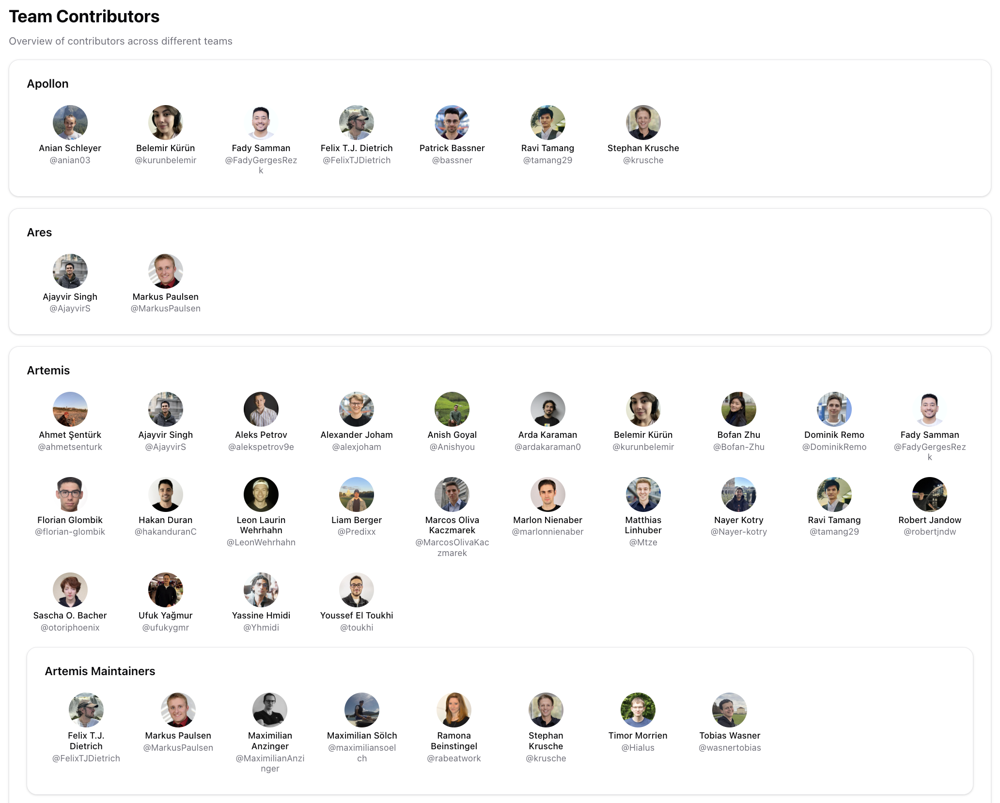
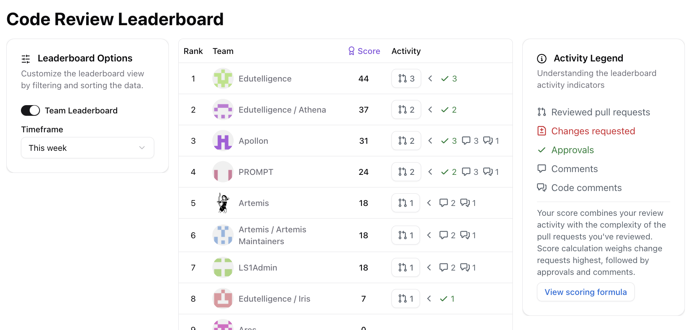

We are shipping the docs refresh together with 0.9.0. The release highlights two practical changes for team management. Teams now sync from GitHub without extra data entry. A Teams Leaderboard summarizes comparative code review metrics.

{/* truncate */}

## GitHub-driven Teams Overview

The old team admin created recurring maintenance work. With 0.9.0, Hephaestus syncs repository permissions and members from GitHub. The Teams Contributors page reflects the latest changes without any manual updates. 

## Teams Leaderboard

Once your teams are in sync, the next step is keeping them accountable. The 0.9.0 leaderboard aggregates each team's code review metrics so you can compare how they are tracking in the current iteration.

That's it for 0.9.0! As always, we are looking forward to your feedback and suggestions. Reach out on Slack or [GitHub Discussions](https://github.com/ls1intum/Hephaestus/discussions).