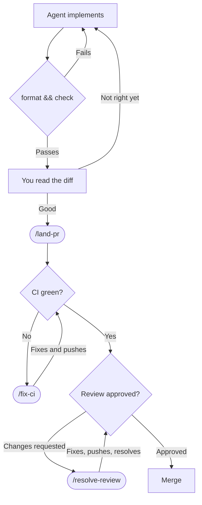

# Coding agents

Three are configured here: **Claude Code**, **opencode** and **Codex**. All three read the same
`AGENTS.md` files, so which one you use is your preference. CodeRabbit reviews pull requests as a
GitHub App and needs nothing in the tree.

Install any of them from its own documentation ([Claude Code](https://code.claude.com/docs),
[opencode](https://opencode.ai/docs), [Codex](https://developers.openai.com/codex)) and sign in with
your own account — nothing in this repository carries a credential, and none of them needs
configuring beyond that to pick up everything below.

## How work moves

```mermaid
flowchart TD
    accTitle: AI-assisted contribution workflow
    accDescr: An agent implements and self-validates, you review the diff, land-pr opens the PR, and fix-ci and resolve-review loop back into CI and review.
    B[Agent implements] --> C{format && check}
    C -->|Fails| B
    C -->|Passes| D[You read the diff]
    D -->|Not right yet| B
    D -->|Good| F([/land-pr])
    F --> H{CI green?}
    H -->|No| I([/fix-ci])
    I -->|Fixes and pushes| H
    H -->|Yes| J{Review approved?}
    J -->|Changes requested| K([/resolve-review])
    K -->|Fixes, pushes, resolves| J
    J -->|Approved| L[Merge]
```

**Agents do not stage, commit or push** until you run `/land-pr`; `/fix-ci` and `/resolve-review`
push their own fixes afterwards, which is why neither loops back through it. Reading the diff
yourself is the review that matters — the gates prove the tree is consistent, not that the change is
right.

`pnpm run format && pnpm run check` is the floor, not the whole ask. Name the thing your change could
actually break: the test file that covers it rather than "run the tests", a request against the
endpoint you added, a query confirming the row was written, the logs after the change.

## Parallel delivery protocol

Parallel work stays parallel only when contributors avoid manufacturing shared diffs:

1. **Reserve hot-file lanes at assignment time.** Only one in-flight PR may write each lane:
   `.github/workflows/**` and `.github/actions/**`; root `package.json` with `pnpm-lock.yaml`;
   `CHANGELOG.md` and `MIGRATION.md` (release automation only); `webapp/src/api/**`; and
   `server/application/src/main/resources/db/master.xml`. Migration fragments remove `MIGRATION.md`
   from feature work, but release automation still owns it exclusively. Dependent changes use
   `/gh-stack`; otherwise, do not make one PR wait for another.
2. **Commit only regeneration caused by the change.** If OpenAPI, ERD, route-tree, or another generator
   produces unrelated drift, stop and report it. One dedicated PR or the owning automation lands that
   drift; feature branches do not each carry a copy.
3. **Repair broken `main` once.** One queue-jumping hotfix owns the repair; feature branches neither
   duplicate it nor absorb it.
4. **Let the merge queue integrate.** Branch from a freshly fetched `origin/main`, rebase immediately
   before requesting merge, then use `gh pr merge --squash --auto`. Do not repeatedly rebase behind
   unrelated PRs or bypass the queue's final integration. A genuine dependency is a stack, not an
   informal waiting chain.

The assignee for a hot-file lane releases it when the PR merges or abandons the edit. If two tasks
discover they need the same lane, split or sequence that part explicitly rather than resolving the
same predictable conflict later.

These rules follow observed failure modes: one merge day spent six rebases on lane collisions and
none on disputed behavior; five sibling PRs carried the same generated API refresh; and one commitlint
repair appeared in four branches plus duplicate PRs
([#1632](https://github.com/ls1intum/Hephaestus/pull/1632),
[#1634](https://github.com/ls1intum/Hephaestus/pull/1634)).

## Slash commands

| Command | Does |
|---------|------|
| `/land-pr` | Validate, regenerate, branch, commit, push, and open the PR |
| `/fix-ci` | Read every failing check in one pass, fix in dependency order, push once |
| `/resolve-review` | Fetch review threads, decide each, reply and resolve |

Each lives in `.claude/skills/<name>/SKILL.md`. opencode
[reads `.claude/skills/` alongside its own](https://opencode.ai/docs/skills/) — `opencode debug
skill` prints every skill with the path it resolved from — so no skill needs a second copy for it.
A *typed* `/name` is the exception: opencode resolves that from `.opencode/commands/` only, so each
of these three has a file there whose entire body is `@.claude/skills/<name>/SKILL.md`. opencode
[inlines a referenced file into the prompt](https://opencode.ai/docs/commands/), which is what makes
a pointer enough where a copy used to be needed.

Codex shares no directory with the other two: it
[scans `.agents/skills/`](https://developers.openai.com/codex/skills) and never `.claude/skills/`,
and it has no repo-level slash commands at all —
[`~/.codex/prompts/` is personal and uncommitted](https://developers.openai.com/codex/custom-prompts),
and OpenAI's own guidance for sharing one is to make it a skill. So the four skills that drive a
contribution — these three and `/gh-stack` — are copied to `.agents/skills/<name>/`, and
`check:instructions` fails if a half goes missing or the two drift. `CODEX_SKILLS` in that script is
the list; add a name and the copy when Codex should have another.

The knowledge packs are deliberately not mirrored: `react-best-practices` alone is fifty files, and a
Codex session that needs them is working in `webapp/`, whose `AGENTS.md` names them by path. The
mirror also costs one `duplicate skill name` warning per skill in opencode's log, since opencode
reads both directories and sees the same name twice.

`disable-model-invocation` makes these three typed-only in Claude Code. opencode and Codex both
ignore the field, so there they are ordinary skills the model can reach on its own.

## Instructions live in `AGENTS.md`, once

| File | Covers |
|---|---|
| `AGENTS.md` | The repository — layout, quality gates, generated artefacts, migrations, changesets |
| `webapp/AGENTS.md` | The SPA — component conventions, linting traps, drawers, motion, vocabulary |
| `server/AGENTS.md` | The Spring Boot server — build traps, the four test tiers, API and security conventions |

The two tools reach them differently, and neither difference is visible from the file:

- **opencode** reads `AGENTS.md` natively and takes the nested ones from the `instructions` globs in
  `opencode.json`. Those load unconditionally, so an opencode session carries all three.
- **Codex** reads `AGENTS.md` from the repository root down to the directory you launched it in, and
  stops there. Start it in `webapp/` to get the SPA guide; started at the root it has only the root
  file.
- **Claude Code** reads `CLAUDE.md` and
  [never `AGENTS.md`](https://code.claude.com/docs/en/memory#agents-md). Each `AGENTS.md` therefore
  has a `CLAUDE.md` beside it holding one line — `@AGENTS.md` — which imports it. An import resolves
  against the file holding it, so the same line means a different file in each directory, and Claude
  loads a nested one the first time it reads a file anywhere in that tree. That is what keeps the
  webapp guide out of a server-only session.

`pnpm run check:instructions` fails on an `AGENTS.md` no `CLAUDE.md` imports, an `@` reference
resolving to nothing, an `instructions` entry matching no file, a typed-only skill with no opencode
command, a Codex mirror that has drifted, two agent files with one body, and any committed symlink
among them. Each failure explains itself. Bodies are compared exactly, so a copy is caught when it is
made rather than after it drifts.

### Adding a tree, or a skill

Write `<dir>/AGENTS.md`, add `<dir>/CLAUDE.md` containing `@AGENTS.md`, and give it its own
`opencode.json` `instructions` entry unless `*/AGENTS.md` already matches. Then run the gate. A skill
is a directory under `.claude/skills/`; it needs a file in `.opencode/commands/` only if you mark it
`disable-model-invocation`.

To confirm a file actually loaded, `/context` in Claude Code lists it under **Memory files** once you
have opened a file in that tree. The other two have no equivalent view — `opencode debug config`
echoes the patterns you configured rather than the files they matched — so there the gate is the
check.

### When an agent ignores an instruction

Confirm the instruction reached it before rewriting the instruction. An `AGENTS.md` in a tree the
agent has not opened yet has not loaded.
