# AI Agent Workflow Guide

This guide defines the **end-to-end workflow** for AI-assisted development. Follow it sequentially.

## The Complete Workflow

```mermaid
flowchart TD
    A[👤 User sends task] --> B[🤖 Agent creates beads issue]
    B --> C[🤖 Agent implements]
    C --> D{🤖 Agent validates}
    D -->|Fail| C
    D -->|Pass| E[👤 Review in Source Control]
    
    E --> F[Inspect file in tree view]
    F --> G{File OK?}
    G -->|Yes| H[Stage]
    G -->|Fixable| I[Re-prompt agent]
    G -->|Bad| J[Discard]
    I --> C
    H --> K{More files?}
    J --> K
    K -->|Yes| F
    K -->|No| L{Staged changes?}
    
    L -->|None| C
    L -->|Some| M([👤 /land-pr])
    M --> N[🤖 Close beads issue with PR #]
    N --> O[PR Created]
    O --> P{CI passes?}
    P -->|No| Q([👤 /fix-ci])
    Q --> C
    P -->|Yes| R[Request Review]
    R --> S{Approved?}
    S -->|Changes requested| T([👤 /resolve-review])
    T --> C
    S -->|Approved| U[Merge]
```



## Reusable Workflows

These slash commands work in **VSCode Copilot** (`.github/prompts/`) and **Antigravity** (`.agent/workflows/`):

| Command | Description |
|---------|-------------|
| `/land-pr` | Format, validate, commit, push, create PR |
| `/resolve-review` | Fetch and address PR review comments |
| `/fix-ci` | Diagnose and fix failing CI checks |

## Tools We Use

| Tool | Use Case | Access |
|------|----------|--------|
| **GitHub Copilot** | Agent mode, inline completions, PR review | Free for students |
| **Antigravity IDE** | Claude Opus 4.5, complex reasoning | Free for students |
| **CodeRabbit** | Automated PR review | GitHub App |

:::tip[Extra Context]
Use **File → Add Folder to Workspace...** to temporarily attach another repository (e.g., a library you're integrating). Copilot's `#runSubagent` tool can then research that codebase alongside Hephaestus. Remove the folder when done to keep your workspace clean.
:::

## Agent Self-Validation

Agents work best when they **validate their own work**. Always include validation in prompts:

**Standard validation:**

```bash
npm run format && npm run check
```

**Ad-hoc validation (when applicable):**

- Make an API request to verify the endpoint works
- Query the database to confirm data was written
- Scan logs for errors after the change
- Run the specific test file that covers your change

:::tip
The more specific your validation request, the better the agent performs. "Run tests" is okay; "Run `npm test -- --grep 'auth'` and check for failures" is better.
:::

## Git Context Commands

These commands help agents understand the current state. Use them in prompts to give context:

```bash
git status --short          # What files changed?
git --no-pager diff         # What are the unstaged changes?
git --no-pager diff --cached # What's staged for commit?
git --no-pager diff origin/main...HEAD  # Full PR diff vs main
```

## Human Controls Git

**Agents should NOT stage, commit, or push** unless you explicitly run `/land-pr`.

Your responsibilities:

1. Review changes in VSCode Source Control (tree view)
2. Run `npm run check` to validate
3. Stage good changes, revert bad ones
4. Use `/land-pr` when ready to commit

## Beads Issue Tracking

Track work across sessions with [Beads](https://github.com/steveyegge/beads):

```bash
bd create "Add auth endpoint" -t task  # Start work
bd list --status open                  # See all open issues
bd close <id> --reason "PR #123"       # Complete work
```

Issues persist in `.beads/issues.jsonl` and sync with git. See `AGENTS.md` section 0 for details.

## Troubleshooting

### Agent Uses Outdated APIs

The agent's training data is stale. Solutions:

- Paste current file contents into the prompt
- Ask agent to use web search for current docs
- Point to working examples in the codebase

### Agent Ignores Instructions

1. Simplify the prompt
2. Break into smaller steps
3. Use explicit constraints: "Do NOT modify..."

## Configuration

Agent instructions are loaded from:

- `AGENTS.md` — Main reference for all agents
- `.github/instructions/` — Scoped instructions per file type
