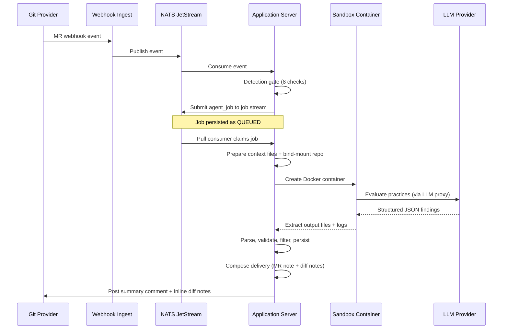

Hephaestus runs an AI-powered code review pipeline that evaluates merge requests against configurable software engineering practices. When a student opens or updates an MR, the system detects relevant practices, runs an LLM agent inside a sandboxed container, parses the structured output, and posts findings as MR comments and inline diff notes.

## Pipeline overview



## Key components

| Component         | Class                           | Responsibility                                                                                                                                                             |
| ----------------- | ------------------------------- | -------------------------------------------------------------------------------------------------------------------------------------------------------------------------- |
| Detection gate    | `PracticeReviewDetectionGate`   | 8-check gate: draft skip, workspace resolution, agent config, practice matching, `runForAllUsers` bypass, assignee presence, Keycloak health, assignee role                |
| Review handler    | `PullRequestReviewHandler`      | Context assembly (diff, metadata, practices), diff summary computation, post-execution delivery orchestration                                                              |
| Result parser     | `PracticeDetectionResultParser` | Parses agent JSON, validates and normalizes slugs, deduplicates by practice (highest confidence wins). Never throws -- failures go to `discarded` list                     |
| Delivery composer | `DeliveryComposer`              | Inline-first rendering: inlinable findings (with file locations) become compact MR summary entries + full diff notes; non-inlinable findings get full detail in MR summary |
| Diff validator    | `DiffHunkValidator`             | Validates diff note line positions against actual diff hunks. Snaps invalid positions to nearest valid line (`TreeSet.floor`/`ceiling`)                                    |
| Feedback service  | `FeedbackDeliveryService`       | Posts MR summary comment and diff notes to the git provider. Suppresses delivery for closed, merged, draft, or opted-out PRs                                               |
| Bot command       | `BotCommandProcessor`           | Listens for `/hephaestus review` comments (via Spring `@TransactionalEventListener`) to retrigger reviews                                                                  |
| Job executor      | `AgentJobExecutor`              | NATS pull consumer: claims jobs with `SKIP LOCKED`, dispatches to sandbox executor pool, persists results in micro-transactions                                            |

## Agent architecture

The system supports two LLM backends. The Claude Code agent may spawn subagents strategically for complex diffs; OpenCode uses a multi-agent orchestrator:

- **Claude Code** (`ClaudeCodeAgentAdapter`) -- Uses `--json-schema` for constrained decoding. Runner script (`.run-claude.mjs`) validates output and retries via `--continue` if malformed.
- **OpenCode** (`OpenCodeAgentAdapter`) -- Uses a self-enforced JSON schema. Runner script (`.run-opencode.mjs`) performs 3-phase self-correction: initial run, format retry, position retry (validates `suggestedDiffNotes` against diff hunks).

Both adapters produce the same output schema. The server is backend-agnostic after the agent returns. The active backend is selected per workspace via the `agent_config` table.

### Workspace layout

Every agent container gets this file structure:

```
/workspace/
  repo/                              # Git repository (read-only bind mount)
  .context/
    metadata.json                    # PR title, body, author, branches, stats
    comments.json                    # Latest 500 review comments
    diff.patch                       # Unified diff with [L<n>] annotations
    diff_stat.txt                    # Changed files summary
    diff_summary.md                  # Per-file diff chunks with index table
    contributor_history.json         # Prior findings for this author (optional)
  .practices/
    index.json                       # [{slug, name, category}]
    {slug}.md                        # Per-practice criteria (generated from DB)
    all-criteria.md                  # All criteria bundled (reduces tool calls)
  orchestrator-protocol.md           # Shared rules and output schema
  .prompt                            # Task prompt for the agent
  .json-schema                       # Output schema (Claude Code only)
  .run-claude.mjs / .run-opencode.mjs  # Runner script with self-correction
  CLAUDE.md                          # Claude Code orchestrator instructions
  .opencode/agents/*.md              # OpenCode agent definitions
  opencode.json                      # OpenCode configuration (OpenCode only)
  .analysis/practices/.gitkeep       # Directory for intermediate findings
  .output/                           # Agent writes final results here
```

### Output schema

The agent returns a JSON object with a `findings` array:

```json
{
  "findings": [
    {
      "practiceSlug": "hardcoded-secrets",
      "title": "API key exposed in source",
      "verdict": "NEGATIVE",
      "severity": "CRITICAL",
      "confidence": 0.95,
      "evidence": {
        "locations": [{ "path": "Config.swift", "startLine": 9, "endLine": 9 }],
        "snippets": ["private let apiToken = \"ghp_abc123\""]
      },
      "reasoning": "Hardcoded credential on +line...",
      "guidance": "Delete the line and use environment variables...",
      "suggestedDiffNotes": [
        {
          "filePath": "Config.swift",
          "startLine": 9,
          "endLine": 9,
          "body": "Delete this credential..."
        }
      ]
    }
  ]
}
```

**Verdicts**: `POSITIVE` (good practice), `NEGATIVE` (violation), `NOT_APPLICABLE` (practice irrelevant to this diff).

**Severities**: `CRITICAL`, `MAJOR`, `MINOR`, `INFO` -- defined per practice in the criteria files.

## Practices

Practices are stored in the database (`practice` table, `criteria` column). At runtime, the handler generates `.practices/{slug}.md` files from the DB criteria and injects them into the agent workspace. Each practice defines:

- What to look for
- Severity classification rules
- False-positive exclusions

The current deployment uses 13 practices (12 software engineering + `hardcoded-secrets`). Practices are fully configurable per workspace and can be added or modified without code changes.

## Delivery pipeline

After the agent returns findings, the server runs a 7-step delivery pipeline in `PullRequestReviewHandler.deliver()`:

1. **Parse** -- `PracticeDetectionResultParser` validates all fields, normalizes slugs (`toLowerCase` + replace `_` with `-`), deduplicates by practice (highest confidence wins), and collects `suggestedDiffNotes` from NEGATIVE findings. Malformed entries are captured in a `discarded` list (never throws).

2. **Filter by diff scope** -- `filterByDiffScope` removes findings whose evidence locations don't intersect the actual diff. Prevents hallucinated findings about unchanged code.

3. **Persist** -- Validated findings are saved as `PracticeFinding` entities in the database.

4. **Compose** -- `DeliveryComposer` partitions findings into:
   - **Inlinable** (have file locations, not in internal paths like `.context/`, practice not in `NON_INLINABLE_PRACTICES`) -- compact list in MR summary, full detail in diff notes
   - **Non-inlinable** (`mr-description-quality`, `commit-discipline`, or no file location) -- full detail in MR summary
   - When all findings are positive, composes a short approval comment naming top positive practices

5. **Validate positions** -- `DiffHunkValidator` parses the unified diff to extract valid new-side line numbers per file. Invalid positions are snapped to the nearest valid line (`TreeSet.floor`/`ceiling`).

6. **Suppress check** -- `FeedbackDeliveryService` checks suppression conditions: PR closed, PR merged (unless `deliverToMerged`), PR is draft (if `skipDrafts`), or author opted out of AI reviews. Suppressed reviews are logged but not posted.

7. **Post** -- `FeedbackDeliveryService` posts the MR summary comment (with an HTML marker `<!-- hephaestus:practice-review:{jobId} -->` for edit-detection) and inline diff notes to the git provider's API.

## Bot command

Students can type `/hephaestus review` in an MR comment to retrigger a review. The flow:

1. `GitLabNoteMessageHandler` detects the command prefix and publishes a `BotCommandReceivedEvent`
2. `BotCommandProcessor` listens asynchronously, validates the PR state, evaluates the detection gate, and submits a new review job

This uses Spring's event system to avoid a module dependency cycle between `gitprovider` and `agent`.

## Database schema

Key tables for code review:

| Table              | Key Columns                                                                                                               | Purpose                                                                                      |
| ------------------ | ------------------------------------------------------------------------------------------------------------------------- | -------------------------------------------------------------------------------------------- |
| `agent_config`     | `model`, `model_version`, `enabled`, `credentials` (encrypted)                                                            | LLM backend configuration per workspace                                                      |
| `agent_job`        | `status`, `idempotency_key`, `job_token` (encrypted), `config_snapshot` (JSONB), `delivery_status`, `llm_*` usage columns | Job lifecycle: QUEUED → RUNNING → COMPLETED/FAILED. Tracks container ID, exit code, LLM cost |
| `practice`         | `slug`, `name`, `category`, `criteria` (TEXT), `trigger_events` (JSONB), `workspace_id`                                   | Practice definitions. Unique constraint on `(workspace_id, slug)`                            |
| `practice_finding` | `verdict`, `severity`, `confidence`, `evidence` (JSONB), `guidance`, `agent_job_id`, `pull_request_id`                    | Individual findings per PR per practice                                                      |

## Configuration

### Application properties

```yaml
hephaestus:
  agent:
    nats:
      enabled: true # Enable agent job processing
      server: nats://localhost:4222
  sandbox:
    llm-proxy-port: 38080 # Must match server port
    docker-host: unix:///var/run/docker.sock
  git:
    enabled: true
    storage-path: /tmp/hephaestus-git-repos
```

### Dev trigger

For development, enable the REST endpoint to manually trigger reviews:

```yaml
hephaestus:
  dev:
    trigger-enabled: true
```

Then trigger with:

```bash
curl -X POST "http://localhost:${SERVER_PORT}/api/dev/trigger-review?prId=123&workspaceId=1"
```

The port must match your `SERVER_PORT` environment variable (default: `38080` in `.env`).

## Adding a new practice

1. Insert a row in the `practice` table with all required fields: `slug`, `name`, `description`, `workspace_id`, and `trigger_events` (JSONB array of event names like `["PULL_REQUEST_OPENED", "PULL_REQUEST_UPDATED"]`)
2. Set the `criteria` column with the evaluation criteria text (Markdown). If omitted, the `description` column is used as fallback
3. Set `category` for grouping (e.g., `security`, `reliability`, `design`, `process`)
4. No code changes needed -- the handler generates `{slug}.md` from the DB criteria and the agent reads practices dynamically from `index.json`

## Extending to new languages

The orchestrator protocol (`orchestrator-protocol.md`) contains language-agnostic rules. Language-specific guidance lives in the practice criteria files. To support a new language:

1. Write new practice criteria targeting the language's patterns and insert them in the `practice` table
2. The orchestrator protocol is language-agnostic -- no changes needed unless the language requires special analysis strategies
3. The agent prompt files (`CLAUDE.md`, `opencode-orchestrator.md`) may need minor adjustments for language-specific tooling (e.g., build commands, linter integration)
