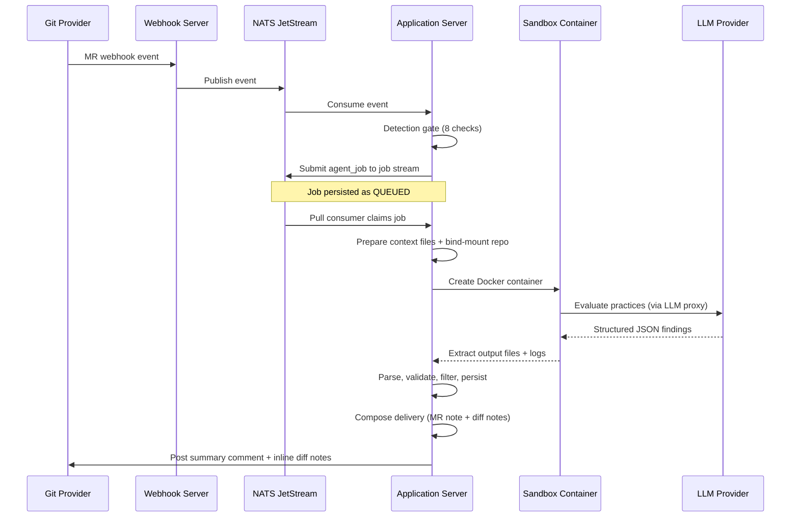

Hephaestus runs an AI-powered code review pipeline that evaluates merge requests against configurable software engineering practices. When a student opens a non-draft MR (or uses `/hephaestus review`), the system detects relevant practices, runs an LLM agent inside a sandboxed container, parses the structured output, and posts findings as MR comments and inline diff notes.

## Pipeline overview



## Key components

| Component         | Class                           | Responsibility                                                                                                                                                             |
| ----------------- | ------------------------------- | -------------------------------------------------------------------------------------------------------------------------------------------------------------------------- |
| Detection gate    | `PracticeReviewDetectionGate`   | 8-check gate: draft skip, workspace resolution, agent config, practice matching, `runForAllUsers` bypass, assignee presence, role-checker health, assignee role                |
| Review handler    | `PullRequestReviewHandler`      | Context assembly (diff, metadata, practices), diff summary computation, post-execution delivery orchestration                                                              |
| Result parser     | `PracticeDetectionResultParser` | Parses agent JSON, validates and normalizes slugs, deduplicates by practice (highest confidence wins). Never throws -- failures go to `discarded` list                     |
| Delivery composer | `DeliveryComposer`              | Inline-first rendering: inlinable findings (with file locations) become compact MR summary entries + full diff notes; non-inlinable findings get full detail in MR summary |
| Diff validator    | `DiffHunkValidator`             | Validates diff note line positions against actual diff hunks. Snaps invalid positions to nearest valid line (`TreeSet.floor`/`ceiling`)                                    |
| Feedback service  | `FeedbackDeliveryService`       | Posts MR summary comment and diff notes to the git provider. Suppresses delivery for closed, merged, draft, or opted-out PRs                                               |
| Bot command       | `BotCommandProcessor`           | Listens for `/hephaestus review` comments (via Spring `@TransactionalEventListener`) to retrigger reviews                                                                  |
| Job executor      | `AgentJobExecutor`              | NATS pull consumer: claims jobs with `SKIP LOCKED`, dispatches to sandbox executor pool, persists results in micro-transactions                                            |

## Agent architecture

A single backend powers practice detection: the **Pi practice agent**, wired via `PracticePiAdapter` on top of the shared `PiRuntimeFactory`. It uses a single-pass architecture — one agent evaluates all relevant practices for the diff and persists structured findings via the custom Pi tool `report_finding` (the run-level summary is composed downstream from the persisted findings, not via a separate tool).

The runner (`.run-pi.mjs`) drives the Pi SDK in-process: initial analysis with a soft-timeout steering message and a hard-timeout abort, followed by a format retry if the persisted output is incomplete. A top-level watchdog hard-exits the process at `AGENT_BUDGET_MS + 30s` so the orchestrator always observes a terminal state.

### Workspace layout

Every agent container gets this file structure (agent-specific files noted):

The layout is split by **location**, not lore (ADR 0020): `inputs/` is read-only (the path-guard whitelists exactly this subtree), `work/` is writable scratch that is never collected, and `out/` is the only directory collected back into SQL. The constants live in `SandboxLayout`; see `docs/developer/agent/workspace-abi.mdx` for the full ABI.

```
/workspace/
  inputs/                              # read-only — the path-guard whitelists exactly this subtree
    manifest.json                      #   telescope: integration-agnostic index (path/connector/sha256)
    sources/scm/repo/                  #   the SCM connector's source — git checkout (read-only mount)
    context/                           #   workspace context (WorkspaceContextBuilder populates this)
      metadata.json                    #     PR metadata + commits
      comments.json                    #     review comments
      diff.patch                       #     diff with [L<n>] annotations
      diff_summary.md                  #     per-file diff chunks with index table
      contributor_history.json         #     prior findings for this author (optional)
    practices/                         #   per-practice catalog (generated from the DB)
      index.json                       #     [{slug, name, area}]
      {slug}.md                        #     per-practice criteria
      all-criteria.md                  #     all criteria bundled (reduces tool calls)
  work/                                # scratch the agent + precompute write; NEVER collected
    precompute/practices/{slug}.ts     #   precompute scripts (from DB, if present)
    precompute-out/                    #   precompute output (summary.md + per-practice JSON)
    analysis/practices/                #   directory for intermediate findings markers
  out/                                 # the ONLY directory collected back into SQL
  task.json                            # TaskEnvelope around Task.PracticeReview — prompt, jobId, workspaceId
  .pi/                                 # Pi SDK agent dir ($PI_CODING_AGENT_DIR)
    AGENTS.md                          #   Pi orchestrator instructions
    settings.json                      #   Pi SDK configuration (provider, model, compaction)
    extensions/                        #   custom provider extensions (auto-discovered)
  .run-pi.mjs                          # runner entry point
```

### Output schema

The agent returns a JSON object with a `findings` array:

```json
{
  "findings": [
    {
      "practiceSlug": "hardcoded-secrets",
      "title": "API key exposed in source",
      "presence": "PRESENT",
      "assessment": "BAD",
      "severity": "CRITICAL",
      "confidence": 0.95,
      "evidence": {
        "locations": [{ "path": "Config.swift", "startLine": 9, "endLine": 9 }],
        "snippets": ["private let apiToken = \"ghp_abc123\""]
      },
      "reasoning": "Hardcoded credential on +line...",
      "guidance": "Delete the line and use environment variables...",
      "suggestedDiffNotes": [
        {
          "filePath": "Config.swift",
          "startLine": 9,
          "endLine": 9,
          "body": "Delete this credential..."
        }
      ]
    }
  ]
}
```

**Presence** (`presence`): `PRESENT` (the practice's signal is in the change), `ABSENT` (it is missing), `NOT_APPLICABLE` (the practice does not apply to this change). **Assessment** (`assessment`): `GOOD` (a strength) or `BAD` (a problem) — required for `PRESENT`/`ABSENT`, omitted (null) for `NOT_APPLICABLE`.

**Severities**: `CRITICAL`, `MAJOR`, `MINOR`, `INFO` -- defined per practice in the criteria files.

## Practices

> **Terminology.** A **practice** is one detectable item (its slug, e.g. `scope-one-reviewable-change`). A **practice area** is one of the groupings that contain practices (entity `PracticeArea`, table `practice_area`). The canonical one-word name for the grouping is **area** (the field is literally `Practice.area` / `practice_area_id`; see `practice-feedback-schema.md` §2 and `practice-catalogue.md` — *area*, never *goal* or *category*). Spell it out as "practice area" only where a bare "area" would be ambiguous from context; never substitute "goal" or "category" for the grouping. (Unrelated uses — achievement categories, mentor goal-setting, CSS grid areas — are exempt.)

Practices are stored in the database (`practice` table, `criteria` column). At runtime, the handler generates `.practices/{slug}.md` files from the DB criteria and injects them into the agent workspace. Each practice defines:

- What to look for
- Severity classification rules
- False-positive exclusions

The current deployment uses 32 practices across 11 practice areas. Practices are fully configurable per workspace and can be added or modified without code changes.

## Delivery pipeline

After the agent returns findings, the server runs a 6-step delivery pipeline in `PullRequestReviewHandler.deliver()`:

1. **Parse** -- `PracticeDetectionResultParser` validates all fields, normalizes slugs (`toLowerCase` + replace `_` with `-`), deduplicates by practice (highest confidence wins), and collects `suggestedDiffNotes` from `BAD` findings. Malformed entries are captured in a `discarded` list (never throws).

2. **Filter by diff scope** -- `filterByDiffScope` removes findings whose evidence locations don't intersect the actual diff. Prevents hallucinated findings about unchanged code.

3. **Persist** -- Validated findings are saved as `Observation` entities in the database.

4. **Compose** -- `DeliveryComposer` partitions findings into:
   - **Inlinable** (have file locations, not in internal paths like `inputs/context/`, practice not in `NON_INLINABLE_PRACTICES`) -- compact list in MR summary, full detail in diff notes
   - **Non-inlinable** (PR-description / commit-discipline practices such as `describe-what-and-why` and `commits-are-atomic-and-cohesive`, or no file location) -- full detail in MR summary
   - When all findings are `GOOD` strengths, composes a short approval comment naming the top strengths

5. **Validate positions** -- `DiffHunkValidator` parses the unified diff to extract valid new-side line numbers per file. Invalid positions are snapped to the nearest valid line (`TreeSet.floor`/`ceiling`).

6. **Post** -- `FeedbackDeliveryService` checks suppression conditions (PR closed, merged, draft, or author opted out) and, if not suppressed, posts the MR summary comment (with an HTML marker `<!-- hephaestus:practice-review:{jobId} -->` for identification) and inline diff notes to the git provider's API. On re-runs, `DiffNotePoster` first deletes old diff notes bearing the `<!-- hephaestus-diff-note -->` marker to prevent accumulation.

## Bot command

Students can type `/hephaestus review` in an MR comment to retrigger a review. The flow:

1. `GitLabNoteMessageHandler` detects the command prefix and publishes a `BotCommandReceivedEvent`
2. `BotCommandProcessor` listens asynchronously, validates the PR state, evaluates the detection gate, and submits a new review job

This uses Spring's event system to avoid a module dependency cycle between `integration.scm` and `agent`.

## Database schema

Key tables for code review:

| Table              | Key Columns                                                                                                               | Purpose                                                                                      |
| ------------------ | ------------------------------------------------------------------------------------------------------------------------- | -------------------------------------------------------------------------------------------- |
| `agent_config`     | `name`, `agent_type`, `enabled`, `instance_model_id` XOR `workspace_model_id` (binds to the instance catalog or a workspace's own BYO connection), `timeout_seconds`, `max_concurrent_jobs`, `allow_internet` | LLM backend configuration per workspace. Legacy `llm_api_key`/`llm_provider`/`credential_mode` columns are retained this release for backward compatibility and are backfilled into an equivalent per-workspace BYO connection |
| `agent_job`        | `status`, `idempotency_key`, `job_token` (encrypted), `config_snapshot` (JSONB), `delivery_status`, `llm_*` usage columns | Job lifecycle: QUEUED → RUNNING → COMPLETED/FAILED. Tracks container ID, exit code, LLM cost |
| `practice`         | `slug`, `name`, `criteria` (TEXT), `trigger_events` (JSONB), `precompute_script` (TEXT), `practice_area_id` (FK → `practice_area`), `artifact_type`, `why_it_matters`, `what_good_looks_like`, `is_active`, `workspace_id` | Practice definitions, each linked to a practice area. Unique constraint on `(workspace_id, slug)` |
| `observation`      | `occurrence_key`, `title`, `presence`, `assessment`, `severity`, `confidence`, `evidence` (JSONB), `reasoning`, `recurrence_key`, `agent_job_id`, `practice_id`, `artifact_type`, `artifact_id`, `about_user_id`, `observed_at` | Individual observations per target (PR) per practice                                          |

## Configuration

### Application properties

```yaml
hephaestus:
  agent:
    image:
      reference: ghcr.io/ls1intum/hephaestus/agent-pi:latest # dev; prod injected by release-pin-fetcher init service
      pull-policy: IF_NOT_PRESENT
      # require-digest: true # set only in application-prod.yml
    nats:
      enabled: true # Enable agent job processing
      server: nats://localhost:4222
  sandbox:
    llm-proxy-port: 8080 # Must match server port
    docker-host: unix:///var/run/docker.sock
  git:
    enabled: true
    storage-path: /tmp/hephaestus-git-repos
```

Production binds the digest via a signed release asset; see [Agent image digests](/admin/agent-image-digests).

### Dev trigger

For development, enable the REST endpoint to manually trigger reviews:

```yaml
hephaestus:
  dev:
    trigger-enabled: true
```

Then trigger with:

```bash
curl -X POST "http://localhost:${SERVER_PORT}/api/dev/trigger-review?prId=123&workspaceId=1"
```

The port must match your `SERVER_PORT` environment variable (default: `8080` in `.env`).

## Adding a new practice

1. Insert a row in the `practice` table with all required fields: `slug`, `name`, `workspace_id`, and `trigger_events` (JSONB array of event names like `["PULL_REQUEST_OPENED", "PULL_REQUEST_UPDATED"]`)
2. Set the `criteria` column with the evaluation criteria text (Markdown)
3. Link the practice to a **practice area** for grouping via `practice_area_id` (FK → `practice_area`, e.g. the seeded review-ready-work or testing-discipline areas)
4. No code changes needed -- the handler generates `{slug}.md` from the DB criteria and the agent reads practices dynamically from `index.json`

### Wording the human-facing strings

`name`, `whyItMatters`, and `whatGoodLooksLike` are read by developers (and `whyItMatters` is posted verbatim as the "Why this matters" line on a real review comment), so keep them plain and human:

- **`name`** — a short imperative verb phrase (≤ 8 words), parallel with the others ("Scope the change to one concern").
- **`whyItMatters`** — 1–2 sentences: name the failure the habit prevents, then the payoff. No clichés, no hype.
- **`whatGoodLooksLike`** — one concrete sentence picturing the good end state, general across languages and stacks (no per-framework examples).
- Avoid AI-speak and clubby slang: drive em-dashes to near zero (prefer a period or comma); skip "ship", "hand off", "rubber-stamp", "leverage", "robust", "seamless"; gloss any unavoidable abbreviation on first use (WIP → work in progress). Keep precise domain terms (injection sink, idempotent, boundary) and let the sentence carry their meaning.
- `criteria` is machine-facing (the developer never sees it) — write it for detection accuracy, not for prose.

## Extending to new languages

The Pi orchestrator instructions (`pi-orchestrator.md`, mounted at `.pi/AGENTS.md`) are language-agnostic. Language-specific guidance lives in the practice criteria. To support a new language:

1. Write new practice criteria targeting the language's patterns and insert them in the `practice` table
2. The agent orchestrator file is language-agnostic -- no changes needed unless the language requires special analysis strategies
3. Practice criteria (in DB) may benefit from language-specific examples; precompute scripts (also in DB) often need per-language regex tweaks
