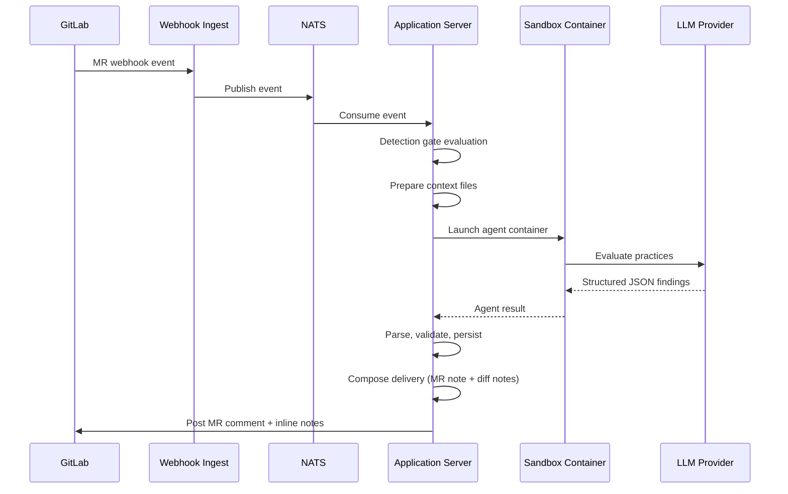

Hephaestus runs an AI-powered code review pipeline that evaluates merge requests against configurable software engineering practices. When a student opens or updates an MR, the system detects relevant practices, runs an LLM agent inside a sandboxed container, parses the structured output, and posts findings as MR comments and inline diff notes.

## Pipeline overview



## Key components

| Component | Class | Responsibility |
|-----------|-------|---------------|
| Detection gate | `PracticeReviewDetectionGate` | Decides whether to run a review (checks workspace config, trigger events, active practices) |
| Review handler | `PullRequestReviewHandler` | Orchestrates the entire pipeline: context assembly, diff computation, agent dispatch, result delivery |
| Result parser | `PracticeDetectionResultParser` | Parses agent JSON output into validated findings. Never throws -- all failures captured in `discarded` list |
| Delivery composer | `DeliveryComposer` | Transforms structured findings into Markdown for MR summary and diff notes |
| Diff validator | `DiffHunkValidator` | Validates and corrects diff note line positions against actual diff hunks |
| Feedback service | `FeedbackDeliveryService` | Posts MR summary comment and diff notes to GitLab. Handles suppression (closed/draft/opt-out) |
| Bot command | `BotCommandProcessor` | Listens for `/hephaestus review` comments to retrigger reviews |
| Job executor | `AgentJobExecutor` | NATS pull consumer that claims, runs, and completes agent jobs |

## Agent architecture

The system supports two LLM backends:

- **Claude Code** (`ClaudeCodeAgentAdapter`) -- Uses `--json-schema` for constrained decoding. Single-pass: one agent evaluates all practices.
- **OpenCode** (`OpenCodeAgentAdapter`) -- Uses `task` tool to dispatch 3 subagents grouped by domain (Safety, Architecture, Process). Collects and merges findings.

Both adapters produce the same output schema. The server is backend-agnostic after the agent returns.

### Workspace layout

Every agent container gets this file structure:

```
/workspace/
  repo/                              # Git repository (read-only)
  .context/
    metadata.json                    # PR title, body, author, branches
    comments.json                    # Existing review comments
    diff.patch                       # Unified diff with [L<n>] annotations
    diff_stat.txt                    # Changed files summary
    diff_summary.md                  # Per-file diff chunks with index table
    contributor_history.json         # Prior findings for this author (optional)
  .practices/
    index.json                       # [{slug, name, category}]
    {slug}.md                        # Per-practice evaluation criteria
    all-criteria.md                  # All criteria bundled
  orchestrator-protocol.md           # Shared rules and output schema
  CLAUDE.md / .opencode/agents/      # Backend-specific orchestrator
  .output/                           # Agent writes results here
```

### Output schema

The agent returns a JSON object with a `findings` array:

```json
{
  "findings": [
    {
      "practiceSlug": "hardcoded-secrets",
      "title": "API key exposed in source",
      "verdict": "NEGATIVE",
      "severity": "CRITICAL",
      "confidence": 0.95,
      "evidence": {
        "locations": [{"path": "Config.swift", "startLine": 9, "endLine": 9}],
        "snippets": ["private let apiToken = \"ghp_abc123\""]
      },
      "reasoning": "Hardcoded credential on +line...",
      "guidance": "Delete the line and use environment variables...",
      "suggestedDiffNotes": [
        {"filePath": "Config.swift", "startLine": 9, "endLine": 9, "body": "Delete this credential..."}
      ]
    }
  ]
}
```

**Verdicts**: `POSITIVE` (good practice), `NEGATIVE` (violation), `NOT_APPLICABLE` (practice irrelevant to this diff).

**Severities**: `CRITICAL`, `MAJOR`, `MINOR`, `INFO` -- defined per practice in the criteria files.

## Practices

Practices are stored in the database (`practice` table, `criteria` column) and as `.md` files in `resources/agent/practices/`. Each practice defines:

- What to look for
- Severity classification rules
- False-positive exclusions

The current deployment uses 13 practices (12 software engineering + `hardcoded-secrets`). Practices are fully configurable per workspace and can be added or modified without code changes.

## Delivery pipeline

After the agent returns findings, the server renders them into GitLab comments:

1. **Parse** -- `PracticeDetectionResultParser` validates all fields, normalizes slugs, deduplicates by practiceSlug (highest confidence wins), and extracts `suggestedDiffNotes` from NEGATIVE findings.

2. **Persist** -- Validated findings are saved as `PracticeFinding` entities in the database.

3. **Compose** -- `DeliveryComposer` splits findings into:
   - **Inlinable** (have file locations) -- compact list in MR summary, full detail in diff notes
   - **Non-inlinable** (no location, e.g., MR description quality) -- full detail in MR summary

4. **Validate positions** -- `DiffHunkValidator` parses the unified diff to extract valid new-side line numbers per file. Invalid positions are snapped to the nearest valid line (`TreeSet.floor`/`ceiling`).

5. **Post** -- `FeedbackDeliveryService` posts the MR summary comment and inline diff notes to GitLab via GraphQL.

## Bot command

Students can type `/hephaestus review` in an MR comment to retrigger a review. The flow:

1. `GitLabNoteMessageHandler` detects the command prefix and publishes a `BotCommandReceivedEvent`
2. `BotCommandProcessor` listens asynchronously, validates the PR state, evaluates the detection gate, and submits a new review job

This uses Spring's event system to avoid a module dependency cycle between `gitprovider` and `agent`.

## Database schema

Key tables for code review:

| Table | Purpose |
|-------|---------|
| `agent_config` | LLM backend configuration (model, credentials, enabled flag) |
| `agent_job` | Job lifecycle tracking (status, timing, LLM usage metrics) |
| `practice` | Practice definitions (slug, name, category, criteria, trigger events) |
| `practice_finding` | Individual findings per PR per practice (verdict, severity, confidence, evidence, guidance) |

## Configuration

### Application properties

```yaml
hephaestus:
  agent:
    nats:
      enabled: true                           # Enable agent job processing
      server: nats://localhost:4222
  sandbox:
    llm-proxy-port: 38080                     # Must match server port
    docker-host: unix:///var/run/docker.sock
  git:
    enabled: true
    storage-path: /tmp/hephaestus-git-repos
```

### Dev trigger

For development, enable the REST endpoint to manually trigger reviews:

```yaml
hephaestus:
  dev:
    trigger-enabled: true
```

Then trigger with:

```bash
curl -X POST "http://localhost:38080/api/dev/trigger-review?prId=123&workspaceId=1"
```

## Adding a new practice

1. Insert a row in the `practice` table with slug, name, category, and criteria text
2. The criteria text is injected as `{slug}.md` into the agent workspace
3. No code changes needed -- the agent reads criteria dynamically from `index.json`

## Extending to new languages

The orchestrator protocol (`orchestrator-protocol.md`) contains language-agnostic rules. Language-specific guidance lives in the practice criteria files. To support a new language:

1. Write new practice criteria targeting the language's patterns
2. Update the `practices-v3.json` catalogue (or create entries in the DB)
3. The agent prompt files (`CLAUDE.md`, `opencode-orchestrator.md`) may need minor adjustments for language-specific analysis strategies
