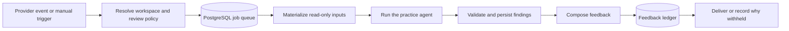

Hephaestus reviews pull requests and merge requests, issues, and settled conversations against the
practices enabled for a workspace. Admission depends on the artifact, workspace policy, trigger, and
available model binding; it is not limited to one provider or event.

## Stable flow

```mermaid
flowchart LR
    Event[Provider event or manual trigger] --> Gate[Resolve workspace and review policy]
    Gate --> Queue[(PostgreSQL job queue)]
    Queue --> Context[Materialize read-only inputs]
    Context --> Sandbox[Run the practice agent]
    Sandbox --> Findings[Validate and persist findings]
    Findings --> Compose[Compose feedback]
    Compose --> Ledger[(Feedback ledger)]
    Ledger --> Deliver[Deliver or record why withheld]
```

The implementation may split agent work into several turns or batches. Those scheduling details are
not part of the contract. The durable boundaries are:

- **Review admission:** `PracticeReviewDetectionGate` decides whether a trigger may enqueue work.
- **Queue and execution:** `agent_job` is the queue; workers claim jobs and run the sandbox described
  by
  [ADR 0025](https://github.com/ls1intum/Hephaestus/blob/main/docs/decisions/0025-agent-job-queue-on-postgresql.md).
- **Workspace ABI:** the sandbox receives immutable `inputs/`, disposable `work/`, and returns only
  `out/`. [Agent workspace ABI](agent/workspace-abi.mdx) is the source of truth for paths and trust
  boundaries.
- **Findings:** the agent reports evidence through `report_finding`.
  `PracticeDetectionResultParser` validates entries; persistence assigns occurrence and recurrence
  identity.
- **Feedback:** server-side composition turns eligible findings into messages. Delivery attempts,
  withholding, replacement, and placements are recorded in the feedback ledger.

The persistence concepts and evaluation joins are documented in
[Practice review data model](practice-feedback-schema.md) and
[Evaluation provenance](evaluation-provenance.md). Product terms are defined in
[Practice feedback language](practice-feedback-language.md).

## Review handlers

Artifact-specific handlers assemble context and delivery constraints:

- `PullRequestReviewHandler` for pull and merge requests;
- `IssueReviewHandler` for issues;
- `ConversationReviewHandler` for settled Slack threads.

All handlers use the same practice-agent runtime and findings model. Provider adapters own provider
identifiers, diff/comment APIs, and conversation storage; the practices module owns practice
definitions, findings, and the feedback ledger.

## Extending the bundled catalogue

Follow [Practice catalogue curation](practice-catalogue.md) for bundled defaults and workspace-specific
practices.

## Changing the runtime

When changing sandbox inputs or outputs:

1. Update the owning runtime type or parser first.
2. Update [Agent workspace ABI](agent/workspace-abi.mdx) only for a durable ABI change.
3. Add a behavioral test at the narrowest owning boundary.
4. Regenerate OpenAPI and the web client when the HTTP contract changes.

Avoid copying file trees, enum inventories, defaults, or database columns into this guide. Those
details are owned by executable types, Liquibase, the generated database schema, and OpenAPI.
