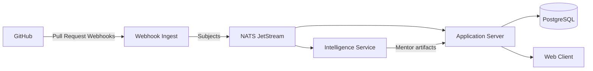

## High-level view

The platform follows a hub-and-spoke model:

1. **Application Server** – Acts as the primary API, integrates with GitHub, persists state in PostgreSQL, and publishes events to NATS.
2. **Intelligence Service** – Consumes events from NATS, enriches them with AI-driven insights, and writes mentor artifacts back via the API.
3. **Webhook Ingest** – Translates GitHub webhooks into normalized NATS messages to decouple GitHub spikes from the main server.
4. **Web Client** – Connects to both REST APIs and websockets for live leaderboard updates using TanStack Query.

## Data flow

## Observability

- OpenTelemetry collectors export traces to the TUM infrastructure.
- Service logs follow a structured JSON schema defined in `docs/contributor/logging.md`.
- Metrics surface via Prometheus scraping endpoints in each container.

## Deployment pipeline

- GitHub Actions builds Docker images for every merge into `develop`.
- Production releases are tagged `release/x.y.z` and deployed through ArgoCD.
- Documentation builds from the `docs` workspace and publishes to GitHub Pages on the `gh-pages` branch.
