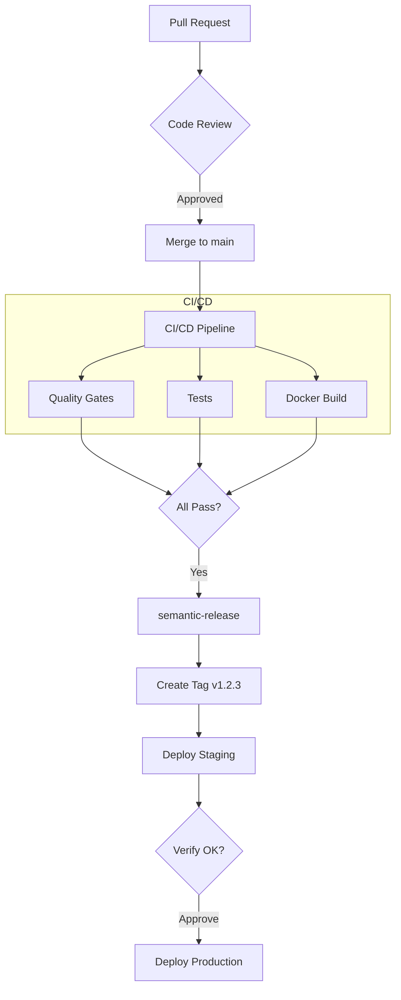

# CI/CD Architecture

Hephaestus uses trunk-based continuous deployment powered by GitHub Actions. Every merge to `main` triggers automatic staging deployment, with production requiring manual approval.

## 🏗️ Architecture Overview

## ⚡ Pipeline Timeline

| Stage | Duration | Notes |
| --- | --- | --- |
| Quality gates | ~3 min | Parallel with tests |
| Tests | ~3 min | Parallel with gates |
| Docker builds | ~7 min | Uses layer caching |
| semantic-release | ~1 min | Creates tag + changelog |
| Staging deploy | ~2 min | Automatic |
| **Your verification** | You decide | Check staging |
| Production deploy | ~2 min | After approval |
| **Total** | **~15 min + verification** | |

## 🚀 Release Flow

### Continuous Deployment

Every merge to `main` with releasable changes (`feat:`, `fix:`, `perf:`, `revert:`, breaking):

1. **CI runs** — tests, quality gates, Docker builds
2. **semantic-release** — analyzes commits, creates version tag
3. **Staging deploys** — automatic, no approval needed
4. **You verify** — check staging.hephaestus.cit.tum.de
5. **Approve production** — click in GitHub Actions
6. **Production deploys** — live!

## 🛡️ Quality Gates

Before any release, code must pass:

| Gate | Tool | Purpose |
| --- | --- | --- |
| Database drift | Liquibase | JPA ↔ Schema sync |
| OpenAPI sync | Diff check | Client ↔ Server sync |
| Java formatting | Spotless | Code style |
| TypeScript | Biome + tsc | Lint + typecheck |

## 🔒 Security

- **Trivy** — Scans Docker images for CVEs
- **Renovate** — Monitors dependencies for vulnerabilities
- **Environment protection** — Production requires approval

## 📦 Environments

| Environment | Protection | Deploys On |
| --- | --- | --- |
| Preview (Coolify) | None | Every PR |
| Staging | None | Every tag |
| Production | Approval required | Tag + approval |

### GitHub Environment Setup

1. **Settings → Environments → New environment**
2. Create `staging` (no rules)
3. Create `production` with **Required reviewers**

## 🔄 Preview Deployments

Coolify handles PR previews:

- Built directly on server (fast!)
- URL: `pr-{number}.preview.hephaestus.cit.tum.de`
- Auto-cleanup on PR close

## ⚙️ Key Workflows

| Workflow | Trigger | Purpose |
| --- | --- | --- |
| `cicd.yml` | Push to main, PRs | Tests, builds, quality gates |
| `release.yml` | On CI/CD Success | Creates tag, deploys staging, gates production |
| `deploy-staging.yml` | Called by release.yml | Deploys to staging |
| `deploy-prod.yml` | workflow_dispatch | Deploys to production (manual trigger) |

## 🎯 Performance Optimizations

### Docker Layer Caching

- All images built every run
- Aggressive caching makes unchanged builds instant
- Ensures every commit is deployable

### Parallel Execution

- Quality gates run parallel to tests
- Docker builds use matrix strategy
- Fail-fast terminates on first failure

### Concurrency Control

- Outdated PR runs cancelled automatically
- Release runs never cancelled
