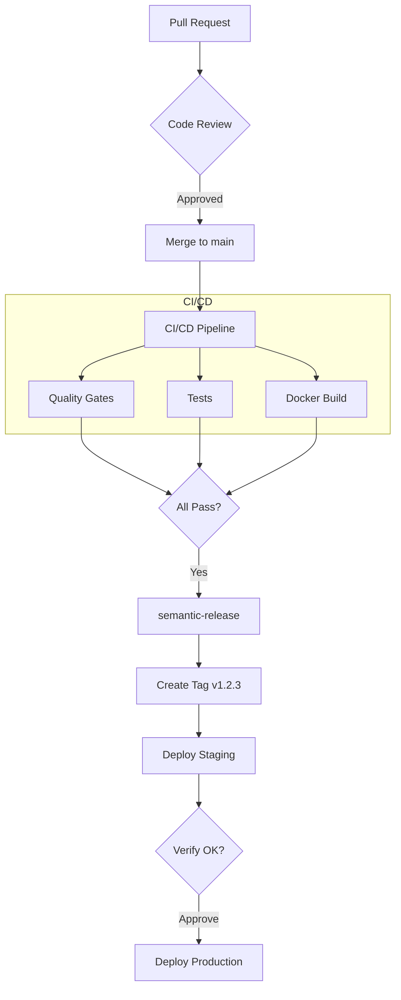

# CI/CD Architecture

Hephaestus uses trunk-based continuous deployment powered by GitHub Actions. Every merge to `main` triggers automatic staging deployment, with production requiring manual approval.

## 🏗️ Architecture Overview



## ⚡ Pipeline Timeline

| Stage                 | Duration                   | Notes                   |
| --------------------- | -------------------------- | ----------------------- |
| Quality gates         | ~3 min                     | Parallel with tests     |
| Tests                 | ~3 min                     | Parallel with gates     |
| Docker builds         | ~7 min                     | Uses layer caching      |
| semantic-release      | ~1 min                     | Creates tag + changelog |
| Staging deploy        | ~2 min                     | Automatic               |
| **Your verification** | You decide                 | Check staging           |
| Production deploy     | ~2 min                     | After approval          |
| **Total**             | **~15 min + verification** |                         |

## 🚀 Release Flow

### Continuous Deployment

Every merge to `main` with releasable changes (`feat:`, `fix:`, `perf:`, `revert:`, breaking):

1. **CI runs** — tests, quality gates, Docker builds
2. **semantic-release** — analyzes commits, creates version tag
3. **Staging deploys** — automatic, no approval needed
4. **You verify** — check staging.hephaestus.cit.tum.de
5. **Approve production** — click in GitHub Actions
6. **Production deploys** — live!

## 🛡️ Quality Gates

Before any release, code must pass:

| Gate            | Tool        | Purpose               |
| --------------- | ----------- | --------------------- |
| Database drift  | Liquibase   | JPA ↔ Schema sync    |
| OpenAPI sync    | Diff check  | Client ↔ Server sync |
| Java formatting | Spotless    | Code style            |
| TypeScript      | Biome + tsc | Lint + typecheck      |

## 🔒 Security

- **Trivy** — Scans Docker images for CVEs
- **Renovate** — Monitors dependencies for vulnerabilities
- **Environment protection** — Production requires approval

## 📦 Environments

| Environment       | Protection        | Deploys On     |
| ----------------- | ----------------- | -------------- |
| Preview (Coolify) | None              | Every PR       |
| Staging           | None              | Every tag      |
| Production        | Approval required | Tag + approval |

### GitHub Environment Setup

1. **Settings → Environments → New environment**
2. Create `staging` (no rules)
3. Create `production` with **Required reviewers**

## 🔄 Preview Deployments

Coolify handles PR previews:

- Built directly on server (fast!)
- URL: `pr-{number}.preview.hephaestus.cit.tum.de`
- Auto-cleanup on PR close

## ⚙️ Key Workflows

| Workflow             | Trigger               | Purpose                                        |
| -------------------- | --------------------- | ---------------------------------------------- |
| `cicd.yml`           | Push to main, PRs     | Tests, builds, quality gates                   |
| `release.yml`        | On CI/CD Success      | Creates tag, deploys staging, gates production |
| `deploy-staging.yml` | Called by release.yml | Deploys to staging                             |
| `deploy-prod.yml`    | workflow_dispatch     | Deploys to production (manual trigger)         |

## 🎯 Performance Optimizations

### Path-Based Filtering

CI only runs jobs for components that actually changed:

| Component            | Triggers On                                                   |
| -------------------- | ------------------------------------------------------------- |
| Webapp               | `webapp/**`, `package.json`, `package-lock.json`              |
| Application Server   | `server/application-server/**`, `scripts/db-utils.sh`         |
| Intelligence Service | `server/intelligence-service/**`, scripts, root package files |
| Webhook Ingest       | `server/webhook-ingest/**`, root package files                |
| CI Config            | `.github/workflows/**`, `.github/actions/**` → runs all jobs  |

**Benefits:**

- Webapp-only changes skip Java tests (~3 min saved)
- Docs-only changes skip all CI jobs (~7 min saved)
- CI config changes run everything (safety net)

### Docker Layer Caching

- All images built every run
- Aggressive caching makes unchanged builds instant
- Ensures every commit is deployable

### Parallel Execution

- 9 test types run in parallel
- 8 quality gate checks run in parallel
- 4 Docker builds × 2 architectures (amd64 + arm64)
- `fail-fast: false` ensures all jobs complete for full feedback

### Concurrency Control

- Outdated PR runs cancelled automatically
- Release runs never cancelled

## 🛠️ Running CI Locally

Before pushing, run the same checks that CI runs:

### Quick Check (Recommended)

```bash
# Format and check all services
npm run format && npm run check
```

### Per-Service Commands

```bash
# Webapp
npm run check:webapp          # Full check (format + lint + typecheck)
npm run test:webapp           # Unit tests

# Application Server (Java)
npm run format:java:check     # Check formatting
cd server/application-server && ./mvnw test -Dgroups="unit"  # Unit tests

# Intelligence Service
npm run check:intelligence-service
cd server/intelligence-service && npm run test:unit

# Webhook Ingest
npm run check:webhook-ingest
cd server/webhook-ingest && npm run test
```

### Common Issues

| Issue                 | Solution                                      |
| --------------------- | --------------------------------------------- |
| Formatting errors     | Run `npm run format`                          |
| TypeScript errors     | Run `npm run typecheck:webapp` to see details |
| Test failures         | Check the specific test output for details    |
| OpenAPI out of sync   | Run `npm run generate:api`                    |
| Database schema drift | Run `npm run db:draft-changelog`              |

## 📊 CI Features

### Test Results

All test suites generate JUnit XML reports that are displayed in the **Test Results** tab of each workflow run:

- **Application Server**: Unit, integration, and architecture tests
- **Webapp**: Unit tests and Storybook interaction tests
- **Intelligence Service**: Unit and integration tests (with Testcontainers)
- **Webhook Ingest**: Unit tests

### Job Summary

Each CI run generates a rich **Job Summary** in the Actions UI with:

- Overall status with emoji indicators
- Results table for each workflow (quality gates, tests, security, Docker)
- Components changed table (from path filtering)
- Failure-specific troubleshooting guides with fix commands
- Performance metrics showing skipped workflows

### Workflow Timeline

The CI Status Gate job generates a visual **Mermaid timeline** showing:

- Job execution order and duration
- Parallel job execution
- Runner wait times
- Critical path identification

This helps identify bottlenecks and optimization opportunities.
