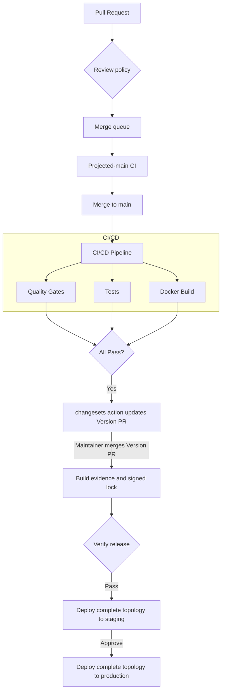
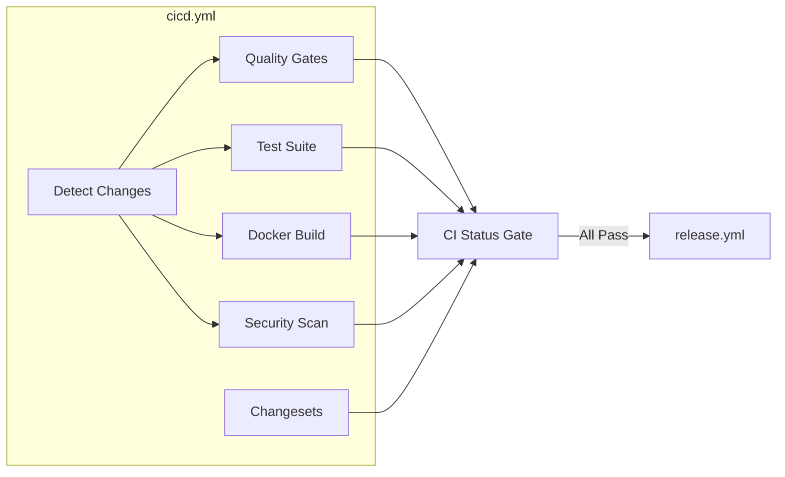

# CI/CD Architecture

Hephaestus uses trunk-based delivery powered by GitHub Actions. Every merge to `main` is verified; signed releases deploy automatically to staging, with production requiring manual approval.

## 🏗️ Architecture Overview


```mermaid
flowchart TD
    accTitle: Pull request delivery pipeline
    accDescr: A pull request satisfies review policy, passes projected-main CI in the merge queue, and becomes a signed release that deploys to staging before production approval.
    PR[Pull Request] --> Policy{Review policy}
    Policy --> Queue[Merge queue]
    Queue --> MG[Projected-main CI]
    MG --> Merge[Merge to main]
    Merge --> CI[CI/CD Pipeline]

    subgraph CI/CD
    CI --> Q[Quality Gates]
    CI --> T[Tests]
    CI --> D[Docker Build]
    end

    Q --> Pass{All Pass?}
    T --> Pass
    D --> Pass

    Pass -->|Yes| VP[changesets action updates Version PR]
    VP -->|Maintainer merges Version PR| Release[Build evidence and signed lock]
    Release --> Verify{Verify release}
    Verify -->|Pass| Staging[Deploy complete topology to staging]
    Staging -->|Approve| Prod[Deploy complete topology to production]
```

## 🚀 Release Flow

Every merge to `main` runs CI and updates the accumulating **Version PR** (changesets). Merging that PR
cuts the release — tag `vX.Y.Z`, GitHub Release, docker tags `X.Y.Z`/`X.Y`/`latest`, then staging
(automatic) and production (after approval). Full flow: [Release Management](./release-management.mdx).

## 🛡️ Quality Gates

Before any release, code must pass:

| Gate (leg)      | Tool        | Purpose              |
| --------------- | ----------- | -------------------- |
| Migration chain + drift (`Database`) | Liquibase | Full chain applies empty → head, then schema is diffed against JPA entities |
| Changelog immutability (`Migrations`) | git diff | Released changesets + `master.xml` are append-only |
| OpenAPI sync    | Diff check  | Client ↔ Server sync |
| Java formatting | Spotless + Palantir Java Format | Code style |
| Java lint       | PMD         | Static analysis      |
| Java nullness policy | NullAway policy scanner | Rejects suppressed analysis and empty source discovery |
| Changeset policy | Node test runner + Changesets | Tests release-note and version synchronization rules |
| Webapp TypeScript | oxlint + oxfmt (`.oxfmtrc.json`) + tsc | Lint + format + typecheck |
| Agent and repository-tooling files | oxlint + oxfmt + tsc | Lint, format, and typecheck where applicable |
| Docs code and configuration | oxfmt | Format JavaScript, TypeScript, JSON/JSONC, and CSS |
| Agent runtime   | Node         | Runner and precompute specs on the version pinned by `package.json`; the package-manager contract rejects Docker image drift |
| Workflow syntax and shell correctness | Actionlint + ShellCheck | Rejects invalid Actions configuration and warning-level shell defects |
| Workflow security | Zizmor | Uploads SARIF and rejects medium-or-higher-confidence findings |

### Merge policy

Pull requests targeting `main` merge through GitHub's merge queue after these GitHub
Actions contexts pass: `CI Status Gate`, `Actionlint`, `Zizmor`, and `review-policy`. The queue runs
the same checks against the projected `main` commit through the `merge_group` event. Each required
context is bound to the GitHub Actions integration rather than accepting a same-named external status.

`review-policy` accepts an author listed in the comma-separated repository variable
`REVIEW_POLICY_MAINTAINERS`. Every other author needs an approval from a non-author who currently
has write access; the approval must cover the current head commit. Repository administrators own the
allow-list. Native required approvals remain zero because GitHub cannot combine an author's
self-authored change, a mandatory approval, and the merge queue without bypassing the queue.

`review-policy` is a check run the workflow publishes, not the workflow's own job status — the job
is `Publish review-policy status` and always succeeds. A job can only pass or fail, so while an
approval was outstanding the required context was red, and a pull request that was healthy and
simply waiting for its first review read as broken on the pull request list. The verdict now takes
three shapes, decided by [`scripts/review-policy.ts`](https://github.com/ls1intum/Hephaestus/blob/main/scripts/review-policy.ts):

| Verdict | Check run | Reads as |
| --- | --- | --- |
| Waiting for an approval | `in_progress`, no conclusion | Pending — blocks merge and merge-queue entry |
| Author allow-listed, or approved by a non-author with write access | `success` | Green, naming who satisfied it |
| `REVIEW_POLICY_MAINTAINERS` unset, or the policy could not be evaluated | `failure` | Red, because that is broken |

A pending required context blocks merging and blocks entry to the merge queue exactly as a failing
one does, so the enforcement is unchanged. `neutral` and `skipped` are not options: GitHub counts
both as passing a required check.

The merge queue's own pass is written into the workflow rather than routed through the evaluator, so
that path needs no checkout: on `merge_group` the workflow comes from the queued commit while a
checkout would come from the default branch, and a merge group that never receives the context sits
until the queue's timeout drops it.

Renaming the check run means editing the ruleset's required context in the same change. A mismatch
leaves every pull request waiting on a context nothing reports, which blocks the fix too.

The changesets Version PR is the temporary exception: updates made with `GITHUB_TOKEN` do not trigger
the required workflows, so release automation uses the ruleset bypass. The release workflow still
requires successful CI on the resulting `main` commit before it publishes anything. Move the Version
PR to a machine identity that triggers workflows before removing this exception.

## 🔒 Security

- **CodeQL** – SAST scanning via GitHub's Default Setup (automatic, zero maintenance)
- **Trivy** – Scans dependencies for CVEs
- **TruffleHog** – Secret detection in code and history
- **Renovate** – Monitors dependencies for vulnerabilities
- **Environment protection** – Production requires approval

### CodeQL Default Setup

CodeQL runs automatically via GitHub's Default Setup (enabled in repository settings), providing:

- Scans on every push to main and protected branches
- Scans on pull request creation and updates
- Weekly scheduled scans for the full codebase
- Incremental analysis (20% faster on PRs)
- Zero maintenance – GitHub manages query updates

This is more efficient than a custom workflow and doesn't consume CI minutes.

## 📦 Environments

| Environment       | Eligibility | Deploys on |
| ----------------- | ----------- | ---------- |
| Preview (Coolify) | Same-repository PR with the `preview` label | Every push; waits for its images, never for tests |
| Staging           | `main` | Verified signed release |
| Production        | Required reviewer | The same verified signed release |

### GitHub Environment Setup

1. **Settings → Environments → New environment**
2. Create `Staging` (no rules)
3. Create `Production` with **Required reviewers**

Preview environments do not need to be created in advance. The preview workflow registers
`preview/pr-N` as a transient GitHub environment when Coolify accepts the first deployment.

## 🔄 Preview Deployments

Previews are opt-in and self-service. Add the **`preview`** label to your pull request — no review,
no ceremony, and you can label your own PR. Every push redeploys, and **a preview never waits for
your tests to pass**: it is most useful exactly when they do not.

A preview runs the images CI published for your commit — the same artifacts staging and production
run. It waits for those images, which CI builds in parallel with the tests, and never for the tests
themselves. How long that takes is how long CI needs to publish the images your change actually
rebuilds: a docs-only change re-tags unchanged images and is quick; touching the webapp or the server
means waiting for that image to build.

That is deliberate: a preview built a second way could start cleanly when the released image would
not, which is the one thing a preview of a Spring Boot service is well placed to catch.

A sticky comment carries the URL, and GitHub records each accepted update as the transient
environment `preview/pr-N`, so the pull request's **View deployment** link opens it too.

Remove the `preview` label to tear the stack down and free the slot. Closing, merging, or converting
the pull request back to draft does the same thing.

Deployments are serialized, never parallel, and each one deploys the pull request's *current* head.
A burst of pushes therefore produces one deployment of the newest commit rather than one per commit.
If you push while a deployment is in flight, that run stands down rather than deploying a commit that
is no longer the head; the new push starts the next deployment and nothing needs re-labelling.

### What is in a preview

Each preview starts from a copy of staging's database, so workspaces, synced work and the
leaderboard are already there — which is what makes a preview worth looking at. The copy is silenced
before the application server boots: review triggers, agent bindings and sweep schedules are off,
queued jobs are cancelled, and the instance identity is dropped so the preview signs its own tokens.
The application server also reads staging's event stream, on a durable of its own. Agent runs and
inbound webhooks stay off. Sign-in works only if the preview-only GitHub OAuth app is configured, and
the accounts in the preview application's `HEPHAESTUS_AUTH_BOOTSTRAP_ADMINS` come up as admins.

Each stack keeps its own PostgreSQL, preview-only credentials, and signed commit-addressed CI images.
No container holds the Docker socket: the seed loader reads staging over the network as a role that
can only read.

Preview controllers run only for pull requests targeting `main`; this keeps privileged
`pull_request_target` workflows anchored to the protected branch. A stacked layer becomes eligible
after it is retargeted to `main`.

### When the comment says nothing deployed

| Comment says | What to do |
| --- | --- |
| does not carry the `preview` label | Add the label |
| is a draft | Mark it ready for review |
| comes from a fork | Push the branch to this repository |
| was opened by a … , not a repository collaborator | Nothing; previews need push access |
| changes trusted deployment policy | Land that change first — a preview never runs a pull request's own edits to `.github/workflows/**`, `.github/actions/**` or `docker/preview/**` |
| changes too many files for one comparison | Split the pull request, or land it without a preview |

### When the preview failed

| Comment says | What it means |
| --- | --- |
| CI never published images for this commit | An image build failed, or was still running when the deploy gave up. Check the CI run; the next push retries. |
| Coolify reported a failed preview deployment | The stack did not start. Open the deployment log link in the comment. |
| Coolify finished, but the preview did not return HTTP 2xx | Containers started but the app never became healthy — usually a migration or a missing setting. |
| Timed out waiting for Coolify … | The deploy outlasted its budget. The next push retries; if it keeps happening the host is likely saturated. |
| The preview host is full (n/m) | Drop the label from one of the named pull requests |

Cleanup sends a signed close event and then marks the deployment inactive; the nightly repair
repeats Coolify cleanup before retiring that record. Failed cleanup stays blocking, and the repair
starts from the host inventory rather than an arbitrary date window.

Operator configuration, host capacity and secret scopes live in
[`docker/preview/README.md`](https://github.com/ls1intum/Hephaestus/blob/main/docker/preview/README.md);
why the label is the authority, and which alternatives were priced and declined, is
[ADR 0035](https://github.com/ls1intum/Hephaestus/blob/main/docs/decisions/0035-pull-request-previews-are-label-gated.md).

## ⚙️ Key Workflows

| Workflow               | Trigger               | Purpose                                            |
| ---------------------- | --------------------- | -------------------------------------------------- |
| `cicd.yml`             | Push to main, PRs, merge queue | Orchestrator: change detection + workflow dispatch |
| `review-policy.yml`    | PR and review events, merge queue | Publishes the `review-policy` check run: author allow-list, or current-head write-access approval |
| `ci-quality-gates.yml` | Called by cicd.yml    | Code quality, formatting, schema validation        |
| `ci-tests.yml`         | Called by cicd.yml    | Unit, integration, visual tests                    |
| `ci-docker-build.yml`  | Called by cicd.yml    | Docker image builds per component                  |
| `ci-security-scan.yml` | Called by cicd.yml    | Dependency scanning (Trivy), secret detection      |
| `ci-profile.yml` | Weekly, manual | Profiles server integration tests and Spring contexts |
| `ci-server-clean-reference.yml` | Weekly, manual | Records cold server phases and compares generated JARs |
| `verify-changesets.yml`| Called by cicd.yml    | Tests changeset/version-sync policy and enforces release-note presence |
| `ci-compose-validate.yml` | PRs, push to main  | Renders the reference and self-host compose stacks so an interpolation or merge break is a red check, not a stranger's bad first boot |
| `deploy-preview.yml` | `preview` label added, or a push, reopen or ready-for-review on a labelled PR | Waits for this commit's attested CI images, deploys them, and registers the native GitHub deployment |
| `cleanup-preview.yml` | Label removed, PR closed or drafted | Removes and verifies resources, then retains a cleanup tombstone |
| `reconcile-previews.yml` | Nightly, manual | Re-sends teardown for any preview environment whose pull request is closed, drafted or unlabelled |
| `version-pr.yml`       | Push to main          | Maintains the accumulating Version PR (changesets) |
| `release.yml`          | Successful CI/CD push on `main` | Publishes the release and promotes it through the Staging and Production environment gates |
| `deploy-staging.yml`   | Called by `release.yml` or manual dispatch | Deploys a verified release lock to staging |
| `deploy-prod.yml`      | Called by `release.yml` or manual dispatch | Deploys the staging-verified release to production |

### Shared setup actions

| Action | Contract |
| --- | --- |
| `setup-node-pnpm` | Installs the versions pinned in `package.json`; `install` must be `none`, `frozen`, or `hardened` |
| `setup-caches` | Restores Maven and generated-client caches for one validated `cache-type` |
| `setup-browsers` | Restores the exact Playwright browser version and installs Chromium system dependencies |
| `setup-release-security-tools` | Installs Cosign, Trivy, and optionally Syft for release-evidence jobs |
| `ghcr-login` | Authenticates Docker to GHCR |

Repository-local actions require checkout first. Jobs without checkout use the external SHA-pinned
action directly rather than checking out the repository only to reach a wrapper.

### Workflow Architecture


```mermaid
flowchart LR
    accTitle: Continuous integration job dependencies
    accDescr: Required quality, test, changeset, image, and security jobs feed the final continuous integration status gate.
    subgraph cicd.yml
        DC[Detect Changes] --> QG[Quality Gates]
        DC --> TS[Test Suite]
        DC --> DB[Docker Build]
        DC --> SS[Security Scan]
        CS[Changesets]
    end

    QG --> Gate[CI Status Gate]
    TS --> Gate
    DB --> Gate
    SS --> Gate
    CS --> Gate

    Gate -->|All Pass| Release[release.yml]
```

The `cicd.yml` workflow:

1. **Detects changes** using `dorny/paths-filter`
2. **Dispatches required sub-workflows**, using component-specific flags where applicable
3. **Aggregates results** in the CI Status Gate job

## 🎯 Performance Optimizations

### Path-Based Filtering

CI only runs jobs for components that actually changed:

| Component            | Triggers On                                                   |
| -------------------- | ------------------------------------------------------------- |
| Webapp               | `webapp/**`, `docs/images/readme/**`, `.oxlintrc.json`, `.oxfmtrc.json`, and root package configuration |
| Application Server   | `server/**`, `scripts/**`, `docker/agents/**`, `docs/**`, root lint, format, TypeScript, and package configuration |
| Agent images         | `docker/agents/**`                                            |
| CI Config            | `.github/workflows/**`, `.github/actions/**` → runs all jobs  |

The whole of `scripts/` counts as application-server change, not just the database helper: the
contract validator and the changelog-immutability guard live there, and a PR editing only a guard
would otherwise skip the workflow that runs it. `docker/agents/**` appears twice for the same reason
— it builds the agent images, and `test:agents` and `typecheck:agents` cover the precompute tree
inside it, so a PR editing only a precompute script must still run those gates.

### Docker Layer Caching

Docker builds use **registry-based caching** to store intermediate layers in `ghcr.io`:

**How it works:**

- `cache-from`: Pulls cached layers from registry (main branch + current branch)
- `cache-to`: Pushes new layers with `mode=max` (all intermediate layers)
- Separate cache tags per platform: `image:cache-linux-amd64`, `image:cache-linux-arm64`
- Native builds: amd64 on x86 runners, arm64 on ARM runners (no QEMU emulation)

The registry cache is not size-capped or time-evicted the way the Actions cache is, and it is shared
across branches, so a pull request reuses `main`'s layers.

### Registry Authentication

Image builds log in to `ghcr.io` with the workflow's own `GITHUB_TOKEN`; there is no Docker Hub
login step and no repository secret to configure. Base image metadata is resolved anonymously and is
therefore subject to the registry's anonymous rate limit.

### Parallel Execution

- Test legs run in parallel across the app server and the webapp. Webhook reception is part of the app-server test surface since ADR 0008.
- Quality-gate legs (App Server, Tooling and Docs, Webapp, OpenAPI, Database, Migrations) run in parallel, plus a legacy-cleanup guard
- Docker images build for both architectures (amd64 + arm64)
- `fail-fast: false` ensures all jobs complete for full feedback

### Concurrency Control

- Outdated PR runs cancelled automatically
- Release runs never cancelled

### Monitoring CI

Use GitHub's organization-level [Actions metrics](https://docs.github.com/en/actions/concepts/metrics)
for workflow and job run time, queue time, failure rate, and runner usage. Each `CI Status Gate` job
also includes the current run's dependency-aware timeline and job summary.

The weekly `CI profile` workflow covers the server-specific data GitHub does not provide: JFR,
resource usage, JUnit results, and Spring context-cache metrics. It signals only after three
consecutive regressions against five earlier default-branch profiles. Branch dispatches produce
standalone diagnostic artifacts without changing or enforcing that baseline.

The weekly **Server Phase Reference** workflow records cache-disabled Maven generation, compilation,
test-compilation, and execution profiles and compares two clean generated-client JARs. GitHub Actions
step durations remain the source for toolchain setup and artifact-upload time; Maven Profiler covers
only work inside Maven.

`SpringTestContextArchitectureTest` separately enforces the reviewed Spring context keys. Run the
profile options locally with:

```bash
mkdir -p ci-metrics
/usr/bin/time -v -o ci-metrics/server-integration-resource.txt \
  pnpm run test:server:integration \
  -DargLine=-XX:StartFlightRecording=filename=target/integration-profile.jfr,settings=profile,dumponexit=true \
  -Dlogging.level.org.springframework.test.context.cache=DEBUG
```

## 🛠️ Running CI Locally

Before pushing, run the complete local quality gate. CI also runs builds and selected server test
tiers that need more time or infrastructure.

### Full Local Check (Recommended)

```bash
# Format and check all services
pnpm run format && pnpm run check
```

When relevant to the change, also run `pnpm run build:webapp`,
`pnpm run test:server:verification`, and the Docker-backed server integration suite. The pull request
workflow remains authoritative for its hosted jobs.

### Per-Service Commands

```bash
# Webapp
pnpm run check:webapp          # oxfmt format check, then oxlint
pnpm run check:webapp:fix      # Same, applying every safe fix
pnpm run typecheck:webapp      # A separate leg — check:webapp does not run it
pnpm run test:webapp           # Unit tests

# Application Server (Java) — includes the integration.core.webhook receiver
pnpm run format:java:check     # Check formatting
pnpm run test:server:unit      # Unit tests

# Agent runtime (Node) — the Pi runner and the practice precompute scripts
pnpm run test:agents           # Runner + precompute specs
pnpm run check:agents          # oxfmt check, then oxlint, then both typechecks
pnpm run check:agents:fix      # Same, applying every safe fix
pnpm run typecheck:agents      # Agent + precompute TypeScript
```

`check:agents` formats the agent and tooling TypeScript trees, docs code, and selected repository
configuration; it also lints and type-checks the non-webapp TypeScript trees. CI invokes the same
commands.

### Common Issues

| Issue                 | Solution                                      |
| --------------------- | --------------------------------------------- |
| Formatting errors     | Run `pnpm run format`                          |
| Lint errors (agent runtime, precompute, `scripts/`) | Run `pnpm run check:agents:fix`, then fix what remains |
| TypeScript errors     | Run `pnpm run typecheck` to see details        |
| Test failures         | Check the specific test output for details    |
| OpenAPI out of sync   | Run `pnpm run generate:api`                    |
| Database schema drift | Run `pnpm run db:draft-changelog`              |

## 📊 CI Features

### Test Results

All test suites generate JUnit XML reports that are displayed in the **Test Results** tab of each workflow run:

- **Application Server**: Unit, integration, and architecture tests (incl. the in-process Pi mentor agent and the webhook receiver per ADR 0008)
- **Webapp**: Unit tests and Storybook interaction tests

### Job Summary

Each CI run generates a rich **Job Summary** in the Actions UI with:

- Overall status with emoji indicators
- Results table for each workflow (quality gates, tests, security, Docker)
- Components changed table (from path filtering)
- Failure-specific troubleshooting guides with fix commands
- Performance metrics showing skipped workflows

### Workflow Timeline

The CI Status Gate job generates a visual **Mermaid timeline** showing:

- Job execution order and duration
- Parallel job execution
- Job creation-to-start delay, including dependency waiting
- Critical path identification

This helps identify bottlenecks and optimization opportunities.

## 🆕 Adding a New Service

Extend the pipeline at the ownership boundary that changed; do not copy an existing job wholesale.

1. Add the service's paths to `detect-changes` in `cicd.yml`, including the shared files that can
   affect it. Expose the result as a reusable-workflow input.
2. Add purpose-named jobs to `ci-quality-gates.yml` and `ci-tests.yml`. Declare `needs` only when a
   job consumes another job's artifact, and give every runnable job a timeout and least-privilege
   permissions.
3. Use `setup-node-pnpm` with an explicit install mode. Java jobs use a validated `setup-caches`
   type; browser jobs use `setup-browsers`.
4. Add image builds through `reusable-docker-build.yml`. Keep image metadata, immutable tags,
   attestations, and signing in that workflow rather than reproducing them in the caller.
5. Pass the change-detection output from `cicd.yml` to every reusable workflow that needs it.

Before opening the pull request, verify that tooling-only changes skip the service, shared inputs
select it, its JUnit or diagnostic artifacts are uploaded, and CI configuration changes exercise its
safety-net path. `scripts/ci-contract.test.ts` owns the repository-wide workflow invariants; extend it
when the new service introduces another invariant rather than relying on prose.
