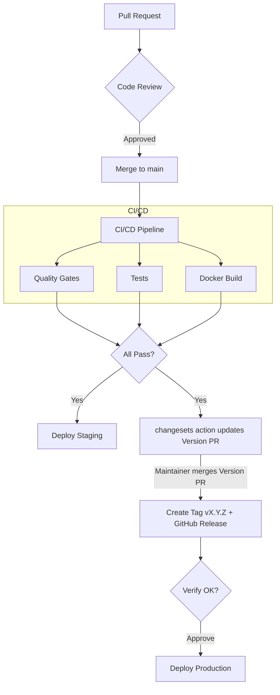
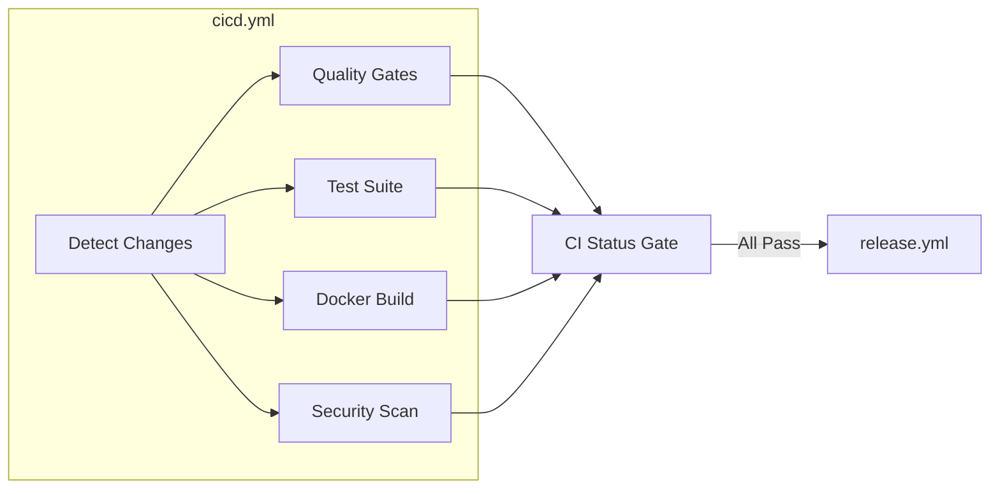

# CI/CD Architecture

Hephaestus uses trunk-based continuous deployment powered by GitHub Actions. Every merge to `main` triggers automatic staging deployment, with production requiring manual approval.

## 🏗️ Architecture Overview


```mermaid
flowchart TD
    accTitle: Pull request delivery pipeline
    accDescr: An approved pull request merges to main, runs continuous integration and deployment, builds images, and deploys the application.
    PR[Pull Request] --> Review{Code Review}
    Review -->|Approved| Merge[Merge to main]
    Merge --> CI[CI/CD Pipeline]

    subgraph CI/CD
    CI --> Q[Quality Gates]
    CI --> T[Tests]
    CI --> D[Docker Build]
    end

    Q --> Pass{All Pass?}
    T --> Pass
    D --> Pass

    Pass -->|Yes| Staging[Deploy Staging]
    Pass -->|Yes| VP[changesets action updates Version PR]
    VP -->|Maintainer merges Version PR| Tag[Create Tag vX.Y.Z + GitHub Release]

    Tag --> Verify{Verify OK?}
    Verify -->|Approve| Prod[Deploy Production]
```

Staging tracks `main` HEAD and production tracks the last released tag, so the two are deliberately
not the same commit.

## 🚀 Release Flow

Every merge to `main` runs CI and updates the accumulating **Version PR** (changesets). Merging that PR
cuts the release — tag `vX.Y.Z`, GitHub Release, docker tags `X.Y.Z`/`X.Y`/`latest`, then staging
(automatic) and production (after approval). Full flow: [Release Management](./release-management.mdx).

## 🛡️ Quality Gates

Before any release, code must pass:

| Gate (leg)      | Tool        | Purpose              |
| --------------- | ----------- | -------------------- |
| Migration chain + drift (`Database`) | Liquibase | Full chain applies empty → head, then schema is diffed against JPA entities |
| Changelog immutability (`Migrations`) | git diff | Released changesets + `master.xml` are append-only |
| OpenAPI sync    | Diff check  | Client ↔ Server sync |
| Java formatting | Spotless + Palantir Java Format | Code style |
| Java lint       | PMD         | Static analysis      |
| Webapp TypeScript | oxlint + Biome (`webapp/biome.jsonc`) + tsc | Lint + format + typecheck |
| Everything else TypeScript | oxlint (`.oxlintrc.json`) + Biome (`biome.jsonc`) + tsc | oxlint reaches the Bun runtime, its specs, both precompute trees, `scripts/**`, `docs/` and the repo-root config files; Biome formats all of those except `docs/`, which has its own config (`docs/.oxlintrc.json`) and no formatter |
| Agent runtime   | Bun         | Runner and precompute specs, on the Bun the sandbox ships — CI reads `ARG BUN_VERSION` out of `docker/agents/pi/Dockerfile` rather than hard-coding it, and fails closed if that line is missing |

## 🔒 Security

- **CodeQL** – SAST scanning via GitHub's Default Setup (automatic, zero maintenance)
- **Trivy** – Scans dependencies for CVEs
- **TruffleHog** – Secret detection in code and history
- **Renovate** – Monitors dependencies for vulnerabilities
- **Environment protection** – Production requires approval

### CodeQL Default Setup

CodeQL runs automatically via GitHub's Default Setup (enabled in repository settings), providing:

- Scans on every push to main and protected branches
- Scans on pull request creation and updates
- Weekly scheduled scans for the full codebase
- Incremental analysis (20% faster on PRs)
- Zero maintenance – GitHub manages query updates

This is more efficient than a custom workflow and doesn't consume CI minutes.

## 📦 Environments

| Environment       | Protection        | Deploys On     |
| ----------------- | ----------------- | -------------- |
| Preview (Coolify) | None              | Every PR       |
| Staging           | None              | Every green commit on `main` (app services only) |
| Production        | Approval required | Tag + approval |

Staging deploys the app services only. NATS/webhook (`core`) and the proxy are stateful and
disruptive to recreate, so they are never auto-deployed; when their compose changes, CD flags it and
an operator runs the staging deploy manually with the core/proxy switches on.

### GitHub Environment Setup

1. **Settings → Environments → New environment**
2. Create `staging` (no rules)
3. Create `production` with **Required reviewers**

## 🔄 Preview Deployments

Coolify handles PR previews:

- Built directly on server (fast!)
- URL: `pr-{number}.preview.hephaestus.cit.tum.de`
- Auto-cleanup on PR close

## ⚙️ Key Workflows

| Workflow               | Trigger               | Purpose                                            |
| ---------------------- | --------------------- | -------------------------------------------------- |
| `cicd.yml`             | Push to main, PRs     | Orchestrator: change detection + workflow dispatch |
| `ci-quality-gates.yml` | Called by cicd.yml    | Code quality, formatting, schema validation        |
| `ci-tests.yml`         | Called by cicd.yml    | Unit, integration, visual tests                    |
| `ci-docker-build.yml`  | Called by cicd.yml    | Docker image builds per component                  |
| `ci-security-scan.yml` | Called by cicd.yml    | Dependency scanning (Trivy), secret detection      |
| `ci-profile.yml` | Weekly, manual | Profiles server integration tests and Spring contexts |
| `ci-server-clean-reference.yml` | Weekly, manual | Records cold server phases and compares generated JARs |
| `verify-changesets.yml`| PRs                   | Fails shipped-code PRs that carry no changeset     |
| `ci-compose-validate.yml` | PRs, push to main  | Renders the reference and self-host compose stacks so an interpolation or merge break is a red check, not a stranger's bad first boot |
| `version-pr.yml`       | Push to main          | Maintains the accumulating Version PR (changesets) |
| `release.yml`          | On CI/CD Success      | Cuts a release when the Version PR merged: tag + GitHub Release, gates production |
| `cd-staging.yml`       | On CI/CD Success on `main` | Deploys that commit's immutable image to staging |
| `deploy-staging.yml`   | Called by cd-staging.yml and manual dispatch | Deploys to staging |
| `deploy-prod.yml`      | workflow_dispatch     | Deploys to production (manual trigger)             |

### Workflow Architecture


```mermaid
flowchart LR
    accTitle: Continuous integration job dependencies
    accDescr: Change detection selects quality and test jobs, whose results feed the final continuous integration status gate.
    subgraph cicd.yml
        DC[Detect Changes] --> QG[Quality Gates]
        DC --> TS[Test Suite]
        DC --> DB[Docker Build]
        DC --> SS[Security Scan]
    end

    QG --> Gate[CI Status Gate]
    TS --> Gate
    DB --> Gate
    SS --> Gate

    Gate -->|All Pass| Release[release.yml]
```

The `cicd.yml` workflow:

1. **Detects changes** using `dorny/paths-filter`
2. **Dispatches sub-workflows** with component-specific flags
3. **Aggregates results** in the CI Status Gate job

## 🎯 Performance Optimizations

### Path-Based Filtering

CI only runs jobs for components that actually changed:

| Component            | Triggers On                                                   |
| -------------------- | ------------------------------------------------------------- |
| Webapp               | `webapp/**`, `docs/images/readme/**`, `package.json`, `pnpm-lock.yaml`, `pnpm-workspace.yaml`, `.npmrc`, `.node-version` |
| Application Server   | `server/**`, `scripts/**` (includes webhook receiver — ADR 0008), `docker/agents/**`, `tsconfig.agents.json`, `biome.jsonc`, `package.json`, `pnpm-lock.yaml` |
| Agent images         | `docker/agents/**`                                            |
| Docs                 | `docs/**`                                                     |
| CI Config            | `.github/workflows/**`, `.github/actions/**` → runs all jobs  |

The whole of `scripts/` counts as application-server change, not just the database helper: the
contract validator and the changelog-immutability guard live there, and a PR editing only a guard
would otherwise skip the workflow that runs it. `docker/agents/**` appears twice for the same reason
— it builds the agent images, and `test:agents` and `typecheck:agents` cover the precompute tree
inside it, so a PR editing only a precompute script must still run those gates.

`.oxlintrc.json`, `biome.jsonc`, `tsconfig.json`, `package.json` and `pnpm-lock.yaml` are listed
because they decide the verdict of the App Server leg's lint and format step: the two rule sets, the
project the type-aware rules resolve against, the `:agents` scripts that invoke them, and the binary
versions. A gate whose own configuration can change without re-running it is not a gate.

### Docker Layer Caching

Docker builds use **registry-based caching** to store intermediate layers in `ghcr.io`:

**How it works:**

- `cache-from`: Pulls cached layers from registry (main branch + current branch)
- `cache-to`: Pushes new layers with `mode=max` (all intermediate layers)
- Separate cache tags per platform: `image:cache-linux-amd64`, `image:cache-linux-arm64`
- Native builds: amd64 on x86 runners, arm64 on ARM runners (no QEMU emulation)

The registry cache is not size-capped or time-evicted the way the Actions cache is, and it is shared
across branches, so a pull request reuses `main`'s layers.

### Registry Authentication

Image builds log in to `ghcr.io` with the workflow's own `GITHUB_TOKEN`; there is no Docker Hub
login step and no repository secret to configure. Base image metadata is resolved anonymously and is
therefore subject to the registry's anonymous rate limit.

### Parallel Execution

- Test legs run in parallel across the app server and the webapp. Webhook reception is part of the app-server test surface since ADR 0008.
- Quality-gate legs (App Server, Webapp, OpenAPI, Database, Migrations) run in parallel, plus a legacy-cleanup guard
- Docker images build for both architectures (amd64 + arm64)
- `fail-fast: false` ensures all jobs complete for full feedback

### Concurrency Control

- Outdated PR runs cancelled automatically
- Release runs never cancelled

### Monitoring CI

Use GitHub's organization-level [Actions metrics](https://docs.github.com/en/actions/concepts/metrics)
for workflow and job run time, queue time, failure rate, and runner usage. Each `CI Status Gate` job
also includes the current run's dependency-aware timeline and job summary.

The weekly `CI profile` workflow covers the server-specific data GitHub does not provide: JFR,
resource usage, JUnit results, and Spring context-cache metrics. It signals only after three
consecutive regressions against five earlier default-branch profiles. Branch dispatches produce
standalone diagnostic artifacts without changing or enforcing that baseline.

The weekly **Server Phase Reference** workflow records cache-disabled Maven generation, compilation,
test-compilation, and execution profiles and compares two clean generated-client JARs. GitHub Actions
step durations remain the source for toolchain setup and artifact-upload time; Maven Profiler covers
only work inside Maven.

`SpringTestContextArchitectureTest` separately enforces the reviewed Spring context keys. Run the
profile options locally with:

```bash
mkdir -p ci-metrics
/usr/bin/time -v -o ci-metrics/server-integration-resource.txt \
  pnpm run test:server:integration \
  -DargLine=-XX:StartFlightRecording=filename=target/integration-profile.jfr,settings=profile,dumponexit=true \
  -Dlogging.level.org.springframework.test.context.cache=DEBUG
```

## 🛠️ Running CI Locally

Before pushing, run the complete local quality gate. CI also runs builds and selected server test
tiers that need more time or infrastructure.

### Full Local Check (Recommended)

```bash
# Format and check all services
pnpm run format && pnpm run check
```

When relevant to the change, also run `pnpm run build:webapp`,
`pnpm run test:server:verification`, and the Docker-backed server integration suite. The pull request
workflow remains authoritative for its hosted jobs.

### Per-Service Commands

```bash
# Webapp
pnpm run check:webapp          # Biome format check, then oxlint
pnpm run check:webapp:fix      # Same, applying every safe fix
pnpm run typecheck:webapp      # A separate leg — check:webapp does not run it
pnpm run test:webapp           # Unit tests

# Application Server (Java) — includes the integration.core.webhook receiver
pnpm run format:java:check     # Check formatting
cd server && ./mvnw test       # Unit tests, including required reactor dependencies

# Agent runtime (Bun) — the Pi runner and the practice precompute scripts
pnpm run test:agents           # Runner + precompute specs
pnpm run check:agents          # Biome format, then oxlint, then both typechecks
pnpm run check:agents:fix      # Same, applying every safe fix
pnpm run typecheck:agents      # Agent + precompute TypeScript
```

`check:agents` covers every TypeScript tree outside the webapp — the runtime, its specs, both
precompute trees and `scripts/**`. Its rules and path roots live in `biome.jsonc`; CI runs the same
thing as `pnpm run ci:agents`, which reports findings as inline annotations on the diff.

### Common Issues

| Issue                 | Solution                                      |
| --------------------- | --------------------------------------------- |
| Formatting errors     | Run `pnpm run format`                          |
| Lint errors (agent runtime, precompute, `scripts/`) | Run `pnpm run check:agents:fix`, then fix what remains |
| TypeScript errors     | Run `pnpm run typecheck` to see details        |
| Test failures         | Check the specific test output for details    |
| OpenAPI out of sync   | Run `pnpm run generate:api`                    |
| Database schema drift | Run `pnpm run db:draft-changelog`              |

## 📊 CI Features

### Test Results

All test suites generate JUnit XML reports that are displayed in the **Test Results** tab of each workflow run:

- **Application Server**: Unit, integration, and architecture tests (incl. the in-process Pi mentor agent and the webhook receiver per ADR 0008)
- **Webapp**: Unit tests and Storybook interaction tests

### Job Summary

Each CI run generates a rich **Job Summary** in the Actions UI with:

- Overall status with emoji indicators
- Results table for each workflow (quality gates, tests, security, Docker)
- Components changed table (from path filtering)
- Failure-specific troubleshooting guides with fix commands
- Performance metrics showing skipped workflows

### Workflow Timeline

The CI Status Gate job generates a visual **Mermaid timeline** showing:

- Job execution order and duration
- Parallel job execution
- Job creation-to-start delay, including dependency waiting
- Critical path identification

This helps identify bottlenecks and optimization opportunities.

## 🆕 Adding a New Service

When adding a new service to the monorepo, update CI configuration in this order:

### Step 1: Path Detection (`cicd.yml`)

Add a path filter and output for the new service:

```yaml
# In detect-changes job outputs:
outputs:
  new-service: ${{ steps.filter.outputs.new-service }}

# In paths-filter step:
filters: |
  new-service:
    - 'server/new-service/**'
    - 'package.json'
    - 'pnpm-lock.yaml'
    - 'pnpm-workspace.yaml'
```

Update the `any-code` aggregate output to include the new service.

### Step 2: Quality Gates (`ci-quality-gates.yml`)

1. **Add to matrix:**

```yaml
matrix:
  check: [
      # ... existing checks
      new-service-quality,
    ]
```

1. **Add case statement** in "Determine if check should run":

```yaml
"new-service-quality")
  echo "run=${{ inputs.new_service_changed }}" >> $GITHUB_OUTPUT
  ;;
```

1. **Add quality check step** with the appropriate linting/type checking commands.

### Step 3: Tests (`ci-tests.yml`)

1. **Add to matrix:**

```yaml
matrix:
  test-type: [
      # ... existing tests
      new-service-unit,
      new-service-integration, # if applicable
    ]
```

1. **Add case statement** in "Determine if test should run":

```yaml
"new-service-unit"|"new-service-integration")
  echo "run=${{ inputs.new_service_changed }}" >> $GITHUB_OUTPUT
  ;;
```

1. **Add test execution step** with the test commands.

2. **Add test result upload** for JUnit reporting.

### Step 4: Docker Build (`ci-docker-build.yml`)

Add a new build job:

```yaml
new-service-build:
  name: "Docker: new-service"
  if: inputs.should_skip != 'true' && inputs.new_service_changed == 'true'
  uses: ls1intum/.github/.github/workflows/build-and-push-docker-image.yml@main
  with:
    image-name: "ls1intum/hephaestus/new-service"
    docker-file: "./server/new-service/Dockerfile"
    docker-context: "./server/new-service"
    # ... rest of config
```

### Step 5: Caching (`setup-caches/action.yml`)

Add the new service's cache-types to the appropriate conditions:

```yaml
# For Node.js services:
- name: Cache Node.js dependencies
  if: contains(fromJSON('["...", "new-service-quality", "new-service-unit"]'), inputs.cache-type)

# For Java services:
- name: Cache Maven dependencies
  if: contains(fromJSON('["...", "new-service-unit"]'), inputs.cache-type)
```

### Step 6: Update Workflow Inputs

In `cicd.yml`, add the new input to workflow calls:

```yaml
with:
  new_service_changed: ${{ (needs.detect-changes.outputs.new-service == 'true' || ...) && 'true' || 'false' }}
```

### Verification Checklist

After adding a new service, verify:

- [ ] Path filter correctly detects changes to new service
- [ ] Quality gates run only when new service changes
- [ ] Tests run only when new service changes
- [ ] Docker build runs only when new service changes
- [ ] CI config changes trigger all jobs (safety net)
- [ ] JUnit reports appear in Test Results tab
