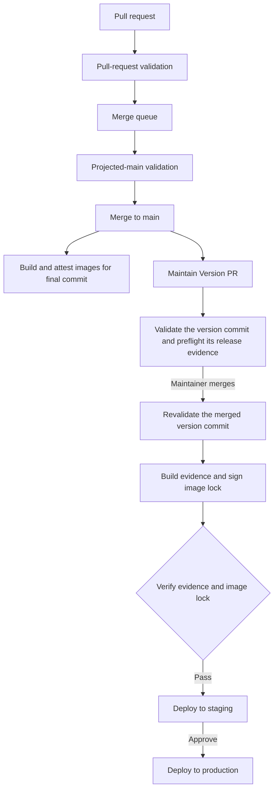

# CI/CD Architecture

Hephaestus uses trunk-based delivery through GitHub's merge queue. Pull requests provide early
feedback, merge groups validate projected `main`, and pushes to `main` produce release images. Releases
with signed image locks deploy automatically to staging; production requires approval.

## Architecture overview


```mermaid
flowchart TD
    accTitle: Pull request delivery pipeline
    accDescr: Pull-request and merge-group validation protect main; final-SHA images become signed releases that deploy to staging before production approval.
    PR[Pull request] --> PRCI[Pull-request validation]
    PRCI --> Queue[Merge queue]
    Queue --> MG[Projected-main validation]
    MG --> Main[Merge to main]
    Main --> Images[Build and attest images for final commit]
    Main --> VP[Maintain Version PR]
    VP --> VPCI[Validate the version commit and preflight its release evidence]
    VPCI -->|Maintainer merges| ReleaseCI[Revalidate the merged version commit]
    ReleaseCI --> Evidence[Build evidence and sign image lock]
    Evidence --> Verify{Verify evidence and image lock}
    Verify -->|Pass| Staging[Deploy to staging]
    Staging -->|Approve| Prod[Deploy to production]
```

## Release flow

Every push to `main` builds and attests multi-architecture images for that commit and maintains the
Version PR; merging the Version PR cuts a release that promotes those images by digest —
[Release management](./release-management.mdx). Pull requests and merge groups build `linux/amd64`
only; a merge group has its own SHA, so its images are never the ones a release promotes. The
exception is the Version PR's branch, where every run builds both architectures, because the release
evidence preflight that guards that branch evidences each image on both published platforms.

## Quality gates

| Job | Checks | Local command |
| --- | --- | --- |
| Quality → App Server | Spotless and PMD, NullAway policy, the PMD canary when PMD inputs changed, artifact-source contracts, setting delivery per runtime role | `pnpm run check:server`, `check:java-nullness`, `check:contracts`, `check:env` |
| Quality → Tooling and Docs | package-manager and agent-runtime pins, `check:agents`, load-test format and syntax, agent specs, instruction mirrors, docs format and `docs:lint`, Mermaid parse | `pnpm run check:agents`, `check:docs`, `test:agents` |
| Quality → Webapp | `vp check`, presentational components, story prose, story sort, docs colour tokens, unit tests, Vite build with a `routeTree.gen.ts` diff | `pnpm run check:webapp`, `test:webapp`, `build:webapp` |
| Quality → Webapp: Stories | Storybook interaction tests, `export:assets` diff, Storybook build, Chromatic | `pnpm run test:webapp:stories` |
| Build → App Server: Package | `./mvnw -pl application -am package -DskipTests`; uploads the classes and JARs once | — |
| Build → App Server: Generated artifacts | `generate:api` diff against the packaged JAR; `db:check-drift`, which replays `master.xml` and diffs the JPA model; ERD diff | `pnpm run generate:api`, `db:check-drift`, `db:generate-erd-docs` |
| Build → App Server: Database | Surefire `database` group against PostgreSQL; the major-upgrade drill | `pnpm run test:postgres-upgrade` |
| Build → Webapp: E2E | Playwright against the packaged JAR | `pnpm --filter webapp run test:e2e` |
| Build → App Server image | `pack build` from the packaged JAR, signed, attested and policy-scanned | — |
| Test → App Server: Unit and architecture, App Server: Integration | compiled from source | `pnpm run test:server:verification`, `test:server:integration` |
| Security → New dependency risk | dependency review; pull requests only | — |
| Security → Dependencies, secrets, and policy | Trivy filesystem scan, TruffleHog, `security.txt` expiry, changelog immutability guard, legacy-reference guards | — |
| Changesets → Verify changesets | policy tests, verified-revert detection, release-note presence, `MIGRATION.md` freeze | `pnpm run check:changesets` |
| Compose → Render compose stacks | the self-hosted, preview and reference stacks render | `pnpm run check:preview-stack` |
| Docker → Webapp, Agent: Pi, Postgres (pg_partman), Tag unchanged images | Dockerfile images; aliases for unchanged ones | — |
| Actionlint, Zizmor | workflow lint with ShellCheck warnings; Zizmor at medium confidence | — |

### Merge policy

Pull requests targeting `main` merge through GitHub's merge queue after these GitHub
Actions contexts pass: `CI Status Gate`, `Actionlint`, and `Zizmor`. Required
workflows run again for the merge group, which includes the current base and queued changes ahead of
the pull request. Each required context is bound to the GitHub Actions integration rather than
accepting a same-named external status.

Review is a native ruleset requirement with stale approvals dismissed on every push. Authors listed
in `REVIEW_POLICY_MAINTAINERS` receive an automated approval; every other author needs a human with
write access. Repository administrators own that allow-list. Remove the automation when independent
maintainer review is available.

The approval workflow runs on `pull_request_target` with `pull-requests: write`, so it checks out only
`scripts/` from the default branch, reads the author login and nothing else, and executes no
pull-request code. An empty allow-list approves nobody. It has no `branches:` filter: a stacked
layer is approved while it still targets the layer below, because retargeting to `main` after the
lower layer merges fires no event.

The Version PR carries checks like any other pull request. Its updates are pushed with
`GITHUB_TOKEN`, which starts no workflow run, so `version-pr.yml` dispatches CI/CD on the Version
PR's branch instead — `workflow_dispatch` being one of the two events that token may start. The
dispatched run reports `CI Status Gate` onto the branch head, which is the pull request's head
commit, so the commit whose merge cuts a release is validated before it lands. `Verify changesets`
is the one leg it skips, and deliberately: the Version PR is the pull request that consumes
changesets rather than adding one. [Release management](./release-management.mdx#the-flow).

## Security and supply-chain controls

| Control | Timing | Enforcement | Destination |
| --- | --- | --- | --- |
| GitHub dependency review | pull requests | blocks new high or critical findings in runtime, development, and unknown scopes | required Security workflow |
| CodeQL default setup | managed by GitHub | repository SAST policy | code scanning |
| TruffleHog and GitHub push protection | pull requests and pushes | block verified secrets | Security workflow and repository protection |
| Trivy filesystem scan | Security workflow | a scanner error fails the job; findings are uploaded and do not block | code scanning |
| Image vulnerability policy | image build and release | blocks fixable high or critical findings | build summary and release evidence |
| Weekly image rescans | `rescan-main-images.yml`, `rescan-release-images.yml` | the `main` rescan upserts one tracking issue; the release rescan fails and comments on the vulnerability response issue | issues and run artifacts |
| OpenSSF Scorecard | `main` pushes, branch-protection changes, and weekly; never on pull requests | reports | code scanning and a run artifact |
| Renovate | configured schedule and vulnerability alerts | pull requests require normal review and CI | dependency dashboard |

Renovate opens pull requests before 07:00 Europe/Berlin on weekdays after a three-day release age;
majors wait seven days and a Dependency Dashboard approval, and vulnerability alerts skip both.
Lockfile maintenance runs on Mondays. Enabled managers: npm, Maven, the Maven wrapper, Dockerfiles,
Compose files, GitHub Actions, and the regex managers in `renovate.json`, which
`scripts/renovate-config.test.ts` covers. The Node, pnpm and Pi SDK pins are grouped, so a version
stated in several managed files moves in one pull request; the toolchain checks reject a version that
reads differently in any of them. Renovate provisions the Node it runs lockfile updates with from
`engines`, so `engines.node` restates `devEngines.runtime` exactly rather than the supported line.

[Vulnerability remediation](./vulnerability-remediation.mdx) owns the blocking and exception policy.
[Release management](./release-management.mdx#supply-chain-evidence) owns artifact signing, provenance,
SBOM, and release-verification guarantees.

## Environments

| Environment | Eligibility | Deploys on | Approval |
| --- | --- | --- | --- |
| Preview (Coolify) | same-repository PR with the `preview` label | every push; never waits for tests | none |
| Staging | every published release | release publication | none |
| Production | the same release after staging | release publication | required reviewer |

### GitHub environment setup

1. **Settings → Environments → New environment**
2. Create `Staging` (no rules)
3. Create `Production` with **Required reviewers**

Preview environments do not need to be created in advance. The preview workflow registers
`preview/pr-N` as a transient GitHub environment when Coolify accepts the first deployment.

## Preview deployments

Add the `preview` label to a same-repository pull request. Every push redeploys, and a preview does
not wait for tests. `Docker` rebuilds the images whose inputs changed and its `Tag unchanged images`
job aliases the base commit's verified digests for the rest, so every image exists at the head SHA.

A sticky comment carries the URL, and GitHub records each accepted update as the transient
environment `preview/pr-N`, so the pull request's **View deployment** link opens it too.

Remove the `preview` label to tear the stack down and free the slot. Closing, merging, or converting
the pull request back to draft does the same thing.

Deployments are serialized, never parallel, and each one deploys the pull request's *current* head.
A burst of pushes therefore produces one deployment of the newest commit rather than one per commit.
If you push while a deployment is in flight, that run stands down rather than deploying a commit that
is no longer the head; the new push starts the next deployment and nothing needs re-labelling.

A preview runs its own PostgreSQL seeded from staging and reads staging's event stream. What is
switched off in the copy, how sign-in works, and how the sandbox is enforced are in
[`docker/preview/README.md`](https://github.com/ls1intum/Hephaestus/blob/main/docker/preview/README.md).

Preview controllers run only for pull requests targeting `main`; this keeps privileged
`pull_request_target` workflows anchored to the protected branch. A stacked layer becomes eligible
after it is retargeted to `main`.

### When the comment says nothing deployed

| Comment says | What to do |
| --- | --- |
| does not carry the `preview` label | Add the label |
| is a draft | Mark it ready for review |
| comes from a fork | Push the branch to this repository |
| was opened by a … , not a repository collaborator | Nothing; previews need push access |
| changes trusted deployment policy | Land that change first — a preview never runs a pull request's own edits to `.github/workflows/**`, `.github/actions/**` or `docker/preview/**` |
| changes too many files for one comparison | Split the pull request, or land it without a preview |

### When the preview failed

| Comment says | What it means |
| --- | --- |
| CI never published images for this commit | An image build failed, or was still running when the deploy gave up. Check the CI run; the next push retries. |
| Coolify reported a failed preview deployment | The stack did not start. Open the deployment log link in the comment. |
| Coolify finished, but the preview did not return HTTP 2xx | Containers started but the app never became healthy. |
| Timed out waiting for Coolify … | The deploy outlasted its budget. The next push retries. |
| The preview host is full (n/m) | Drop the label from one of the named pull requests |

`cleanup-preview.yml` sends the signed close event and marks the GitHub deployment inactive; if
Coolify rejects the event the job fails and `reconcile-previews.yml` retries nightly, starting from
the deployment inventory.

Operator configuration, host capacity and secret scopes live in
[`docker/preview/README.md`](https://github.com/ls1intum/Hephaestus/blob/main/docker/preview/README.md);
why the label is the authority, and which alternatives were priced and declined, is
[ADR 0035](https://github.com/ls1intum/Hephaestus/blob/main/docs/decisions/0035-pull-request-previews-are-label-gated.md).

## Workflows

| Workflow | Trigger | Purpose |
| --- | --- | --- |
| `cicd.yml` | PR, merge group, push to main, manual | Validates changes before merge and builds final-SHA images after merge; the release evidence gate runs over the images the run built on the Version PR's branch, and wherever the `release-preflight` dispatch input asks for it |
| `review-policy.yml` | PR opened, reopened, synchronized, ready for review, edited | Approves a listed maintainer's pull request so the ruleset's required approval is met; does nothing for anyone else |
| `pull-request.yml` | PR opened, edited, synchronized, reopened, ready for review | Validates the title with commitlint, applies labels, assigns the author |
| `ci-quality-gates.yml` | Called by cicd.yml | Formatting, lint, type checks, webapp unit and story tests: everything verifiable from source |
| `ci-build.yml` | Called by cicd.yml | Packages the server reactor once, then runs the OpenAPI, schema, database and browser E2E gates and the application-server image against that artifact |
| `ci-tests.yml` | Called by cicd.yml | The server unit, architecture and integration suites, compiled from source |
| `ci-docker-build.yml` | Called by cicd.yml | Dockerfile image builds (webapp, agent, PostgreSQL) and aliases for unchanged images |
| `reusable-docker-build.yml` | Called by ci-build.yml and ci-docker-build.yml | Builds, signs, attests, and blocks on the release vulnerability policy for the `linux/amd64` image |
| `ci-security-scan.yml` | Called by cicd.yml | Dependency review on pull requests; Trivy dependency scan, secret detection and repository policy checks |
| `verify-changesets.yml` | Called by cicd.yml | Tests changeset and version-sync policy and enforces release-note presence |
| `ci-compose-validate.yml` | Called by cicd.yml | Validates rendered reference and self-hosted Compose stacks |
| `openapi-autocommit.yml` | `autocommit-openapi` label | Regenerates the OpenAPI spec and client and commits them to the pull request |
| `security-mutation.yml` | PR touching the suite's inputs, manual | Runs the security mutation suite |
| `scorecard.yml` | Push to main, branch-protection change, weekly | Publishes the OpenSSF Scorecard |
| `rescan-main-images.yml` | Weekly, manual | Rescans main's published images against the release vulnerability policy and keeps one tracking issue in step with the findings |
| `rescan-release-images.yml` | Weekly, manual | Rescans the latest published release's images and reports drift on the vulnerability response issue |
| `ci-profile.yml` | Weekly, manual | Profiles server integration tests and Spring contexts |
| `ci-server-clean-reference.yml` | Weekly, manual | Records cold server phases and compares generated JARs |
| `deploy-preview.yml` | `preview` label added, or a push, reopen or ready-for-review on a labelled PR | Waits for this commit's attested CI images, deploys them, and registers the native GitHub deployment |
| `cleanup-preview.yml` | Label removed, PR closed or drafted | Removes and verifies resources, then retains a cleanup tombstone |
| `reconcile-previews.yml` | Nightly, manual | Re-sends teardown for any preview environment whose pull request is closed, drafted or unlabelled |
| `cd-docs.yml`, `cd-docs-teardown.yml` | `docs/**` on push and pull requests; PR closed | Publishes the docs site and its pull-request previews |
| `version-pr.yml` | Push to main | Maintains the accumulating Version PR (changesets) and dispatches CI/CD on its branch, release evidence preflight included |
| `release.yml` | Successful CI/CD push on `main` | Publishes the release and promotes it through the Staging and Production environment gates |
| `release-upgrade.yml` | Called by `release.yml`, weekly | Boots the previous stable release with seeded data, then the candidate against the same database |
| `deploy-staging.yml`, `deploy-prod.yml` | Called by `release.yml` or manual dispatch | Deploy a verified release lock through `deploy-locked-compose.yml` |

### Shared setup actions

| Action | Contract |
| --- | --- |
| `setup-node-pnpm` | Installs the versions pinned in `package.json`; `install` must be `none`, `frozen`, or `hardened` |
| `setup-caches` | Sets up the JDK and restores the Maven dependency cache with a prefix fallback; `application-server-reactor` also restores the generated-client build cache and is the only type that writes caches, on default-branch push, schedule and dispatch runs |
| `restore-server-build` | Downloads the packaged reactor and installs its generated-clients JAR and parent pom so single-module Maven goals resolve them; outputs the executable JAR path |
| `setup-browsers` | Restores the exact Playwright browser version and installs Chromium system dependencies |
| `setup-release-security-tools` | Installs Cosign, Trivy, and optionally Syft for release-evidence jobs |
| `download-trivy-db` | Fetches the vulnerability database with retries and a mirror fallback; optionally refuses one over `max-age-hours` old and records its metadata |
| `ghcr-login` | Authenticates Docker to GHCR |

Repository-local actions require checkout first. Jobs without checkout use the external SHA-pinned
action directly rather than checking out the repository only to reach a wrapper.

## Path filters

`detect-changes` in `cicd.yml` selects legs from the changed paths. Same-repository pull requests run
`Build` and `Docker` regardless of paths, because previews need every image at the head SHA.

| Selects | Paths |
| --- | --- |
| Quality → Webapp | `webapp/**`, `docs/images/readme/**`, `docs/src/css/custom.css`, the root oxlint and oxfmt configs, the four `scripts/check-*` files it runs, root package files |
| Quality → App Server | `server/**` except `AGENTS.md` and `CLAUDE.md`, `scripts/run-mvnw.ts`, `docker/compose.app.yaml`, `docker/compose.core.yaml`, root package files |
| Quality → Tooling and Docs | `scripts/**`, `docker/agents/**`, `load-tests/**`, `docs/**`, tsconfigs, oxlint and oxfmt configs, `.changeset/**`, `commitlint.config.ts`, instruction files, `renovate.json`, `openapitools.json` |
| Build artifact gates | contracts: the App Server paths or `docker/postgres/**`; E2E: webapp source and the server main sources; image: `server/application/src/main/**`, the poms, `server/application/project.toml`, `server/generated-clients/**` |
| Docker images | `webapp-image`: the webapp build inputs and non-test source; `agent-images`: `docker/agents/**`; `postgres-image`: `docker/postgres/**` |
| CI config | one filter per leg naming its own workflow files and actions; any `.github/workflows/**` or `.github/actions/**` change runs Actionlint and Zizmor |

`docker/agents/**` is in both the tooling and the agent-image filters: `test:agents` and
`typecheck:agents` cover the precompute tree, and the same tree builds the agent image.

## Docker layer caching

Dockerfile builds import `<image>:cache-main-<platform>` from `ghcr.io` and write it, with every
intermediate layer, only on pushes to `main`, so a pull request reuses `main`'s layers and writes
nothing. amd64 builds on `ubuntu-24.04`, arm64 on `ubuntu-24.04-arm`; no emulation. The buildpacks
path (`App Server image`) does not use this cache.

## Registry authentication

Image builds authenticate to `ghcr.io` with the workflow's `GITHUB_TOKEN`; base images are pulled from
Docker Hub anonymously, which
[GitHub-hosted runners may do without a rate limit](https://docs.github.com/en/actions/reference/limits).

## Build once

`Build` packages the server reactor once. The OpenAPI and schema gates, the database contract tests,
the browser E2E suite and the application-server image download that artifact and run Maven goals or
`pack` against it: the JAR the E2E suite ran is the JAR inside the image, and the spec is scraped
from the same JAR. The unit, architecture and integration suites are the exception: they produce
nothing that ships, so they compile from source in `Test` and do not wait for packaging.

## Parallelism and concurrency

- `Quality` legs and `Test` suites start from source; `Build` gates start when `App Server: Package`
  uploads its artifact.
- Pull requests and merge groups build `linux/amd64`; pushes to `main`, and every run on the Version
  PR's branch, build both architectures. `detect-changes` decides that once and hands it to every
  image build in the run.
- The `Quality` matrix uses `fail-fast: false`; the image matrix in `reusable-docker-build.yml` uses
  `fail-fast: true`.
- Pull-request runs cancel superseded runs; `release.yml` never cancels.

## Monitoring CI

Use GitHub's organization-level [Actions metrics](https://docs.github.com/en/actions/concepts/metrics)
for workflow and job run time, queue time, failure rate, and runner usage. Each `CI Status Gate` job
also includes the current run's dependency-aware timeline and job summary, and JUnit results appear
as `Test Results - …` check runs.

The weekly `CI profile` workflow covers the server-specific data GitHub does not provide: JFR,
resource usage, JUnit results, and Spring context-cache metrics. It signals only after three
consecutive regressions against five earlier default-branch profiles. Branch dispatches produce
standalone diagnostic artifacts without changing or enforcing that baseline. The exact invocation is
that workflow's `Run integration suite with JFR` step; `SpringTestContextArchitectureTest` enforces
the reviewed Spring context keys.

The weekly **Server Phase Reference** workflow records cache-disabled Maven generation, compilation,
test-compilation, and execution profiles and compares two clean generated-client JARs.

## Running CI locally

```bash
pnpm run format && pnpm run check
```

When relevant to the change, also run `pnpm run build:webapp`, `pnpm run test:server:verification`
and `pnpm run test:server:integration`; `pnpm run verify` runs the credential-free set.

```bash
# Webapp
pnpm run check:webapp          # vp check: format and lint
pnpm run check:webapp:fix      # Same, applying every safe fix
pnpm run typecheck:webapp      # A separate leg — check:webapp does not run it
pnpm run test:webapp           # Unit tests

# Application Server (Java)
pnpm run format:java:check     # Check formatting
pnpm run test:server:unit      # Unit tests

# Agent runtime (Node) — the Pi runner and the practice precompute scripts
pnpm run test:agents           # Runner + precompute specs
pnpm run check:agents          # Format check, oxlint, both typechecks, release-image inventory, scripts/*.test.ts
pnpm run check:agents:fix      # Same, applying every safe fix
pnpm run typecheck:agents      # Agent + precompute TypeScript
```

| Issue | Solution |
| --- | --- |
| Formatting errors | Run `pnpm run format` |
| Lint errors (agent runtime, precompute, `scripts/`) | Run `pnpm run check:agents:fix`, then fix what remains |
| TypeScript errors | Run `pnpm run typecheck` to see details |
| OpenAPI out of sync | Run `pnpm run generate:api` |
| Database schema drift | Run `pnpm run db:draft-changelog` |

## Adding a new service

Extend the pipeline at the ownership boundary that changed; do not copy an existing job wholesale.

1. Add the service's paths to `detect-changes` in `cicd.yml`, including the shared files that can
   affect it. Expose the result as a reusable-workflow input.
2. Add purpose-named jobs to `ci-quality-gates.yml`, `ci-tests.yml` or `ci-build.yml`. Declare
   `needs` only when a job consumes another job's artifact, and give every runnable job a timeout and
   least-privilege permissions.
3. Use `setup-node-pnpm` with an explicit install mode. Java jobs use a validated `setup-caches`
   type; browser jobs use `setup-browsers`.
4. Add image builds through `reusable-docker-build.yml`. Keep image metadata, immutable tags,
   attestations, and signing in that workflow rather than reproducing them in the caller.
5. Pass the change-detection output from `cicd.yml` to every reusable workflow that needs it.

`scripts/ci-contract.test.ts` owns the workflow invariants; extend it when the service introduces one.
