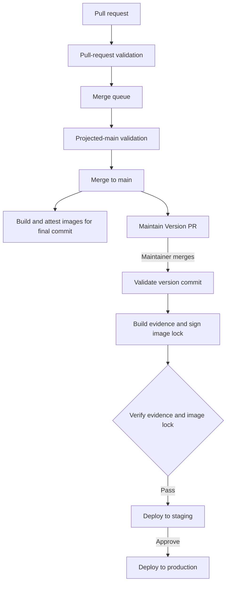

# CI/CD Architecture

Hephaestus uses trunk-based delivery through GitHub's merge queue. Pull requests provide early
feedback, merge groups validate projected `main`, and pushes to `main` produce release images. Releases
with signed image locks deploy automatically to staging; production requires approval.

## 🏗️ Architecture Overview


```mermaid
flowchart TD
    accTitle: Pull request delivery pipeline
    accDescr: Pull-request and merge-group validation protect main; final-SHA images become signed releases that deploy to staging before production approval.
    PR[Pull request] --> PRCI[Pull-request validation]
    PRCI --> Queue[Merge queue]
    Queue --> MG[Projected-main validation]
    MG --> Main[Merge to main]
    Main --> Images[Build and attest images for final commit]
    Main --> VP[Maintain Version PR]
    VP -->|Maintainer merges| ReleaseCI[Validate version commit]
    ReleaseCI --> Evidence[Build evidence and sign image lock]
    Evidence --> Verify{Verify evidence and image lock}
    Verify -->|Pass| Staging[Deploy to staging]
    Staging -->|Approve| Prod[Deploy to production]
```

## 🚀 Release Flow

Every merge to `main` produces commit-addressed container images and maintains the accumulating
**Version PR**. Merging the Version PR creates a release with a signed image lock, promotes versioned
image tags, deploys to staging, and waits for production approval. Full flow:
[Release Management](./release-management.mdx).

Pull-request and merge-group jobs build amd64 images for preview and packaging validation. A merge
group is a [temporary integration candidate](https://docs.github.com/en/repositories/configuring-branches-and-merges-in-your-repository/configuring-pull-request-merges/managing-a-merge-queue#how-merge-queues-work)
with its own SHA, so pushes to `main` build and attest multi-architecture images for the final commit.
Releases promote those images by digest without rebuilding them; see
[Release Management](./release-management.mdx).

## 🛡️ Quality Gates

Before any release, code must pass:

| Gate (leg)      | Tool        | Purpose              |
| --------------- | ----------- | -------------------- |
| Migration chain + drift (`Database`) | Liquibase | Full chain applies empty → head, then schema is diffed against JPA entities |
| Changelog immutability (`Migrations`) | git diff | Released changesets + `master.xml` are append-only |
| OpenAPI sync    | Diff check  | Client ↔ Server sync |
| Java formatting | Spotless + Palantir Java Format | Code style |
| Java lint       | PMD         | Static analysis      |
| Java nullness policy | NullAway policy scanner | Rejects suppressed analysis and empty source discovery |
| Changeset policy | Node test runner + Changesets | Tests release-note and version synchronization rules |
| Webapp TypeScript | oxlint + oxfmt (`.oxfmtrc.json`) + tsc | Lint + format + typecheck |
| Agent and repository-tooling files | oxlint + oxfmt + tsc | Lint, format, and typecheck where applicable |
| Docs code and configuration | oxfmt | Format JavaScript, TypeScript, JSON/JSONC, and CSS |
| Agent runtime   | Node         | Runner and precompute specs on the version pinned by `package.json`; the package-manager contract rejects Docker image drift |
| Workflow syntax and shell correctness | Actionlint + ShellCheck | Rejects invalid Actions configuration and warning-level shell defects |
| Workflow security | Zizmor | Uploads SARIF and rejects medium-or-higher-confidence findings |

### Merge policy

Pull requests targeting `main` merge through GitHub's merge queue after these GitHub
Actions contexts pass: `CI Status Gate`, `Actionlint`, and `Zizmor`. Required
workflows run again for the merge group, which includes the current base and queued changes ahead of
the pull request. Each required context is bound to the GitHub Actions integration rather than
accepting a same-named external status.

Review is a native ruleset requirement with stale approvals dismissed on every push. Authors listed
in `REVIEW_POLICY_MAINTAINERS` receive an automated approval; every other author needs a human with
write access. Repository administrators own that allow-list. Remove the automation when independent
maintainer review is available.

The approval workflow runs on `pull_request_target` with `pull-requests: write`, so it checks out only
`scripts/` from the default branch, reads the author login and nothing else, and executes no
pull-request code. An empty allow-list approves nobody. It has no `branches:` filter: a stacked
layer is approved while it still targets the layer below, because retargeting to `main` after the
lower layer merges fires no event.

The changesets Version PR is the temporary exception: updates made with `GITHUB_TOKEN` do not trigger
the required workflows, so release automation uses the ruleset bypass. The resulting version bump
runs source validation on `main` before release; other pushes build final-SHA images without repeating
source validation.

## 🔒 Security and supply-chain controls

| Control | Timing | Enforcement | Destination |
| --- | --- | --- | --- |
| GitHub dependency review | pull requests | blocks new high or critical findings in runtime, development, and unknown scopes | required Security workflow |
| CodeQL default setup | managed by GitHub | repository SAST policy | code scanning |
| TruffleHog and GitHub push protection | pull requests and pushes | block verified secrets | Security workflow and repository protection |
| Trivy filesystem scan | CI | scanner failure blocks; findings publish | code scanning and Security workflow |
| Image vulnerability policy | image build and release | blocks fixable high or critical findings | build summary and release evidence |
| Scheduled image rescans | weekly | findings update the tracking issue; scanner failure fails the run | vulnerability response issue |
| OpenSSF Scorecard | `main`, branch-protection changes, and weekly | posture findings do not extend the pull-request critical path | code scanning and run artifact |
| Renovate | configured schedule and vulnerability alerts | pull requests require normal review and CI | dependency dashboard |

Renovate opens update pull requests on weekday mornings; only major updates wait for a Dependency
Dashboard approval, and vulnerability alerts bypass the release-age delay and the approval gate.
Native managers cover package manifests, lockfiles, container bases, Maven, and GitHub Actions;
regex managers covered by `scripts/renovate-config.test.ts` cover version declarations that have
no native manager.

[Vulnerability remediation](./vulnerability-remediation.mdx) owns the blocking and exception policy.
[Release management](./release-management.mdx#supply-chain-evidence) owns artifact signing, provenance,
SBOM, and release-verification guarantees.

## 📦 Environments

| Environment       | Eligibility | Deploys on |
| ----------------- | ----------- | ---------- |
| Preview (Coolify) | Same-repository PR with the `preview` label | Every push; waits for its images, never for tests |
| Staging           | `main` | Verified signed release |
| Production        | Required reviewer | The same verified signed release |

### GitHub Environment Setup

1. **Settings → Environments → New environment**
2. Create `Staging` (no rules)
3. Create `Production` with **Required reviewers**

Preview environments do not need to be created in advance. The preview workflow registers
`preview/pr-N` as a transient GitHub environment when Coolify accepts the first deployment.

## 🔄 Preview Deployments

Previews are opt-in and self-service. Add the **`preview`** label to your pull request — no review,
no ceremony, and you can label your own PR. Every push redeploys, and **a preview never waits for
your tests to pass**: it is most useful exactly when they do not.

A preview runs the amd64 images that pull-request CI builds in parallel with tests, using the release
Dockerfiles and buildpack configuration. A docs-only change re-tags unchanged images; changes to the
webapp or server rebuild the affected image.

A sticky comment carries the URL, and GitHub records each accepted update as the transient
environment `preview/pr-N`, so the pull request's **View deployment** link opens it too.

Remove the `preview` label to tear the stack down and free the slot. Closing, merging, or converting
the pull request back to draft does the same thing.

Deployments are serialized, never parallel, and each one deploys the pull request's *current* head.
A burst of pushes therefore produces one deployment of the newest commit rather than one per commit.
If you push while a deployment is in flight, that run stands down rather than deploying a commit that
is no longer the head; the new push starts the next deployment and nothing needs re-labelling.

### What is in a preview

Each preview starts from a copy of staging's database, so workspaces, synced work and the
leaderboard are already there — which is what makes a preview worth looking at. The copy is silenced
before the application server boots: review triggers, agent bindings and sweep schedules are off,
queued jobs are cancelled, and the instance identity is dropped so the preview signs its own tokens.
The application server also reads staging's event stream, on a durable of its own. Agent runs and
inbound webhooks stay off. Sign-in works only if the preview-only GitHub OAuth app is configured, and
the accounts in the preview application's `HEPHAESTUS_AUTH_BOOTSTRAP_ADMINS` come up as admins.

Each stack keeps its own PostgreSQL, preview-only credentials, and signed commit-addressed CI images.
No container holds the Docker socket: the seed loader reads staging over the network as a role that
can only read.

Preview controllers run only for pull requests targeting `main`; this keeps privileged
`pull_request_target` workflows anchored to the protected branch. A stacked layer becomes eligible
after it is retargeted to `main`.

### When the comment says nothing deployed

| Comment says | What to do |
| --- | --- |
| does not carry the `preview` label | Add the label |
| is a draft | Mark it ready for review |
| comes from a fork | Push the branch to this repository |
| was opened by a … , not a repository collaborator | Nothing; previews need push access |
| changes trusted deployment policy | Land that change first — a preview never runs a pull request's own edits to `.github/workflows/**`, `.github/actions/**` or `docker/preview/**` |
| changes too many files for one comparison | Split the pull request, or land it without a preview |

### When the preview failed

| Comment says | What it means |
| --- | --- |
| CI never published images for this commit | An image build failed, or was still running when the deploy gave up. Check the CI run; the next push retries. |
| Coolify reported a failed preview deployment | The stack did not start. Open the deployment log link in the comment. |
| Coolify finished, but the preview did not return HTTP 2xx | Containers started but the app never became healthy — usually a migration or a missing setting. |
| Timed out waiting for Coolify … | The deploy outlasted its budget. The next push retries; if it keeps happening the host is likely saturated. |
| The preview host is full (n/m) | Drop the label from one of the named pull requests |

Cleanup sends a signed close event and then marks the deployment inactive; the nightly repair
repeats Coolify cleanup before retiring that record. Failed cleanup stays blocking, and the repair
starts from the host inventory rather than an arbitrary date window.

Operator configuration, host capacity and secret scopes live in
[`docker/preview/README.md`](https://github.com/ls1intum/Hephaestus/blob/main/docker/preview/README.md);
why the label is the authority, and which alternatives were priced and declined, is
[ADR 0035](https://github.com/ls1intum/Hephaestus/blob/main/docs/decisions/0035-pull-request-previews-are-label-gated.md).

## ⚙️ Key Workflows

| Workflow               | Trigger               | Purpose                                            |
| ---------------------- | --------------------- | -------------------------------------------------- |
| `cicd.yml`             | PR, merge group, push to main | Validates changes before merge and builds final-SHA images after merge |
| `review-policy.yml`    | PR opened, reopened, synchronized, ready for review, edited | Approves a listed maintainer's pull request so the ruleset's required approval is met; does nothing for anyone else |
| `ci-quality-gates.yml` | Called by cicd.yml    | Formatting, lint, type checks, webapp unit and story tests: everything verifiable from source |
| `ci-build.yml`         | Called by cicd.yml    | Packages the server reactor once, then runs the OpenAPI, schema, database and browser E2E gates and the application-server image against that artifact |
| `ci-tests.yml`         | Called by cicd.yml    | The server unit, architecture and integration suites, compiled from source |
| `ci-docker-build.yml`  | Called by cicd.yml    | Dockerfile image builds (webapp, agent, PostgreSQL) and aliases for unchanged images |
| `reusable-docker-build.yml` | Called by ci-build.yml and ci-docker-build.yml | Builds, signs, attests, and blocks on the release vulnerability policy for the `linux/amd64` image |
| `ci-security-scan.yml` | Called by cicd.yml    | Dependency review on pull requests; Trivy dependency scan, secret detection and repository policy checks |
| `rescan-main-images.yml` | Weekly, manual | Rescans main's published images against the release vulnerability policy and keeps one tracking issue in step with the findings |
| `ci-profile.yml` | Weekly, manual | Profiles server integration tests and Spring contexts |
| `ci-server-clean-reference.yml` | Weekly, manual | Records cold server phases and compares generated JARs |
| `verify-changesets.yml`| Called by cicd.yml    | Tests changeset/version-sync policy and enforces release-note presence |
| `ci-compose-validate.yml` | Called by cicd.yml | Validates rendered reference and self-hosted Compose stacks |
| `deploy-preview.yml` | `preview` label added, or a push, reopen or ready-for-review on a labelled PR | Waits for this commit's attested CI images, deploys them, and registers the native GitHub deployment |
| `cleanup-preview.yml` | Label removed, PR closed or drafted | Removes and verifies resources, then retains a cleanup tombstone |
| `reconcile-previews.yml` | Nightly, manual | Re-sends teardown for any preview environment whose pull request is closed, drafted or unlabelled |
| `version-pr.yml`       | Push to main          | Maintains the accumulating Version PR (changesets) |
| `release.yml`          | Successful CI/CD push on `main` | Publishes the release and promotes it through the Staging and Production environment gates |
| `deploy-staging.yml`   | Called by `release.yml` or manual dispatch | Deploys a verified release lock to staging |
| `deploy-prod.yml`      | Called by `release.yml` or manual dispatch | Deploys the staging-verified release to production |

### Shared setup actions

| Action | Contract |
| --- | --- |
| `setup-node-pnpm` | Installs the versions pinned in `package.json`; `install` must be `none`, `frozen`, or `hardened` |
| `setup-caches` | Sets up the JDK and restores the Maven dependency cache with a prefix fallback; `application-server-reactor` also restores the generated-client build cache and is the only type that writes caches |
| `restore-server-build` | Downloads the packaged reactor and installs its generated-clients JAR and parent pom so single-module Maven goals resolve them; outputs the executable JAR path |
| `setup-browsers` | Restores the exact Playwright browser version and installs Chromium system dependencies |
| `setup-release-security-tools` | Installs Cosign, Trivy, and optionally Syft for release-evidence jobs |
| `download-trivy-db` | Fetches the vulnerability database with retries and a mirror fallback; optionally refuses one over `max-age-hours` old and records its metadata |
| `ghcr-login` | Authenticates Docker to GHCR |

Repository-local actions require checkout first. Jobs without checkout use the external SHA-pinned
action directly rather than checking out the repository only to reach a wrapper.

## 🎯 Performance Optimizations

### Path-Based Filtering

CI only runs jobs for components that actually changed:

| Component            | Triggers On                                                   |
| -------------------- | ------------------------------------------------------------- |
| Webapp               | `webapp/**`, `docs/images/readme/**`, `.oxlintrc.json`, `.oxfmtrc.json`, and root package configuration |
| Application Server   | `server/**`, `scripts/**`, `docker/agents/**`, `docs/**`, root lint, format, TypeScript, and package configuration |
| Agent images         | `docker/agents/**`                                            |
| CI config            | Each leg's own workflow files and actions, through one path filter per leg; any `.github/**` change runs Actionlint and Zizmor |

The whole of `scripts/` counts as application-server change, not just the database helper: the
contract validator and the changelog-immutability guard live there, and a PR editing only a guard
would otherwise skip the workflow that runs it. `docker/agents/**` appears twice for the same reason
— it builds the agent images, and `test:agents` and `typecheck:agents` cover the precompute tree
inside it, so a PR editing only a precompute script must still run those gates.

### Docker Layer Caching

Docker builds use **registry-based caching** to store intermediate layers in `ghcr.io`:

**How it works:**

- `cache-from`: Pulls cached layers from registry (main branch + current branch)
- `cache-to`: Pushes new layers with `mode=max` (all intermediate layers)
- Separate cache tags per platform: `image:cache-linux-amd64`, `image:cache-linux-arm64`
- Native builds: amd64 on x86 runners, arm64 on ARM runners (no QEMU emulation)

The registry cache is not size-capped or time-evicted the way the Actions cache is, and it is shared
across branches, so a pull request reuses `main`'s layers.

### Registry Authentication

Image builds log in to `ghcr.io` with the workflow's own `GITHUB_TOKEN`; there is no Docker Hub
login step, no registry mirror, and no repository secret to configure. Base images come from Docker
Hub anonymously: [GitHub-hosted runners pulling public images are not subject to Docker Hub's rate
limit](https://docs.github.com/en/actions/reference/limits).

### Build once

`Build` packages the server reactor once. The OpenAPI and schema gates, the database contract tests,
the browser E2E suite and the application-server image download that artifact and run Maven goals or
`pack` against it: the JAR the E2E suite ran is the JAR inside the image, and the spec is scraped
from the same JAR. The unit, architecture and integration suites are the exception: they produce
nothing that ships and each runs longer than packaging, so they compile from source in `Test` and
start immediately.

### Parallel Execution

- Quality legs (App Server, Tooling and Docs, Webapp, Stories) start immediately from source.
- Artifact gates (OpenAPI, schema, database, E2E, image) start as soon as the reactor is packaged. Webhook reception is part of the app-server test surface since ADR 0008.
- Docker images build for both architectures (amd64 + arm64) after a merge; pull requests and merge groups build amd64 only.
- `fail-fast: false` ensures all jobs complete for full feedback

### Concurrency Control

- Outdated PR runs cancelled automatically
- Release runs never cancelled

### Monitoring CI

Use GitHub's organization-level [Actions metrics](https://docs.github.com/en/actions/concepts/metrics)
for workflow and job run time, queue time, failure rate, and runner usage. Each `CI Status Gate` job
also includes the current run's dependency-aware timeline and job summary.

The weekly `CI profile` workflow covers the server-specific data GitHub does not provide: JFR,
resource usage, JUnit results, and Spring context-cache metrics. It signals only after three
consecutive regressions against five earlier default-branch profiles. Branch dispatches produce
standalone diagnostic artifacts without changing or enforcing that baseline.

The weekly **Server Phase Reference** workflow records cache-disabled Maven generation, compilation,
test-compilation, and execution profiles and compares two clean generated-client JARs. GitHub Actions
step durations remain the source for toolchain setup and artifact-upload time; Maven Profiler covers
only work inside Maven.

`SpringTestContextArchitectureTest` separately enforces the reviewed Spring context keys. Run the
profile options locally with:

```bash
mkdir -p ci-metrics
/usr/bin/time -v -o ci-metrics/server-integration-resource.txt \
  pnpm run test:server:integration \
  -DargLine=-XX:StartFlightRecording=filename=target/integration-profile.jfr,settings=profile,dumponexit=true \
  -Dlogging.level.org.springframework.test.context.cache=DEBUG
```

## 🛠️ Running CI Locally

Before pushing, run the complete local quality gate. CI also runs builds and selected server test
tiers that need more time or infrastructure.

### Full Local Check (Recommended)

```bash
# Format and check all services
pnpm run format && pnpm run check
```

When relevant to the change, also run `pnpm run build:webapp`,
`pnpm run test:server:verification`, and the Docker-backed server integration suite. The pull request
workflow remains authoritative for its hosted jobs.

### Per-Service Commands

```bash
# Webapp
pnpm run check:webapp          # oxfmt format check, then oxlint
pnpm run check:webapp:fix      # Same, applying every safe fix
pnpm run typecheck:webapp      # A separate leg — check:webapp does not run it
pnpm run test:webapp           # Unit tests

# Application Server (Java) — includes the integration.core.webhook receiver
pnpm run format:java:check     # Check formatting
pnpm run test:server:unit      # Unit tests

# Agent runtime (Node) — the Pi runner and the practice precompute scripts
pnpm run test:agents           # Runner + precompute specs
pnpm run check:agents          # oxfmt check, then oxlint, then both typechecks
pnpm run check:agents:fix      # Same, applying every safe fix
pnpm run typecheck:agents      # Agent + precompute TypeScript
```

`check:agents` formats the agent and tooling TypeScript trees, docs code, and selected repository
configuration; it also lints and type-checks the non-webapp TypeScript trees. CI invokes the same
commands.

### Common Issues

| Issue                 | Solution                                      |
| --------------------- | --------------------------------------------- |
| Formatting errors     | Run `pnpm run format`                          |
| Lint errors (agent runtime, precompute, `scripts/`) | Run `pnpm run check:agents:fix`, then fix what remains |
| TypeScript errors     | Run `pnpm run typecheck` to see details        |
| Test failures         | Check the specific test output for details    |
| OpenAPI out of sync   | Run `pnpm run generate:api`                    |
| Database schema drift | Run `pnpm run db:draft-changelog`              |

## 📊 CI Features

### Test Results

All test suites generate JUnit XML reports that are displayed in the **Test Results** tab of each workflow run:

- **Application Server**: Unit, integration, and architecture tests (incl. the in-process Pi mentor agent and the webhook receiver per ADR 0008)
- **Webapp**: Unit tests and Storybook interaction tests

### Job Summary

Each CI run generates a rich **Job Summary** in the Actions UI with:

- Overall status with emoji indicators
- Results table for each workflow (quality gates, tests, security, Docker)
- Components changed table (from path filtering)
- Failure-specific troubleshooting guides with fix commands
- Performance metrics showing skipped workflows

### Workflow Timeline

The CI Status Gate job generates a visual **Mermaid timeline** showing:

- Job execution order and duration
- Parallel job execution
- Job creation-to-start delay, including dependency waiting
- Critical path identification

This helps identify bottlenecks and optimization opportunities.

## 🆕 Adding a New Service

Extend the pipeline at the ownership boundary that changed; do not copy an existing job wholesale.

1. Add the service's paths to `detect-changes` in `cicd.yml`, including the shared files that can
   affect it. Expose the result as a reusable-workflow input.
2. Add purpose-named jobs to `ci-quality-gates.yml` and `ci-tests.yml`. Declare `needs` only when a
   job consumes another job's artifact, and give every runnable job a timeout and least-privilege
   permissions.
3. Use `setup-node-pnpm` with an explicit install mode. Java jobs use a validated `setup-caches`
   type; browser jobs use `setup-browsers`.
4. Add image builds through `reusable-docker-build.yml`. Keep image metadata, immutable tags,
   attestations, and signing in that workflow rather than reproducing them in the caller.
5. Pass the change-detection output from `cicd.yml` to every reusable workflow that needs it.

Before opening the pull request, verify that tooling-only changes skip the service, shared inputs
select it, its JUnit or diagnostic artifacts are uploaded, and CI configuration changes exercise its
safety-net path. `scripts/ci-contract.test.ts` owns the repository-wide workflow invariants; extend it
when the new service introduces another invariant rather than relying on prose.
