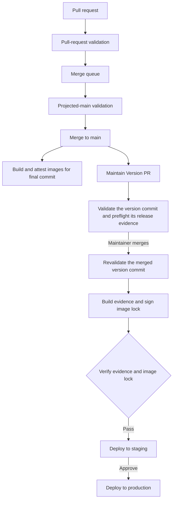

# CI/CD Architecture

Hephaestus uses trunk-based delivery through GitHub's merge queue. Pull requests provide early
feedback, merge groups validate projected `main`, and pushes to `main` produce release images. Releases
with signed image locks deploy automatically to staging; production requires approval.

## Architecture overview


```mermaid
flowchart TD
    accTitle: Pull request delivery pipeline
    accDescr: Pull-request and merge-group validation protect main; final-SHA images become signed releases that deploy to staging before production approval.
    PR[Pull request] --> PRCI[Pull-request validation]
    PRCI --> Queue[Merge queue]
    Queue --> MG[Projected-main validation]
    MG --> Main[Merge to main]
    Main --> Images[Build and attest images for final commit]
    Main --> VP[Maintain Version PR]
    VP --> VPCI[Validate the version commit and preflight its release evidence]
    VPCI -->|Maintainer merges| ReleaseCI[Revalidate the merged version commit]
    ReleaseCI --> Evidence[Build evidence and sign image lock]
    Evidence --> Verify{Verify evidence and image lock}
    Verify -->|Pass| Staging[Deploy to staging]
    Staging -->|Approve| Prod[Deploy to production]
```

## Release flow

Every push to `main` builds and attests multi-architecture images for that commit and maintains the
Version PR; merging the Version PR cuts a release that promotes those images by digest —
[Release management](./release-management.mdx). Pull requests and merge groups build `linux/amd64`
only; a merge group has its own SHA, so its images are never the ones a release promotes. The
exception is the Version PR's branch, where every run builds every release image on both
architectures, whichever event started it, because the release evidence preflight that guards that
branch evidences each image on both published platforms and can only evidence what the run
published.

## Quality gates

| Job | Checks | Local command |
| --- | --- | --- |
| Quality → App Server | Spotless and PMD, NullAway policy, the PMD canary when PMD inputs changed, artifact-source contracts, setting delivery per runtime role | `vp run gate:server`, `gate:java-nullness`, `gate:contracts`, `gate:env` |
| Quality → Tooling and Docs | toolchain and agent-runtime pins, the runner and lint contracts, `gate:agents`, load-test format and syntax, agent specs, instruction mirrors, docs format and `docs:lint`, Mermaid parse | `vp run gate:agents`, `gate:docs`, `test:agents` |
| Quality → Webapp | `vp check`, presentational components, story prose, story sort, docs colour tokens, unit tests, Vite build with a `routeTree.gen.ts` diff | `vp run check:webapp`, `test:webapp`, `build:webapp` |
| Quality → Webapp: Stories | Storybook interaction tests, `export:assets` diff, Storybook build, Chromatic | `vp run test:webapp:stories` |
| Quality → Windows | Every gate that needs neither Maven, Docker nor the agent sandbox, on `windows-latest`, uncached | `vp run --no-cache ci:windows` |
| Quality → Clean install | `vp install --frozen-lockfile` on a runner with Node and the launcher and nothing else, then `gate:toolchain` and the hooks path | `vp install` |
| Build → App Server: Package | `./mvnw -pl application -am package -DskipTests`; uploads the classes and JARs once | — |
| Build → App Server: Generated artifacts | `generate:api` diff against the packaged JAR; `db:check-drift`, which replays `master.xml` and diffs the JPA model; ERD diff | `vp run generate:api`, `db:check-drift`, `db:generate-erd-docs` |
| Build → App Server: Database | Surefire `database` group against PostgreSQL; the major-upgrade drill | `vp run test:postgres-upgrade` |
| Build → Webapp: E2E | Playwright against the packaged JAR | `vp run --filter webapp test:e2e` |
| Build → App Server image | `pack build` from the packaged JAR, signed, attested and policy-scanned | — |
| Test → App Server: Unit and architecture, App Server: Integration | compiled from source | `vp run test:server:verification`, `test:server:integration` |
| Security → New dependency risk | dependency review; pull requests only | — |
| Security → Dependencies, secrets, and policy | Trivy filesystem scan, dependency vulnerability gate, TruffleHog, `security.txt` expiry, changelog immutability guard, legacy-reference guards | — |
| Changesets → Verify changesets | policy tests, verified-revert detection, release-note presence, `MIGRATION.md` freeze | `vp run gate:changesets` |
| Compose → Render compose stacks | the self-hosted, preview and reference stacks render | `vp run gate:preview-stack` |
| Docker → Webapp, Agent: Pi, Postgres (pg_partman), Tag unchanged images | Dockerfile images; aliases for unchanged ones | — |
| Supported-host boot smoke | `docker/self-host/setup.sh`, then PostgreSQL, NATS and the application server from this run's own images, waiting for the application to report healthy | — |
| Actionlint, Zizmor | workflow lint with ShellCheck warnings; Zizmor at medium confidence | — |
| PR → Verify commit identity | every commit's primary author resolves to a GitHub account, and that account is the pull request's author; a `Bot` author is matched against its `[bot]` account | — |

The four quality legs are one matrix job, one entry per leg of the task graph. Each runs
`vp run ci:<leg>`, then pipes `vp run --last-details` through `scripts/report-task-run.ts`: every
task that did not pass becomes an error annotation naming the command that reproduces it, and the
report, cache hits and miss reasons included, lands in the job summary. A leg runs when the change
detection in `cicd.yml` says its scope changed; the Windows leg listens to the tooling scope, and
both it and the tooling leg prove the hook dispatcher on a rejected and an accepted commit.

### Merge policy

Pull requests targeting `main` merge through GitHub's merge queue after these GitHub
Actions contexts pass: `CI Status Gate`, `Actionlint`, and `Zizmor`. Required
workflows run again for the merge group, which includes the current base and queued changes ahead of
the pull request. Each required context is bound to the GitHub Actions integration rather than
accepting a same-named external status.

A merge group is a diff, so it selects its jobs from the paths it touches —
[Path filters](#path-filters). It has no preview, so `Build` and `Docker` are filtered there too.
`any-code` is the union of the source filters and reaches `docs/**` through the tooling filter, so a
documentation-only group still starts `Quality`, `Security`, `Build` and `Docker` even where the
jobs inside them skip. To find out why a leg did not run, read the `CI Status Gate` summary, which
lists every leg including the skipped ones, and the `Detect changes` log, which records the filters
the diff matched.

A required context may be filtered because a ruleset accepts a skipped check as satisfied; the check
still reports `skipped`, not `success`. A workflow that never triggers reports nothing at all, and a
required context left pending blocks the queue for good — `merge_group` supports no `paths:` filter
in any case, so the filtering lives in each job's `if`. The queue builds up to
`max_entries_to_build: 3` groups speculatively, a repository-ruleset field rather than a file here,
and each group costs a whole `CI/CD` run, so a job added to `cicd.yml` is paid for once per group in
flight.

A failed merge group drops its pull requests from the queue without failing any check on them, so
CI updates a comment on the pull request named by the merge group's head ref with the run link. It
does not requeue automatically: the result does not say whether the failure was transient or
deterministic. Regrouping the queue cancels the runs it dissolves, and a cancelled run is reported
to nobody.

Review is a native ruleset requirement with stale approvals dismissed on every push. Authors listed
in `REVIEW_POLICY_MAINTAINERS` receive an automated approval; every other author needs a human with
write access, including Renovate. Green checks and Dependency Dashboard approval do not satisfy this
review requirement. Renovate includes that reminder in each pull request's body. Repository
administrators own the allow-list; do not add dependency bots to it. Remove the automation when
independent maintainer review is available. After approving the current commit, the workflow attempts
to minimize superseded automatic reviews. A minimization failure is a warning, not a failed approval.

The approval workflow runs on `pull_request_target` with `pull-requests: write`. It loads the evaluator
from `scripts/` on the default branch, reads current pull-request metadata and reviews from GitHub,
and executes no pull-request code. An empty allow-list approves nobody. It has no `branches:` filter:
a stacked layer is approved while it still targets the layer below, because retargeting to `main` after the
lower layer merges must not depend on receiving a subsequent event. The `edited` trigger also
re-evaluates explicit base changes.

The Version PR carries checks like any other pull request. Its updates are pushed with
`GITHUB_TOKEN`, which starts no workflow run, so `version-pr.yml` dispatches CI/CD on the Version
PR's branch instead — `workflow_dispatch` being one of the two events that token may start. The
dispatched run reports `CI Status Gate` onto the branch head, which is the pull request's head
commit, so the commit whose merge cuts a release is validated before it lands. `Verify changesets`
is the one leg it skips, and deliberately: the Version PR is the pull request that consumes
changesets rather than adding one. [Release management](./release-management.mdx#the-flow).

## Security and supply-chain controls

| Control | Timing | Enforcement | Destination |
| --- | --- | --- | --- |
| Dependency vulnerability gate | Security workflow | owns the dependency verdict; blocks fixable high or critical findings in every dependency the checkout resolves | required Security workflow |
| GitHub dependency review | pull requests | reports the advisories a pull request introduces, with their patched versions; holds no verdict | Security workflow summary |
| CodeQL advanced setup | pull requests, merge groups, `main` pushes, and weekly | repository SAST policy | code scanning |
| TruffleHog and GitHub push protection | pull requests and pushes | block verified secrets | Security workflow and repository protection |
| Trivy filesystem scan | Security workflow | a scanner error blocks; findings of every severity are report-only | code scanning |
| Semgrep TLS policy | pull requests, merge groups, and `main` pushes | fails on a rule violation or a scanner error | code scanning and a run artifact |
| Image vulnerability policy | image build and release | blocks fixable high or critical findings | build summary and release evidence |
| Weekly image rescans | `rescan-main-images.yml`, `rescan-release-images.yml` | the `main` rescan upserts one tracking issue; the release rescan fails and comments on the vulnerability response issue | issues and run artifacts |
| OpenSSF Scorecard | `main` pushes, branch-protection changes, and weekly; never on pull requests | reports | code scanning and a run artifact |
| Scorecard ratchet | the same events, plus on demand | fails when an enforced check scores below `security/scorecard-baseline.json` | job summary and a run artifact |
| Renovate | configured schedule and vulnerability alerts | pull requests require normal review and CI | dependency dashboard |

One check owns the dependency verdict: the dependency vulnerability gate in `ci-security-scan.yml`,
a second Trivy pass in `table` format over the same checkout. It runs on pull requests and on `main`
pushes and evaluates every dependency the lockfiles resolve, so an advisory published against a pin
no pull request touches fails the next run rather than waiting for someone to open the code-scanning
dashboard. It applies the severity policy in [vulnerability
remediation](./vulnerability-remediation.mdx) — fixable high or critical — and its exceptions are the
one exception path for a dependency finding, recorded in `security/trivy-dependency-ignore.yaml`.

Dependency review sees only the manifests a pull request changes, so it cannot hold that verdict; it
reports what the pull request introduces and fails nothing. The first Trivy pass is the
code-scanning feed: SARIF output reports every severity whatever `severity` is set to, so the pass
that publishes it carries neither `severity` nor `exit-code`, and it keeps Trivy's secret scanner,
which covers the whole tree where TruffleHog covers a pull request's own commits.

Renovate groups routine updates only when they share a review and verification boundary. Production
dependencies remain separate unless Renovate identifies a package family that must move together.
Major updates and minor updates to pre-1.0 dependencies remain ungrouped, wait seven days, and require
Dependency Dashboard approval. Vulnerability alerts remain ungrouped and bypass those gates.

Lockfile maintenance runs on Mondays. `renovate.json` owns the managed ecosystems and extraction
rules; `scripts/renovate-config.test.ts` exercises each custom manager against its source. The Node,
pnpm and Pi SDK pins are grouped, so a version stated in several managed files moves in one pull
request; the toolchain checks reject a version that reads differently in any of them. Renovate
provisions the Node it runs lockfile updates with from `engines`, so `engines.node` restates
`devEngines.runtime` exactly rather than the supported line.

[Vulnerability remediation](./vulnerability-remediation.mdx) owns the severity policy and the shape,
ceiling and approval of an exception, for images and dependencies alike.
[Release management](./release-management.mdx#supply-chain-evidence) owns artifact signing, provenance,
SBOM, and release-verification guarantees.

### Semgrep policy

`security/semgrep/` holds this repository's own rule pack: syntax checks for disabled Node
certificate verification and unconditional Java hostname verifiers, not comprehensive TLS analysis.
CodeQL keeps the deep dataflow analysis, and the image-reference, `security.txt` and Liquibase guards
in `ci-security-scan.yml` stay independent. Inline `nosemgrep` suppression is disabled, so an
exception is a reviewed rule change, and every rule carries a positive and a negative fixture beside
it.

Semgrep reports; it is not a required check. The digest-pinned scanner runs without network access or
credentials over a read-only checkout, and `.github/workflows/semgrep.yml` owns the commands that
reproduce a run locally. A pull request from a fork gets the scan verdict but no code-scanning row,
because GitHub caps a fork token's `security-events` access at read.

### CodeQL configuration

`.github/workflows/codeql.yml` runs CodeQL under advanced setup: only advanced setup reads a
committed config file, and `.github/codeql/codeql-config.yml` excludes `security/semgrep/**`,
whose fixtures deliberately carry the patterns the Semgrep rules exist to flag — unused parameters
among them — which CodeQL's own queries otherwise report in code that is never shipped. Advanced
setup replaces GitHub's managed default setup; switching a repository between the two is a one-time
manual step under **Settings → Advanced Security → Code scanning → CodeQL analysis → Switch to
advanced → Disable CodeQL**, not something a workflow file can do.

### Scorecard baseline

`security/scorecard-baseline.json` owns the minimum every enforced Scorecard check must hold and the
four exclusions, each with its reason. Checks are compared one at a time, so an improvement cannot
offset a regression, and a check the baseline does not name is not enforced. Lowering a minimum also
edits the map in `scripts/check-scorecard.test.ts`, so the change is visible in the pull request that
makes it.

`scripts/check-scorecard.ts` reads the posture OpenSSF publishes for this repository — the latest
published assessment, not necessarily the current commit — and fails on a regression, a missing
enforced check, evidence that predates the baseline or is more than eight days old, and on an API or
parsing failure. `scorecard-ratchet.yml` runs it on `main` pushes, branch-protection changes, weekly
and on demand, and keeps the fetched assessment as an artifact. It is a workflow of its own because
[OpenSSF restricts the publishing job](https://github.com/ossf/scorecard-action#workflow-restrictions)
to allowlisted actions. Reproduce it with `node scripts/check-scorecard.ts`, or
`node --test scripts/check-scorecard.test.ts` without network access.

## Environments

| Environment | Eligibility | Deploys on | Approval |
| --- | --- | --- | --- |
| Preview (Coolify) | same-repository PR with the `preview` label | every push; never waits for tests | none |
| Staging | every published release | release publication | none |
| Production | the same release after staging | release publication | required reviewer |

### GitHub environment setup

1. **Settings → Environments → New environment**
2. Create `Staging` (no rules)
3. Create `Production` with **Required reviewers**

A deploy brings up `app`, then `core`, then `proxy`: the application server runs the Liquibase
migration the webhook runtime in `core` reads, and the edge starts last, against routers that are
already complete. Both deploy paths use this order — the push workflow and the pull reconciler.
The `proxy` stack publishes :80 and :443. An environment whose host already has an
edge in front of it sets the environment variable `DEPLOY_EDGE_PROXY=false`, which leaves `proxy`
out of both the render and the deploy; anything else, including an unset variable, deploys all
three. Staging sets it, because it shares a host with the Coolify instance that serves preview
deployments and that proxy holds both ports — a second edge there fails the deploy on a port that
is already allocated.

Preview environments do not need to be created in advance. The preview workflow registers
`preview/pr-N` as a transient GitHub environment when Coolify accepts the first deployment.

## Preview deployments

Add the `preview` label to a same-repository pull request. Every push redeploys, and a preview does
not wait for tests. `Docker` rebuilds the images whose inputs changed and its `Tag unchanged images`
job aliases the base commit's verified digests for the rest, so every image exists at the head SHA.
An alias serves a preview and never release evidence: when the base commit's image is still
publishing it falls back to the candidate the merged pull request built, which carries `linux/amd64`
alone. That is why the Version PR's branch builds every image itself instead.

A sticky comment carries the URL, and GitHub records each accepted update as the transient
environment `preview/pr-N`, so the pull request's **View deployment** link opens it too.

Remove the `preview` label to tear the stack down and free the slot. Closing, merging, or converting
the pull request back to draft does the same thing.

Deployments are serialized, never parallel, and each one deploys the pull request's *current* head.
A burst of pushes therefore produces one deployment of the newest commit rather than one per commit.
If you push while a deployment is in flight, that run stands down rather than deploying a commit that
is no longer the head; the new push starts the next deployment and nothing needs re-labelling.

A preview runs its own PostgreSQL seeded from staging and reads staging's event stream. What is
switched off in the copy, how sign-in works, and how the sandbox is enforced are in
[`docker/preview/README.md`](https://github.com/ls1intum/Hephaestus/blob/main/docker/preview/README.md).

Preview controllers run only for pull requests targeting `main`; this keeps privileged
`pull_request_target` workflows anchored to the protected branch. A stacked layer becomes eligible
after it is retargeted to `main`.

### When the comment says nothing deployed

| Comment says | What to do |
| --- | --- |
| does not carry the `preview` label | Add the label |
| is a draft | Mark it ready for review |
| comes from a fork | Push the branch to this repository |
| was opened by a … , not a repository collaborator | Nothing; previews need push access |
| changes trusted deployment policy | Land that change first — a preview never runs a pull request's own edits to `.github/workflows/**`, `.github/actions/**` or `docker/preview/**` |
| changes too many files for one comparison | Split the pull request, or land it without a preview |

### When the preview failed

| Comment says | What it means |
| --- | --- |
| CI never published images for this commit | An image build failed, or was still running when the deploy gave up. Check the CI run; the next push retries. |
| Coolify reported a failed preview deployment | The stack did not start. Open the deployment log link in the comment. |
| Coolify finished, but the preview did not return HTTP 2xx | Containers started but the app never became healthy. |
| Timed out waiting for Coolify … | The deploy outlasted its budget. The next push retries. |
| The preview host is full (n/m) | Drop the label from one of the named pull requests |

`cleanup-preview.yml` sends the signed close event and marks the GitHub deployment inactive; if
Coolify rejects the event the job fails and `reconcile-previews.yml` retries nightly, starting from
the deployment inventory.

Operator configuration, host capacity and secret scopes live in
[`docker/preview/README.md`](https://github.com/ls1intum/Hephaestus/blob/main/docker/preview/README.md);
why the label is the authority, and which alternatives were priced and declined, is
[ADR 0035](https://github.com/ls1intum/Hephaestus/blob/main/docs/decisions/0035-pull-request-previews-are-label-gated.md).

## Workflows

| Workflow | Trigger | Purpose |
| --- | --- | --- |
| `cicd.yml` | PR, merge group, push to main, manual | Validates changes before merge and builds final-SHA images after merge; the release evidence gate runs over the images the run built on the Version PR's branch, and wherever the `release-preflight` dispatch input asks for it |
| `review-policy.yml` | PR opened, reopened, synchronized, ready for review, edited | Approves a listed maintainer's pull request so the ruleset's required approval is met; does nothing for anyone else |
| `pull-request.yml` | PR opened, edited, synchronized, reopened, ready for review | Validates the title against the policy `commitlint.config.ts` exports, without installing the workspace, checks that every commit resolves to the pull request's author, and assigns the author when the pull request opens |
| `ci-quality-gates.yml` | Called by cicd.yml | Formatting, lint, type checks, webapp unit and story tests: everything verifiable from source |
| `ci-build.yml` | Called by cicd.yml | Packages the server reactor once, then runs the OpenAPI, schema, database and browser E2E gates and the application-server image against that artifact |
| `ci-tests.yml` | Called by cicd.yml | The server unit, architecture and integration suites, compiled from source |
| `ci-docker-build.yml` | Called by cicd.yml | Dockerfile image builds (webapp, agent, PostgreSQL) and aliases for unchanged images |
| `reusable-docker-build.yml` | Called by ci-build.yml and ci-docker-build.yml | Builds, signs, attests, and blocks on the release vulnerability policy for the `linux/amd64` image |
| `ci-security-scan.yml` | Called by cicd.yml | Dependency review on pull requests; Trivy dependency scan, secret detection and repository policy checks |
| `verify-changesets.yml` | Called by cicd.yml | Tests changeset and version-sync policy and enforces release-note presence |
| `ci-compose-validate.yml` | Called by cicd.yml | Validates rendered reference and self-hosted Compose stacks |
| `openapi-autocommit.yml` | `autocommit-openapi` label | Regenerates the OpenAPI spec and client and commits them to the pull request |
| `security-mutation.yml` | PR touching the suite's inputs, manual | Runs the security mutation suite |
| `scorecard.yml` | Push to main, branch-protection change, weekly | Publishes the OpenSSF Scorecard |
| `semgrep.yml` | Pull request, push to main, merge group | Tests and scans the repository's own TLS rule pack |
| `rescan-main-images.yml` | Weekly, manual | Rescans main's published images against the release vulnerability policy and keeps one tracking issue in step with the findings |
| `rescan-release-images.yml` | Weekly, manual | Rescans the latest published release's images and reports drift on the vulnerability response issue |
| `ci-profile.yml` | Weekly, manual | Profiles server integration tests and Spring contexts |
| `ci-server-clean-reference.yml` | Weekly, manual | Records cold server phases and compares generated JARs |
| `scorecard-ratchet.yml` | Push to main, branch-protection change, weekly, manual | Fails when a Scorecard check drops below the committed baseline |
| `deploy-preview.yml` | `preview` label added, or a push, reopen or ready-for-review on a labelled PR | Waits for this commit's attested CI images, deploys them, and registers the native GitHub deployment |
| `cleanup-preview.yml` | Label removed, PR closed or drafted | Removes and verifies resources, then retains a cleanup tombstone |
| `reconcile-previews.yml` | Nightly, manual | Re-sends teardown for any preview environment whose pull request is closed, drafted or unlabelled |
| `cd-docs.yml`, `cd-docs-teardown.yml` | `docs/**` on push and pull requests; PR closed | Publishes the docs site and its pull-request previews |
| `version-pr.yml` | Push to main | Maintains the accumulating Version PR (changesets) and dispatches CI/CD on its branch, release evidence preflight included |
| `release.yml` | Successful CI/CD push on `main` | Publishes the release and promotes it through the Staging and Production environment gates |
| `release-upgrade.yml` | Called by `release.yml`, weekly | Boots the previous stable release with seeded data, then the candidate against the same database |
| `deploy-staging.yml`, `deploy-prod.yml` | Called by `release.yml` or manual dispatch | Deploy a verified release lock through `deploy-locked-compose.yml` |

### Commits a workflow makes

Actions holds no signing key, so a commit pushed with `git` from a workflow is unsigned and a
required-signature rule rejects it. Every commit an automation makes here is created through
GitHub's `createCommitOnBranch` mutation instead, which GitHub signs — the same path
`changesets/action` lands the Version PR on and Renovate lands a dependency bump on.
`scripts/commit-via-api.ts` is the one caller: `openapi-autocommit.yml` commits the regenerated spec
and client to the pull request's branch through it, and `promote.yml` commits the channel to
`deploy-state`. `scripts/ci-contract.test.ts` fails any workflow that pushes to a real ref.

The mutation carries whole file contents rather than a diff, so the script enumerates every added,
modified and deleted path from the work tree and sends each file entire; a rename is its source
deleted and its destination added. It commits against the head the work tree was compared with, so a
branch that moved in the meantime fails the run instead of overwriting whatever moved it. The
credential is still `GITHUB_TOKEN`, so these commits start no further workflow run.

### Shared setup actions

| Action | Contract |
| --- | --- |
| `setup-toolchain` | Installs the Node.js version pinned in `package.json`, and nothing else when `install` is `none`, so a job that only runs `node scripts/…` reaches no package registry; `frozen` adds the pinned pnpm — caching its executable by runner platform and pinned version and retrying the download twice on a miss — restores the pnpm store cache, and installs the launcher through the SHA-pinned `setup-vp` with `node-manager: false`, which then runs the lockfile's `vite-plus` |
| `setup-caches` | Sets up the JDK from `.java-version` and restores the Maven dependency cache with a prefix fallback; `application-server-reactor` also restores the generated-client build cache and is the only type that writes caches, on default-branch push, schedule and dispatch runs |
| `restore-server-build` | Downloads the packaged reactor and installs its generated-clients JAR and parent pom so single-module Maven goals resolve them; outputs the executable JAR path |
| `setup-browsers` | Restores the exact Playwright browser version and installs Chromium system dependencies |
| `setup-release-security-tools` | Installs Cosign, Trivy, and optionally Syft for release-evidence jobs |
| `download-trivy-db` | Fetches the vulnerability database with retries and a mirror fallback; optionally refuses one over `max-age-hours` old and records its metadata |
| `ghcr-login` | Authenticates Docker to GHCR |

### Caches

A run restores caches from its own branch and from `main`, never from a sibling branch; within that
scope the newest entry under the key prefix wins. Task-cache entries are content-addressed, so a
pull request saves them for its own reruns; the Maven caches and the pnpm executable cache save only
from `main`, because every branch shares their key and a write from any other ref would be reused by
nobody. The JDK the caches depend on is pinned once, in `.java-version`, which every workflow
provisions from.

Repository-local actions require checkout first. Jobs without checkout use the external SHA-pinned
action directly rather than checking out the repository only to reach a wrapper.

## Path filters

`detect-changes` in `cicd.yml` selects legs from the changed paths on the two events that are a
diff: a pull request against its base, and a merge group against `merge_group.base_sha..head_sha`. A
push to `main` and a dispatch validate a whole commit and run every leg, which `detect-changes`
publishes as `unfiltered`. Same-repository pull requests also run `Build` and `Docker` regardless of
paths, because previews need every image at the head SHA; no other event has a preview.

| Selects | Paths |
| --- | --- |
| Quality → Webapp | `webapp/**`, `docs/images/readme/**`, `docs/src/css/custom.css`, the root oxlint and oxfmt configs, the four `scripts/check-*` files it runs, root package files |
| Quality → App Server | `server/**` except `AGENTS.md` and `CLAUDE.md`, `scripts/run-mvnw.ts`, `docker/compose.app.yaml`, `docker/compose.core.yaml`, root package files |
| Quality → Tooling and Docs | `scripts/**`, `docker/agents/**`, `load-tests/**`, `docs/**`, tsconfigs, oxlint and oxfmt configs, `.changeset/**`, `commitlint.config.ts`, instruction files, `renovate.json`, `openapitools.json` |
| Every quality leg | `vite.config.ts`, `.vite-hooks/**`, `.java-version`, `cicd.yml`, `ci-quality-gates.yml` and the setup actions: the task graph, the hooks and the JDK decide every leg's verdict, so a change to one runs all of them |
| Build artifact gates | contracts: the App Server paths or `docker/postgres/**`; E2E: webapp source and the server main sources; image: `server/application/src/main/**`, the poms, `server/application/project.toml`, `server/generated-clients/**` |
| Docker images | `webapp-image`: the webapp build inputs and non-test source; `agent-images`: `docker/agents/**`; `postgres-image`: `docker/postgres/**` |
| Supported-host boot smoke | `docker/**`, `application*.yml`, and the sources Spring binds configuration from — `**/*Properties.java` and `Application.java`. `ci-contract.test.ts` fails if a source carrying `@ConfigurationProperties` or `@ConfigurationPropertiesScan` is not selected |
| CI config | one filter per leg naming its own workflow files and actions; any `.github/workflows/**` or `.github/actions/**` change runs Actionlint and Zizmor |

`docker/agents/**` is in both the tooling and the agent-image filters: `test:agents` and
`typecheck:agents` cover the precompute tree, and the same tree builds the agent image.

## Docker layer caching

Dockerfile builds import `<image>:cache-main-<platform>` from `ghcr.io` and write it, with every
intermediate layer, only on pushes to `main`, so a pull request reuses `main`'s layers and writes
nothing. amd64 builds on `ubuntu-24.04`, arm64 on `ubuntu-24.04-arm`; no emulation. The buildpacks
path (`App Server image`) does not use this cache.

## Registry authentication

Image builds authenticate to `ghcr.io` with the workflow's `GITHUB_TOKEN`; base images are pulled from
Docker Hub anonymously, which
[GitHub-hosted runners may do without a rate limit](https://docs.github.com/en/actions/reference/limits).
A job that reads a first-party image back — the scan, the preflight, the boot smoke — logs in as
well, because `packages: read` alone buys nothing.

A pull request from a fork gets a read-only `GITHUB_TOKEN`, so `cicd.yml` passes `publish: false`
to both image workflows. That build compiles the image and stops: no login, no push, no signature,
no attestation, no policy scan and no alias moves. Forks therefore get no preview and no boot smoke;
the release path exercises their code once it is on `main`.

## Image identity

Every consumer resolves an image through the commit the run built it from, and
`reusable-docker-build.yml` publishes exactly that tag for the event the run started under:
`github.sha` for a push, dispatch or merge group, and the pull request's head SHA for a pull request,
where `github.sha` is a merge commit no image carries. Within a run, the vulnerability scan skips
tags entirely and reads the digest its own build or merge job emitted as an output, so re-running the
scan alone scans the artefact that build produced.

`ci-contract.test.ts` asserts the whole contract: every tag a consumer resolves is one the build
publishes for that consumer's event, and no job resolves an image by the run that happened to build
it. A run-scoped tag names the attempt rather than the artefact, and GitHub's *re-run failed jobs*
gives the retried job a new attempt number.

## Build once

`Build` packages the server reactor once. The OpenAPI and schema gates, the database contract tests,
the browser E2E suite and the application-server image download that artifact and run Maven goals or
`pack` against it: the JAR the E2E suite ran is the JAR inside the image, and the spec is scraped
from the same JAR. The unit, architecture and integration suites are the exception: they produce
nothing that ships, so they compile from source in `Test` and do not wait for packaging.

An image a pull request did not change is not rebuilt either: `Tag unchanged images` verifies the
digest an earlier run published and re-tags it to this run's head SHA. It is aliased from the
nearest commit the default branch contains, found by walking up the chain of bases — a layer of a
stacked pull request is based on another branch's head, which published nothing — and a run that
reaches no such commit builds every image itself. `detect-changes` resolves that commit once, with
`scripts/resolve-alias-base.ts`, and hands it to the image jobs as `alias_base`.

## Parallelism and concurrency

- `Quality` legs and `Test` suites start from source; `Build` gates start when `App Server: Package`
  uploads its artifact.
- Pull requests and merge groups build `linux/amd64`; pushes to `main`, and every run on the Version
  PR's branch, build both architectures. A pull request also builds only the images its diff touched
  and aliases the rest, while the Version PR's branch builds all of them. `detect-changes` decides
  both once, as `single-arch` and `all-images`, and hands them to every image build in the run.
- The `Quality` matrix uses `fail-fast: false`; the image matrix in `reusable-docker-build.yml` uses
  `fail-fast: true`.
- Pull-request runs cancel superseded runs; `release.yml` never cancels.

## Monitoring CI

Use GitHub's organization-level [Actions metrics](https://docs.github.com/en/actions/concepts/metrics)
for workflow and job run time, queue time, failure rate, and runner usage. Each `CI Status Gate` job
also includes the current run's dependency-aware timeline and job summary, and JUnit results appear
as `Test Results - …` check runs.

The weekly `CI profile` workflow covers the server-specific data GitHub does not provide: JFR,
resource usage, JUnit results, and Spring context-cache metrics. It signals only after three
consecutive regressions against five earlier default-branch profiles. Branch dispatches produce
standalone diagnostic artifacts without changing or enforcing that baseline. The exact invocation is
that workflow's `Run integration suite with JFR` step; `SpringTestContextArchitectureTest` enforces
the reviewed Spring context keys.

The weekly **Server Phase Reference** workflow records cache-disabled Maven generation, compilation,
test-compilation, and execution profiles and compares two clean generated-client JARs.

## Running CI locally

```bash
vp run format && vp run check
```

When relevant to the change, also run `vp run build:webapp`, `vp run test:server:verification`
and `vp run test:server:integration`; `vp run verify` runs the credential-free set.

```bash
# Webapp
vp run check:webapp          # vp check: format and lint
vp run fix:webapp           # check:webapp, applying every safe fix
vp run typecheck:webapp      # A separate leg — check:webapp does not run it
vp run test:webapp           # Unit tests

# Application Server (Java)
vp run format:java:check     # Check formatting
vp run test:server:unit      # Unit tests

# Agent runtime (Node) — the Pi runner and the practice precompute scripts
vp run test:agents           # Runner + precompute specs
vp run check:agents           # Format check, oxlint, both typechecks, release-image inventory, scripts/*.test.ts
vp run fix:agents            # check:agents, applying every safe fix
vp run typecheck:agents      # Agent + precompute TypeScript
```

| Issue | Solution |
| --- | --- |
| Formatting errors | Run `vp run format` |
| Lint errors (agent runtime, precompute, `scripts/`) | Run `vp run fix:agents`, then fix what remains |
| TypeScript errors | Run `vp run typecheck` to see details |
| OpenAPI out of sync | Run `vp run generate:api` |
| Database schema drift | Run `vp run db:draft-changelog` |

## Adding a new service

Extend the pipeline at the ownership boundary that changed; do not copy an existing job wholesale.

1. Add the service's paths to `detect-changes` in `cicd.yml`, including the shared files that can
   affect it. Expose the result as a reusable-workflow input.
2. Add purpose-named jobs to `ci-quality-gates.yml`, `ci-tests.yml` or `ci-build.yml`. Declare
   `needs` only when a job consumes another job's artifact, and give every runnable job a timeout and
   least-privilege permissions.
3. Use `setup-toolchain` with an explicit install mode: `frozen` for any job that calls `vp`,
   because Vite+ loads the task graph from the workspace configs; `none` only for jobs that run
   `node scripts/…` or shell alone. Java jobs use a validated `setup-caches`
   type; browser jobs use `setup-browsers`.
4. Add image builds through `reusable-docker-build.yml`. Keep image metadata, immutable tags,
   attestations, and signing in that workflow rather than reproducing them in the caller.
5. Pass the change-detection output from `cicd.yml` to every reusable workflow that needs it.

`scripts/ci-contract.test.ts` owns the workflow invariants; extend it when the service introduces one.
