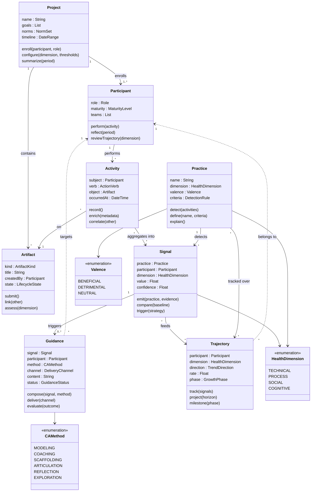
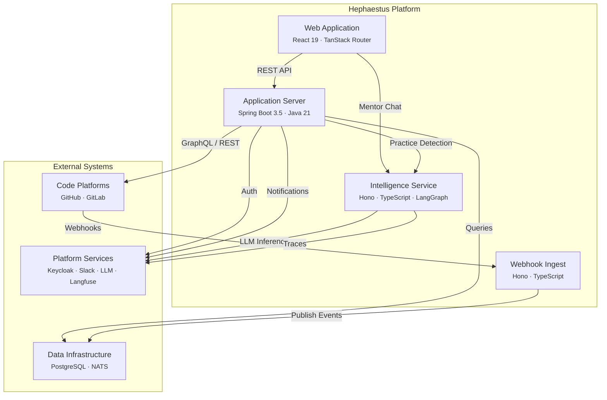

# Conceptual Model

Hephaestus is grounded in **Cognitive Apprenticeship** (Collins, Brown & Newman, 1989) and built around a domain-independent framework for formative practice analytics. This page describes the core domain concepts, their relationships, the system architecture, and how both map to established learning theory.

## Domain Model

The domain model captures **what exists in the problem world** — independent of how Hephaestus implements it. Eight concepts form a pipeline: **Observe → Detect → Guide → Grow**.

### The Eight Concepts

| # | Concept | What it is | Key insight |
|---|---------|-----------|-------------|
| 1 | **Project** | Bounded endeavor with goals, timeline, and norms | The interpretive frame — norms make signals meaningful |
| 2 | **Participant** | Person (or agent) developing professional practice | The subject of observation and guidance |
| 3 | **Artifact** | Tangible work product mediating activity | What we can observe — the tangible outputs of collaboration |
| 4 | **Activity** | Normalized, immutable record of what happened | Subject–verb–object, platform-agnostic |
| 5 | **Practice** | Named behavioral pattern, beneficial or detrimental | The vocabulary for talking about *how* people work |
| 6 | **Signal** | Quantified measure along a health dimension | Multi-dimensional to prevent Goodhart's Law |
| 7 | **Guidance** | Coaching response grounded in a CA method | Closes the loop: Signal → Guidance → Participant |
| 8 | **Trajectory** | Developmental arc over time | Direction, rate, phase — not just snapshots |

### Four Health Dimensions

Signals are measured along four dimensions to provide a holistic view of project health:

| Dimension | What it measures | Example signals |
|-----------|-----------------|-----------------|
| **Technical** | Domain skill quality | Review thoroughness, bad practice detection rate, complexity management |
| **Process** | Workflow effectiveness | Lead time, WIP count, PR abandonment rate, issue linkage |
| **Social** | Collaboration quality | Review reciprocity, response time, cross-team engagement, knowledge sharing |
| **Cognitive** | Understanding & growth | Declining bad practice rate, reflection depth, cognitive debt indicators |

### Cross-Domain Instantiation

The domain model is deliberately independent of any specific project type:

| Concept | Software Engineering | Design | Research | Course Project |
|---------|---------------------|--------|----------|----------------|
| Project | Repository + Sprint | Design Brief | Study | Capstone |
| Participant | Developer | Designer | Researcher | Student |
| Artifact | PR, Review, Issue | Mockup, Critique, Spec | Paper, Experiment | Report, Presentation |
| Activity | "opened PR #42" | "uploaded mockup v3" | "submitted revision §4" | "gave peer feedback" |
| Practice | "Gives substantive reviews" | "Tests with users" | "Pre-registers hypotheses" | "Incorporates feedback" |
| Signal | Review substantiveness: 0.85 | Iteration velocity: 3/wk | Rigor score: 4.2 | Timeliness: 95% |
| Guidance | PR comment: "Consider breaking this into smaller changes" | Critique prompt: "How might color-blind users experience this?" | Revision note: "Methods section lacks power analysis" | Reflection: "What did you learn from the peer feedback?" |
| Trajectory | Solo contributor → collaborative practitioner | Pixel-pusher → user-centered designer | Protocol-follower → independent investigator | Surface learner → self-regulated |

### Mapping to Codebase

| Domain Concept | Current Implementation | Status |
|---|---|---|
| Project | `Workspace` + `Repository` | Implemented |
| Participant | `User` + `WorkspaceMembership` | Implemented |
| Artifact | `Issue`, `PullRequest`, `PullRequestReview`, `PullRequestReviewComment` | Implemented |
| Activity | `ActivityEvent` (immutable ledger, 55+ event types) | Implemented |
| Practice | `PullRequestBadPractice` (negative practices only) | Partial |
| Signal | Implicit (XP scores, leaderboard metrics) | Needs explicit modeling |
| Guidance | AI mentor messages, PR review comments (planned) | Partial |
| Trajectory | Not modeled | Planned |

---

## Architecture

### Data Flows

1. **Observe**: Code Platform → Webhook Ingest → NATS → Application Server → PostgreSQL
2. **Detect (Practices)**: Application Server → Intelligence Service → LLM → PostgreSQL
3. **Guide (AI Mentor)**: Participant → Web App → Intelligence Service → LLM Provider
4. **Interact**: Participant → Web App → Application Server (via Keycloak auth)
5. **Notify**: Application Server → Slack / Email

---

## Cognitive Apprenticeship Mapping

Hephaestus operationalizes the six methods of **Cognitive Apprenticeship** (Collins, Brown & Newman, 1989) plus **Fading** as a meta-principle. The mapping emerged organically from sound pedagogical intuition and is now made explicit:

| CA Method | Definition | Hephaestus Mechanism | Status |
|-----------|-----------|---------------------|--------|
| **Modeling** | Making expert practice visible | Bad practice detection (`GOOD_PRACTICE` status), leaderboard (what high performers do), achievement progression chains | Current |
| **Coaching** | Observing and providing feedback | AI mentor (Hattie feedback levels), practice detection with lifecycle-aware severity, PR comments (planned) | Current + Planned |
| **Scaffolding** | Providing support to perform beyond current ability | Graduated severity (DRAFT → Minor, READY → Critical), PR templates, cognitive load limits (max 5 findings) | Current |
| **Articulation** | Getting learners to externalize reasoning | Mentor reflection sessions ("What happened? What did you try?"), PR description quality enforcement | Current |
| **Reflection** | Enabling comparison with experts or peers | Activity summaries, week-over-week trends, peer comparison via leaderboard, session history | Current |
| **Exploration** | Encouraging self-directed problem solving | Pull-based mentor, hidden achievements, agent sandboxes for experimentation | Current |
| **Fading** | Withdrawing support as competence grows | Adaptive intervention intensity by participant maturity | Planned |

### Secondary Theories

| Theory | Role in Hephaestus |
|--------|-------------------|
| **Self-Regulated Learning** (Zimmerman, 2002) | Micro-theory for AI mentor design: forethought → performance → self-reflection cycle |
| **Feedback Intervention Theory** (Hattie & Timperley, 2007) | Feedback level hierarchy: Task > Process > Self-Regulation >> Self. Guides what the mentor and detector say |
| **Self-Determination Theory** (Deci & Ryan, 2000) | Gamification design: achievements → competence, team competitions → relatedness, pull-based mentor → autonomy |

---

## Canonical Diagrams

The canonical versions of these diagrams are maintained as [HyLiMo](https://hylimo.github.io) files for use in research publications:

- **Domain Model**: [`docs/research/domain-model.hyl`](https://github.com/ls1intum/Hephaestus/blob/main/docs/research/domain-model.hyl)
- **Architecture**: [`docs/research/architecture.hyl`](https://github.com/ls1intum/Hephaestus/blob/main/docs/research/architecture.hyl)

Render these at [hylimo.github.io](https://hylimo.github.io) by pasting the file contents.
