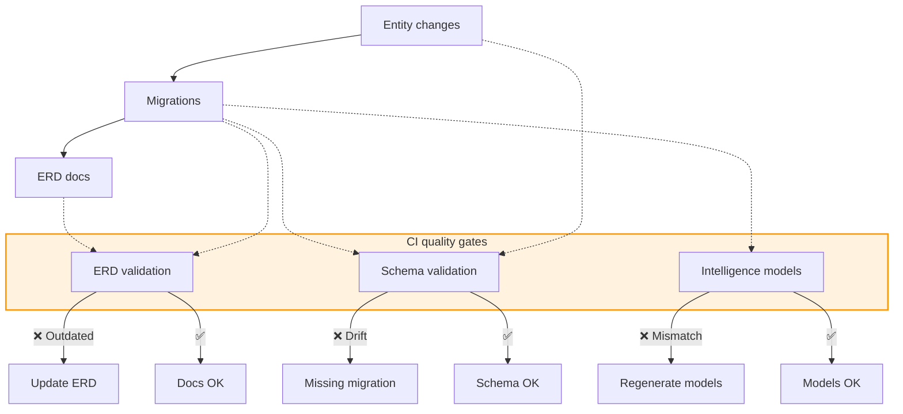

Liquibase manages schema changes in the application server. Follow this workflow to keep the database, ERD docs, and generated Drizzle schema in sync.

## Quick start

1. Modify JPA entities with the desired changes.
2. Generate a draft changelog:

   ```bash
   npm run db:draft-changelog
   ```

3. **Review `changelog_new.xml` carefully**—check for destructive operations.
4. Rename and move the file to `server/application-server/src/main/resources/db/changelog/{id}_changelog.xml`.
5. Regenerate docs and models:

   ```bash
   npm run db:generate-erd-docs
   npm run db:generate-models:intelligence-service
   ```

6. Commit the migration, documentation (`docs/contributor/erd/schema.mmd`), and updated models.

:::danger Always validate
Generated migrations can drop or rename columns unexpectedly. Double-check each changeset before committing.
:::

## Validation checklist

- Replace the autogenerated `user (generated)` author with your GitHub username.
- Prefer `renameColumn` over drop/add sequences when renaming fields to avoid data loss.
- Ensure new sequences start at `1` unless you have a data migration plan.
- Confirm destructive statements (`dropTable`, `dropColumn`) are intentional and safe.
- Run `npm run db:generate-erd-docs` and inspect the diff before committing.

### Safe rename example

```xml
<!-- ❌ Avoid drop + add when renaming -->
<dropColumn tableName="user" columnName="first_name"/>
<addColumn tableName="user">
    <column name="firstName" type="VARCHAR(255)"/>
</addColumn>

<!-- ✅ Use renameColumn to preserve data -->
<renameColumn tableName="user" oldColumnName="first_name" newColumnName="firstName"/>
```

## CI validation

Three GitHub Actions guard against drift:

1. **Database schema validation** – Applies migrations to a fresh DB and compares it with current entities. Failure produces a new `changelog_new.xml`.
2. **Database documentation validation** – Generates an ERD from migrations and compares it with the committed diagram.
3. **Intelligence service model validation** – Regenerates the Drizzle schema and compares it with `src/shared/db/schema.ts`.

## Entity change tips

- Prefer `renameColumn` over drop/add pairs to avoid data loss.
- Replace `user (generated)` in Liquibase files with your GitHub username.
- Sequences should start at `1` unless explicitly required otherwise.

### Example

```java
@Entity
public class User {
    @NonNull
    private String email; // Newly added field
}
```

Generates:

```xml
<changeSet author="yourusername" id="1749286026779-1">
    <addColumn tableName="user">
        <column name="email" type="VARCHAR(255)">
            <constraints nullable="false"/>
        </column>
    </addColumn>
</changeSet>
```

## CI flow



## Intelligence service sync

Every migration may affect the intelligence service. Regenerate models with:

```bash
npm run db:generate-models:intelligence-service
```

The command applies migrations, introspects the database, and updates `server/intelligence-service/src/shared/db/schema.ts`. Treat the generated file as disposable—never edit it manually.

## Resources

- [Liquibase documentation](https://docs.liquibase.com/) for change set syntax and best practices.
- [Spring Data JPA reference](https://docs.spring.io/spring-data/jpa/reference/jpa/query-methods.html) for repository naming rules.
