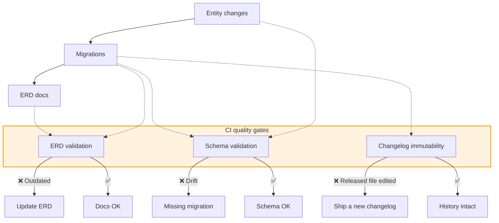

Liquibase manages schema changes in the application server. Follow this workflow to keep the database and ERD docs in sync.

## Quick start

1. Modify JPA entities with the desired changes.
2. Generate a draft changelog:

   ```bash
   pnpm run db:draft-changelog
   ```

3. **Review `changelog_new.xml` carefully** – check for destructive operations.
4. Rename and move the file to `server/src/main/resources/db/changelog/{id}_changelog.xml`.
5. **Append an `<include>` for the new file to `server/src/main/resources/db/master.xml`.**
   `master.xml` lists every changelog explicitly (not via `<includeAll/>`) so the
   apply order is a deliberate choice — append your new entry at the end of the list.
   Two PRs that both add migrations will then conflict in `master.xml` and the
   authors must agree on order, instead of `<includeAll/>` silently interleaving
   the timestamps.
6. Regenerate docs:

   ```bash
   pnpm run db:generate-erd-docs
   ```

7. Add a **release changeset** (`pnpm changeset`) — the Liquibase `<changeSet>` and the release
   changeset are different things, and a schema change needs both. Keep the summary user-facing; the
   release notes flag the migration automatically. See the
   [release management guide](./release-management.mdx).
8. Commit the migration, the `master.xml` edit, the changeset, and the documentation
   (`docs/contributor/erd/schema.mmd`).

:::danger Always validate
Generated migrations can drop or rename columns unexpectedly. Double-check each changeset before committing.
:::

## Validation checklist

- Replace the autogenerated `user (generated)` author with your GitHub username.
- Prefer `renameColumn` over drop/add sequences when renaming fields to avoid data loss.
- Ensure new sequences start at `1` unless you have a data migration plan.
- Confirm destructive statements (`dropTable`, `dropColumn`) are intentional and safe.
- Run `pnpm run db:generate-erd-docs` and inspect the diff before committing.

### Safe rename example

```xml
<!-- ❌ Avoid drop + add when renaming -->
<dropColumn tableName="user" columnName="first_name"/>
<addColumn tableName="user">
    <column name="firstName" type="VARCHAR(255)"/>
</addColumn>

<!-- ✅ Use renameColumn to preserve data -->
<renameColumn tableName="user" oldColumnName="first_name" newColumnName="firstName"/>
```

## Changelog immutability policy

The Liquibase changelog chain **is** the upgrade path: every production and self-hosted
instance upgrades by replaying exactly these files, in `master.xml` order. That works only
if history never changes underneath an instance that already ran part of it.

1. **Released changesets are never edited.** A changeset is *released* once it reaches
   `main` — from that moment it may already be applied to a production database. Editing it
   causes checksum errors at boot on upgraded instances while fresh installs silently get a
   different schema. Fix mistakes **forward** with a new changelog file. (Also note that
   Liquibase [excludes preconditions, contexts, and labels from checksums](https://www.liquibase.com/blog/what-affects-changeset-checksums)
   and silently ignores deleted changesets — so even "harmless" edits can desynchronize
   installed instances without any error.)
2. **`master.xml` is append-only.** Never remove or reorder existing `<include>` entries;
   new changelogs go at the end.
3. **Destructive changes follow deprecate-then-remove across two releases.** Renaming or
   dropping a table/column that shipped in a release happens in two steps: release *N*
   stops writing/reading it (and migrates data if needed), release *N+1* drops it. A single
   release must stay bootable against the schema left behind by the previous one.

CI enforces 1 and 2 mechanically (see below); 3 is a review responsibility.

## CI validation

Three GitHub Actions checks guard the database (all in `ci-quality-gates.yml`):

1. **Migration-chain replay** (`Database` gate) – Applies the full `master.xml` chain via
   `liquibase:update` to an empty pg_partman PostgreSQL (the production image). A changelog that
   doesn't parse or apply fails here. This runs as the first half of the schema-drift check, so
   it exercises the same empty→head path a fresh install boots through.
2. **Schema-drift + ERD validation** (`Database` gate) – After applying the chain, diffs the
   resulting schema against the JPA entities (drift produces a `changelog_new.xml`) and against
   the committed ERD. Reproduce locally with `pnpm run db:draft-changelog`.
3. **Changelog immutability** (`Migrations` gate) – Enforces the policy above with a pure git
   diff against the merge-base: fails if any released file under `db/changelog/` was modified,
   renamed, or deleted, or if an existing `master.xml` `<include>` line was removed, reordered,
   or edited. This catches exactly the edits Liquibase checksums miss (preconditions, contexts,
   labels, comments, and deleted changesets).

The replay applies **every** changeset (the Maven plugin sets no context filter), so it validates
that the whole chain is well-formed — it does **not** reproduce a specific instance's boot (a real
`dev`/`prod` boot filters by `spring.liquibase.contexts`) and, running against an empty database,
does **not** catch data-incompatible migrations (a `NOT NULL` add or a `CHECK` that existing rows
violate). The replay is also forward-only, so `<rollback>` blocks and `onFail="MARK_RAN"`
preconditions are never exercised. Those remain a review responsibility, enforced through the
deprecate-then-remove discipline above.

## Entity change tips

- Prefer `renameColumn` over drop/add pairs to avoid data loss.
- Replace `user (generated)` in Liquibase files with your GitHub username.
- Sequences should start at `1` unless explicitly required otherwise.

### Example

```java
@Entity
public class User {
    @NonNull
    private String email; // Newly added field
}
```

Generates:

```xml
<changeSet author="yourusername" id="1749286026779-1">
    <addColumn tableName="user">
        <column name="email" type="VARCHAR(255)">
            <constraints nullable="false"/>
        </column>
    </addColumn>
</changeSet>
```

## CI flow


```mermaid
flowchart TD
    A[Entity changes] --> B[Migrations]
    B --> C[ERD docs]

    subgraph CI [CI quality gates]
        D[Schema validation]
        E[ERD validation]
        F[Changelog immutability]
    end

    A -.-> D
    B -.-> D
    B -.-> E
    C -.-> E
    B -.-> F

    D -->|❌ Drift| G[Missing migration]
    D -->|✅| H[Schema OK]
    E -->|❌ Outdated| I[Update ERD]
    E -->|✅| J[Docs OK]
    F -->|❌ Released file edited| K[Ship a new changelog]
    F -->|✅| L[History intact]

    style CI fill:#fff3e0,stroke:#ff9800,stroke-width:2px
```

## Resources

- [Liquibase documentation](https://docs.liquibase.com/) for change set syntax and best practices.
- [Spring Data JPA reference](https://docs.spring.io/spring-data/jpa/reference/jpa/query-methods.html) for repository naming rules.
