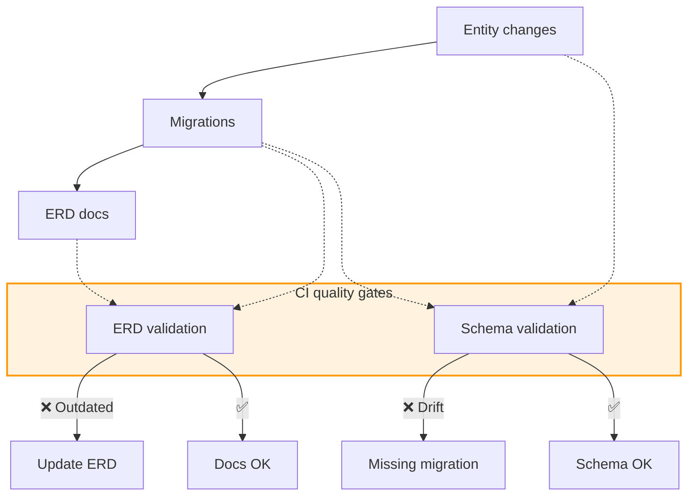

Liquibase manages schema changes in the application server. Follow this workflow to keep the database and ERD docs in sync.

## Quick start

1. Modify JPA entities with the desired changes.
2. Generate a draft changelog:

   ```bash
   pnpm run db:draft-changelog
   ```

3. **Review `changelog_new.xml` carefully** – check for destructive operations.
4. Rename and move the file to `server/src/main/resources/db/changelog/{id}_changelog.xml`.
5. **Append an `<include>` for the new file to `server/src/main/resources/db/master.xml`.**
   `master.xml` lists every changelog explicitly (not via `<includeAll/>`) so the
   apply order is a deliberate choice — append your new entry at the end of the list.
   Two PRs that both add migrations will then conflict in `master.xml` and the
   authors must agree on order, instead of `<includeAll/>` silently interleaving
   the timestamps.
6. Regenerate docs:

   ```bash
   pnpm run db:generate-erd-docs
   ```

7. Add a **release changeset** (`pnpm changeset`, bump ≥ `minor`) whose summary says
   `Includes an automatic database migration.` — the Liquibase `<changeSet>` and the release changeset
   are different things, and a schema change needs both. See the
   [release management guide](./release-management.mdx).
8. Commit the migration, the `master.xml` edit, the changeset, and the documentation
   (`docs/contributor/erd/schema.mmd`).

:::danger Always validate
Generated migrations can drop or rename columns unexpectedly. Double-check each changeset before committing.
:::

## Validation checklist

- Replace the autogenerated `user (generated)` author with your GitHub username.
- Prefer `renameColumn` over drop/add sequences when renaming fields to avoid data loss.
- Ensure new sequences start at `1` unless you have a data migration plan.
- Confirm destructive statements (`dropTable`, `dropColumn`) are intentional and safe.
- Run `pnpm run db:generate-erd-docs` and inspect the diff before committing.

### Safe rename example

```xml
<!-- ❌ Avoid drop + add when renaming -->
<dropColumn tableName="user" columnName="first_name"/>
<addColumn tableName="user">
    <column name="firstName" type="VARCHAR(255)"/>
</addColumn>

<!-- ✅ Use renameColumn to preserve data -->
<renameColumn tableName="user" oldColumnName="first_name" newColumnName="firstName"/>
```

## CI validation

Two GitHub Actions guard against drift:

1. **Database schema validation** – Applies migrations to a fresh DB and compares it with current entities. Failure produces a new `changelog_new.xml`.
2. **Database documentation validation** – Generates an ERD from migrations and compares it with the committed diagram.

## Entity change tips

- Prefer `renameColumn` over drop/add pairs to avoid data loss.
- Replace `user (generated)` in Liquibase files with your GitHub username.
- Sequences should start at `1` unless explicitly required otherwise.

### Example

```java
@Entity
public class User {
    @NonNull
    private String email; // Newly added field
}
```

Generates:

```xml
<changeSet author="yourusername" id="1749286026779-1">
    <addColumn tableName="user">
        <column name="email" type="VARCHAR(255)">
            <constraints nullable="false"/>
        </column>
    </addColumn>
</changeSet>
```

## CI flow


```mermaid
flowchart TD
    A[Entity changes] --> B[Migrations]
    B --> C[ERD docs]

    subgraph CI [CI quality gates]
        D[Schema validation]
        E[ERD validation]
    end

    A -.-> D
    B -.-> D
    B -.-> E
    C -.-> E

    D -->|❌ Drift| G[Missing migration]
    D -->|✅| H[Schema OK]
    E -->|❌ Outdated| I[Update ERD]
    E -->|✅| J[Docs OK]

    style CI fill:#fff3e0,stroke:#ff9800,stroke-width:2px
```

## Resources

- [Liquibase documentation](https://docs.liquibase.com/) for change set syntax and best practices.
- [Spring Data JPA reference](https://docs.spring.io/spring-data/jpa/reference/jpa/query-methods.html) for repository naming rules.
