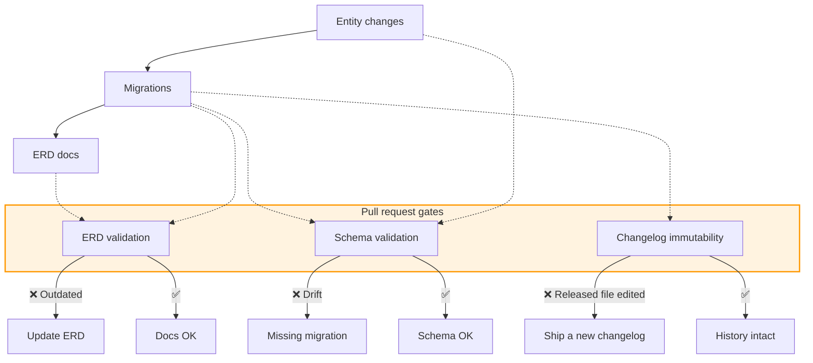

Liquibase manages schema changes in the application server. This page is the procedure; the entity
conventions the drift gate reads are in `server/AGENTS.md` § Schema changes.

## Quick start

1. Modify the JPA entities.
2. Write the drift into this branch's changelog:

   ```bash
   pnpm run db:draft-changelog
   ```

   The command applies the whole chain to a disposable database, diffs it against the JPA model,
   and writes the difference as change sets into
   `server/application/src/main/resources/db/changelog/<timestamp>_changelog.xml`, with ids
   `<timestamp>-1`, `-2`, … and the author `hephaestus`. A branch gets one such file: the first run
   creates it and appends its `<include>` to `master.xml`; later runs add change sets to it. It then
   refreshes the ERD. With no drift it writes nothing.

   `master.xml` lists every changelog explicitly rather than through `<includeAll/>`, so the apply
   order is committed and append-only.

3. **Review the change sets.** Keep the real deltas and remove what the diff only inferred. Prefer
   `renameColumn` over a drop-and-add pair, start new sequences at `1` unless there is a data
   migration plan, and confirm every `dropTable` or `dropColumn` is intended. Give every change set a
   precondition (`onFail="MARK_RAN"`) and a `<rollback>`. If you pruned anything, refresh the ERD:

   ```bash
   pnpm run db:generate-erd-docs
   ```

4. Add a release changeset: `pnpm changeset`, or hand-write `.changeset/<slug>.md`
   (`.changeset/README.md`). A Liquibase `<changeSet>` and a release changeset are different things
   and a schema change needs both; `verify-changesets` fails a PR that touches `db/changelog/`
   without one. Keep the summary user-facing; the release notes flag the migration automatically.
5. Commit the changelog, the `master.xml` edit, the changeset, and `docs/contributor/erd/schema.mmd`.

### Safe rename example

```xml
<!-- Avoid drop + add when renaming -->
<dropColumn tableName="user" columnName="first_name"/>
<addColumn tableName="user">
    <column name="firstName" type="VARCHAR(255)"/>
</addColumn>

<!-- Use renameColumn to preserve data -->
<renameColumn tableName="user" oldColumnName="first_name" newColumnName="firstName"/>
```

## Changelog immutability policy

The Liquibase changelog chain **is** the upgrade path: every production and self-hosted
instance upgrades by replaying exactly these files, in `master.xml` order. That works only
if history never changes underneath an instance that already ran part of it.

1. **Released changesets are never edited.** A changeset is *released* once it reaches
   `main` — from that moment it may already be applied to a production database. Editing it
   causes checksum errors at boot on upgraded instances while fresh installs silently get a
   different schema. Fix mistakes **forward** with a new changelog file. Liquibase
   [excludes preconditions, contexts and labels from checksums](https://www.liquibase.com/blog/what-affects-changeset-checksums)
   and ignores deleted changesets, so those edits desynchronise installed instances without any
   error.
2. **`master.xml` is append-only.** Never remove or reorder existing `<include>` entries;
   new changelogs go at the end.
3. **Destructive changes follow deprecate-then-remove across two releases.** Renaming or
   dropping a table/column that shipped in a release happens in two steps: release *N*
   stops writing/reading it (and migrates data if needed), release *N+1* drops it. A single
   release must stay bootable against the schema left behind by the previous one.

CI enforces 1 and 2 mechanically (see below); 3 is a review responsibility.

## CI validation

1. **Migration-chain replay, schema drift and ERD** — Build workflow, job *App Server: Generated
   artifacts*. `pnpm run db:check-drift` applies the full `master.xml` chain to an empty database
   from the repository's PostgreSQL image (`docker/postgres`) and diffs the result against the JPA
   entities; a changelog that does not parse or apply fails here. `pnpm run db:generate-erd-docs`
   then has to leave `docs/contributor/erd/schema.mmd` unchanged.
2. **Changelog immutability** — Security workflow, job *Dependencies, secrets, and policy*, step
   *Changelog immutability guard*. A git diff from the PR base commit fails if any file under
   `db/changelog/` was modified, renamed or deleted, or if an existing `<include>` line in
   `master.xml` was removed, reordered or edited. This catches what checksums miss.
3. **Seeded release upgrade** — `release-upgrade.yml` boots the previous stable release, seeds
   account and workspace data, then boots the candidate against the same database and checks
   readiness, the seeded relationships, the practice catalog and authenticated reads. Release
   publication depends on it; it also runs weekly.

The empty-database replay applies **every** changeset (the Maven plugin sets no context filter), so it validates
that the whole chain is well-formed — it does **not** reproduce a specific instance's boot (a real
`dev`/`prod` boot filters by `spring.liquibase.contexts`) and, running against an empty database,
does **not** catch data-incompatible migrations (a `NOT NULL` add or a `CHECK` that existing rows
violate). The replay is also forward-only, so `<rollback>` blocks and `onFail="MARK_RAN"`
preconditions are never exercised. Those remain a review responsibility, enforced through the
deprecate-then-remove discipline above.

## Example

```java
@Entity
public class User {
    private String email;            // NOT NULL under @NullMarked
    private @Nullable String phone;  // nullable column
}
```

Generates:

```xml
<changeSet id="1749286026779-1" author="hephaestus">
    <addColumn tableName="user">
        <column name="email" type="VARCHAR(255)"><constraints nullable="false"/></column>
        <column name="phone" type="VARCHAR(255)"/>
    </addColumn>
</changeSet>
```

## CI flow


```mermaid
flowchart TD
    accTitle: Database schema change workflow
    accDescr: Entity changes produce a migration, which updates generated schema documentation and is checked in continuous integration.
    A[Entity changes] --> B[Migrations]
    B --> C[ERD docs]

    subgraph CI [Pull request gates]
        D[Schema validation]
        E[ERD validation]
        F[Changelog immutability]
    end

    A -.-> D
    B -.-> D
    B -.-> E
    C -.-> E
    B -.-> F

    D -->|❌ Drift| G[Missing migration]
    D -->|✅| H[Schema OK]
    E -->|❌ Outdated| I[Update ERD]
    E -->|✅| J[Docs OK]
    F -->|❌ Released file edited| K[Ship a new changelog]
    F -->|✅| L[History intact]

    style CI fill:#fff3e0,stroke:#ff9800,stroke-width:2px
```

## Resources

- [Liquibase documentation](https://docs.liquibase.com/) for change set syntax.
