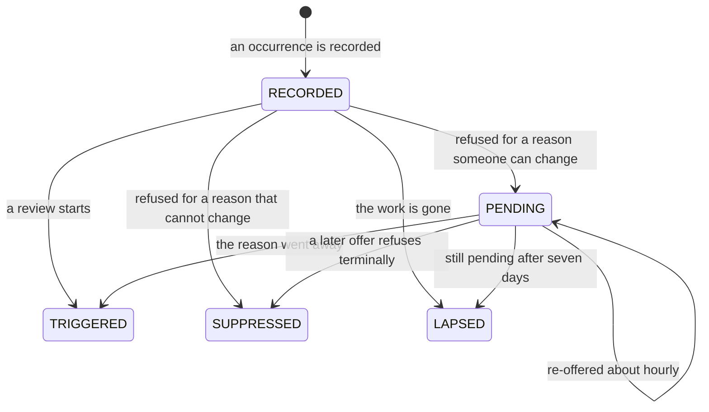
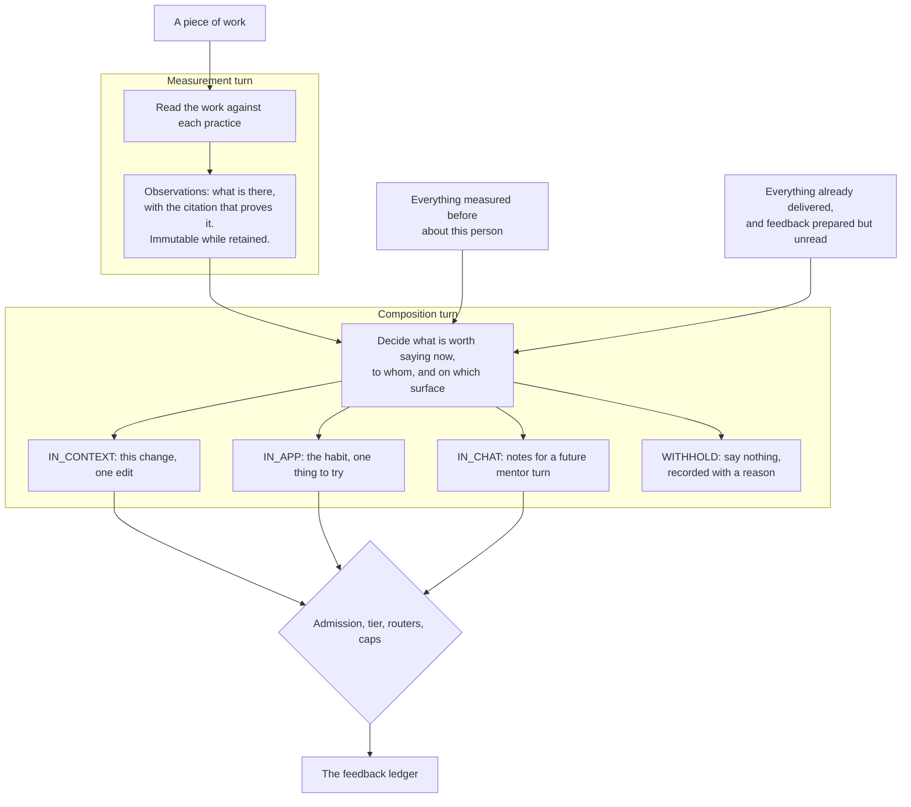
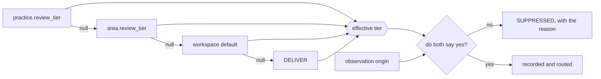
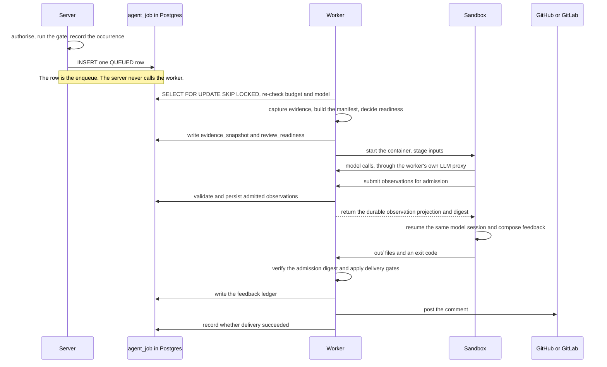

A practice review passes through four stages, in this order: **Occasion**, **Capture**, **Observation**,
**Delivery**. Each stage can stop independently and records a different reason.


Use the stage that stopped the review to decide what to fix. Do not translate one stage's reason into
another stage's vocabulary.

## Where a review can stop

**Each stage owns exactly one refusal vocabulary, and they are not interchangeable.** Answering a question
from one stage in another stage's words is the failure this table exists to prevent.

| Stage       | Refusal vocabulary                                                           | Lands in                                                                   | Means                            |
| ----------- | ---------------------------------------------------------------------------- | -------------------------------------------------------------------------- | -------------------------------- |
| Occasion    | `SignalStateReason`                                                          | `artifact_signal.state_reason`                                             | We chose not to look, or not yet |
| Capture     | `SourceAbsenceReason` per source, `SourceReadinessReason` per practice check | `agent_job.evidence_snapshot` (the manifest), `agent_job.review_readiness` | We could not look                |
| Observation | `Presence.INCONCLUSIVE`                                                      | `observation.presence`                                                     | We looked and could not tell     |
| Delivery    | `FeedbackSuppressionReason`                                                  | `feedback.suppression_reason`                                              | We know, and chose to stay quiet |

The four are not ranked and do not substitute for one another. "We could not look" is deliberately not
representable as a `Presence` value, because a `Presence` is a claim about the developer's work and a
missing source is a fact about the instrument — which is exactly what lets the whole `observation` table be
read as behaviour. In the other direction, "we chose to stay quiet" must never be recorded as an absent
observation: a tier turned down is a delivery decision, and the measurement it withholds still happened.
When you add a reason code, the first question is which of these four columns it belongs in. If the honest
answer is "two of them", the reason is really two reasons.

## Occasion

An occasion is an *occurrence* — one named signal on one revision of one artifact — recorded in
`artifact_signal` before any decision is taken about it. Recording first is what makes silence auditable:
every review that did not happen has a row saying so.



`TRIGGERED`, `SUPPRESSED` and `LAPSED` are terminal — every ledger update is guarded on
`state IN ('RECORDED','PENDING')`, so nothing walks a decided row back. `PENDING` is the only state that
costs anything later: `PendingSignalReaper` re-offers it and `PendingSignalResubmitter` runs the gate
again.

Which state a refusal produces is a property of the reason, not of the caller —
`SignalStateReason.resultingState()` decides, and `isRetryable()` is defined as
`resultingState() == PENDING`. That is why the tables below are the reason's own classification and not a
policy applied on top of it.

**Terminal — refused, never re-offered.** The fact that caused the refusal cannot change for this
occurrence.

| Reason                      | Why it can never come out differently                                    |
| --------------------------- | ------------------------------------------------------------------------ |
| `GATE_SKIPPED`              | A workspace review gate turned it away                                   |
| `COOLDOWN_ACTIVE`           | This work was reviewed too recently; a later occurrence gets its own row |
| `REQUEST_COOLDOWN_ACTIVE`   | A review of this was asked for moments ago                               |
| `REQUESTER_QUOTA_EXHAUSTED` | The asker's hourly allowance is spent; asking again is a new occurrence  |
| `CONCURRENT_DUPLICATE`      | The same review was already running                                      |
| `OUT_OF_REVIEW_SCOPE`       | The branch a merge request targeted will not change                      |

**Retryable — parked as `PENDING`, re-offered until it lapses.** Somebody can lift these without the
artifact changing.

Most of them also carry a destination. `webapp/src/components/practice-trace/trace-format.ts` maps a
reason to the screen that undoes it, and the trace renders that as a link — but only for a reader who may
open workspace administration, since every member of a workspace can read a trace. A reason with no entry
in that map renders as a sentence and nothing more, which is the correct answer for the self-healing and
terminal ones below: sending somebody to a settings page that cannot affect what they just read is how a
limit gets widened to fix a non-fault.

| Reason                 | What lifts it                                                                                         | Where the trace links                                                |
| ---------------------- | ----------------------------------------------------------------------------------------------------- | -------------------------------------------------------------------- |
| `WORKSPACE_INACTIVE`   | The workspace becomes active again                                                                    | — no screen reactivates a workspace; the status endpoint has no UI   |
| `PRACTICES_DISABLED`   | An admin starts practice reviews                                                                      | Practices → Review → *When and where*                                |
| `NO_ACTIVE_PRACTICE`   | A practice covering this kind of work is installed                                                    | Practices → Practice setup                                           |
| `REVIEW_MODEL_UNBOUND` | An admin binds a model for practice review                                                            | Administration → AI models                                           |
| `PRACTICE_TIER_OFF`    | An admin raises a watching practice above `OFF` — at the practice, its area, or the workspace default | Practices → Review → *How much*                                      |
| `BUDGET_EXHAUSTED`     | The cap is raised, or the month rolls over                                                            | Administration → AI usage                                            |
| `SUBJECT_UNLINKED`     | The author links a Hephaestus account                                                                 | — the author's own account page, which an admin cannot open for them |
| `MODEL_UNAVAILABLE`    | The bound model or its connection becomes usable                                                      | Administration → AI models                                           |

**Retired — terminal, but not a decision.** These close a row nobody will come back to.

| Reason                      | Meaning                                      |
| --------------------------- | -------------------------------------------- |
| `PENDING_DEADLINE_EXCEEDED` | Re-offered for seven days and never admitted |
| `ARTIFACT_GONE`             | The work no longer exists                    |

Two properties of this ledger you have to know before you reason about volume. A `PENDING` row is retried
on a cadence (`hephaestus.signal-ledger.pending-retry-after`, default one hour) until
`pending-lapse-after` (default seven days) retires it — so a workspace left mis-configured accumulates
re-offer work for a week and then goes quiet again with no further signal. And **nothing ever deletes from
`artifact_signal`**: there is no pruning job for any state, `LAPSED` included. That is deliberate — the
table is the record of what we did not do — but it means the table only grows.

`SignalStateReason.describe()` is exhaustive over every constant and returns one reader-facing sentence
each. Both the API and the webapp print it; when you add a constant, the compiler will make you write that
sentence.

### Provenance, and the collapse

Every occurrence also records **how we came to know about it** — `DiscoveredVia` — which is a free health
measurement rather than a routing decision. `SignalOrigins` maps it once onto `ObservationOrigin`, which is
what later reads use to keep populations apart. The glossary holds that mapping and the operator-facing
label for each door: [How a review was occasioned](./practice-review-glossary.mdx#how-a-review-was-occasioned).

Two things about it are facts about the code rather than about the vocabulary, so they live here. Neither
is visible from the enum, and assuming otherwise is a mistake the enum will not stop you making:

- **Three doors collapse into `MANUAL`.** `ManualReviewRequests` is the single recording site for both the
  `/hephaestus review` comment command (via `BotCommandProcessor`) and the *Review this now* button (via
  `PracticeReviewRequestController`); `DevTriggerController` is a third, gated on
  `hephaestus.dev.trigger-enabled`. Provenance cannot tell you which one was used.
- **`SYNC` is a dead end for connected project work.** `AgentJobEventListener` and
  `IssueAgentJobEventListener` both return immediately when the context is a sync, leaving the row
  `RECORDED` and undecided. The one exception is `ConversationThreadTriggerScheduler`, which records
  `SYNC` and then submits — Slack thread reviews are occasioned this way. Write "reconciliation never
  starts a review" only about pull requests and issues.

## Capture

Capture stages **every source the contract says applies to the artifact kind under review** — all of them,
every time. Practice bindings decide which practices may run, never which files reach the sandbox; there is
no per-run source selection. What a capture then reports about each source (available, not collected,
unavailable, redacted, errored — with a typed reason) and how a practice's stances turn those reports into
a readiness decision is the whole subject of the
[artifact-source contract](./artifact-source-contract.mdx), which is versioned and validated at startup.

Do not restate that contract here. The one fact this page owns is where the readiness verdict lands:
`agent_job.review_readiness`, its own `jsonb` column, split out from `evidence_snapshot` because a snapshot
carries one entry per staged file and a TOASTed `jsonb` has no partial read.

## Observation

An observation is one practice's answer about one piece of work, written once and immutable. It carries a
`Presence` — `PRESENT`, `ABSENT`, `NOT_APPLICABLE` or `INCONCLUSIVE` — and, only when the presence carries
valence, an assessment. `PracticeDetectionResultParser` force-nulls the assessment on an `INCONCLUSIVE`
observation, so a detector that hedges and still attaches a strength cannot slip an unearned one into the
series.

The glossary defines what each presence claims and what `NOT_APPLICABLE` has to carry to be allowed to claim
it — see [Outcome states](./practice-review-glossary.mdx#outcome-states). Two facts belong to this stage
rather than to that vocabulary. `INCONCLUSIVE` is not "we could not look": a missing, errored or
governance-blocked source produces a readiness decision in the Capture stage and **no observation at all**.
And the `NOT_APPLICABLE` grounding rule is enforced twice, in the in-sandbox normalizer and again at
server-side delivery, for the same reason the citation and recorded-search rules are — the sandbox guard runs
inside the thing it is checking.

Identity is assigned at persistence, not by the detector: an occurrence key dedupes within a run
(`insertIfAbsent`, `ON CONFLICT DO NOTHING`), and a recurrence key hashes the locus so the same observation
is recognisable across runs.

**An observation carries `evidenceRationale` and no advice.** `evidenceRationale` is the measurement's own
justification — *"the change adds a tax-exempt branch, and no test file in this diff calls `total`"* —
and it is the only prose the observation carries anywhere. The detector emits no next step: there is no
`guidance` field on the tool, on the parsed observation, or on the ledger. Advice is a property of a
*delivery* (ADR 0021, ADR 0022), and the stage that decides deliveries is the subject of the next
section.

## Measurement and intervention

Everything above this line is the system taking a reading. Everything below it is the system deciding
to say something to a person. Those are separate turns in one agent session. An authenticated server callback admits the observations
between them, so composition retains context but can use only the persisted projection. Keeping that boundary
is why one fact can read three different ways.

**A measurement is falsifiable.** *"This change adds a tax-exempt branch, and nothing in the change
tests it"* is either true or false, and you check it by opening the file. It says nothing about what
anybody should do, and it remains unedited for as long as it is retained, so later readings can
be compared with it.

**An intervention must stay grounded, but grounding alone does not make it useful.** *"Write the assertion
that distinguishes the new branch before you write the branch"* can be supported by the observation and
still be badly timed, repetitive, or irrelevant to the recipient. Composition therefore considers the
audience, surface, history, and current conversation as well as the evidence.

The line the code draws, stated once so it fits in a prompt: **if you can check it by reading the
artifact, it is measurement; if you can only check it by watching what the person does next, it is
intervention.**

They are separated because the good version of each ruins the other. A measurement authored as advice
starts bending toward whatever makes good advice — the observation you can write a nice tip about gets
reported, the one you cannot gets quietly dropped. It also bends toward *fault*, because a next step
presupposes something to step away from: the three answers that assert nothing is wrong (a strength, a
practice with no subject here, a question the evidence left open) are the ones that suffer for it. And advice written at the moment of measurement can
only ever be about the one thing just measured: it cannot know that this is the third time, it cannot
know the developer was already told, and it cannot decide to stay quiet.



Note where the arrows converge. **The model proposes; the server admits.** Every gate that existed
before composition still sits after it — `FeedbackAdmission.delivers(origin, tier, channel)`,
`FeedbackChannelRouter`, `InAppFeedbackRouter`, the in-context admission gate and every per-lane
cap. Giving the model more context is not a reason to relax the gate; it is a reason the gate has more
to refuse.

### Composition inputs and outputs

After Java admits the observations, `pi-runner.mjs` resumes the same in-memory session with
`agent/feedback-composer.md`. Reusing the session avoids making the agent reconstruct the artifact context. The provider still receives the prior conversation on the resumed turn; prompt caching may reduce, but does not erase, that input cost.
The runner closes the measurement phase before that turn: `report_observation` refuses every later call,
and `report_feedback` can only bind to the admitted observations returned by Java. Composition has a
reserved timeout, so detection cannot consume its entire container budget.

It is prompted with `agent/feedback-composer.md` and reads:

| Input                                                      | Where                                                       | Staged by                                          |
| ---------------------------------------------------------- | ----------------------------------------------------------- | -------------------------------------------------- |
| This run's admitted observations                           | `work/composition/observations.json`                        | the runner, from Java's admission response         |
| Prior observations about this person                       | `inputs/history/observations.json`                          | `ReviewHistoryContentSource` — 90 days, at most 50 |
| Feedback already delivered                                 | `inputs/history/feedback.json`                              | the same, at most 30                               |
| Feedback prepared but not yet read                         | `inputs/history/prepared.json`                              | the same, at most 20                               |
| How each measured locus moved                              | `inputs/history/delta.json`                                 | the same, computed by `ObservationDelta`           |
| The practices, by slug                                     | `inputs/practices/index.json`, `inputs/practices/<slug>.md` | `PracticeCatalogInjector`                          |
| Which lanes are open, and how many messages each may carry | `inputs/feedback-composition.json`                          | `FeedbackCompositionInputs`                        |

Output is `out/feedback.json`, collected into the job output and parsed by
`FeedbackCompositionResultParser` into `ComposedFeedbackUnit`s.

Three properties matter more than the paths:

- **Presence of `inputs/feedback-composition.json` is the on switch, and it carries the lane set.**
  Only `PullRequestReviewHandler` and `IssueReviewHandler` stage it, and never for a `BACKFILL` origin.
  A document or conversation-thread review composes nothing at all, which is not an oversight — the
  file's absence is how a handler says "review, but do not compose", and that is what every review did
  before this existed. The lane set is carried rather than inferred so that a stage with no artifact in
  hand can disable `IN_CONTEXT` from the outside; that is the seam a scheduled workspace sweep will use.
- **The history window is never reported `COMPLETE`.** It is a bounded read of a record that keeps
  growing, so it can show that something recurred but never that something has never happened before.
- **The delta is arithmetic, not judgement.** `ObservationDelta.classify` groups a person's window by
  artifact, treats the newest run of each artifact as "now", and returns `NEW`, `RECURRING` (still
  there and the assessment or severity moved), `UNCHANGED` (still there, nothing moved) or `RESOLVED`.
  `RESOLVED` is the whole reason it exists: *"the gap from last week is closed"* originates from a locus
  that is in the prior set and absent from the newest run, so no mapping that walks this run's
  observations can ever reach it. A vanished *strength* is deliberately not `RESOLVED` — that would
  credit somebody with fixing what was already right. And because the recurrence key folds the artifact
  id, the delta can never say "this keeps happening across your work"; that claim comes from the staged
  observation history, and the composer has to clear a distinct-artifact floor to make it.

### The three channels are three levels

`FeedbackChannel` is not three renderers of one message. Each value is a different level of Hattie &
Timperley's model, which is why the mapping from observations to feedback is not 1:1 in either
direction. All three names answer one question — *where does this land?* — and
[ADR 0029](https://github.com/ls1intum/Hephaestus/blob/main/docs/decisions/0029-measurement-intervention-seam-and-channel-levels.md)
records why the lane once called `REFLECTION` is not named for what the developer is meant to do with it.

|                 | `IN_CONTEXT`                                                                        | `IN_APP`                                  | `IN_CHAT`                                                                                        |
| --------------- | ----------------------------------------------------------------------------------- | ----------------------------------------- | ------------------------------------------------------------------------------------------------ |
| Lands           | on the work artifact — pull request summary or inline note, issue comment           | on the developer's own practice pages     | in a turn of a conversation, wherever it runs — the in-app mentor at `/w/:slug/mentor`, or Slack |
| Level           | task                                                                                | process                                   | self-regulation                                                                                  |
| Answers         | "what is worth changing or reinforcing here?"                                       | "what pattern is visible across my work?" | "what capability could this conversation support?"                                               |
| Audience        | public — the team reads it                                                          | private, to the developer alone           | private, in a live mentor turn                                                                   |
| Evidence is     | a current admitted observation; a diff placement also selects one verified citation | several pieces of work, named             | available to the mentor as the original observations and a concise summary                       |
| Intervention is | one edit, in this change                                                            | a habit, for next time                    | chosen by the mentor from the notes, evidence, and live conversation                             |
| `whyItMatters`  | appended verbatim by the server                                                     | situated by the composer, never appended  | not used                                                                                         |
| Placement       | `DIFF` on a verified citation, or `ARTIFACT` at summary level                       | forbidden                                 | forbidden                                                                                        |

**The mentor renders in the app too, and that does not make it `IN_APP`.** `IN_CHAT` is the *dialogic*
channel — the unit becomes a turn the developer can answer — wherever the conversation runs. `IN_APP` is
the *non-dialogic* practice surface — the unit is written down, and reading it is the whole interaction.
Ask *is it a turn?* before asking *which screen?*: a new written surface inside Hephaestus is `IN_APP`,
and a mentor that moves to another chat product is still `IN_CHAT`.

Two of the rows are the load-bearing ones. The public lane never says *"you keep doing this"* — that
is a performance review in front of the team — even though the composer knows it. The private lanes
never re-quote a line of code, because the line is already on the merge request where it can be read
in context. Neither rule is achievable by templating one advice string over three surfaces, which is
what the system did before.

An issue review has no diff, so its in-context unit can use only `ARTIFACT` placement. Pull requests allow
both `DIFF` and `ARTIFACT`. In either form, public feedback must bind to a current admitted observation of
the same practice; history alone cannot become a public claim. Per-lane limits are part of the staged
composition configuration rather than this documentation.

`IN_CHAT` is composed as **notes to the mentor**, not as a turn: the `situation` (factual, artifacts
named, never addressed to the developer as "you"), the `capability` (the useful understanding or
behaviour the conversation should support), the `evidenceSummary` (checked against the separately staged
observation evidence), and the `inConversationSignal` (an observable sign that the conversation helped). The rule the field names
enforce is that you write what the mentor needs to know, never a sentence for it to say — anything phrased
as a line of dialogue gets spoken and sounds like a script.

The notes are stored as structured JSON and handed to the mentor as `notes`; the composed title is staged
separately as `topic`. Neither is a message to speak. The mentor composes the turn against the live
conversation and may adapt, defer, or discard a note when it no longer fits.
There is no empty-notes form: an admitted `IN_CHAT` unit has all four fields, and no unit is created when
composition has nothing useful to prepare.

The producer, parser, persistence model, and mentor context use the same four required fields. There are no
aliases or fallback conversation schemas.

For example, a review may observe that a new tax-exempt branch has no distinguishing test. The conversation
lane does **not** prepare `"Why didn't you write a test?"`. It prepares material such as:

```json
{
  "situation": "The tax calculation change adds a tax-exempt branch without a test that exercises it.",
  "capability": "Recognise decision branches that need a distinguishing example before implementation.",
  "evidenceSummary": "The admitted observation binds the new branch and the exhaustive search of changed tests.",
  "inConversationSignal": "The developer can name the input that distinguishes the new branch and where to test it."
}
```

On a later turn, the mentor inspects the bound observation and the conversation so far. It might ask for the
distinguishing input, explain the gap directly, connect it to the developer's current question, or leave the
note for later. The prepared fields constrain purpose and grounding; they do not prescribe dialogue.

### What the composer is not allowed to do

The tool schema and `FeedbackCompositionResultParser` refuse the same four things, once in the sandbox
and once on the server, for the reason every other guard on this pipeline is doubled — a guard the
constrained party can skip is advice, not a boundary. The parser never throws; a unit it cannot accept
is dropped and logged.

- **No verdict fields.** `report_feedback` takes no presence, assessment, severity or confidence. An
  intervention that could carry a verdict would eventually be read back as one.
- **No model-authored path or line number.** `placement.kind: "DIFF"` names an admitted
  `{ observationId, citationIndex }`, and the server resolves the file, side, and line from that
  observation's citation. `placement.kind: "ARTIFACT"` carries no coordinates and stays in the summary.
  Both forms require a current admitted observation of the same practice.
- **No invented supersession target.** `action: "SUPERSEDE"` must name a `threadKey` that was staged in
  `prepared.json`.
- **No second unit on the same lane about the same practice.** One unit per `(channel,
practiceSlug)`; the rest are dropped.

Staying quiet is the fourth action, not a gap: `action: "WITHHOLD"` with `NO_MATERIAL_CHANGE`,
`ALREADY_SAID` or `BELOW_BAR`. That enum is deliberately **not** `FeedbackSuppressionReason` — a
withhold reason is the composer's own judgement, and `FeedbackSuppressionReason` is a database check
constraint listing reasons the *server* refused. Merging them would make "we had nothing worth saying"
indistinguishable from "the tier held it back".

### Supersession — nothing received may be un-said

`FeedbackThreadKey` is one hash over `kind ␟ locus ␟ recipient ␟ channel`. The longitudinal lanes call
`forPractice(practiceSlug, recipientUserId, channel)`, because a habit claim is about the practice
rather than about one merge request: a second card about the same habit should replace the queued
first, not stack beside it. The in-context lane keys on the artifact, as it always did.

`FeedbackSupersession` is a per-channel compare-and-swap. It finds the latest row on the thread, then
runs `UPDATE feedback SET delivery_state='SUPERSEDED' WHERE id = ? AND delivery_state='PREPARED'`,
retrying a bounded number of times while the head of the thread keeps moving. There are three outcomes
and **the new unit is written in all three**:

| Outcome      | What happened                                     | `replaces_id`         |
| ------------ | ------------------------------------------------- | --------------------- |
| `SUPERSEDED` | A queued message was claimed and retired          | the retired row       |
| `CONTINUED`  | The recipient read it first; it keeps `DELIVERED` | the row that was read |
| `NEW`        | Nothing live on the thread                        | not set               |

`DELIVERED` is never retired on the longitudinal lanes, because on those lanes delivered means *read*.
The in-context lane still retires a `DELIVERED` summary, and that is not an exception to the rule: the
provider comment is **edited in place**, so the old text stops being visible and the ledger has to say
so.

`thread_key` stays non-unique. A thread is a chain of rows over time; the uniqueness that matters — at
most one live `PREPARED` per thread — is the compare-and-swap's job, not a constraint's. And the two
mechanisms here have two different jobs that should not be merged: **the compare-and-swap protects the
ledger's integrity, and the per-practice cooldown protects the developer's inbox.** The swap cannot
stop a near-duplicate and is not meant to.

### When composition does not run

It is allowed to fail, and the design leans on that. The stage runs on whatever budget the review left
over, ceilinged at `max(60s, 15% of the agent budget)` with a 30-second floor below which it is skipped
outright; a prompt error is caught and logged, a watchdog abort is logged, and the review's exit code
is unaffected. `out/feedback.json` is rewritten on every accepted tool call, so a stage killed
mid-flight still leaves behind what it had already decided — and it is written even when empty, because
"the composer looked and composed nothing" is a different fact from "the stage never ran".

Each lane absorbs that differently, and the difference is the design:

- **In context has a fallback, so it needs no durability.** `DeliveryComposer` prefers the composed
  unit for a practice and otherwise renders the observation's own `evidenceRationale`, with the catalogue's
  "why this matters" under it. **The fallback carries no next step, because no measurement writes one.**
  An uncomposed practice tells the developer what was seen at that locus and stops — that is the honest
  output of a stage that was not asked what to do, and it is the price of not biasing the measurement.
  What the composer will never post is the shell of a note: an observation whose `evidenceRationale` scrubs away
  to nothing places no inline comment at all, and lands in full in the summary instead.
- **The longitudinal lanes have no fallback, so they are made durable instead.** `agent_job` carries a
  per-lane preparation mark recording that a lane ran at all, and
  `FeedbackLanePreparationSweeper` re-runs any lane whose async listener did not. It selects on the
  **missing mark**, never on missing feedback rows, because both lanes legitimately prepare nothing —
  and it leaves a short settling window so it does not race a submission still queued in the async pool.

## Delivery

Delivery turns admitted observations into feedback and records what happened to it, including when nothing was
sent. A withheld observation is written to the ledger as `SUPPRESSED` with a reason rather than dropped, so "we
saw it and chose to stay quiet" reads differently from "we missed it" in every later evaluation.

Two gates decide admission, and they are ANDed. `FeedbackAdmission.delivers(origin, tier, channel)`
is the single place they meet, so a new channel, tier or origin has one place to be reasoned about.
Note where the resolution happens: only the tier is inherited, and it is resolved before the conjunction,
never inside it.



- **`PracticeReviewTier`** — how much autonomy the system has over this practice: `OFF`, `PROPOSE`,
  `DELIVER`. Only `DELIVER` delivers. `PROPOSE` runs the review and records every observation, and those
  observations are dropped before a body is composed, so nothing is sent and nothing is stored to send later.
  The tier is the **effective** one, resolved practice → area → workspace, because either of the first two
  levels may hold no opinion. Withheld here means `PRACTICE_TIER_QUIET`. There is no second, unordered
  axis narrowing *where* a delivering practice may speak: `DELIVER` delivers wherever the reviewed work
  allows, and that is the whole decision.
- **`ObservationOrigin`** — `LIVE` and `MANUAL` deliver everywhere; `BACKFILL` is entitled only to
  `IN_APP`. Withheld here means `BACKFILL_QUIET`.

`FeedbackChannel.IN_APP` is the developer's own practice feedback: the process level of the three, where
a habit that recurs across several pieces of their work is named along with what to do differently next
time. It is composed, admitted and stored per developer and served to that developer alone from
`GET /workspaces/{workspaceSlug}/practices/feedback/in-app`; the developer's practice pages are where it
will surface. Its body is
the only text the system composes that is read verbatim by a named person who is its sole audience —
`IN_CONTEXT` feedback is already public on the work, and `IN_CHAT` stores structured notes for the mentor
rather than words for the developer — so an
ArchUnit rule (`InAppChannelProducerArchTest`) keeps the set of classes that may write one or read one
back small and named, and `ReviewFeedbackQueryService` withholds the body from every operator surface. The `BACKFILL` entitlement is a ceiling, not an instruction: a
backfilled observation may reach only this channel, and the router refuses a cluster made entirely of
backfilled measurements, so it is still measured and not delivered — by construction, not by
configuration. `BACKFILL_QUIET` is deliberately distinct from `PRACTICE_TIER_QUIET` because a tier is a
dial an admin can turn and this is not one.

The full suppression vocabulary lives on `FeedbackSuppressionReason`, which also carries one deprecated
constant (`ARTIFACT_DRAFT`) kept only so old rows still read back.

## Who does what, and where

The most counter-intuitive facts about this system are all about *where* code runs, and none of them are
visible from the class names.



- **The `agent_job` table is the queue.** There is no broker between server and worker. Submission is one
  row insert; `handler.createSubmission` is explicitly the lightweight path and extracts metadata and an
  idempotency key only. NATS is upstream of all of this, carrying webhook ingress, and is not part of the
  review path.
- **Evidence capture runs on the claiming worker, not on the server.** `handler.prepareInputs` — and
  therefore `WorkspaceContextBuilder` and `ContextManifestBuilder` — is called from `AgentJobExecutor`
  after the claim. The beans themselves carry no runtime-role condition; it is the *call chain* that is
  worker-exclusive. The operational consequence is easy to miss: **the worker reads the repository clone
  from its own disk**, so a worker without checkout enabled and without the fabric volume captures a
  degraded tree and says so in the manifest.
- **`evidence_snapshot` and `review_readiness` are written before the container starts**, in their own
  transaction, and a failed write fails the run before any model cost accrues. The result is a separate,
  later transaction.
- **The worker posts the comment.** The whole tail — parse, persist observations, compose, call the
  provider — runs inside `handler.deliver` on the worker's sandbox-executor thread.
- **Control never returns to the server between claim and completion.** The only server-to-worker push is
  the hub WebSocket, and it carries cancellation and drain, not work.

## Extension points

Artifact-specific handlers assemble context and delivery constraints — `PullRequestReviewHandler`,
`IssueReviewHandler`, `ConversationReviewHandler` — and all of them share one practice-agent runtime and
one observations model. Provider adapters own provider identifiers, diff and comment APIs, and conversation
storage; the practices module owns practice definitions, observations, and the feedback ledger.

The durable boundaries, which the implementation may reschedule freely behind:

- **Admission** — `PracticeReviewDetectionGate` decides whether an occurrence may enqueue work.
- **Queue and execution** — `agent_job`, described by
  [ADR 0025](https://github.com/ls1intum/Hephaestus/blob/main/docs/decisions/0025-agent-job-queue-on-postgresql.md).
- **Workspace ABI** — the sandbox receives read-only `inputs/`, disposable `work/`, and returns only
  `out/`. [Agent workspace ABI](agent/workspace-abi.mdx) is the source of truth for paths and exit codes.
- **Observations** — the agent reports through `report_observation`;
  `PracticeDetectionResultParser` validates and never throws, and persistence assigns occurrence and
  recurrence identity.
- **Feedback** — after admission, the same agent session reports through `report_feedback` in a closed
  intervention phase;
  `FeedbackCompositionResultParser` validates and never throws, and every attempt, withholding,
  replacement and placement is recorded in the ledger. The seam itself is
  [ADR 0029](https://github.com/ls1intum/Hephaestus/blob/main/docs/decisions/0029-measurement-intervention-seam-and-channel-levels.md).

When changing sandbox inputs or outputs: update the owning runtime type or parser first; update the ABI
page only for a durable ABI change; add a behavioural test at the narrowest owning boundary; regenerate
OpenAPI and the web client when the HTTP contract changes. To extend the bundled catalogue, follow
[Practice catalogue curation](practice-catalogue.md).

Avoid copying file trees, enum inventories, defaults, or database columns into this guide. Those details
are owned by executable types, Liquibase, the generated database schema, and OpenAPI.

## Reading a real review back

`PracticeTraceEntryDTO` is the derived answer to "what did every practice make of this piece of work", and
it is what the **Review activity** screen renders for every member. It is derived, never stored:
`PracticeTraceDeriver` walks an ordered precedence list to a single `PracticeTraceOutcome`.

The trace separates two axes on purpose, and reading it wrongly is the fastest way to misdiagnose a quiet
workspace:

- **`outcome` is about the measurement.** `REVIEWED`, `NOT_OCCASIONED`, `TURNED_OFF`, `NOT_ASSESSABLE`,
  `DORMANT`, `LAPSED`, and so on.
- **`observationCount`, `deliveredCount` and `withheldReasons` are about the intervention.**

So a practice at `PROPOSE` is `REVIEWED` with `observationCount > 0`, `deliveredCount = 0` and
`PRACTICE_TIER_QUIET` in `withheldReasons` — measured, and deliberately quiet. That trio is how a held
observation reaches a reader at all; the `SUPPRESSED` ledger row behind it is storage, not a screen.
`TURNED_OFF` is the workspace's own choice and is checked *before* any mechanical
reason, so it never masks one. It is not called `SILENCED`: silence is what `PROPOSE` does, and
`PRACTICE_TIER_QUIET` already covers it.

Operator-facing guidance for reading the same screen is on
[Practice review](/admin/practice-review); the vocabulary both pages use is defined in the
[practice review glossary](practice-review-glossary.mdx). Persistence concepts and evaluation joins are in
[Practice review data model](practice-feedback-schema.md) and
[Evaluation provenance](evaluation-provenance.md).
