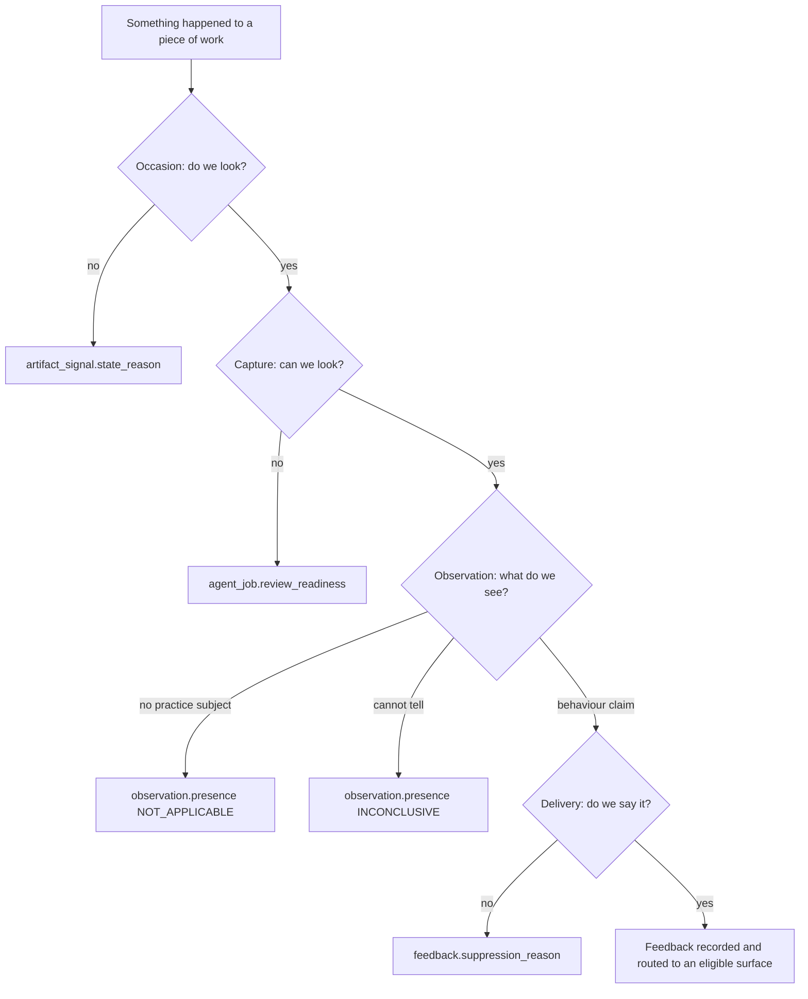
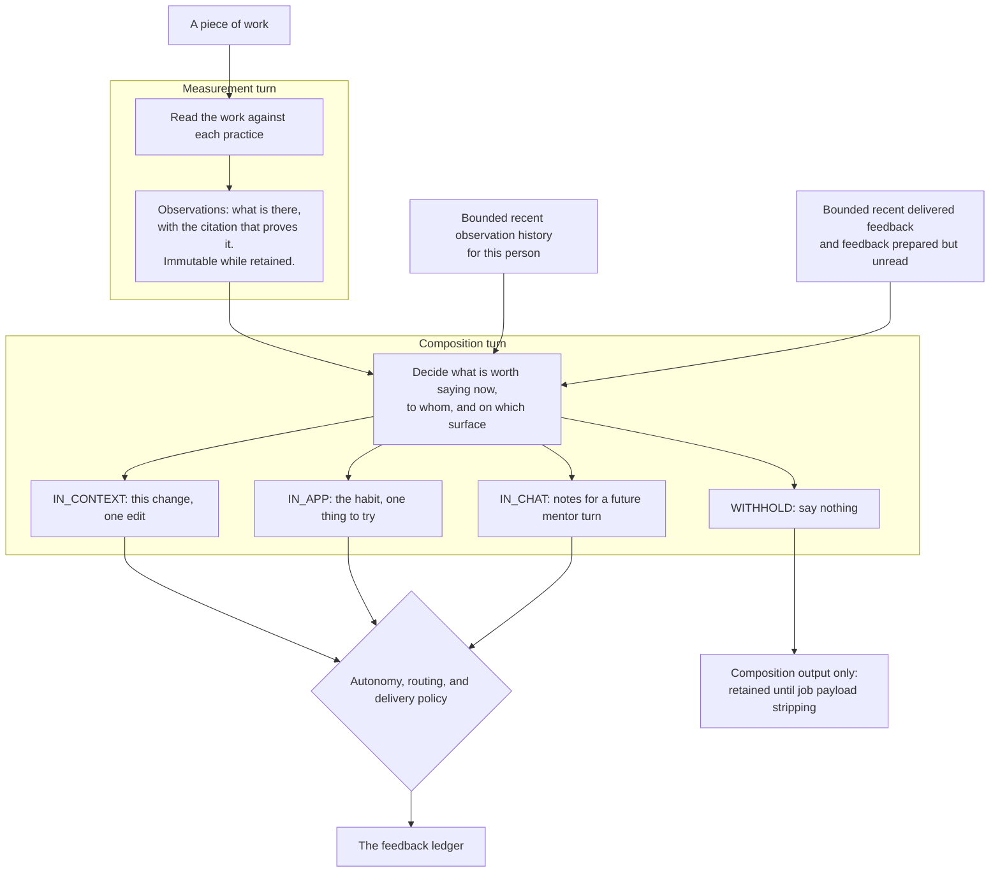

A practice review passes through four stages, in this order: **Occasion**, **Capture**, **Observation**,
**Delivery**. Each stage can stop independently and records a different reason.

Use the stage that stopped the review to decide what to fix. Do not translate one stage's reason into
another stage's vocabulary.

## Choose the page for your change

This page owns the runtime sequence and the seams between its stages. Start elsewhere when your change
belongs to one contract:

| You are changing                                                  | Start with                                                    |
| ----------------------------------------------------------------- | ------------------------------------------------------------- |
| A source, its capture states, retention, or permitted uses        | [Artifact-source contract](./artifact-source-contract.mdx)    |
| A practice's criteria, occasion, or evidence requirements         | [Practice catalogue](./practice-catalogue.md)                 |
| Observation or feedback persistence, identity, or API projections | [Practice review data model](./practice-feedback-schema.md)   |
| Product and model-facing terminology                              | [Practice feedback language](./practice-feedback-language.md) |
| Run provenance and evaluation joins                              | [Evaluation provenance](./evaluation-provenance.md)           |
| An exact enum meaning after you know the stage                    | [Practice review glossary](./practice-review-glossary.mdx)    |

Return here when a change crosses two stages. That boundary is usually where an apparently harmless
shortcut can turn a capture failure into a claim about someone's work, or a delivery choice into a missing
measurement.

## Where a review can stop

**Each stage owns exactly one refusal vocabulary, and they are not interchangeable.** Answering a question
from one stage in another stage's words is the failure this table exists to prevent.

| Stage       | Refusal vocabulary                                                           | Lands in                                                                   | Means                            |
| ----------- | ---------------------------------------------------------------------------- | -------------------------------------------------------------------------- | -------------------------------- |
| Occasion    | `SignalStateReason`                                                          | `artifact_signal.state_reason`                                             | We chose not to look, or not yet |
| Capture     | `SourceAbsenceReason` per source, `SourceReadinessReason` per practice check | `agent_job.evidence_snapshot` (the manifest), `agent_job.review_readiness` | We could not look                |
| Observation | `Presence.INCONCLUSIVE`                                                      | `observation.presence`                                                     | We looked and could not tell     |
| Delivery    | `FeedbackSuppressionReason`                                                  | `feedback.suppression_reason`                                              | We know, and chose to stay quiet |

The four are not ranked and do not substitute for one another. "We could not look" is deliberately not
representable as a `Presence` value, because a `Presence` is a claim about the developer's work and a
missing source is a fact about the instrument — which is exactly what lets the whole `observation` table be
read as behaviour. In the other direction, "we chose to stay quiet" must never be recorded as an absent
observation: requiring human approval is a release decision, and the measurement still happened.
When you add a reason code, the first question is which of these four columns it belongs in. If the honest
answer is "two of them", the reason is really two reasons.

## Occasion

An occasion is one named signal on one revision of one artifact. It is recorded in
`artifact_signal` before admission, so a review that does not start still has an auditable outcome.

`SignalState` has six values: `RECORDED` for an occurrence nobody has decided on yet, `DEFERRED` for one
queued in the [update coalescer](#durable-update-coalescing), `TRIGGERED` for one that started a review,
terminal `SUPPRESSED`, retryable `PENDING`, and retired `LAPSED`. Terminal rows never reopen — a coalesced
`SUPPRESSED` row is the one exception, moving to `DEFERRED` rather than reopening when a later live
transition repeats its content, because that content has never itself been decided on. Pending rows are
re-offered until their reason clears or their deadline passes. Retryability belongs to the reason, not to
the caller: each `SignalStateReason` declares the state it resolves to. Which reason to reach for, and the
two that are easy to confuse, are in
[Signal state reasons](./practice-review-glossary.mdx#signal-state-reasons); provenance mapping and UI
labels are in [How a review was occasioned](./practice-review-glossary.mdx#how-a-review-was-occasioned).
Operator remediation is in [When a workspace goes quiet](/admin/practice-review#when-a-workspace-goes-quiet).

A live GitHub or GitLab event whose work is tombstoned holds its occasion with
`ARTIFACT_NOT_VISIBLE` (`PENDING`) instead of starting a review, so the pending-signal reaper
re-offers it and an ordinary sync can restore reviewability without another webhook. The check reads
committed mirror state at admission; work deleted during capture or delivery belongs to that stage's
refusal policy.

The occurrence ledger has no pruning job; capacity planning must treat it as append-only. Retry and lapse
thresholds are documented in the admin guide.

### Issue lifecycle occasions

Issue practices bind to three lifecycle occasions:

| Occasion | Transition | Revision identity |
| --- | --- | --- |
| `scm.issue.opened` | The issue is created | Title and body |
| `scm.issue.updated` | The review-relevant snapshot changes, including reopening | The whole snapshot |
| `scm.issue.closed` | The issue enters a closed state | The close timestamp |

The snapshot is the title, body, native type, labels, assignees, milestone, state, and state reason — the
fields the issue evidence a bundled practice reads is built from. Labels and assignees are sorted while the
digest is built, so provider ordering does not change the revision.

Only `scm.issue.updated` keys on the whole snapshot. The other two deliberately do not, because a recurring
backfill sweep re-derives their keys from the artifact as it stands: an opening keys on the prose and a
close on the moment it closed, so triage between two sweeps moves neither and buys no second review.

Unlike a merged pull request, a closed issue is not in a state it cannot leave. Keying the close on its
timestamp keeps a redelivery of one close inert while making the close that follows a reopen a second
occasion, so the retrospective at-close review runs for each round of work rather than only the first.
Neither provider guarantees a close timestamp; a mirror row without one falls back to a single close
occasion, since there is then nothing to tell two closes apart.

Two consequences are worth stating because neither is obvious:

- **A return to a previously-seen snapshot occasions nothing.** Adding a label occasions a review, removing
  it occasions another, and adding it back matches a revision already in the ledger and occasions none.
  Reverse states are symmetric in what they raise, not in what they spend. A reopen is the exception: it
  moves the state field, so it occasions an update review, and the close after it occasions its own close
  review because that close is a different moment.
- **A burst of distinct intermediate snapshots is coalesced, not deduplicated by content alone.** Five
  triage actions on one issue arrive as five deliveries carrying five different snapshots; only the
  snapshot still current when the burst settles is submitted — see
  [Durable update coalescing](#durable-update-coalescing).

| Transition | GitHub webhook action | GitLab webhook action | Review decision |
| --- | --- | --- | --- |
| Title or body changed | `edited` | `update` | Updated |
| Native type set or removed | `typed`, `untyped` | Not exposed by the validated webhook contract | GitHub: updated; GitLab: synchronization only |
| Label added or removed | `labeled`, `unlabeled` | `update` | Updated |
| Assignee added or removed | `assigned`, `unassigned` | `update` | Updated |
| Milestone set or removed | `milestoned`, `demilestoned` | `update` | Updated |
| Reopened | `reopened` | `reopen` | Updated |
| Closed | `closed` | `close` | Closed |
| Locked, pinned, due date, weight, time tracking | `locked`, `pinned` | `update` | Nothing |

Both adapters report what a delivery moved as a field set, and an update that moves none of the snapshot's
fields occasions nothing: GitHub compares the mirrored row against the incoming one, and GitLab reads the
`changes` diff its `update` action carries, which is the only thing distinguishing a retitling from a
due-date, weight or time-tracking edit.

Synchronization updates the issue projection without creating lifecycle occasions. GitLab synchronization
includes native type, but its webhook contract does not provide a reliable type transition; the GitLab
adapter therefore does not advertise live type-change reviews. A type set on GitLab still reaches the
snapshot through the mirror, so it lands in the digest of whichever later `update` happens to fire.

Every practice bound to `scm.issue.updated` is reevaluated. Practice bindings declare occasions and evidence
sources, not dependencies on individual issue fields. Reevaluating the bounded issue evidence avoids
retaining observations whose inputs changed without introducing a second dependency model.

#### Durable update coalescing

`IssueAgentJobEventListener` records live updates in the mirror transaction. `IssueUpdateCoalescer` consumes
those `DEFERRED` rows on a locked, single-replica sweep in the server role. Sync-only rows are ineligible
until a live delivery promotes them. [Queue timing](/admin/practice-review-operations#issue-update-queue) is
based on newly queued snapshots, not every transition or provider timestamps.

Each artifact's queued rows are locked and eligibility is rechecked in the settlement transaction, which
also re-resolves the issue's workspace: a repository re-keyed to a different workspace inside the queue's
window (§ re-keying,
[ADR 0024](https://github.com/ls1intum/Hephaestus/blob/main/docs/decisions/0024-integration-sync-lifecycle-and-two-deletion-semantics.md))
settles as `SUPPRESSED / OUT_OF_REVIEW_SCOPE` rather than under the workspace that recorded it. Submission
and settlement commit together; a rollback leaves the occasions available. Locks cover the whole group
because [skipping individual locked rows](https://www.postgresql.org/docs/current/sql-select.html#SQL-FOR-UPDATE-SHARE)
could split a burst between consumers. Attempt timestamps order retries independently of eligibility,
so a repeatedly failing artifact does not monopolize a batch.

Only a revision matching the current mirror reaches admission. Displaced revisions become
`SUPPRESSED / COALESCED`, including updates overtaken by a close. Missing work lapses; tombstoned work
is held as `PENDING / ARTIFACT_NOT_VISIBLE`. Pending retries also compare revisions before admission.
See [Signal state reasons](./practice-review-glossary.mdx#signal-state-reasons) for retry semantics.

Issue-update jobs retain the admitted revision. Capture compares it against the issue's canonical digest and
reports the source unavailable (`SourceAbsenceReason.NOT_FOUND`) on a missing or mismatched revision, rather
than making an observation about the developer. This check does not fence edits after capture or invalidate
earlier observations and feedback.

## Capture

Capture stages **every source the contract says applies to the artifact kind under review** — all of them,
every time. Practice bindings decide which practices may run, never which files reach the sandbox; there is
no per-run source selection. What a capture then reports about each source (available, not collected,
unavailable, redacted, errored — with a typed reason) and how a practice's stances turn those reports into
a readiness decision is the whole subject of the
[artifact-source contract](./artifact-source-contract.mdx), which is versioned and validated at startup.

Do not restate that contract here. The one fact this page owns is where the readiness verdict lands:
`agent_job.review_readiness`, its own `jsonb` column, split out from `evidence_snapshot` because a snapshot
carries one entry per staged file and a TOASTed `jsonb` has no partial read.

## Observation

An observation is one practice's answer about one piece of work, written once and immutable. It carries a
`Presence` — `PRESENT`, `ABSENT`, `NOT_APPLICABLE` or `INCONCLUSIVE` — and, only when the presence carries
valence, an assessment. Admission removes assessment from an `INCONCLUSIVE` observation, so a detector that
hedges cannot attach an unearned strength to the series.

The glossary defines what each presence claims and what `NOT_APPLICABLE` has to carry to be allowed to claim
it — see [Outcome states](./practice-review-glossary.mdx#outcome-states). Two facts belong to this stage
rather than to that vocabulary. `INCONCLUSIVE` is not "we could not look": a missing, errored or
governance-blocked source produces a readiness decision in the Capture stage and **no observation at all**.
And the `NOT_APPLICABLE` grounding rule is enforced twice, in the in-sandbox normalizer and again at
server-side delivery, for the same reason the citation and recorded-search rules are — the sandbox guard runs
inside the thing it is checking.

Identity is assigned at persistence, not by the detector: an occurrence key dedupes within a run
(`insertIfAbsent`, `ON CONFLICT DO NOTHING`), and a recurrence key hashes the locus so the same observation
is recognisable across runs.

**An observation carries `evidenceRationale` and no advice.** `evidenceRationale` is the measurement's own
justification — *"the change adds a tax-exempt branch, and no test file in this diff calls `total`"* —
and it is the only prose the observation carries anywhere. The detector emits no next step: there is no
`guidance` field on the tool, on the parsed observation, or on the ledger. Advice is a property of a
*delivery* (ADR 0021, ADR 0022), and the stage that decides deliveries is the subject of the next
section.

## Measurement and intervention

Everything above this line is the system taking a reading. Everything below it is the system deciding
to say something to a person. Those are separate turns in one agent session. An authenticated server callback admits the observations
between them, so composition retains context but can use only the persisted projection. Keeping that boundary
is why one fact can read three different ways.

**A measurement is falsifiable.** *"This change adds a tax-exempt branch, and nothing in the change
tests it"* is either true or false, and you check it by opening the file. It says nothing about what
anybody should do, and it remains unedited for as long as it is retained, so later readings can
be compared with it.

**An intervention must stay grounded, but grounding alone does not make it useful.** *"Write the assertion
that distinguishes the new branch before you write the branch"* can be supported by the observation and
still be badly timed, repetitive, or irrelevant to the recipient. Composition therefore considers the
audience, surface, history, and current conversation as well as the evidence.

The line the code draws, stated once so it fits in a prompt: **if you can check it by reading the
artifact, it is measurement; if you can only check it by watching what the person does next, it is
intervention.**

They are separated because the good version of each ruins the other. A measurement authored as advice
starts bending toward whatever makes good advice — the observation you can write a nice tip about gets
reported, the one you cannot gets quietly dropped. It also bends toward *fault*, because a next step
presupposes something to step away from: the three answers that assert nothing is wrong (a strength, a
practice with no subject here, a question the evidence left open) are the ones that suffer for it. And advice written at the moment of measurement can
only ever be about the one thing just measured: it cannot know that this is the third time, it cannot
know the developer was already told, and it cannot decide to stay quiet.

Note where the arrows converge. **The model proposes; the server admits.** Origin, effective autonomy,
channel-specific routing, placement checks, and per-lane caps still apply after composition. Giving the
model more context is not a reason to relax these gates; it gives them more proposals to assess.

### Composition inputs and outputs

After Java admits observations, the runner resumes the same model session with the composition prompt. The
measurement tool is closed, and feedback may bind only to the durable observations returned by admission.
The resumed session retains artifact context without weakening the server boundary.

The composer receives the current admitted observations, bounded recent observation and feedback history,
unread prepared feedback, per-locus deltas, practice definitions, and the enabled lanes with their limits.
The exact files belong to the [agent workspace ABI](agent/workspace-abi.mdx), not this guide.

Three constraints shape how that context may be used:

- Only pull-request and issue handlers enable composition, and not for backfills. Document and conversation
  reviews record observations but compose no feedback.
- History is bounded and therefore supports recurrence claims, never claims that something has *never*
  happened before.
- Deltas describe a locus on one artifact as `NEW`, `RECURRING`, `UNCHANGED`, or `RESOLVED`. Cross-artifact
  habits require distinct-artifact evidence from history; an unobserved prior strength is not `RESOLVED`.

Accepted tool calls update the composition output incrementally. The server parses proposed units and applies
all delivery gates; the model never writes the feedback ledger directly.

### Channels are distinct interventions

The channel contract is defined in the
[practice review glossary](./practice-review-glossary.mdx#the-three-channels-are-three-levels). The
composition turn must not render one advice string three ways:

- `IN_CONTEXT` is public task-level feedback about the current work. It binds to a current admitted
  observation and uses either server-resolved `DIFF` placement or artifact-level placement. History alone
  cannot support a public claim.
- `IN_APP` is private process-level feedback about a pattern across several pieces of the recipient's work.
- `IN_CHAT` is private context for a later mentor turn. It prepares `situation`, `capability`,
  `evidenceSummary`, and `inConversationSignal` as notes, not dialogue. The mentor receives the original
  evidence and live conversation, then may adapt, defer, or discard the note.

An issue has no diff and therefore permits only artifact-level in-context placement. Pull requests permit
both placements. Per-lane limits are supplied in composition configuration, not fixed in this guide.

### What the composer is not allowed to do

The tool schema and server admission refuse the same four things. Validation exists on both sides of the
sandbox boundary because a guard the constrained party can skip is advice, not a boundary. An invalid unit
is dropped and logged without failing the completed measurement.

- **No verdict fields.** `report_feedback` takes no presence, assessment, severity or confidence. An
  intervention that could carry a verdict would eventually be read back as one.
- **No model-authored path or line number.** `placement.kind: "DIFF"` names an admitted
  `{ observationId, citationIndex }`, and the server resolves the file, side, and line from that
  observation's citation. `placement.kind: "ARTIFACT"` carries no coordinates and stays in the summary.
  Both forms require a current admitted observation of the same practice.
- **No invented supersession target.** `action: "SUPERSEDE"` must name a `threadKey` that was staged in
  `prepared.json`.
- **No second unit on the same lane about the same practice.** One unit per `(channel,
practiceSlug)`; the rest are dropped.

Staying quiet is the fourth action, not a gap: `action: "WITHHOLD"` with `NO_MATERIAL_CHANGE`,
`ALREADY_SAID` or `BELOW_BAR`. Those three are the composer's own vocabulary and are deliberately not
`FeedbackSuppressionReason` values — the glossary says
[why the two must never be merged](./practice-review-glossary.mdx#measurement-and-intervention).

Supersession is likewise the glossary's, under
[Thread key and supersession](./practice-review-glossary.mdx#thread-key-and-supersession). The only part
this stage owns is that composition proposes the thread action; the server, not the model, decides whether
the named thread may be superseded at all.

### When composition does not run

A composition failure does not invalidate admitted observations. An empty result is distinct from a turn
that never ran. In-context feedback may fall back to the observation's `evidenceRationale` and the
practice's `whyItMatters`, but invents no next step. Longitudinal lanes have no content fallback; per-lane
preparation marks let a sweeper retry only turns that did not run.

## Delivery and human approval

Composition creates immutable feedback units before release authority is applied. A composer `WITHHOLD`
means there was nothing useful to say and creates no feedback row. A policy refusal is instead persisted as
`SUPPRESSED` with a server-owned reason. These outcomes must not be conflated with a human rejection.

Autonomy is only the authority step, and the glossary owns it in full — the resolution chain and the three
values in [Practice autonomy](./practice-review-glossary.mdx#practice-autonomy), the approval lifecycle
alongside them, and the ordered list of gates every delivery walks in
[the delivery policy check order](./practice-review-glossary.mdx#the-delivery-policy-check-order). Read
those before changing anything here, and do not restate them.

One fact belongs to this stage rather than to that vocabulary: **`PracticeAutonomyPolicy` is a second,
narrower predicate, and each channel's router applies it itself.** It admits a unit only when the
observation's immutable `ObservationOrigin` entitles it to that channel *and* the effective autonomy is
`AUTOMATIC`. That is why a backfilled observation can never reach the artifact or a mentor turn whatever
anybody configures: the entitlement is a property of how the measurement was obtained, not of what the
workspace currently permits. The two halves answer different questions — origin asks what a provenance may
*ever* be said on, and `DeliveryPolicyResolver` asks whether today is the day.

## Runtime and extension points

The server records an occasion and enqueues an `agent_job`; a worker claims it, captures evidence, runs the
sandbox, admits observations, resumes composition, applies delivery gates, and calls the provider. Runtime
roles, transaction boundaries, extension ownership, and change guidance are documented in
[Practice review runtime](./practice-review-runtime.mdx).

## Reading a real review back

`PracticeTraceEntryDTO` is the derived answer to "what did every practice make of this piece of work", and
it is what the **Review activity** screen renders for every member. It is derived, never stored:
`PracticeTraceDeriver` walks an ordered precedence list to a single `PracticeTraceOutcome`.

The trace separates two axes on purpose, and reading it wrongly is the fastest way to misdiagnose a quiet
workspace:

- **`outcome` is about the measurement**, and is one of these values: `REVIEWED`, `RUNNING`,
  `PENDING`, `SKIPPED`, `NOT_ASSESSABLE`, `TURNED_OFF`, `NOT_OCCASIONED`, `DORMANT`, `LAPSED`, `FAILED`.
- **`observationCount`, `deliveredCount` and `withheldReasons` are about the intervention.**

At `HUMAN_APPROVAL`, `REVIEWED` and a positive observation count describe the measurement; the proposal's
`AWAITING_APPROVAL`, `PREPARED`, `DISCARDED`, or eventual `DELIVERED` state describes the intervention. Do
not represent a pending human decision as suppression: it is an actionable workflow state.

The precedence rule is not "configuration beats mechanics" — it is **what a run recorded beats what today's
configuration implies.** A verdict a run wrote against this practice by name (`REVIEWED`, `SKIPPED`,
`NOT_ASSESSABLE`) is returned even after the practice is switched off, because it happened. `TURNED_OFF`
comes next, and therefore outranks everything merely re-derived from the occurrence ledger — `FAILED`,
`LAPSED`, `PENDING` — so a practice the workspace switched off reads as switched off rather than as broken.
A new outcome has to be placed on the right side of that line, not ranked against the others by severity.

Operator-facing guidance for reading the same screen is on
[Practice review](/admin/practice-review); the vocabulary both pages use is defined in the
[practice review glossary](practice-review-glossary.mdx). Persistence concepts and evaluation joins are in
[Practice review data model](practice-feedback-schema.md) and
[Evaluation provenance](evaluation-provenance.md).
