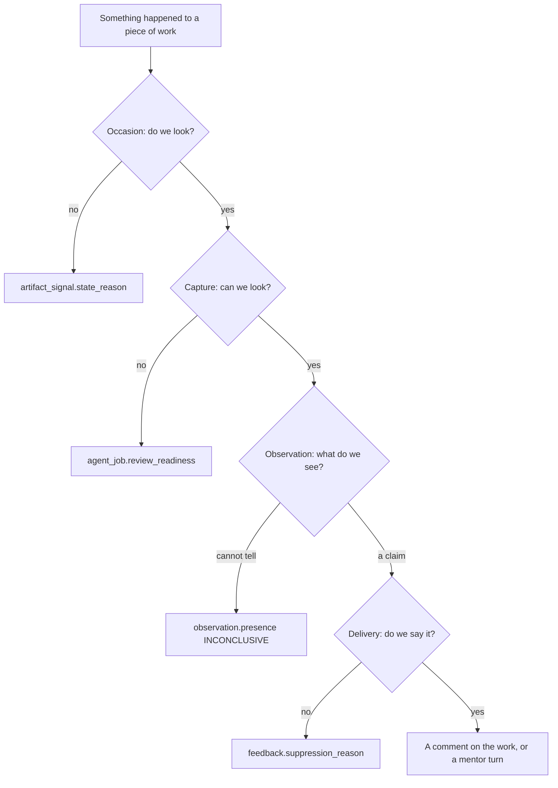
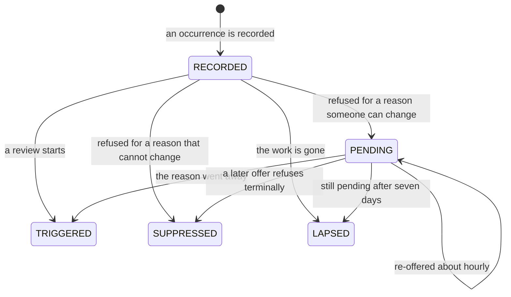
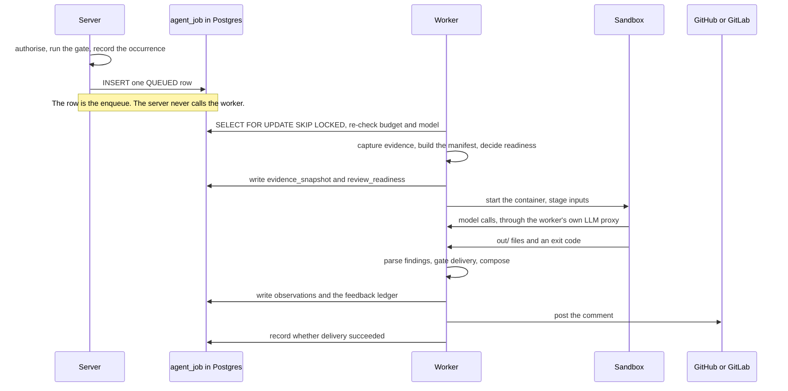

A practice review passes through four stages, in this order: **Occasion**, **Capture**, **Observation**,
**Delivery**. Each is a first-class noun in the code — `NOT_OCCASIONED` and `occasionedBy`,
`SourceCaptureState` and `capturedAt`, `Observation` and `ObservationOrigin`, `DeliveryComposer` and
`FeedbackChannel` — and each one can end the review on its own terms.

Read that as a funnel with four exits, not a pipe with one. Most reviews that produce nothing exited
somewhere above the last box, and which box it was is the only thing that tells you what to fix.

:::note "Act 1–4" is not the name of anything
Design conversations around this pipeline used "Act 1" through "Act 4" as shorthand. Do not carry it into
code, commits, or docs: it means nothing to a reader who was not in the room, cannot be grepped for, and
invites a fifth act. The stages are Occasion, Capture, Observation, Delivery.
:::

## Refusal is the point

The most consequential mistake this codebase has made, repeatedly, is answering a question from one stage
with a vocabulary from another. **Each stage owns exactly one refusal vocabulary, and they are not
interchangeable.**

| Stage | Refusal vocabulary | Lands in | Means |
| --- | --- | --- | --- |
| Occasion | `SignalStateReason` | `artifact_signal.state_reason` | We chose not to look, or not yet |
| Capture | `SourceAbsenceReason` per source, `SourceReadinessReason` per practice check | `agent_job.evidence_snapshot` (the manifest), `agent_job.review_readiness` | We could not look |
| Observation | `Presence.INCONCLUSIVE` | `observation.presence` | We looked and could not tell |
| Delivery | `FeedbackSuppressionReason` | `feedback.suppression_reason` | We know, and chose to stay quiet |

The four are not ranked and do not substitute for one another. "We could not look" is deliberately not
representable as a `Presence` value, because a `Presence` is a claim about the developer's work and a
missing source is a fact about the instrument — which is exactly what lets the whole `observation` table be
read as behaviour. In the other direction, "we chose to stay quiet" must never be recorded as an absent
observation: a tier turned down is a delivery decision, and the measurement it withholds still happened.
When you add a reason code, the first question is which of these four columns it belongs in. If the honest
answer is "two of them", the reason is really two reasons.

## Occasion

An occasion is an *occurrence* — one named signal on one revision of one artifact — recorded in
`artifact_signal` before any decision is taken about it. Recording first is what makes silence auditable:
every review that did not happen has a row saying so.

`TRIGGERED`, `SUPPRESSED` and `LAPSED` are terminal — every ledger update is guarded on
`state IN ('RECORDED','PENDING')`, so nothing walks a decided row back. `PENDING` is the only state that
costs anything later: `PendingSignalReaper` re-offers it and `PendingSignalResubmitter` runs the gate
again.

Which state a refusal produces is a property of the reason, not of the caller —
`SignalStateReason.resultingState()` decides, and `isRetryable()` is defined as
`resultingState() == PENDING`. That is why the tables below are the reason's own classification and not a
policy applied on top of it.

**Terminal — refused, never re-offered.** The fact that caused the refusal cannot change for this
occurrence.

| Reason | Why it can never come out differently |
| --- | --- |
| `GATE_SKIPPED` | A workspace review gate turned it away |
| `COOLDOWN_ACTIVE` | This work was reviewed too recently; a later occurrence gets its own row |
| `REQUEST_COOLDOWN_ACTIVE` | A review of this was asked for moments ago |
| `REQUESTER_QUOTA_EXHAUSTED` | The asker's hourly allowance is spent; asking again is a new occurrence |
| `CONCURRENT_DUPLICATE` | The same review was already running |
| `OUT_OF_REVIEW_SCOPE` | The branch a merge request targeted will not change |

**Retryable — parked as `PENDING`, re-offered until it lapses.** Somebody can lift these without the
artifact changing.

Most of them also carry a destination. `webapp/src/components/practice-trace/trace-format.ts` maps a
reason to the screen that undoes it, and the trace renders that as a link — but only for a reader who may
open workspace administration, since every member of a workspace can read a trace. A reason with no entry
in that map renders as a sentence and nothing more, which is the correct answer for the self-healing and
terminal ones below: sending somebody to a settings page that cannot affect what they just read is how a
limit gets widened to fix a non-fault.

| Reason | What lifts it | Where the trace links |
| --- | --- | --- |
| `WORKSPACE_INACTIVE` | The workspace becomes active again | — no screen reactivates a workspace; the status endpoint has no UI |
| `PRACTICES_DISABLED` | An admin starts practice reviews | Practices → Review → *When and where* |
| `NO_ACTIVE_PRACTICE` | A practice covering this kind of work is installed | Practices → Practice setup |
| `REVIEW_MODEL_UNBOUND` | An admin binds a model for practice review | Administration → AI models |
| `PRACTICE_TIER_OFF` | An admin raises a watching practice above `OFF` — at the practice, its area, or the workspace default | Practices → Review → *How much* |
| `BUDGET_EXHAUSTED` | The cap is raised, or the month rolls over | Administration → AI usage |
| `SUBJECT_UNLINKED` | The author links a Hephaestus account | — the author's own account page, which an admin cannot open for them |
| `MODEL_UNAVAILABLE` | The bound model or its connection becomes usable | Administration → AI models |

**Retired — terminal, but not a decision.** These close a row nobody will come back to.

| Reason | Meaning |
| --- | --- |
| `PENDING_DEADLINE_EXCEEDED` | Re-offered for seven days and never admitted |
| `ARTIFACT_GONE` | The work no longer exists |

Two properties of this ledger you have to know before you reason about volume. A `PENDING` row is retried
on a cadence (`hephaestus.signal-ledger.pending-retry-after`, default one hour) until
`pending-lapse-after` (default seven days) retires it — so a workspace left mis-configured accumulates
re-offer work for a week and then goes quiet again with no further signal. And **nothing ever deletes from
`artifact_signal`**: there is no pruning job for any state, `LAPSED` included. That is deliberate — the
table is the record of what we did not do — but it means the table only grows.

`SignalStateReason.describe()` is exhaustive over every constant and returns one reader-facing sentence
each. Both the API and the webapp print it; when you add a constant, the compiler will make you write that
sentence.

### Provenance, and the collapse

Every occurrence also records **how we came to know about it** — `DiscoveredVia` — which is a free health
measurement rather than a routing decision. `SignalOrigins` maps it once onto `ObservationOrigin`, which is
what later reads use to keep populations apart:

| `DiscoveredVia` | `ObservationOrigin` | Notes |
| --- | --- | --- |
| `EVENT` | `LIVE` | A provider told us as it happened |
| `SYNC` | `LIVE` | Found while reconciling; see the caveat below |
| `MANUAL` | `MANUAL` | A human asked. Self-selected, so never a trend against `LIVE` |
| `BACKFILL` | `BACKFILL` | A confirmed campaign over work that already existed |
| `SWEEP` | `LIVE` | A recurring schedule looking again at recent work |

Five constants, but they do not line up one-to-one with the doors an operator sees, and assuming they do
is a mistake the enum will not stop you making:

- **Three doors collapse into `MANUAL`.** `ManualReviewRequests` is the single recording site for both the
  `/hephaestus review` comment command (via `BotCommandProcessor`) and the *Review this now* button (via
  `PracticeReviewRequestController`); `DevTriggerController` is a third, gated on
  `hephaestus.dev.trigger-enabled`. Provenance cannot tell you which one was used.
- **`SYNC` is a dead end for connected project work.** `AgentJobEventListener` and
  `IssueAgentJobEventListener` both return immediately when the context is a sync, leaving the row
  `RECORDED` and undecided. The one exception is `ConversationThreadTriggerScheduler`, which records
  `SYNC` and then submits — Slack thread reviews are occasioned this way. Write "reconciliation never
  starts a review" only about pull requests and issues.

## Capture

Capture stages **every source the contract says applies to the artifact kind under review** — all of them,
every time. Practice bindings decide which practices may run, never which files reach the sandbox; there is
no per-run source selection. What a capture then reports about each source (available, not collected,
unavailable, redacted, errored — with a typed reason) and how a practice's stances turn those reports into
a readiness decision is the whole subject of the
[artifact-source contract](./artifact-source-contract.mdx), which is versioned and validated at startup.

Do not restate that contract here. The one fact this page owns is where the readiness verdict lands:
`agent_job.review_readiness`, its own `jsonb` column, split out from `evidence_snapshot` because a snapshot
carries one entry per staged file and a TOASTed `jsonb` has no partial read.

## Observation

An observation is one practice's answer about one piece of work, written once and immutable. It carries a
`Presence` — `PRESENT`, `ABSENT`, `NOT_APPLICABLE` or `INCONCLUSIVE` — and, only when the presence carries
valence, an assessment. `PracticeDetectionResultParser` force-nulls the assessment on an `INCONCLUSIVE`
observation, so a detector that hedges and still attaches a strength cannot slip an unearned one into the
series.

`INCONCLUSIVE` means the evidence the practice needs *was* present and *was* read and does not settle the
question. It is not "we could not look" — a missing, errored or governance-blocked source produces a
readiness decision and **no observation at all**.

The two valence-free presences are held to different costs on purpose. `NOT_APPLICABLE` is a claim about the
work, so it must carry `evidence.inapplicability`: the sources read, what the practice looks for, and the
fact about *this* change that rules it out. Without that it was the cheapest answer available — its citation
proves nothing, unlike `PRESENT`'s — and uncertainty drained into it, which writes "nothing to see" into a
person's record on a change where there was something to see. The rule is enforced twice, in the in-sandbox
normalizer and again at server-side delivery, for the same reason the citation and recorded-search rules are:
the sandbox guard runs inside the thing it is checking.

Identity is assigned at persistence, not by the detector: an occurrence key dedupes within a run
(`insertIfAbsent`, `ON CONFLICT DO NOTHING`), and a recurrence key hashes the locus so the same observation
is recognisable across runs.

**Guidance is authored inline by the detector, and Delivery is not where wording is decided.**
`DeliveryComposer`'s own contract says so: *"The `reasoning` and `guidance` on a finding are written by the
detector, not by this class; this renderer only sanitises and lays them out."* The composer reads
`guidance()` and never writes one. There is exactly one delivery-time-authored layer — the catalogue's
transferable principle (`Practice.whyItMatters`), which the server supplies verbatim precisely because the
model is told not to write it and so cannot fabricate or drift it. If feedback reads badly, the prompt and
the catalogue are where you look; the composer will not save you.

## Delivery

Delivery turns admitted observations into feedback and records what happened to it, including when nothing was
sent. A withheld observation is written to the ledger as `SUPPRESSED` with a reason rather than dropped, so "we
saw it and chose to stay quiet" reads differently from "we missed it" in every later evaluation.

Three gates decide admission, and they are ANDed. `FeedbackAdmission.delivers(origin, tier, reach, channel)`
is the single place they meet, so a new channel, tier, reach or origin has one place to be reasoned about:

- **`PracticeReviewTier`** — how much autonomy the system has over this practice: `OFF`, `PROPOSE`,
  `DELIVER`. Only `DELIVER` delivers. `PROPOSE` runs the review and records every observation, and those
  observations are dropped before a body is composed, so nothing is sent and nothing is stored to send later.
  The tier is the **effective** one, resolved practice → area → workspace, because either of the first two
  levels may hold no opinion. Withheld here means `PRACTICE_TIER_QUIET`.
- **`FeedbackReach`** — where this workspace lets feedback go at all: `CONVERSATION`, or `ON_THE_WORK`
  which adds the artifact. One setting per workspace, not per practice. Withheld here also means
  `PRACTICE_TIER_QUIET` — from the recipient's side it is the same fact, that the workspace chose to stay
  quiet here.
- **`ObservationOrigin`** — `LIVE` and `MANUAL` deliver everywhere; `BACKFILL` is entitled only to
  `PROFILE`. Withheld here means `BACKFILL_QUIET`.

`FeedbackChannel.PROFILE` is **declared and unwritten**: nothing in the application produces a `PROFILE`
unit, and an ArchUnit rule (`ProfileChannelUnwrittenArchTest`) keeps it that way by allowlisting the three
classes permitted to name the constant. The consequence is the one worth remembering: a backfill
observation is entitled only to a channel with no producer, so it is measured and never delivered — by
construction, not by configuration. `BACKFILL_QUIET` is deliberately distinct from `PRACTICE_TIER_QUIET`
because a tier is a dial an admin can turn and this one lifts only when a profile surface ships.

The full suppression vocabulary lives on `FeedbackSuppressionReason`, which also carries one deprecated
constant (`ARTIFACT_DRAFT`) kept only so old rows still read back.

## Who does what, and where

The most counter-intuitive facts about this system are all about *where* code runs, and none of them are
visible from the class names.

- **The `agent_job` table is the queue.** There is no broker between server and worker. Submission is one
  row insert; `handler.createSubmission` is explicitly the lightweight path and extracts metadata and an
  idempotency key only. NATS is upstream of all of this, carrying webhook ingress, and is not part of the
  review path.
- **Evidence capture runs on the claiming worker, not on the server.** `handler.prepareInputs` — and
  therefore `WorkspaceContextBuilder` and `ContextManifestBuilder` — is called from `AgentJobExecutor`
  after the claim. The beans themselves carry no runtime-role condition; it is the *call chain* that is
  worker-exclusive. The operational consequence is easy to miss: **the worker reads the repository clone
  from its own disk**, so a worker without checkout enabled and without the fabric volume captures a
  degraded tree and says so in the manifest.
- **`evidence_snapshot` and `review_readiness` are written before the container starts**, in their own
  transaction, and a failed write fails the run before any model cost accrues. The result is a separate,
  later transaction.
- **The worker posts the comment.** The whole tail — parse, persist observations, compose, call the
  provider — runs inside `handler.deliver` on the worker's sandbox-executor thread.
- **Control never returns to the server between claim and completion.** The only server-to-worker push is
  the hub WebSocket, and it carries cancellation and drain, not work.

## Extension points

Artifact-specific handlers assemble context and delivery constraints — `PullRequestReviewHandler`,
`IssueReviewHandler`, `ConversationReviewHandler` — and all of them share one practice-agent runtime and
one observations model. Provider adapters own provider identifiers, diff and comment APIs, and conversation
storage; the practices module owns practice definitions, observations, and the feedback ledger.

The durable boundaries, which the implementation may reschedule freely behind:

- **Admission** — `PracticeReviewDetectionGate` decides whether an occurrence may enqueue work.
- **Queue and execution** — `agent_job`, described by
  [ADR 0025](https://github.com/ls1intum/Hephaestus/blob/main/docs/decisions/0025-agent-job-queue-on-postgresql.md).
- **Workspace ABI** — the sandbox receives read-only `inputs/`, disposable `work/`, and returns only
  `out/`. [Agent workspace ABI](agent/workspace-abi.mdx) is the source of truth for paths and exit codes.
- **Observations** — the agent reports through `report_finding` (the sandbox contract keeps the older word);
  `PracticeDetectionResultParser` validates and never throws, and persistence assigns occurrence and
  recurrence identity.
- **Feedback** — server-side composition, with every attempt, withholding, replacement and placement
  recorded in the ledger.

When changing sandbox inputs or outputs: update the owning runtime type or parser first; update the ABI
page only for a durable ABI change; add a behavioural test at the narrowest owning boundary; regenerate
OpenAPI and the web client when the HTTP contract changes. To extend the bundled catalogue, follow
[Practice catalogue curation](practice-catalogue.md).

Avoid copying file trees, enum inventories, defaults, or database columns into this guide. Those details
are owned by executable types, Liquibase, the generated database schema, and OpenAPI.

## Reading a real review back

`PracticeTraceEntryDTO` is the derived answer to "what did every practice make of this piece of work", and
it is what the **Review activity** screen renders for every member. It is derived, never stored:
`PracticeTraceDeriver` walks an ordered precedence list to a single `PracticeTraceOutcome`.

The trace separates two axes on purpose, and reading it wrongly is the fastest way to misdiagnose a quiet
workspace:

- **`outcome` is about the measurement.** `REVIEWED`, `NOT_OCCASIONED`, `TURNED_OFF`, `NOT_ASSESSABLE`,
  `DORMANT`, `LAPSED`, and so on.
- **`observationCount`, `deliveredCount` and `withheldReasons` are about the intervention.**

So a practice at `PROPOSE` is `REVIEWED` with `observationCount > 0`, `deliveredCount = 0` and
`PRACTICE_TIER_QUIET` in `withheldReasons` — measured, and deliberately quiet. That trio is how a held
observation reaches a reader at all; the `SUPPRESSED` ledger row behind it is storage, not a screen.
`TURNED_OFF` is the workspace's own choice and is checked *before* any mechanical
reason, so it never masks one. It is not called `SILENCED`: silence is what `PROPOSE` does, and
`PRACTICE_TIER_QUIET` already covers it.

Operator-facing guidance for reading the same screen is on
[Practice review](/admin/practice-review); the vocabulary both pages use is defined in the
[practice review glossary](practice-review-glossary.mdx). Persistence concepts and evaluation joins are in
[Practice review data model](practice-feedback-schema.md) and
[Evaluation provenance](evaluation-provenance.md).
