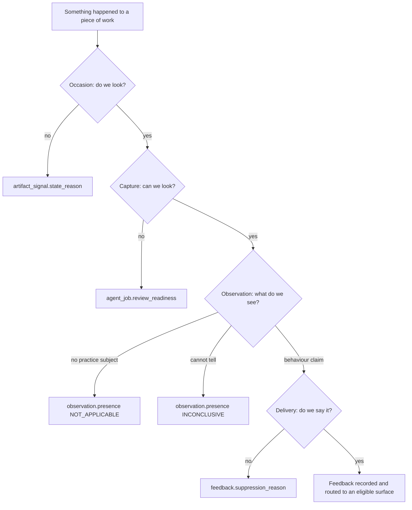
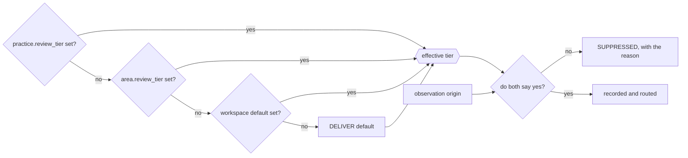

A practice review passes through four stages, in this order: **Occasion**, **Capture**, **Observation**,
**Delivery**. Each stage can stop independently and records a different reason.

Use the stage that stopped the review to decide what to fix. Do not translate one stage's reason into
another stage's vocabulary.

## Choose the page for your change

This page owns the runtime sequence and the seams between its stages. Start elsewhere when your change
belongs to one contract:

| You are changing | Start with |
| --- | --- |
| A source, its capture states, retention, or permitted uses | [Artifact-source contract](./artifact-source-contract.mdx) |
| A practice's criteria, occasion, or evidence requirements | [Practice catalogue](./practice-catalogue.md) |
| Observation or feedback persistence, identity, or API projections | [Practice review data model](./practice-feedback-schema.md) |
| Product and model-facing terminology | [Practice feedback language](./practice-feedback-language.md) |
| Evaluation joins, claim currentness, or stale results | [Evaluation provenance](./evaluation-provenance.md) |
| An exact enum meaning after you know the stage | [Practice review glossary](./practice-review-glossary.mdx) |

Return here when a change crosses two stages. That boundary is usually where an apparently harmless
shortcut can turn a capture failure into a claim about someone's work, or a delivery choice into a missing
measurement.

## Where a review can stop

**Each stage owns exactly one refusal vocabulary, and they are not interchangeable.** Answering a question
from one stage in another stage's words is the failure this table exists to prevent.

| Stage       | Refusal vocabulary                                                           | Lands in                                                                   | Means                            |
| ----------- | ---------------------------------------------------------------------------- | -------------------------------------------------------------------------- | -------------------------------- |
| Occasion    | `SignalStateReason`                                                          | `artifact_signal.state_reason`                                             | We chose not to look, or not yet |
| Capture     | `SourceAbsenceReason` per source, `SourceReadinessReason` per practice check | `agent_job.evidence_snapshot` (the manifest), `agent_job.review_readiness` | We could not look                |
| Observation | `Presence.INCONCLUSIVE`                                                      | `observation.presence`                                                     | We looked and could not tell     |
| Delivery    | `FeedbackSuppressionReason`                                                  | `feedback.suppression_reason`                                              | We know, and chose to stay quiet |

The four are not ranked and do not substitute for one another. "We could not look" is deliberately not
representable as a `Presence` value, because a `Presence` is a claim about the developer's work and a
missing source is a fact about the instrument — which is exactly what lets the whole `observation` table be
read as behaviour. In the other direction, "we chose to stay quiet" must never be recorded as an absent
observation: a tier turned down is a delivery decision, and the measurement it withholds still happened.
When you add a reason code, the first question is which of these four columns it belongs in. If the honest
answer is "two of them", the reason is really two reasons.

## Occasion

An occasion is one named signal on one revision of one artifact. It is recorded in
`artifact_signal` before admission, so a review that does not start still has an auditable outcome.

The ledger distinguishes `TRIGGERED`, terminal `SUPPRESSED`, retryable `PENDING`, and retired `LAPSED`
rows. Terminal rows never reopen; pending rows are re-offered until their reason clears or their deadline
passes. Retryability belongs to the reason, not to the caller. The canonical reason list, provenance mapping,
and UI labels are in [How a review was occasioned](./practice-review-glossary.mdx#how-a-review-was-occasioned).
Operator remediation is in [When a workspace goes quiet](/admin/practice-review#when-a-workspace-goes-quiet).

The occurrence ledger has no pruning job; capacity planning must treat it as append-only. Retry and lapse
thresholds are documented in the admin guide.

## Capture

Capture stages **every source the contract says applies to the artifact kind under review** — all of them,
every time. Practice bindings decide which practices may run, never which files reach the sandbox; there is
no per-run source selection. What a capture then reports about each source (available, not collected,
unavailable, redacted, errored — with a typed reason) and how a practice's stances turn those reports into
a readiness decision is the whole subject of the
[artifact-source contract](./artifact-source-contract.mdx), which is versioned and validated at startup.

Do not restate that contract here. The one fact this page owns is where the readiness verdict lands:
`agent_job.review_readiness`, its own `jsonb` column, split out from `evidence_snapshot` because a snapshot
carries one entry per staged file and a TOASTed `jsonb` has no partial read.

## Observation

An observation is one practice's answer about one piece of work, written once and immutable. It carries a
`Presence` — `PRESENT`, `ABSENT`, `NOT_APPLICABLE` or `INCONCLUSIVE` — and, only when the presence carries
valence, an assessment. `PracticeDetectionResultParser` force-nulls the assessment on an `INCONCLUSIVE`
observation, so a detector that hedges and still attaches a strength cannot slip an unearned one into the
series.

The glossary defines what each presence claims and what `NOT_APPLICABLE` has to carry to be allowed to claim
it — see [Outcome states](./practice-review-glossary.mdx#outcome-states). Two facts belong to this stage
rather than to that vocabulary. `INCONCLUSIVE` is not "we could not look": a missing, errored or
governance-blocked source produces a readiness decision in the Capture stage and **no observation at all**.
And the `NOT_APPLICABLE` grounding rule is enforced twice, in the in-sandbox normalizer and again at
server-side delivery, for the same reason the citation and recorded-search rules are — the sandbox guard runs
inside the thing it is checking.

Identity is assigned at persistence, not by the detector: an occurrence key dedupes within a run
(`insertIfAbsent`, `ON CONFLICT DO NOTHING`), and a recurrence key hashes the locus so the same observation
is recognisable across runs.

**An observation carries `evidenceRationale` and no advice.** `evidenceRationale` is the measurement's own
justification — *"the change adds a tax-exempt branch, and no test file in this diff calls `total`"* —
and it is the only prose the observation carries anywhere. The detector emits no next step: there is no
`guidance` field on the tool, on the parsed observation, or on the ledger. Advice is a property of a
*delivery* (ADR 0021, ADR 0022), and the stage that decides deliveries is the subject of the next
section.

## Measurement and intervention

Everything above this line is the system taking a reading. Everything below it is the system deciding
to say something to a person. Those are separate turns in one agent session. An authenticated server callback admits the observations
between them, so composition retains context but can use only the persisted projection. Keeping that boundary
is why one fact can read three different ways.

**A measurement is falsifiable.** *"This change adds a tax-exempt branch, and nothing in the change
tests it"* is either true or false, and you check it by opening the file. It says nothing about what
anybody should do, and it remains unedited for as long as it is retained, so later readings can
be compared with it.

**An intervention must stay grounded, but grounding alone does not make it useful.** *"Write the assertion
that distinguishes the new branch before you write the branch"* can be supported by the observation and
still be badly timed, repetitive, or irrelevant to the recipient. Composition therefore considers the
audience, surface, history, and current conversation as well as the evidence.

The line the code draws, stated once so it fits in a prompt: **if you can check it by reading the
artifact, it is measurement; if you can only check it by watching what the person does next, it is
intervention.**

They are separated because the good version of each ruins the other. A measurement authored as advice
starts bending toward whatever makes good advice — the observation you can write a nice tip about gets
reported, the one you cannot gets quietly dropped. It also bends toward *fault*, because a next step
presupposes something to step away from: the three answers that assert nothing is wrong (a strength, a
practice with no subject here, a question the evidence left open) are the ones that suffer for it. And advice written at the moment of measurement can
only ever be about the one thing just measured: it cannot know that this is the third time, it cannot
know the developer was already told, and it cannot decide to stay quiet.

Note where the arrows converge. **The model proposes; the server admits.** Every gate that existed
before composition still sits after it — `FeedbackAdmission.delivers(origin, tier, channel)`,
`FeedbackChannelRouter`, `InAppFeedbackRouter`, the in-context admission gate and every per-lane
cap. Giving the model more context is not a reason to relax the gate; it is a reason the gate has more
to refuse.

### Composition inputs and outputs

After Java admits observations, the runner resumes the same model session with the composition prompt. The
measurement tool is closed, and feedback may bind only to the durable observations returned by admission.
The resumed session retains artifact context without weakening the server boundary.

The composer receives the current admitted observations, bounded recent observation and feedback history,
unread prepared feedback, per-locus deltas, practice definitions, and the enabled lanes with their limits.
The exact files belong to the [agent workspace ABI](agent/workspace-abi.mdx), not this guide.

Three constraints shape how that context may be used:

- Only pull-request and issue handlers enable composition, and not for backfills. Document and conversation
  reviews record observations but compose no feedback.
- History is bounded and therefore supports recurrence claims, never claims that something has *never*
  happened before.
- Deltas describe a locus on one artifact as `NEW`, `RECURRING`, `UNCHANGED`, or `RESOLVED`. Cross-artifact
  habits require distinct-artifact evidence from history; an unobserved prior strength is not `RESOLVED`.

Accepted tool calls update the composition output incrementally. The server parses proposed units and applies
all delivery gates; the model never writes the feedback ledger directly.

### Channels are distinct interventions

The channel contract is defined in the
[practice review glossary](./practice-review-glossary.mdx#the-three-channels-are-three-levels). The
composition turn must not render one advice string three ways:

- `IN_CONTEXT` is public task-level feedback about the current work. It binds to a current admitted
  observation and uses either server-resolved `DIFF` placement or artifact-level placement. History alone
  cannot support a public claim.
- `IN_APP` is private process-level feedback about a pattern across several pieces of the recipient's work.
- `IN_CHAT` is private context for a later mentor turn. It prepares `situation`, `capability`,
  `evidenceSummary`, and `inConversationSignal` as notes, not dialogue. The mentor receives the original
  evidence and live conversation, then may adapt, defer, or discard the note.

An issue has no diff and therefore permits only artifact-level in-context placement. Pull requests permit
both placements. Per-lane limits are supplied in composition configuration, not fixed in this guide.

### What the composer is not allowed to do

The tool schema and `FeedbackCompositionResultParser` refuse the same four things, once in the sandbox
and once on the server, for the reason every other guard on this pipeline is doubled — a guard the
constrained party can skip is advice, not a boundary. The parser never throws; a unit it cannot accept
is dropped and logged.

- **No verdict fields.** `report_feedback` takes no presence, assessment, severity or confidence. An
  intervention that could carry a verdict would eventually be read back as one.
- **No model-authored path or line number.** `placement.kind: "DIFF"` names an admitted
  `{ observationId, citationIndex }`, and the server resolves the file, side, and line from that
  observation's citation. `placement.kind: "ARTIFACT"` carries no coordinates and stays in the summary.
  Both forms require a current admitted observation of the same practice.
- **No invented supersession target.** `action: "SUPERSEDE"` must name a `threadKey` that was staged in
  `prepared.json`.
- **No second unit on the same lane about the same practice.** One unit per `(channel,
practiceSlug)`; the rest are dropped.

Staying quiet is the fourth action, not a gap: `action: "WITHHOLD"` with `NO_MATERIAL_CHANGE`,
`ALREADY_SAID` or `BELOW_BAR`. That enum is deliberately **not** `FeedbackSuppressionReason` — a
withhold reason is the composer's own judgement, and `FeedbackSuppressionReason` is a database check
constraint listing reasons the *server* refused. Merging them would make "we had nothing worth saying"
indistinguishable from "the tier held it back".

### Supersession preserves read feedback

A thread identifies one continuing topic for one recipient and channel. Longitudinal lanes key it by
practice; in-context feedback keys it by artifact. New feedback supersedes a queued unread row, continues
an already-read row without changing it, or starts a new thread. The ledger permits a history of rows but
at most one live `PREPARED` row per thread. Provider comments differ only because editing in place makes
the old text no longer visible, so the ledger retires it.

### When composition does not run

A composition failure does not invalidate admitted observations. An empty result is distinct from a turn
that never ran. In-context feedback may fall back to the observation's `evidenceRationale` and the
practice's `whyItMatters`, but invents no next step. Longitudinal lanes have no content fallback; per-lane
preparation marks let a sweeper retry only turns that did not run.

## Delivery

Delivery applies server policy to composed units. A composer `WITHHOLD` remains in the retained composition
output and creates no feedback row. If the server refuses a proposed unit, it writes `SUPPRESSED` feedback
with the server reason. This keeps “nothing worth saying” distinct from “not allowed to deliver.”

Two gates decide admission, and they are ANDed. `FeedbackAdmission.delivers(origin, tier, channel)`
is the single place they meet, so a new channel, tier or origin has one place to be reasoned about.
Note where the resolution happens: only the tier is inherited, and it is resolved before the conjunction,
never inside it.

- **`PracticeReviewTier`** — how much autonomy the system has over this practice: `OFF`, `PROPOSE`,
  `DELIVER`. Only `DELIVER` delivers. `PROPOSE` runs the review and records every observation, and those
  observations are dropped before a body is composed, so nothing is sent and nothing is stored to send later.
  The tier is the **effective** one, resolved practice → area → workspace, because either of the first two
  levels may hold no opinion. Withheld here means `PRACTICE_TIER_QUIET`. There is no second, unordered
  axis narrowing *where* a delivering practice may speak: `DELIVER` delivers wherever the reviewed work
  allows, and that is the whole decision.
- **`ObservationOrigin`** — `LIVE` and `MANUAL` deliver everywhere; `BACKFILL` is entitled only to
  `IN_APP`. Withheld here means `BACKFILL_QUIET`.

`FeedbackChannel.IN_APP` is private, process-level feedback for the developer concerned. Its body is
served only to that developer; operator projections omit it. A `BACKFILL` origin may target only this lane,
but the router refuses a cluster made entirely of backfilled observations, so backfills are measured and
never delivered.

The full suppression vocabulary lives on `FeedbackSuppressionReason`, which also carries one deprecated
constant (`ARTIFACT_DRAFT`) kept only so old rows still read back.

## Runtime and extension points

The server records an occasion and enqueues an `agent_job`; a worker claims it, captures evidence, runs the
sandbox, admits observations, resumes composition, applies delivery gates, and calls the provider. Runtime
roles, transaction boundaries, extension ownership, and change guidance are documented in
[Practice review runtime](./practice-review-runtime.mdx).

## Reading a real review back

`PracticeTraceEntryDTO` is the derived answer to "what did every practice make of this piece of work", and
it is what the **Review activity** screen renders for every member. It is derived, never stored:
`PracticeTraceDeriver` walks an ordered precedence list to a single `PracticeTraceOutcome`.

The trace separates two axes on purpose, and reading it wrongly is the fastest way to misdiagnose a quiet
workspace:

- **`outcome` is about the measurement.** `REVIEWED`, `NOT_OCCASIONED`, `TURNED_OFF`, `NOT_ASSESSABLE`,
  `DORMANT`, `LAPSED`, and so on.
- **`observationCount`, `deliveredCount` and `withheldReasons` are about the intervention.**

So a practice at `PROPOSE` is `REVIEWED` with `observationCount > 0`, `deliveredCount = 0` and
`PRACTICE_TIER_QUIET` in `withheldReasons` — measured, and deliberately quiet. That trio is how a held
observation reaches a reader at all; the `SUPPRESSED` ledger row behind it is storage, not a screen.
`TURNED_OFF` is the workspace's own choice and is checked *before* any mechanical
reason, so it never masks one. It is not called `SILENCED`: silence is what `PROPOSE` does, and
`PRACTICE_TIER_QUIET` already covers it.

Operator-facing guidance for reading the same screen is on
[Practice review](/admin/practice-review); the vocabulary both pages use is defined in the
[practice review glossary](practice-review-glossary.mdx). Persistence concepts and evaluation joins are in
[Practice review data model](practice-feedback-schema.md) and
[Evaluation provenance](evaluation-provenance.md).
