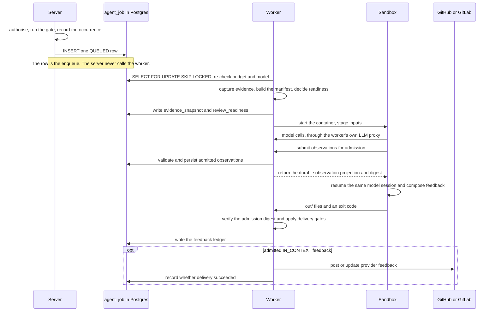

# Practice review runtime

Use this page when changing where practice-review work executes or extending an artifact handler. For the
review lifecycle and its product semantics, start with the
[practice review pipeline](./practice-review-pipeline.mdx).

## Execution sequence

The most counter-intuitive facts about this system are all about *where* code runs, and none of them are
visible from the class names.

- **The `agent_job` table is the queue.** There is no broker between server and worker. Submission is one
  row containing metadata and an idempotency key. NATS carries webhook ingress upstream and is not part of
  the review queue.
- **Evidence capture runs on the claiming worker, not on the server.** The worker reads the repository clone
  from its own disk, so a worker without checkout enabled or without the fabric volume records a degraded
  tree in the manifest.
- **`evidence_snapshot` and `review_readiness` are written before the container starts**, in their own
  transaction, and a failed write fails the run before any model cost accrues. The result is a separate,
  later transaction.
- **The worker posts public feedback.** Parsing, persistence, composition, and provider delivery remain on
  the worker after sandbox execution.
- **Control never returns to the server between claim and completion.** The only server-to-worker push is
  the hub WebSocket, and it carries cancellation and drain, not work.

## Extension points

Artifact handlers assemble context and delivery constraints. Provider adapters own provider identifiers,
diff and comment APIs, and conversation storage; the practices module owns definitions, observations, and
the feedback ledger.

The durable boundaries, which the implementation may reschedule freely behind:

- **Admission** — the review gate decides whether an occurrence may enqueue work.
- **Queue and execution** — `agent_job`, described by
  [ADR 0025](https://github.com/hephaestus-build/Hephaestus/blob/main/docs/decisions/0025-agent-job-queue-on-postgresql.md).
- **Workspace ABI** — the sandbox receives read-only `inputs/`, disposable `work/`, and returns only
  `out/`. [Agent workspace ABI](agent/workspace-abi.mdx) is the source of truth for paths and exit codes.
- **Observations** — the agent reports through `report_observation`; server admission validates it, and
  persistence assigns occurrence and recurrence identity.
- **Feedback** — after admission, the same agent session reports through `report_feedback` in a closed
  intervention phase;
  server admission validates the result without invalidating completed measurement. Admitted feedback,
  server suppressions, replacements, and placements enter the ledger; a model `WITHHOLD` remains only in
  the bounded job output. The seam itself is
  [ADR 0029](https://github.com/hephaestus-build/Hephaestus/blob/main/docs/decisions/0029-measurement-intervention-seam-and-channel-levels.md).

When changing sandbox inputs or outputs: update the owning runtime type or parser first; update the ABI
page only for a durable ABI change; add a behavioural test at the narrowest owning boundary; regenerate
OpenAPI and the web client when the HTTP contract changes. To extend the bundled catalogue, follow
[Practice catalogue curation](practice-catalogue.md).

Avoid copying file trees, enum inventories, defaults, or database columns into this guide. Those details
are owned by executable types, Liquibase, the generated database schema, and OpenAPI.
