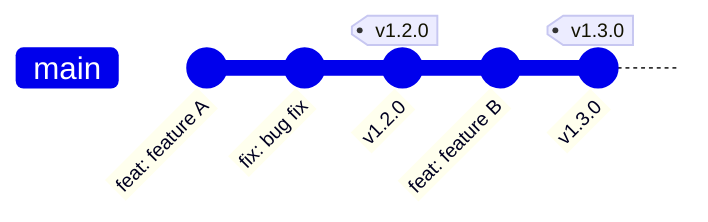
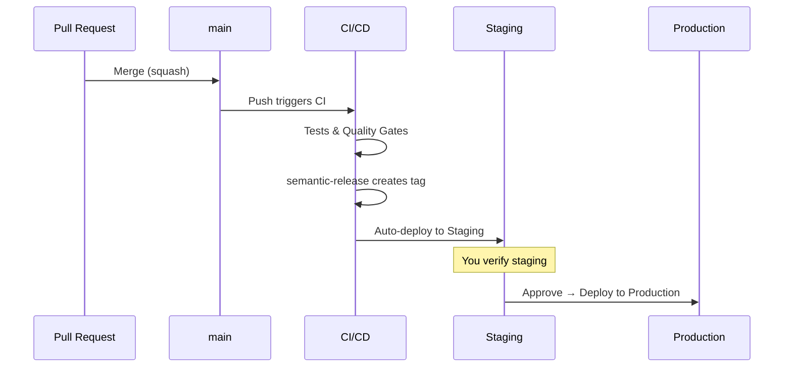

# Release Management

Hephaestus uses **trunk-based development** with continuous deployment. Every merge to `main` triggers an automatic release to staging, with production deployment requiring manual approval.

## Workflow overview

| Branch | Purpose |
| --- | --- |
| `main` | The only branch. All work merges here. |

:::tip No develop branch
We use trunk-based development. There is no `develop` branch. Every merge to `main` is a potential release.
:::

## Release flow

### Timeline

| Step | Duration |
| --- | --- |
| PR merged to `main` | — |
| CI runs (tests, builds) | ~10 min |
| semantic-release creates tag | ~1 min |
| Staging deploy | ~2 min |
| **You verify staging** | You decide |
| Production deploy (after approval) | ~2 min |
| **Total to production** | **~15 min + your verification** |

## How to release

### Normal release

1. **Merge your PR** to `main` (squash merge)
2. **Wait for CI** — tests run, then semantic-release creates a tag
3. **Staging deploys automatically** — you get a notification
4. **Verify staging** — check https://staging.hephaestus.cit.tum.de
5. **Approve production** — Go to the Actions run → Click "Review deployments" → Approve

### Hotfix

Same as normal release. There's no separate process — the fast pipeline handles everything.

1. Create a branch from `main`
2. Open a PR, get it reviewed
3. Merge → Staging → Verify → Approve → Production

## Pull request expectations

- **Title format**: Conventional commits (e.g., `feat(webapp): add leaderboard`)
- **Breaking changes**: Add `!` suffix (e.g., `feat!: remove deprecated API`)
- **Merge method**: Always **Squash and merge**
- **Target branch**: Always `main`

## Commit types and release impact

| Type | Creates Release? | Version Bump |
| --- | --- | --- |
| `feat:` | ✅ | Minor |
| `fix:` | ✅ | Patch |
| `perf:` | ✅ | Patch |
| `feat!:` / BREAKING | ✅ | Major |
| `revert:` | ✅ | Patch |
| `docs:` | ❌ | — |
| `style:` | ❌ | — |
| `refactor:` | ❌ | — |
| `test:` | ❌ | — |
| `build:` | ❌ | — |
| `ci:` | ❌ | — |
| `chore:` | ❌ | — |

Only `feat`, `fix`, `perf`, `revert`, and breaking changes trigger new releases.

## Breaking changes

When introducing breaking changes:

1. **PR title**: Use `!` suffix (e.g., `feat(api)!: remove deprecated endpoint`)
2. **PR body**: Include a migration guide under `## Migration`
3. **Description**: Clearly explain what users need to change

## GitHub Environments

We use GitHub Environment protection rules:

| Environment | Approval | URL |
| --- | --- | --- |
| `staging` | None (auto) | https://staging.hephaestus.cit.tum.de |
| `production` | Required | https://hephaestus.cit.tum.de |

### Setting up environments

In your repository settings:

1. Go to **Settings → Environments**
2. Create `staging` environment (no protection rules)
3. Create `production` environment with **Required reviewers** (add yourself)

## Preview deployments

Coolify handles PR preview deployments:

- Every PR gets an isolated preview environment
- Built directly on the server (fast)
- Automatically cleaned up when PR is closed

## Dependency management

Dependencies are automatically updated via [Renovate Bot](https://docs.renovatebot.com/):

- Runs Monday mornings
- Patches/minors automerge after 3 days
- Majors require manual review

## Version synchronization

`semantic-release` automatically updates version numbers in:

- `package.json` files
- `pom.xml` files  
- OpenAPI specs

Run `./update_version.sh <version>` to update versions manually if needed.

## Best practices

### Do

- Merge small, focused PRs frequently
- Use conventional commits consistently
- Verify staging before approving production
- Use preview deployments for complex changes

### Don't

- Push directly to `main`
- Batch changes for releases (release small & often)
- Skip staging verification
- Manually edit version numbers
