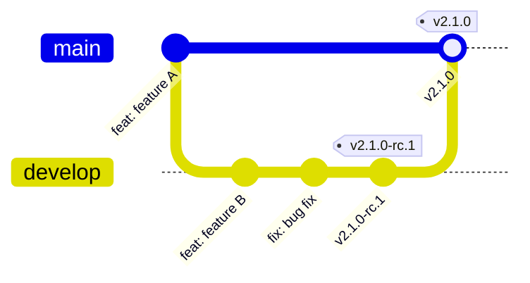
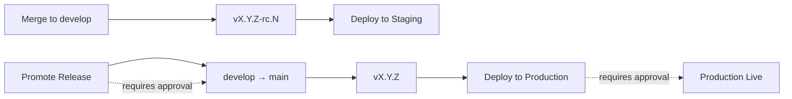

Hephaestus ships with a two-branch workflow (`develop` and `main`) powered by semantic-release and GitHub Actions. This guide outlines the expectations for pull requests, release candidates, and emergency procedures.

## Workflow overview

| Branch | Releases | Deploys to | Purpose |
| --- | --- | --- | --- |
| `develop` | `v2.1.0-rc.1` | Staging | Release candidates |
| `main` | `v2.1.0` | Production | Stable releases |

## Pull request expectations

- **Title format**: Conventional commits only (the squash merge title is the source of truth).
- **Breaking changes**: Add `!` (e.g., `feat!: remove deprecated API`).
- **Merge method**: Always use *Squash and merge* into `develop`.
- **Code review**: Required before merge; automation will block otherwise.

Automation highlights include title validation, size labelling, auto assignment, and component labels based on touched paths.

## Development to staging

1. Create a feature branch, push, and open a PR with a conventional title.
2. Once approved, squash merge into `develop`.
3. GitHub Actions tags a release candidate (`vX.Y.Z-rc.N`) and deploys to staging.

## Promote to production

1. Run the **Promote Release** workflow (requires approval).
2. The workflow fast-forwards `develop` to `main`.
3. A stable tag (`vX.Y.Z`) is created and deployed to production.

## Commit types and scopes

| Type | Bump | Description |
| --- | --- | --- |
| `feat:` | Minor | New feature |
| `fix:` | Patch | Bug fix |
| `feat!:` | Major | Breaking change |
| `docs:` | Patch | Documentation |
| `style:` | Patch | Formatting |
| `refactor:` | Patch | Internal refactor |
| `perf:` | Patch | Performance |
| `test:` | None | Tests |
| `build:` | Patch | Build tooling |
| `ci:` | None | CI/CD changes |
| `chore:` | Patch | Maintenance |
| `revert:` | Patch | Revert |

Recommended scopes include `webapp`, `application-server`, `intelligence-service`, `webhook-ingest`, `docs`, `deps`, and `config`.

## Emergency operations

### Deploying a hotfix

1. Branch from `main`.
2. Open a PR back into `main` (still using conventional commit titles).
3. Squash merge—production deploy triggers automatically (approval required).

### Manual deployments

For exceptional cases run the "Deploy to Production" or "Deploy to Staging" workflow, selecting the desired image tag or commit SHA. Protected environments still require approval.

## Release candidate communication

- Maintain one GitHub Discussion titled `Release Candidate: vX.Y.Z` in the Announcements category.
- Post updates for each RC (`-rc.2`, `-rc.3`, …) as comments in that thread.
- RC release notes remain cumulative; the final stable release links back to the discussion.

## Best practices

### Do

- Use conventional commits to keep semantic-release happy.
- Test every release in staging before promoting.
- Group related features into cohesive release candidates.

### Don't

- Push directly to `develop` or `main`.
- Manually edit version numbers—automation handles it.
- Deploy without the required approvals.

## Version synchronisation

Run `./update_version.sh` to update package versions across:

- `webapp/package.json`
- `server/application-server/pom.xml`
- `server/intelligence-service/pyproject.toml`
- OpenAPI specs and configuration files
