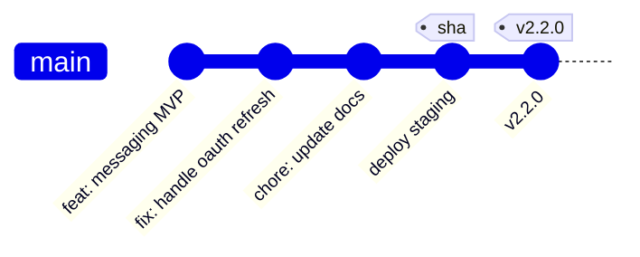

Hephaestus ships from a single protected branch—`develop` for now—with immutable container images. Every merge runs the full CI
suite, publishes images tagged by Git SHA (plus a convenience `staging-<sha>` alias), and immediately deploys that build to
staging. Promotion to production happens by creating a SemVer tag (`vX.Y.Z`) on the already tested commit. The release workflow
retags the published images without rebuilding and deploys them to the production environment.

## Workflow overview

| Branch | Purpose | Deploys to |
| --- | --- | --- |
| `develop` | Single trunk for all work (rename to `main` later) | Automatically to **Staging** on every merge |

## Pull request expectations

- **Title format**: Conventional commits keep the changelog and release notes clean (`feat:`, `fix:`, etc.).
- **Merge method**: Squash merge into `develop`; the squash title becomes the commit subject.
- **Checks**: The AI reviewer and CI must be green. No manual gatekeeping once automation passes.

Automation handles labelling, size detection, and other hygiene tasks. Once you merge, the staging deployment begins within
minutes.

## Development → staging

1. Open a PR from a short-lived feature branch into `develop`.
2. When CI and review are green, squash merge into `develop`.
3. The `CI/CD` workflow:
   - Runs quality gates, tests, and security scans.
   - Builds all containers once, tagging them with the full Git SHA and `staging-<sha>`.
   - Injects runtime metadata (`APP_VERSION`, `IMAGE_TAG`, `GIT_SHA`) into the deployment manifest.
   - Deploys those images to the staging environment.

Staging runs exactly the bytes that were built in CI. The UI surfaces the Git SHA so you can link reports back to the deployed
commit.

## Promote to production

1. Pick the staged commit you want to release (for now still on `develop`).
2. Create a SemVer tag locally, e.g. `git tag v2.2.0 <commit-sha>` and push it (`git push origin v2.2.0`).
3. The `Release` workflow:
   - Resolves the digest for each GHCR image that was built for that commit.
   - Retags the digest to the pushed tag (`v2.2.0`). Stable tags also receive a rolling `prod` alias.
   - Generates GitHub release notes from the commit history.
   - Deploys the tagged images with `APP_VERSION` set to the pushed tag and `IMAGE_TAG`/`GIT_SHA` preserved from the CI build:
     - Pre-release tags (anything containing `-`, e.g. `v2.2.0-rc.1`) redeploy staging with the nicer tag.
     - Stable tags (`v2.2.0`) deploy production using the `v2.2.0` image tag—no rebuild required.

### Version visibility

- Containers expose the Git SHA via the `GIT_SHA` environment variable and OCI image labels, along with `IMAGE_TAG` and
  the OCI `created` timestamp for traceability.
- The release workflow injects `APP_VERSION` during promotion (and staging auto-deploys default it to the commit SHA), so
  UIs show `vX.Y.Z (abcdef0)` without rebuilding images.
- Spring, FastAPI, and Sentry pick up `spring.application.version` / `APP_VERSION` automatically, so logs, health endpoints, and
  telemetry all agree on the deployed build.

## Emergency operations

### Hotfixes

1. Branch from `develop` (or production’s release tag if you need to roll back).
2. Merge back into `develop` following the usual process; staging deploys automatically.
3. Tag the hotfix commit (e.g. `v2.2.1`) to promote to production.

### Manual deployments

Prefer the automated flow. If you must, the `Deploy to Staging` and `Deploy to Production` workflows accept manual inputs for the
`image-tag` (commit SHA or existing release tag), `app-version` (optional SemVer shown in UIs), and `git-sha` (explicit commit if
you deploy a tag). They still require environment approvals.

## Best practices

### Do

- Keep trunk green—merge small, reviewable PRs frequently.
- Let staging soak before tagging a production release.
- Use pre-release tags (`v2.2.0-rc.1`) to mark staged builds without changing the deployed bits.

### Don't

- Edit version numbers in source files for releases. Tags + env vars provide the version.
- Cherry-pick directly onto `main`. `develop` is the source of truth until we rename it.
- Rebuild images during promotion. Always reuse the digest that staging validated.
