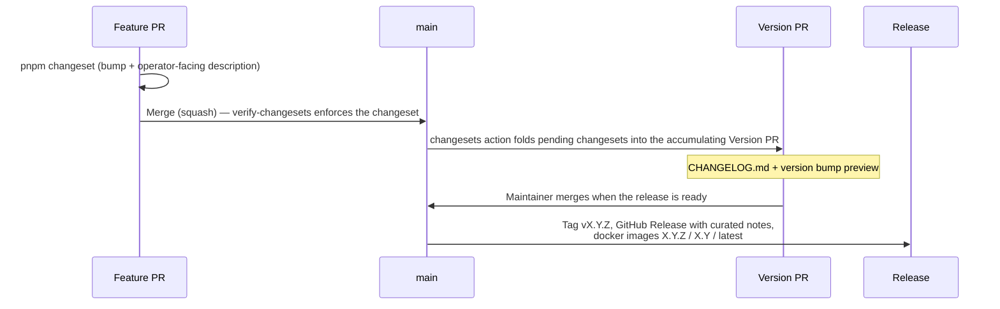

# Release Management

**Release ≠ deploy.** Development is trunk-based: all work merges to `main` (squash merge, no
`develop` branch) and every merge builds deployable images. A **release** is a deliberate act:
cutting a version of Hephaestus for self-hosters, with a tag, curated release notes, and versioned
Docker images. Our own instances ride the release cut — staging deploys automatically, production
after approval. Releases are managed with [changesets](https://github.com/changesets/changesets).

What a released version number promises is defined in the
[compatibility policy](https://ls1intum.github.io/Hephaestus/admin/compatibility-policy).

## The flow

```mermaid
sequenceDiagram
    participant PR as Feature PR
    participant M as main
    participant VP as Version PR
    participant R as Release

    PR->>PR: pnpm changeset (bump + operator-facing description)
    PR->>M: Merge (squash) — verify-changesets enforces the changeset
    M->>VP: changesets action folds pending changesets into the accumulating Version PR
    Note over VP: CHANGELOG.md + version bump preview
    VP->>M: Maintainer merges when the release is ready
    M->>R: Tag vX.Y.Z, GitHub Release with curated notes,<br/>docker images X.Y.Z / X.Y / latest
```

1. **Every user-facing PR carries a changeset.** `pnpm changeset` asks for the bump type and an
   operator-facing description; the file lands in `.changeset/` and merges with the PR. The
   `verify-changesets` check fails PRs that change shipped code — anything under `server/`, `webapp/`,
   or `docker/` except tests and in-tree docs — without one. `pnpm changeset --empty` (non-interactive)
   is the explicit opt-out for changes with no user-facing effect; write why in the file body.
2. **The Version PR accumulates.** On every push to `main`, the release workflow maintains a PR
   titled `chore(release): version packages` that previews the next version and the assembled
   `CHANGELOG.md` section. It is safe to leave open — it updates itself.
3. **Merging the Version PR cuts the release.** The release workflow tags `vX.Y.Z` at the merge
   commit, creates the GitHub Release from the new changelog section, retags the CI-built Docker
   images as `X.Y.Z`, `X.Y`, and `latest`, publishes the signed release-pin asset, and starts the
   deploy chain (staging automatically, production after approval).

## Writing changesets

A changeset summary becomes the `CHANGELOG.md` entry **verbatim** — write it in the operator/user's voice:

- Lead with what an operator or user can now do, or the symptom a fix removes. No class names, hook
  names, or file paths. If operators must act, add a line: `**Operators:** …`.
- **One changeset per user-visible change** — a PR that ships two unrelated visible changes ships two
  changeset files. Unsure whether it's visible? Add one; a reviewer can delete a superfluous note, but a
  missing one is invisible.
- **Don't mention automatic migrations** — the release notes get an automatic "back up before
  upgrading" banner whenever a release touches `server/src/main/resources/db/changelog/`, so the
  changeset stays user-facing. Only a migration that requires operator action belongs in the summary
  (`**Operators:** …` + [`MIGRATION.md`](https://github.com/ls1intum/Hephaestus/blob/main/MIGRATION.md)).
- **Bump = the operator's upgrade cost**, not code semantics:
  - `patch` — upgrade needs no action (bug fix, internal change, additive auto-applied migration).
  - `minor` — new capability, still zero-action; note any new *optional* env var / flag in the summary.
  - `major` — operator must act first (required new env var, removed/renamed config, destructive/manual
    migration, dropped API); state the action and update [`MIGRATION.md`](https://github.com/ls1intum/Hephaestus/blob/main/MIGRATION.md).

No TTY (agents, CI)? `pnpm changeset` is interactive — write the file by hand instead: create
`.changeset/<slug>.md` with frontmatter `"hephaestus": <bump>` and the summary as the body (see
`.changeset/README.md`). Never hand-edit `CHANGELOG.md`.

:::caution Pre-1.0
Never pick a `major` bump while the version is `0.x` — it would cut 1.0.0, and CI rejects it. Breaking
changes ride in `minor` instead, so a pre-1.0 `minor` is **not** guaranteed zero-action: if the operator
must act, say so in the summary and update `MIGRATION.md` exactly as a `major` would. The 1.0.0 release
ships deliberately with the [1.0 milestone](https://github.com/ls1intum/Hephaestus/issues/1378) via a
single sanctioned major changeset.
:::

The whole app is versioned as one product: changesets target the root `hephaestus` package only;
`webapp` and `docs` are never versioned individually.

## Deploys (unchanged by releases)

| Environment | Trigger | Approval | URL |
| --- | --- | --- | --- |
| Staging | Release cut | None (auto) | https://staging.hephaestus.cit.tum.de |
| Production | Release cut | Required reviewer | https://hephaestus.cit.tum.de |
| PR previews | Coolify per PR (opt-in) | — | — |

Verify staging before approving production. Hotfixes have no separate process: PR → changeset →
merge → merge the Version PR.

## Version management

Version numbers in source manifests stay at their placeholders (`webapp/package.json` and `server/pom.xml`
are `0.0.0-development`) — the **release version**
lives in the root `package.json` and is bumped only by the Version PR. At deploy time,
`APP_VERSION` is set from the image tag via Docker Compose; the application server exposes it as
`spring.application.version`.

Check the current release: `git describe --tags --abbrev=0` or
[GitHub Releases](https://github.com/ls1intum/Hephaestus/releases).

## Dependency management

Dependencies are updated via [Renovate Bot](https://docs.renovatebot.com/) (Monday mornings;
patches/minors automerge after 3 days, majors need review). Bot PRs are exempt from the changeset
check — when a dependency bump is user-facing, a maintainer adds the changeset.
