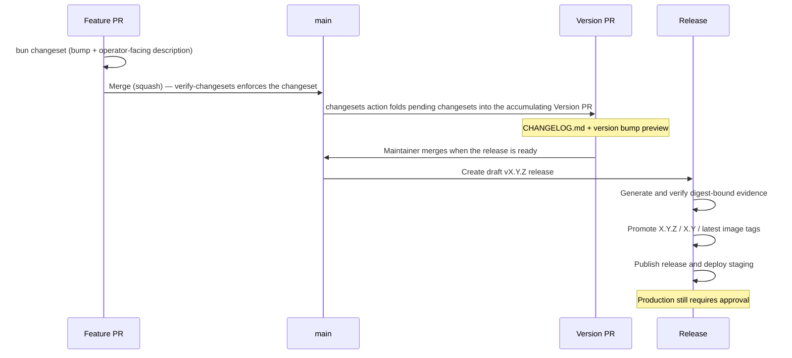

# Release Management

**Release ≠ deploy.** Development is trunk-based: all work merges to `main` (squash merge, no
`develop` branch) and every merge builds deployable images. A **release** is a deliberate act:
cutting a version of Hephaestus for self-hosters, with a tag, curated release notes, and versioned
Docker images. Our own instances ride the release cut — staging deploys automatically, production
after approval. Releases are managed with [changesets](https://github.com/changesets/changesets).

What a released version number promises is defined in the
[compatibility policy](https://ls1intum.github.io/Hephaestus/admin/compatibility-policy).

## The flow

```mermaid
sequenceDiagram
    accTitle: Changesets release workflow
    accDescr: Feature pull requests add changesets, the version pull request consumes them, and merging the version pull request publishes the release.
    participant PR as Feature PR
    participant M as main
    participant VP as Version PR
    participant R as Release

    PR->>PR: bun changeset (bump + operator-facing description)
    PR->>M: Merge (squash) — verify-changesets enforces the changeset
    M->>VP: changesets action folds pending changesets into the accumulating Version PR
    Note over VP: CHANGELOG.md + version bump preview
    VP->>M: Maintainer merges when the release is ready
    M->>R: Create draft vX.Y.Z release
    R->>R: Generate and verify digest-bound evidence
    R->>R: Promote X.Y.Z / X.Y / latest image tags
    R->>R: Publish release and deploy staging
    Note over R: Production still requires approval
```

1. **Every user-facing PR carries a changeset.** `bun changeset` asks for the bump type and an
   operator-facing description; the file lands in `.changeset/` and merges with the PR. The
   `verify-changesets` check fails PRs that change shipped code — anything under `server/`, `webapp/`,
   or `docker/` except tests and in-tree docs — without one. `bun changeset --empty` (non-interactive)
   is the explicit opt-out for changes with no user-facing effect; write why in the file body. Release
   changesets need an operator-facing summary for the root package.
2. **The Version PR accumulates.** On every push to `main`, the release workflow maintains a PR
   titled `chore(release): version packages` that previews the next version and the assembled
   `CHANGELOG.md` section. It is safe to leave open — it updates itself. It is opened by
   `github-actions[bot]` and deliberately runs **no CI**: it only bumps a version string and
   rewrites the changelog, and it is re-pushed on every merge to `main`, so running the full matrix
   on it would burn CI without validating anything. Validation happens after the merge — `main` runs
   the full suite and a release is only cut if that run succeeds. Maintainers bypass the branch
   ruleset, so the absent required checks don't block the merge. Versioning also moves any
   `### Next release` section in `MIGRATION.md` under the version being cut.
3. **Merging the Version PR cuts the release.** The workflow creates a draft release at the merge
   commit. After its evidence gate passes, it promotes the CI-built images to `X.Y.Z`, `X.Y`, and
   `latest`, publishes the release, deploys staging, and requests production approval.

## Supply-chain evidence

A release remains a draft until every first-party and upstream production image in
`security/release-images.json` has passed the evidence
gate. The gate resolves each image index and its `linux/amd64` and `linux/arm64` manifests to immutable
digests. It generates a lossless Syft inventory plus SPDX and CycloneDX SBOMs for each deployed platform.
The gate proves that the Syft source metadata identifies the exact digest and architecture, checks that
every discovered package survives both standard-format conversions, and records packages whose license
could not be detected. It also scans each platform manifest with Trivy, signs its SPDX predicate as an OCI
attestation, and verifies the image signature and build provenance. The SBOMs, license summaries, scan
reports, applied policy, checksums, and `manifest.json` are GitHub Release assets, so they outlive Actions
artifact retention. Publication requires every artifact to be present, well formed, and bound to its
recorded digest.

Upstream NATS, Traefik, nginx, and Alpine images are versioned and digest-pinned in the production
Compose topology. They receive the same per-platform SBOM, license, vulnerability, and index-membership
evidence as first-party images. Hephaestus requires its own signatures and build provenance only for
images it builds; it does not misrepresent observed upstream images as Hephaestus-built artifacts.

The version-controlled policy rejects new fixable HIGH or CRITICAL findings. Baselines use exact
image/CVE/package/installed-version fingerprints. Exceptions use the same scope and require an owner,
justification, and future expiry.

The latest release is rescanned weekly. A policy violation or scan failure is reported on
[the vulnerability response issue](https://github.com/ls1intum/Hephaestus/issues/1369); scanner failure
is never treated as no findings.

### Operator verification

The [release image lock](../admin/release-image-lock) is the canonical verification procedure. It
verifies the lock signer and release identity before Compose consumes any digest. The remaining
release assets provide the per-platform SBOM, vulnerability, license, and index-membership evidence;
`SHA256SUMS` covers that evidence set.

## Writing changesets

A changeset summary becomes the `CHANGELOG.md` entry **verbatim** — write it in the operator/user's voice:

- Lead with what an operator or user can now do, or the symptom a fix removes. No class names, hook
  names, or file paths. If operators must act, add a line: `**Operators:** …`.
- **One changeset per user-visible change** — a PR that ships two unrelated visible changes ships two
  changeset files. Unsure whether it's visible? Add one; a reviewer can delete a superfluous note, but a
  missing one is invisible.
- Once a changeset reaches `main`, revise it in place. If it should not become a release note, convert
  it to an explained empty changeset instead of deleting or renaming it.
- **Don't mention automatic migrations** — the release notes get an automatic "back up before
  upgrading" banner whenever a release touches `server/application/src/main/resources/db/changelog/`, so the
  changeset stays user-facing. Only a migration that requires operator action belongs in the summary
  (`**Operators:** …` + [`MIGRATION.md`](https://github.com/ls1intum/Hephaestus/blob/main/MIGRATION.md)).
- **Bump = the operator's upgrade cost**, not code semantics:
  - `patch` — upgrade needs no action (bug fix, internal change, additive auto-applied migration).
  - `minor` — new capability, still zero-action; note any new *optional* env var / flag in the summary.
  - `major` — operator must act first (required new env var, removed/renamed config, destructive/manual
    migration, dropped API); state the action and update [`MIGRATION.md`](https://github.com/ls1intum/Hephaestus/blob/main/MIGRATION.md).

No TTY (agents, CI)? `bun changeset` is interactive — write the file by hand instead: create
`.changeset/<slug>.md` with frontmatter `"hephaestus": <bump>` and the summary as the body (see
`.changeset/README.md`). Never hand-edit `CHANGELOG.md`.

:::caution Pre-1.0
Never pick a `major` bump while the version is `0.x` — it would cut 1.0.0, and CI rejects it. Breaking
changes ride in `minor` instead, so a pre-1.0 `minor` is **not** guaranteed zero-action: if the operator
must act, say so in the summary and update `MIGRATION.md` exactly as a `major` would. The 1.0.0 release
ships deliberately with the [1.0 milestone](https://github.com/ls1intum/Hephaestus/issues/1378) via a
single sanctioned major changeset.
:::

The whole app is versioned as one product: changesets target the root `hephaestus` package only;
`webapp` and `docs` are never versioned individually.

## Deploys (unchanged by releases)

| Environment | Trigger | Approval | URL |
| --- | --- | --- | --- |
| Staging | Green commit on `main` | None (auto) | https://staging.hephaestus.aet.cit.tum.de |
| Production | Release cut | Required reviewer | https://hephaestus.aet.cit.tum.de |
| PR previews | `preview` label on a same-repo PR | None (push access) | PR deployment link |

Verify staging before approving production. Hotfixes have no separate process: PR → changeset →
merge → merge the Version PR.

## Version management

Version numbers in source manifests stay at their placeholders (`webapp/package.json` and `server/pom.xml`
are `0.0.0-development`) — the **release version**
lives in the root `package.json` and is bumped only by the Version PR. At deploy time, the verified release lock supplies `APP_VERSION`; the application server exposes it
as `spring.application.version`.

Check the current release: `git describe --tags --abbrev=0` or
[GitHub Releases](https://github.com/ls1intum/Hephaestus/releases).

## Dependency management

Dependencies are managed through the
[Renovate Dependency Dashboard](https://docs.renovatebot.com/key-concepts/dashboard/). Approved
updates are scheduled after the configured release-age checks; vulnerability alerts may run and merge
independently. Bot PRs are exempt from the changeset check — when a dependency bump is user-facing,
a maintainer adds the changeset.

Exact pins remain exact during Renovate updates. Formatter upgrades must include and separately review
any resulting mechanical formatting changes.
