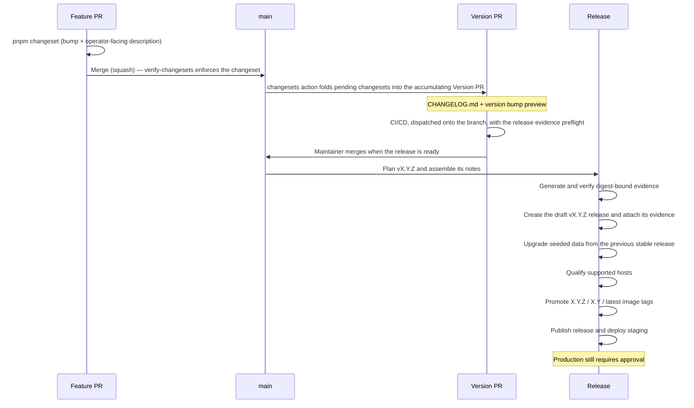

# Release Management

**Release ≠ deploy.** Development is trunk-based: all work merges to `main` (squash merge, no
`develop` branch) and every merge builds deployable images. A **release** is a deliberate act:
cutting a version of Hephaestus for self-hosters, with a tag, curated release notes, and versioned
Docker images. Our own instances ride the release cut — staging deploys automatically, production
after approval. Releases are managed with [changesets](https://github.com/changesets/changesets).

What a released version number promises is defined in the
[compatibility policy](https://docs.hephaestus.build/admin/compatibility-policy).

## The flow

```mermaid
sequenceDiagram
    accTitle: Changesets release workflow
    accDescr: Feature pull requests add changesets, the version pull request consumes them, and merging the version pull request publishes the release.
    participant PR as Feature PR
    participant M as main
    participant VP as Version PR
    participant R as Release

    PR->>PR: pnpm changeset (bump + operator-facing description)
    PR->>M: Merge (squash) — verify-changesets enforces the changeset
    M->>VP: changesets action folds pending changesets into the accumulating Version PR
    Note over VP: CHANGELOG.md + version bump preview
    VP->>VP: CI/CD, dispatched onto the branch, with the release evidence preflight
    VP->>M: Maintainer merges when the release is ready
    M->>R: Plan vX.Y.Z and assemble its notes
    R->>R: Generate and verify digest-bound evidence
    R->>R: Create the draft vX.Y.Z release and attach its evidence
    R->>R: Upgrade seeded data from the previous stable release
    R->>R: Qualify supported hosts
    R->>R: Promote X.Y.Z / X.Y / latest image tags
    R->>R: Publish release and deploy staging
    Note over R: Production still requires approval
```

1. **Every PR that changes shipped code carries a changeset.** `Verify changesets` fails the PR
   otherwise; [Writing changesets](#writing-changesets) has the rules.
2. **The Version PR accumulates, and is checked.** On every push to `main`, `version-pr.yml`
   maintains a PR titled `chore(release): version packages` that previews the version bump, the
   `CHANGELOG.md` section, and the `MIGRATION.md` section assembled from `.migration/` fragments at
   the `### Next release` anchor. Its updates are pushed with `GITHUB_TOKEN`, and a push made with
   that token starts no workflow run — so the same workflow dispatches CI/CD onto the Version PR's
   branch, `workflow_dispatch` being one of the two events that token may start. Every Version PR
   head commit gets one such run; `scripts/dispatch-version-pr-ci.ts` decides by asking whether the
   head already has one, so a missed dispatch heals on the next push and an unchanged head costs
   nothing. Every CI/CD run on that branch also carries the **release evidence preflight** below,
   whichever event started it, and `CI Status Gate` fails there unless the preflight succeeded in the
   same run. More than one run can report that gate for a Version PR head — a dispatch and an
   approved `pull_request` run both did for v0.75.1 — and the ruleset is satisfied by either, so a
   green gate means the preflight passed only if no run can be green without it. Every run on that
   branch therefore publishes the whole release image set on both architectures, where an ordinary
   pull request builds the `linux/amd64` candidates its diff touched and aliases the rest from
   `main`: the preflight evidences each image on both published platforms, and it can only evidence
   what the run it belongs to published.
3. **The merge is checked again.** The merge commit's push runs CI/CD in full — a push to `main`
   repeats the source-validation legs only when it carries a version bump, which is exactly this
   commit — and `release.yml` starts only when that run succeeds.
4. **Merging the Version PR cuts the release.** The workflow resolves the release image digests and
   runs the evidence gate first, and only then creates the draft release at the merge commit and
   attaches the evidence to it. After the seeded-upgrade and supported-host gates pass too, it
   promotes the CI-built images to `X.Y.Z`, `X.Y`, and `latest`, publishes the release, deploys
   staging, and requests production approval.

### When a release fails

Release images are promoted **by digest and never rebuilt**, so a commit the evidence gate rejects
can never pass on a retry — only a new commit can. The gate therefore runs before anything is
created: a rejected release leaves no draft and no tag behind (a draft materialises no tag), so
there is nothing to clean up.

Recovering is fixing forward. `scripts/plan-release.ts` cuts the version `main` carries whenever
that version has **no published release**, from whichever commit carries it, so landing the fix is
the whole recovery: the next successful CI run on `main` re-cuts the same version from the commit
that fixes it. Merging the next Version PR instead works just as well — a release follows the
latest *published* release rather than the version its parent commit carried, so a version that
never published is simply skipped. An ordinary merge decides nothing either way: it carries a
version that is already published, which is the one and only no-op.

A failure *after* the draft exists — the seeded-upgrade or supported-host gate, or publication
itself — is the case the resume path covers: re-running the workflow at the same commit reuses the
existing draft, regenerates the evidence, and replaces its assets. A draft pins its version to its
commit, so a later commit refuses to re-cut over it: a draft that can never pass is deleted by
hand, and the version then re-cuts from the fixed commit.

Reverting the version commit is therefore no longer part of recovery, but the exemption that made
it possible stands. The `verify-changesets` freeze rules — `MIGRATION.md` is not editable in a
feature PR, pending changesets and migration fragments are not deletable — are lifted for a
**verified revert**, which `scripts/verify-revert.ts` decides structurally: every commit the pull
request adds must record `This reverts commit <sha>.`, name a commit that is already an ancestor of
the base, and carry that commit's patch exactly reversed. Anything else leaves the rules in force.

## Supported-host qualification

Every release boots its signed, immutable image lock through the self-hosted topology on native Ubuntu
24.04 `amd64` and `arm64` hosts. The gate enforces the [published support matrix](../admin/install#supported-host-matrix),
waits for stack readiness, and exercises HTTPS ingress. Either cell can block publication.

Each cell's status record is attached to the immutable GitHub release. This qualification covers a
clean boot; the seeded-upgrade gate separately proves the supported migration path.

## Supply-chain evidence

No release exists until every image in `security/release-images.json` passes the evidence gate, and
it stays a draft until the later gates pass. For each image the gate resolves the index and its
`linux/amd64` and `linux/arm64` manifests to digests, reads each platform manifest from the registry,
and generates a Syft inventory plus SPDX and CycloneDX SBOMs, a Trivy vulnerability scan and a Trivy
license report. `scripts/verify-release-evidence.ts` checks that every document is bound to that
platform's repository, digest and architecture and that every package survives both format
conversions; then the SPDX predicate is attached as a Cosign attestation and the image signature and
build provenance are verified. SBOMs, reports, the policy, checksums and `manifest.json` are release
assets.

Upstream NATS, Traefik, nginx, and Alpine images are versioned and digest-pinned in the production
Compose topology. They receive the same per-platform SBOM, license, vulnerability, and index-membership
evidence as first-party images. Hephaestus requires its own signatures and build provenance only for
images it builds.

[Vulnerability remediation](./vulnerability-remediation.mdx) is the normative policy for blocking
findings, scheduled rescans, and exceptions.

### Nothing may fail for the first time at a release

For a long time a release was the only thing that ever produced an evidence bundle, so it was also
the only thing that could evaluate a check over one. v0.75.0 failed twice on findings no earlier
gate had ever looked at. The fix for the *subjects* was to scan the pinned upstream images before the
release; the fix for the *checks* is that the same bundle is now produced and judged before a release
exists. `scripts/generate-release-evidence.ts` is the one generator and
`scripts/verify-release-evidence.ts` the one verifier; `release.yml` and the `Release evidence
preflight` job in `cicd.yml` both run them, and the preflight runs the verifier in its default mode,
which performs every check except signature verification.

| Release evidence check | Can a release be the first to run it? |
| --- | --- |
| Manifest matches `security/release-images.json`, both platforms, canonical order | No — `check-release-image-inventory.ts` validates the inventory on every pull request, and `generate-release-evidence.test.ts` feeds the real generator's manifest to the real verifier |
| Syft, SPDX and CycloneDX describe the same subject and the same packages | No — the preflight generates the triple and validates it |
| Trivy licence report is bound to its subject | No — the preflight generates and validates it |
| Vulnerability policy, `linux/amd64` | No — also the build gate in `reusable-docker-build.yml` and, for the pinned upstream digests, `ci-security-scan.yml` |
| Vulnerability policy, `linux/arm64` | No — `ci-security-scan.yml` for the pinned upstream digests, and the preflight for the images we build, which nothing else scans on this platform |
| Each platform digest is a member of its published index | No — the preflight resolves and checks index membership over the images its own run pushed |
| The validation documents re-derive unchanged | No — the preflight verifies twice, the second time comparing rather than writing |
| SBOM attestation matches the durable evidence | **Yes, structurally.** `cosign attest` creates the attestation during the release; there is nothing to verify before it exists |
| Image index signature and build provenance carry the release's identity | **Yes, structurally.** The Fulcio certificate identity is the release workflow's, on `refs/heads/main`, and no earlier run can produce one |
| The manifest names a release version | **Yes, structurally.** Only `plan-release.ts` decides the tag; the preflight substitutes the version the ref carries |

The two signature entries are the only mode-conditional behaviour in the verifier, and
`ci-contract.test.ts` asserts exactly that: a check gated on anything other than
`mode === "verify-signatures"` is a check a release could be the first to perform, and fails the
contract test rather than a release. The third structural entry is not conditional at all — the
verifier always demands a release version, and the preflight gives it the version the ref carries.

The preflight is not free — it is a Syft and Trivy pass over every image on both architectures, plus
the image builds it reads, which on the Version PR's branch means the whole set on both
architectures where an ordinary pull request would build one image on one — so it
runs only where its answer changes a decision: on every CI/CD run on the Version PR's branch, and
on any manual CI/CD dispatch that ticks `release-preflight`. It reuses the images that run already built, so what it judges is the
artefact a release of that ref would promote, not a stand-in.

The pinned upstream images are therefore judged twice on the Version PR, and deliberately: the
upstream scan in `ci-security-scan.yml` is a minute of Trivy that answers the one question a digest
bump can break, while the preflight is the whole evidence gate and answers it as a side effect of
verifying a bundle. They cannot disagree — one planner, one evaluator, one policy file, and the same
`selectPlatformDigest` resolving the same index — so the cost is a duplicated scan rather than a
second opinion. Removing the fast one to save it would take the quick answer away from the pull
request that most needs it; removing the upstream half of the bundle would leave a bundle the
verifier rejects.

## Browser source maps

`ci-docker-build.yml` passes `SENTRY_AUTH_TOKEN`, `SENTRY_ORG` and `SENTRY_PROJECT` as BuildKit
secrets to the `linux/amd64` webapp build on pushes to `main` only. The Vite build uploads hidden
source maps when all three are set and refuses a partial set; the Dockerfile deletes every `.map`
from the image either way.

### Operator verification

The [release image lock](../admin/release-image-lock) is the canonical verification procedure. It
verifies the lock signer and release identity before Compose consumes any digest. The remaining
release assets provide the per-platform SBOM, vulnerability, license, and index-membership evidence;
`SHA256SUMS` covers that evidence set.

## Writing changesets

A changeset summary becomes the `CHANGELOG.md` entry **verbatim** — write it in the operator/user's voice:

- Lead with what an operator or user can now do, or the symptom a fix removes. No class names, hook
  names, or file paths. If operators must act, add a line: `**Operators:** …`.
- **One changeset per user-visible change** — a PR that ships two unrelated visible changes ships two
  changeset files. Unsure whether it's visible? Add one; a reviewer can delete a superfluous note, but a
  missing one is invisible.
- Once a changeset reaches `main`, revise it in place. If it should not become a release note, convert
  it to an explained empty changeset instead of deleting or renaming it.
- **Don't mention automatic migrations** — the release notes get an automatic "back up before
  upgrading" banner whenever a release touches `server/application/src/main/resources/db/changelog/`, so the
  changeset stays user-facing. Only a migration that requires operator action belongs in the summary
  (`**Operators:** …` plus a `.migration/<changeset-slug>.md` fragment).
- **Bump = the operator's upgrade cost**, not code semantics:
  - `patch` — upgrade needs no action (bug fix, internal change, additive auto-applied migration).
  - `minor` — new capability, still zero-action; note any new *optional* env var / flag in the summary.
  - `major` — operator must act first (required new env var, removed/renamed config, destructive/manual
    migration, dropped API); state the action and add a `.migration` fragment.

No TTY (agents, CI)? `pnpm changeset` is interactive — write the file by hand instead: create
`.changeset/<slug>.md` with frontmatter `"hephaestus": <bump>` and the summary as the body (see
`.changeset/README.md`). When action is required, add `.migration/<slug>.md` with the complete
`#### 🔴 …` guide entry. CI requires the matching slug and `**Operators:**` marker. Never hand-edit
`CHANGELOG.md` or `MIGRATION.md`; versioning generates both.

:::caution Pre-1.0
Never pick a `major` bump while the version is `0.x` — it would cut 1.0.0, and CI rejects it. Breaking
changes ride in `minor` instead, so a pre-1.0 `minor` is **not** guaranteed zero-action: if the operator
must act, say so in the summary and add a migration fragment exactly as a `major` would.
:::

The whole app is versioned as one product: changesets target the root `hephaestus` package only;
`webapp` and `docs` are never versioned individually.

## Deploys

`release.yml` calls `deploy-staging.yml` on publication and `deploy-prod.yml` after the Production
environment's required reviewer approves; both also run by `workflow_dispatch` with a release tag.
The environments are listed in [CI/CD](./ci-cd.mdx#environments). Verify staging before approving
production. Hotfixes have no separate process: PR → changeset → merge → merge the Version PR.

## Version management

Version numbers in source manifests stay at their placeholders (`webapp/package.json` and `server/pom.xml`
are `0.0.0-development`) — the **release version**
lives in the root `package.json` and is bumped only by the Version PR. At deploy time the release
lock sets `IMAGE_TAG`, which `docker/compose.app.yaml` passes as `APP_VERSION`; `application.yml`
exposes it as `spring.application.version`.

Check the current release: `git describe --tags --abbrev=0` or
[GitHub Releases](https://github.com/ls1intum/Hephaestus/releases).

## Dependency management

Renovate policy is in [CI/CD](./ci-cd.mdx#security-and-supply-chain-controls). `Verify changesets`
skips bot-authored pull requests; when a dependency bump is user-facing, a maintainer adds the
changeset.
