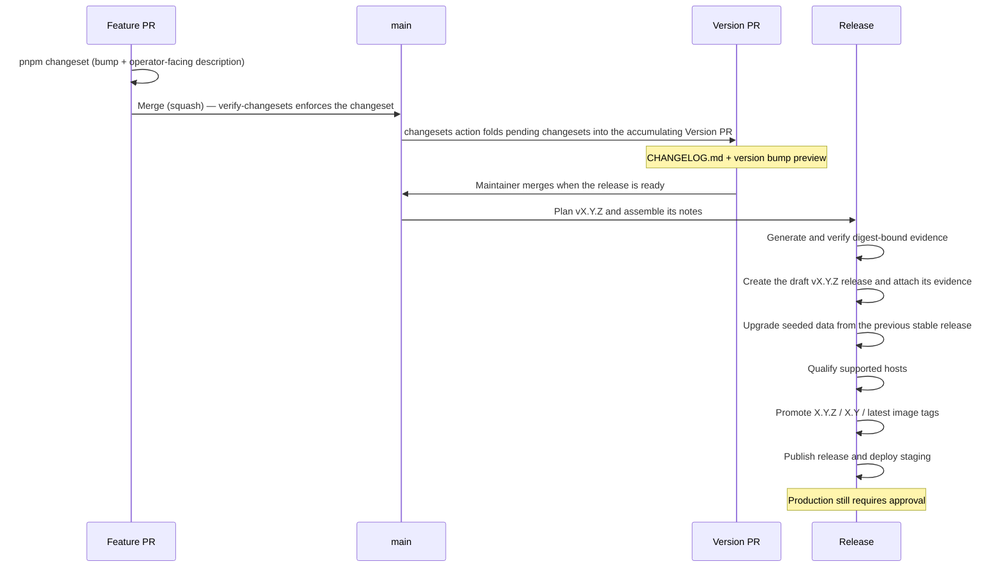

# Release Management

**Release ≠ deploy.** Development is trunk-based: all work merges to `main` (squash merge, no
`develop` branch) and every merge builds deployable images. A **release** is a deliberate act:
cutting a version of Hephaestus for self-hosters, with a tag, curated release notes, and versioned
Docker images. Our own instances ride the release cut — staging deploys automatically, production
after approval. Releases are managed with [changesets](https://github.com/changesets/changesets).

What a released version number promises is defined in the
[compatibility policy](https://docs.hephaestus.build/admin/compatibility-policy).

## The flow

```mermaid
sequenceDiagram
    accTitle: Changesets release workflow
    accDescr: Feature pull requests add changesets, the version pull request consumes them, and merging the version pull request publishes the release.
    participant PR as Feature PR
    participant M as main
    participant VP as Version PR
    participant R as Release

    PR->>PR: pnpm changeset (bump + operator-facing description)
    PR->>M: Merge (squash) — verify-changesets enforces the changeset
    M->>VP: changesets action folds pending changesets into the accumulating Version PR
    Note over VP: CHANGELOG.md + version bump preview
    VP->>M: Maintainer merges when the release is ready
    M->>R: Plan vX.Y.Z and assemble its notes
    R->>R: Generate and verify digest-bound evidence
    R->>R: Create the draft vX.Y.Z release and attach its evidence
    R->>R: Upgrade seeded data from the previous stable release
    R->>R: Qualify supported hosts
    R->>R: Promote X.Y.Z / X.Y / latest image tags
    R->>R: Publish release and deploy staging
    Note over R: Production still requires approval
```

1. **Every user-facing PR carries a changeset.** `pnpm changeset` asks for the bump type and an
   operator-facing description; the file lands in `.changeset/` and merges with the PR. The
   `verify-changesets` check fails PRs that change shipped code — anything under `server/`, `webapp/`,
   or `docker/` except tests and in-tree docs — without one. `pnpm changeset --empty` (non-interactive)
   is the explicit opt-out for changes with no user-facing effect; write why in the file body. Release
   changesets need an operator-facing summary for the root package.
2. **The Version PR accumulates.** On every push to `main`, the release workflow maintains a PR
   titled `chore(release): version packages` that previews the next version and the assembled
   `CHANGELOG.md` section. It is safe to leave open — it updates itself. It is opened by
   `github-actions[bot]` and deliberately runs **no CI**: it only bumps a version string and
   rewrites the changelog. `GITHUB_TOKEN` updates do not trigger the required workflows, so release
   automation uses the ruleset bypass. The version bump runs the full source-validation suite on
   `main`, and a release is only cut if that run succeeds. Versioning also moves any
   migration fragments at the existing `### Next release` anchor in `MIGRATION.md`, creates the
   versioned section beneath it, and consumes the fragments.
3. **Merging the Version PR cuts the release.** The workflow resolves the release image digests and
   runs the evidence gate first, and only then creates the draft release at the merge commit and
   attaches the evidence to it. After the seeded-upgrade and supported-host gates pass too, it
   promotes the CI-built images to `X.Y.Z`, `X.Y`, and `latest`, publishes the release, deploys
   staging, and requests production approval.

### When a release fails

Release images are promoted **by digest and never rebuilt**, so a commit the evidence gate rejects
can never pass on a retry — only a new commit can. The gate therefore runs before anything is
created: a rejected release leaves no draft and no tag behind (a draft materialises no tag), so
there is nothing to clean up and the version number is not consumed.

Recovering is a revert and a re-cut: revert the version commit, which restores the pending
changesets, land the fix, and let the Version PR re-cut the same version from a commit that carries
it. The `verify-changesets` freeze rules — `MIGRATION.md` is not editable in a feature PR, pending
changesets and migration fragments are not deletable — are lifted for a **verified revert**, which
`scripts/verify-revert.ts` decides structurally rather than by title: every commit the pull request
adds must record `This reverts commit <sha>.`, name a commit that is already an ancestor of the
base, and carry that commit's patch exactly reversed. Anything else leaves the rules in force.

A failure *after* the draft exists — the seeded-upgrade or supported-host gate, or publication
itself — is the case the resume path covers: re-running the workflow at the same commit reuses the
existing draft, regenerates the evidence, and replaces its assets. A draft that can never pass is
deleted by hand, and the version re-cuts from the fixed commit as above.

## Supported-host qualification

Every release boots its signed, immutable image lock through the self-hosted topology on native Ubuntu
24.04 `amd64` and `arm64` hosts. The gate enforces the [published support matrix](../admin/install#supported-host-matrix),
waits for stack readiness, and exercises HTTPS ingress. Either cell can block publication.

Each cell's status record is attached to the immutable GitHub release. This qualification covers a
clean boot; the seeded-upgrade gate separately proves the supported migration path.

## Supply-chain evidence

No release exists at all until every first-party and upstream production image in
`security/release-images.json` has passed the evidence
gate, and it remains a draft until the gates after it pass too. The gate resolves each image index and its `linux/amd64` and `linux/arm64` manifests to immutable
digests. It generates a lossless Syft inventory plus SPDX and CycloneDX SBOMs for each deployed platform,
scanning the registry manifest directly rather than a local Docker daemon copy, which would re-serialize
the manifest and digest to something the release never published. The gate proves that all three documents
name the repository, digest, and architecture of that one platform manifest — including the reference Syft
resolved, so an index-wide scan cannot pass as per-platform evidence — checks that
every discovered package survives both standard-format conversions, and records packages whose license
could not be detected. It also scans each platform manifest with Trivy, signs its SPDX predicate as an OCI
attestation, and verifies the image signature and build provenance. The SBOMs, license reports, scan
reports, applied policy, checksums, and `manifest.json` are GitHub Release assets, so they outlive Actions
artifact retention. Publication requires every artifact to be present, well formed, and bound to its
recorded digest.

Upstream NATS, Traefik, nginx, and Alpine images are versioned and digest-pinned in the production
Compose topology. They receive the same per-platform SBOM, license, vulnerability, and index-membership
evidence as first-party images. Hephaestus requires its own signatures and build provenance only for
images it builds; it does not misrepresent observed upstream images as Hephaestus-built artifacts.

The version-controlled policy rejects every HIGH or CRITICAL finding **for which upstream has published
a fix**. An unfixable finding is still counted and still appears in the signed evidence, but it does not
block: the pinned upstream images cannot be patched at all, so failing on one removes no risk and leaves
nobody an action. A residual fixable finding requires an exception scoped to its image, platform,
vulnerability, package, and installed version, with an owner, justification, evidence URL, and expiry no
more than 90 days away. Each exception and policy report records the scanned digest, but an exception is
not matched on it — the release digest does not exist until the images are tagged, so a digest-keyed
exception could only ever be written after the gate had already failed a release.

The same policy runs on every image build, against the `linux/amd64` image the run just pushed, so a
pull request fails before a release can. The release scans both architectures, where the evidence bundle
has to be complete. Both call `scripts/check-release-vulnerabilities.ts` with
`security/vulnerability-policy.json`; there is no second copy of either. A failing gate names the
rejected CVEs in the run summary and uploads its `.policy.json`.

The latest release is rescanned weekly. A policy violation or scan failure is reported on
[the vulnerability response issue](https://github.com/ls1intum/Hephaestus/issues/1369); scanner failure
is never treated as no findings.

`main`'s images are rescanned on the same weekly cadence, by `rescan-main-images.yml`. Container
vulnerabilities are time-dependent, not commit-dependent: the build gate can only catch a finding some
change introduced, and the finding that blocked v0.75.0 was published after the code had merged clean.
The scheduled run resolves each image's `:main` tag to its `linux/amd64` digest and evaluates the same
policy through the same script, so nothing about the verdict differs from a release.

That run is **not** blocking, and no scheduled run should be. Nobody triggered it, no commit caused the
finding and no revert removes it — the remedy is to rebuild `main` against a patched base image, which
the next merge does anyway. So `scripts/report-vulnerability-drift.ts` keeps a single tracking issue in
step with the findings instead: opened when they appear, edited in place and commented when the set
changes, silent when it has not, and closed when it clears. It recognises its own issue by an HTML
marker on the first line of the body, not by the title, so the issue can be retitled and triaged freely;
delete that line and the next run opens a new one.

[Vulnerability remediation](./vulnerability-remediation.mdx) states the policy in full — what an
exception must contain, and why VEX is not adopted.

## Browser source maps

Image builds upload hidden source maps through Sentry's debug-ID integration when the repository
secrets `SENTRY_AUTH_TOKEN`, `SENTRY_ORG`, and `SENTRY_PROJECT` are all configured. The token must be
authorized to upload artifacts to that project. Builds reject a partial configuration, pass the
values as BuildKit secrets to the `amd64` build outside pull requests, and remove maps before creating
either nginx image. The runtime release remains the same version the application server receives
from the verified release lock.

### Operator verification

The [release image lock](../admin/release-image-lock) is the canonical verification procedure. It
verifies the lock signer and release identity before Compose consumes any digest. The remaining
release assets provide the per-platform SBOM, vulnerability, license, and index-membership evidence;
`SHA256SUMS` covers that evidence set.

## Writing changesets

A changeset summary becomes the `CHANGELOG.md` entry **verbatim** — write it in the operator/user's voice:

- Lead with what an operator or user can now do, or the symptom a fix removes. No class names, hook
  names, or file paths. If operators must act, add a line: `**Operators:** …`.
- **One changeset per user-visible change** — a PR that ships two unrelated visible changes ships two
  changeset files. Unsure whether it's visible? Add one; a reviewer can delete a superfluous note, but a
  missing one is invisible.
- Once a changeset reaches `main`, revise it in place. If it should not become a release note, convert
  it to an explained empty changeset instead of deleting or renaming it.
- **Don't mention automatic migrations** — the release notes get an automatic "back up before
  upgrading" banner whenever a release touches `server/application/src/main/resources/db/changelog/`, so the
  changeset stays user-facing. Only a migration that requires operator action belongs in the summary
  (`**Operators:** …` plus a `.migration/<changeset-slug>.md` fragment).
- **Bump = the operator's upgrade cost**, not code semantics:
  - `patch` — upgrade needs no action (bug fix, internal change, additive auto-applied migration).
  - `minor` — new capability, still zero-action; note any new *optional* env var / flag in the summary.
  - `major` — operator must act first (required new env var, removed/renamed config, destructive/manual
    migration, dropped API); state the action and add a `.migration` fragment.

No TTY (agents, CI)? `pnpm changeset` is interactive — write the file by hand instead: create
`.changeset/<slug>.md` with frontmatter `"hephaestus": <bump>` and the summary as the body (see
`.changeset/README.md`). When action is required, add `.migration/<slug>.md` with the complete
`#### 🔴 …` guide entry. CI requires the matching slug and `**Operators:**` marker. Never hand-edit
`CHANGELOG.md` or `MIGRATION.md`; versioning generates both.

:::caution Pre-1.0
Never pick a `major` bump while the version is `0.x` — it would cut 1.0.0, and CI rejects it. Breaking
changes ride in `minor` instead, so a pre-1.0 `minor` is **not** guaranteed zero-action: if the operator
must act, say so in the summary and add a migration fragment exactly as a `major` would. The 1.0.0 release
ships deliberately with the [1.0 milestone](https://github.com/ls1intum/Hephaestus/issues/1378) via a
single sanctioned major changeset.
:::

The whole app is versioned as one product: changesets target the root `hephaestus` package only;
`webapp` and `docs` are never versioned individually.

## Deploys (unchanged by releases)

| Environment | Trigger | Approval | URL |
| --- | --- | --- | --- |
| Staging | Green commit on `main` | None (auto) | https://staging.hephaestus.aet.cit.tum.de |
| Production | Release cut | Required reviewer | https://hephaestus.aet.cit.tum.de |
| PR previews | `preview` label on a same-repo PR | None (push access) | PR deployment link |

Verify staging before approving production. Hotfixes have no separate process: PR → changeset →
merge → merge the Version PR.

## Version management

Version numbers in source manifests stay at their placeholders (`webapp/package.json` and `server/pom.xml`
are `0.0.0-development`) — the **release version**
lives in the root `package.json` and is bumped only by the Version PR. At deploy time, the verified release lock supplies `APP_VERSION`; the application server exposes it
as `spring.application.version`.

Check the current release: `git describe --tags --abbrev=0` or
[GitHub Releases](https://github.com/ls1intum/Hephaestus/releases).

## Dependency management

Routine dependency updates require approval through the
[Renovate Dependency Dashboard](https://docs.renovatebot.com/key-concepts/dashboard/) and observe
the configured schedule and release age. Vulnerability-fix pull requests bypass those controls but
still require review. Bot PRs are exempt from the changeset check — when a dependency bump is
user-facing, a maintainer adds the changeset.

Exact pins remain exact during Renovate updates. Formatter upgrades must include and separately review
any resulting mechanical formatting changes.
