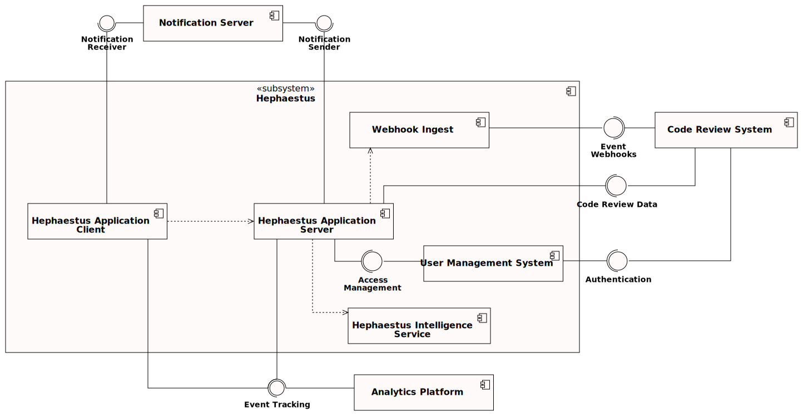
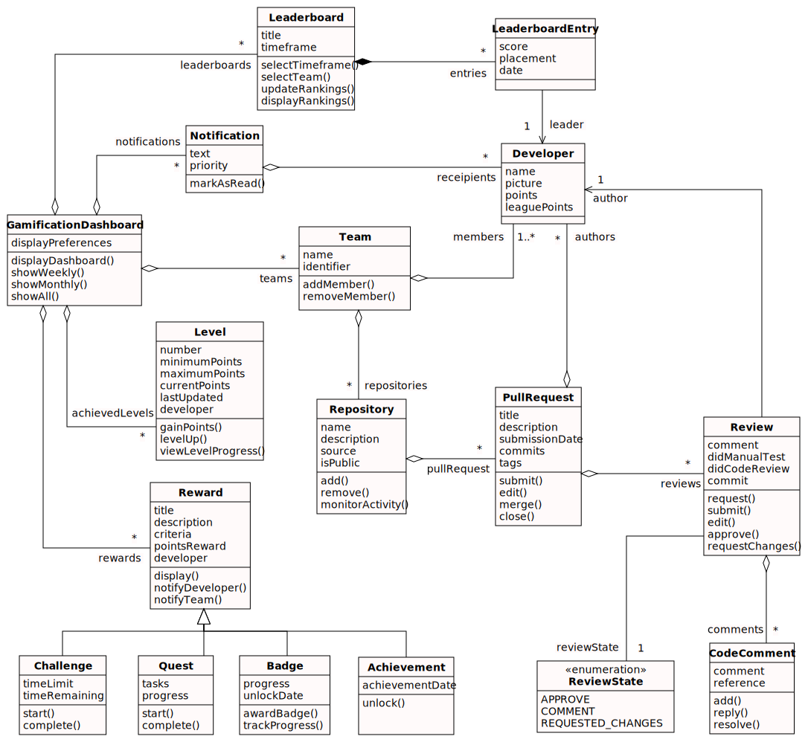
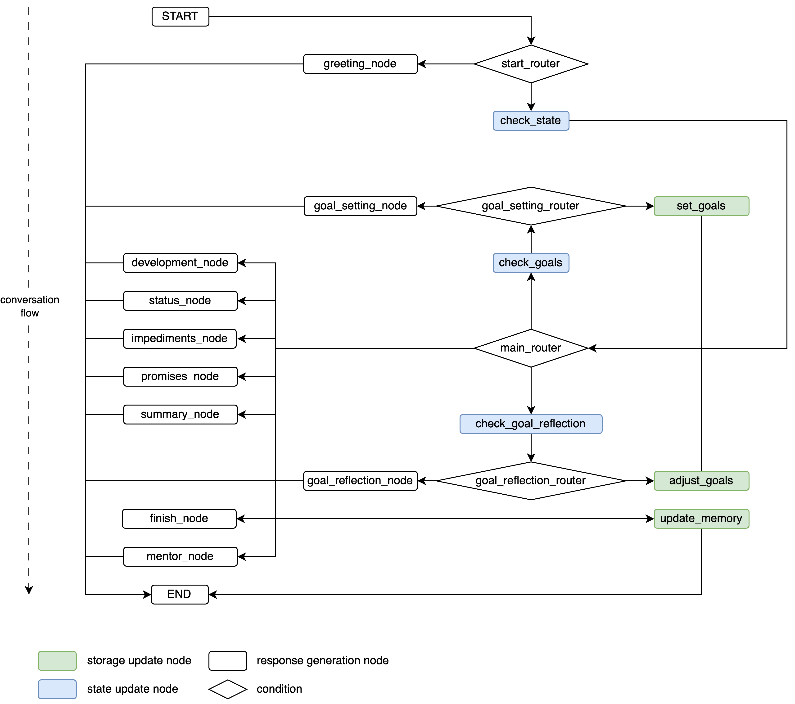
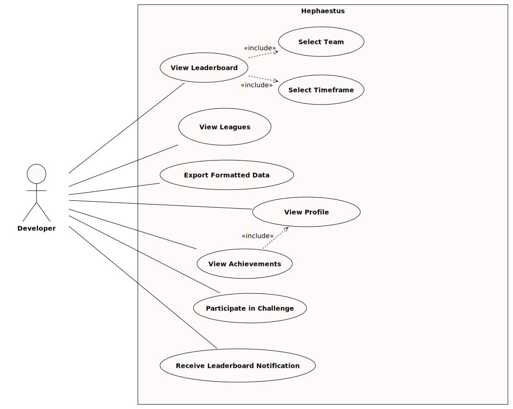
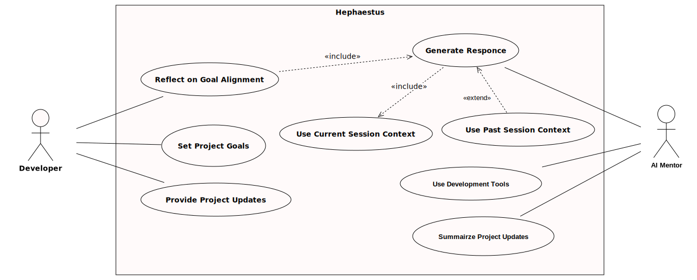
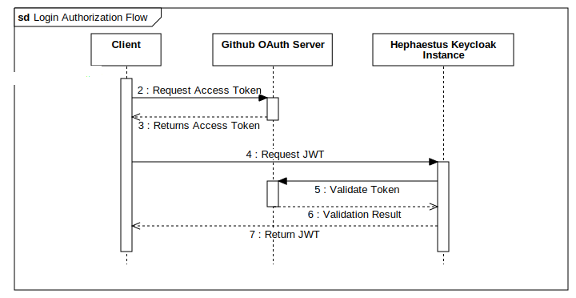
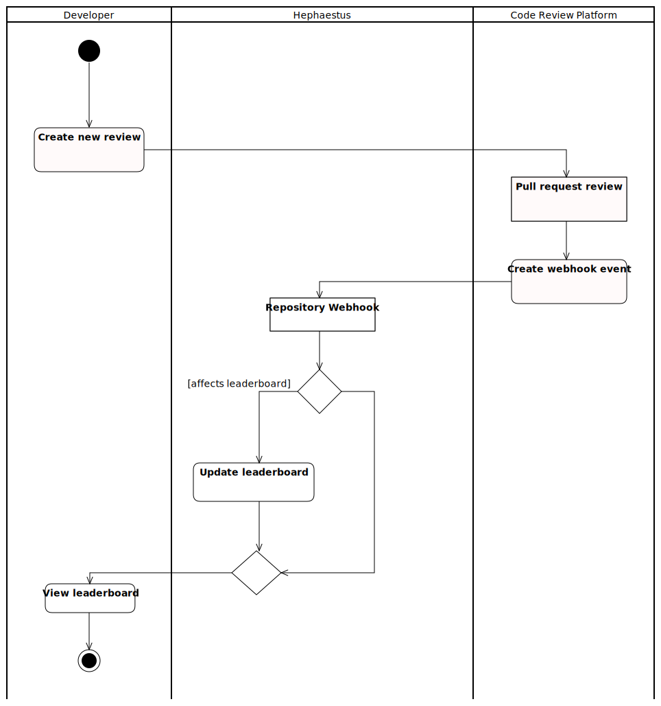

Hephaestus follows an architecture-first approach. All diagrams originate from a shared StarUML project that you can [download as `hephaestus-system-model.mdj`](/files/hephaestus-system-model.mdj).

:::tip Update the source of truth
Open the `.mdj` file in StarUML, adjust the relevant diagram, then export the SVG back into `docs/contributor/img/system-design`. Keep filenames stable so existing embeds stay intact.
:::

## Top-level architecture

The platform is intentionally layered. Internally we distinguish between:

- **Application Server** - Spring Boot, integrates with Git providers, manages the leaderboard, and exposes the primary REST API.
- **Intelligence Service** - FastAPI + LangGraph powered mentor logic that produces conversational guidance and artifacts.
- **Webhook Ingest** - NATS-based ingestion for GitHub events, decoupling external webhooks from downstream processing.
- **User Management** - Keycloak identity realm configured with GitHub as identity provider.

Externally we integrate with code hosting (GitHub today, GitLab planned), Slack/email notifications, and the analytics stack used for anonymised usage metrics. Data enters through webhooks, gets enriched via API calls, and surfaces in the React client.

## Gamification model

The analysis object model maps GitHub webhook payloads to Hephaestus entities. Core classes (`Review`, `PullRequest`, `Developer`) mirror GitHub data, while `Leaderboard`, `Reward`, and `GamificationDashboard` extend the model for competitions.

The original webhook events contain redundant fields, so we normalise them into dedicated entities. Around that core we layer abstractions for leaderboards, rewards, and dashboards that keep gamification state cohesive and queryable.

## AI mentor architecture

The mentor relies on LangGraph nodes that update storage, generate responses, and maintain state. Conditional edges decide which node executes next based on the conversation context.

Each call to the mentor executes the graph: storage update nodes persist longitudinal context, response nodes craft user-facing replies, state nodes mutate the TypedDict that represents the conversation, and conditional edges steer the flow. The result is a predictable yet adaptive mentoring experience.

## User interaction flows

These use case diagrams model the primary developer interactions with the platform, from leaderboard browsing to mentor sessions.

We model the developer as the primary actor: configuring workspaces, reviewing pull requests, receiving mentor guidance, and engaging with competitions. The diagrams capture how a user moves between dashboards, mentor sessions, and notifications across a typical sprint.

The combined journey map highlights how onboarding, weekly rituals, and review feedback interleave across gamification and mentoring features.

## Core workflows

### Login and authorisation

The login flow leverages GitHub OAuth via Keycloak. Successful login grants access tokens for both the client and application server.

### New review activity

Webhook events trigger data ingestion via the webhook ingest service. The application server enriches the data and recalculates leaderboard standings in real time.

These workflows highlight the two critical loops: authenticating via GitHub (producing application + mentor tokens) and streaming review events through ingest → enrichment → leaderboard updates. Keeping these diagrams current avoids surprises when we extend integrations.
