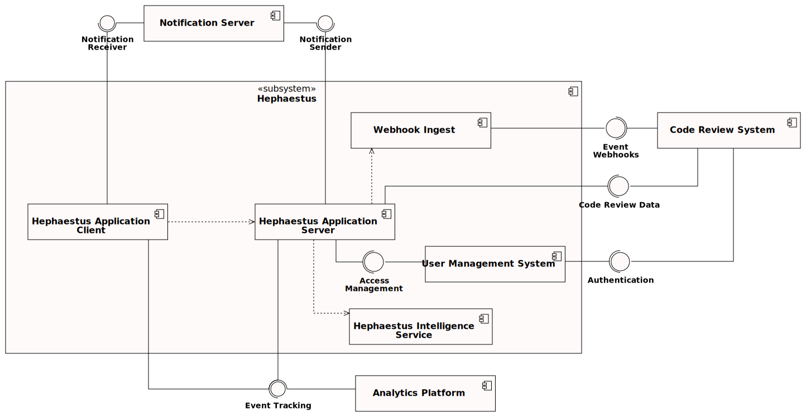
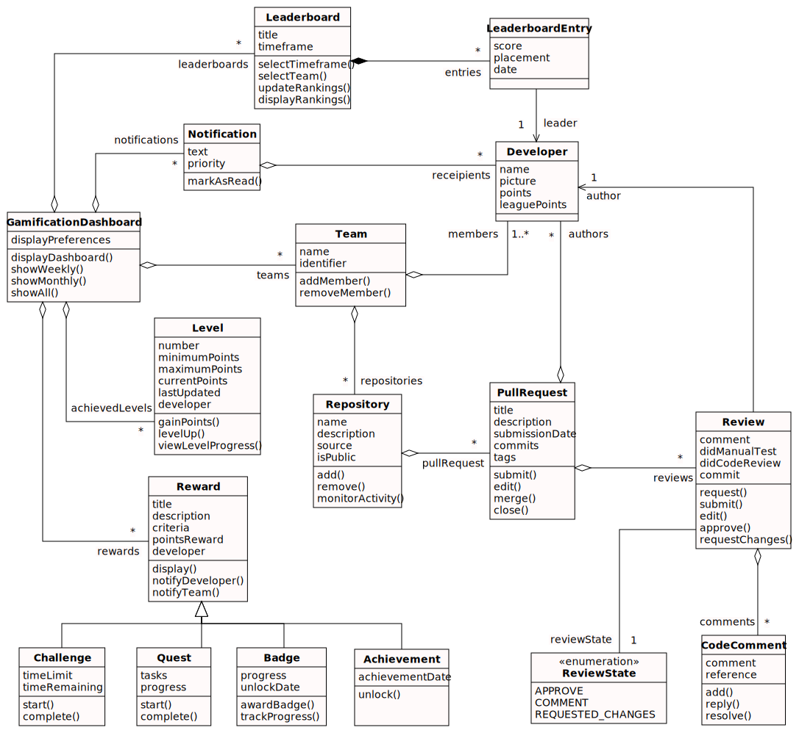
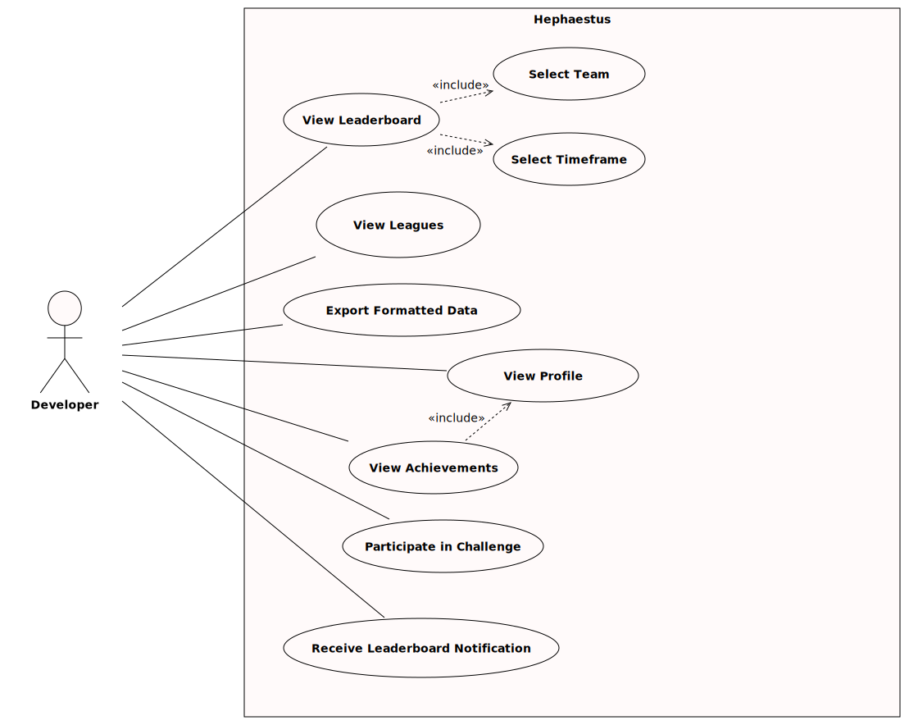
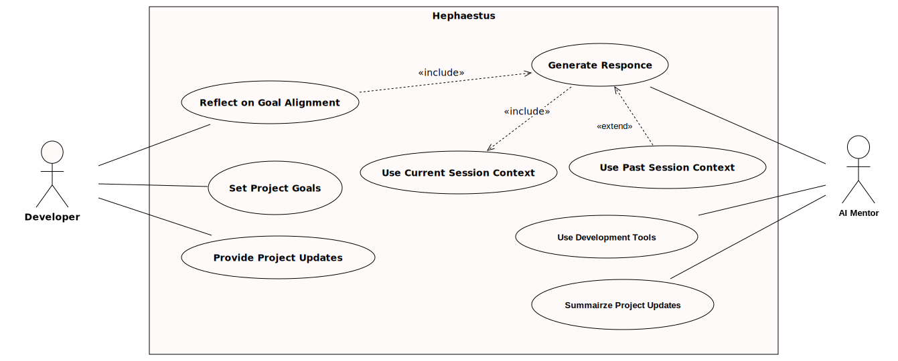
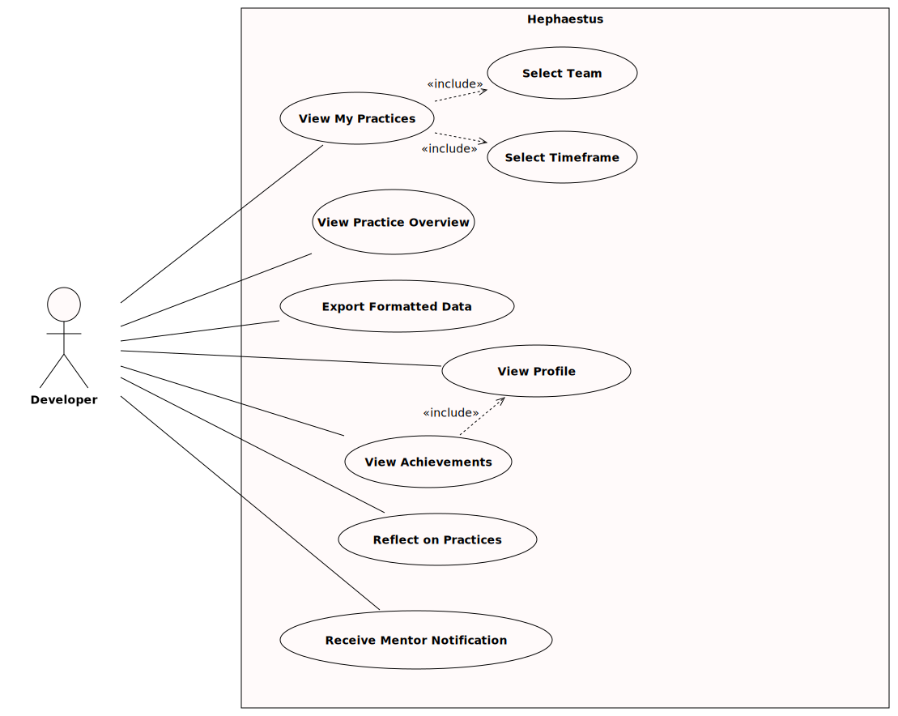

Hephaestus follows an architecture-first approach. Top-level diagrams (architecture and domain model) are maintained as [HyLiMo](https://hylimo.github.io) files in `docs/diagrams/` — run `npm run docs:render-diagrams` to regenerate SVGs. Detailed workflow diagrams below originate from a shared StarUML project that you can [download as `hephaestus-system-model.mdj`](/files/hephaestus-system-model.mdj).

:::tip Update the source of truth
For workflow diagrams: open the `.mdj` file in StarUML, adjust the relevant diagram, then export the SVG back into `docs/contributor/img/system-design`. For architecture and domain model: edit the `.hyl` files in `docs/diagrams/` and re-render.
:::

## Top-level architecture

The canonical architecture diagram lives in [`docs/diagrams/architecture.hyl`](https://github.com/ls1intum/Hephaestus/blob/main/docs/diagrams/architecture.hyl) — see the [Conceptual Model](/contributor/conceptual-model#architecture) for the rendered version and data flow descriptions.

The legacy StarUML diagram below predates the canonical version and covers the same ground at a lower level of abstraction:

The platform is intentionally layered. Internally we distinguish between:

- **Application Server** — Spring Boot, integrates with code platforms, manages the leaderboard, and exposes the primary REST API.
- **Intelligence Service** — TypeScript + Hono guidance logic that powers the AI mentor and produces conversational artifacts.
- **Webhook Ingest** — Event ingestion for GitHub/GitLab webhooks, decoupled from downstream processing via a message broker.
- **Agent Sandbox** — Isolated Docker containers running AI agents (Claude Code, OpenCode) for practice detection.
- **User Management** — Keycloak identity realm configured with GitHub as identity provider.

Externally we integrate with code hosting (GitHub and GitLab), Slack notifications, and the analytics stack used for anonymised usage metrics. Data enters through webhooks, gets enriched via API calls, and surfaces in the React client.

## Engagement & recognition model

The analysis object model maps webhook payloads to Hephaestus entities. Core classes (`Review`, `PullRequest`, `Contributor`) mirror code platform data, while `Leaderboard`, `Reward`, and `Dashboard` extend the model for competitions.

The original webhook events contain redundant fields, so we normalise them into dedicated entities. Around that core we layer abstractions for leaderboards, rewards, and dashboards that keep engagement state cohesive and queryable.

## AI mentor architecture

The mentor relies on LangGraph nodes that update storage, generate responses, and maintain state. Conditional edges decide which node executes next based on the conversation context.

Each call to the mentor executes the graph: storage update nodes persist longitudinal context, response nodes craft user-facing replies, state nodes mutate the TypedDict that represents the conversation, and conditional edges steer the flow. The result is a predictable yet adaptive guidance experience.

## User interaction flows

These use case diagrams model the primary contributor interactions with the platform, from leaderboard browsing to AI mentor sessions.

We model the contributor as the primary actor: configuring workspaces, reviewing pull requests, receiving guidance, and engaging with competitions. The diagrams capture how a user moves between dashboards, AI mentor sessions, and notifications across a typical week.

The combined journey map highlights how onboarding, weekly rituals, and review feedback interleave across engagement and guidance features.

## Core workflows

### Login and authorisation

The login flow leverages GitHub OAuth via Keycloak. Successful login grants access tokens for both the client and application server.

### New review activity

Webhook events trigger data ingestion via the webhook ingest service. The application server enriches the data and recalculates leaderboard standings in real time.

These workflows highlight the two critical loops: authenticating via GitHub (producing application + mentor tokens) and streaming review events through ingest → enrichment → leaderboard updates. Keeping these diagrams current avoids surprises when we extend integrations.
