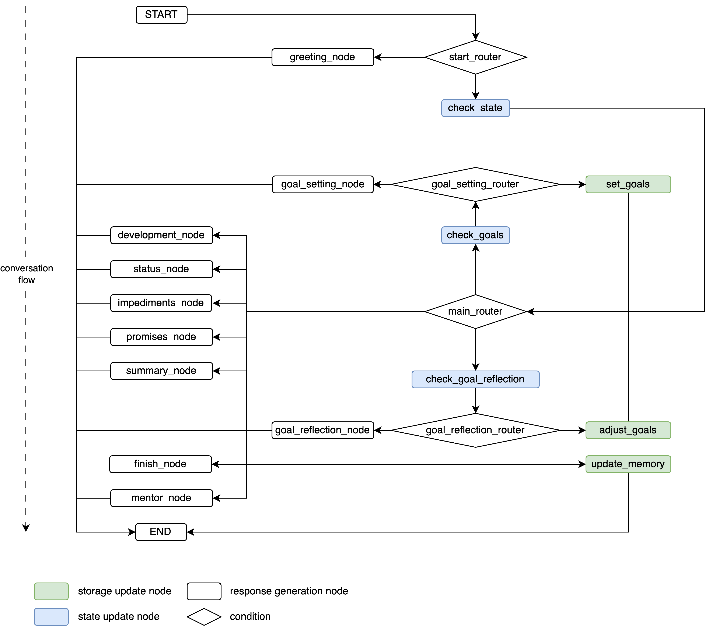
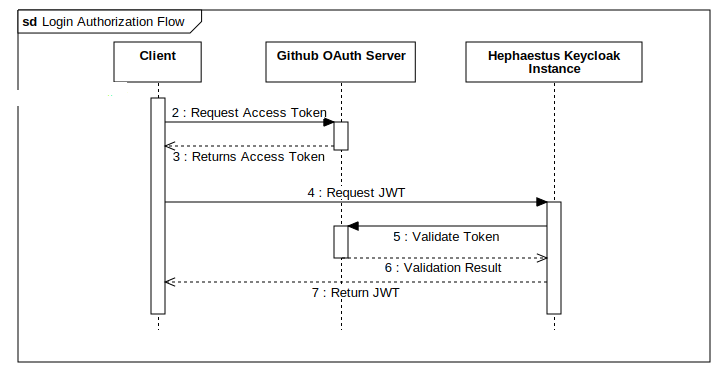
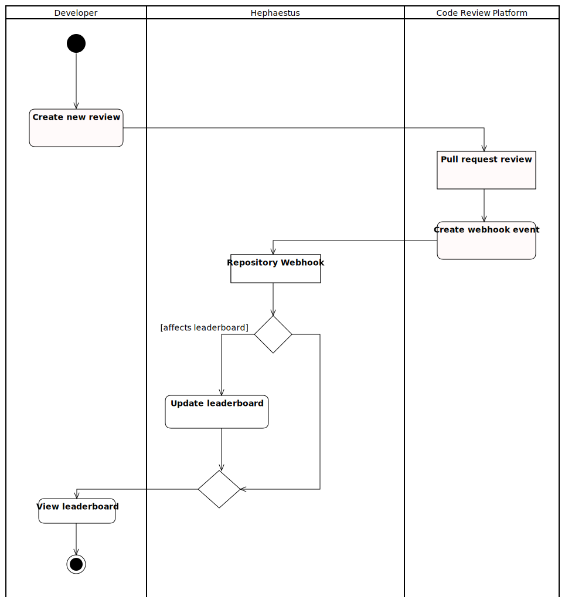

The canonical view of Hephaestus lives in the [Conceptual Model](/contributor/conceptual-model): a seven-entity domain model and a component-level architecture rendered from [HyLiMo](https://hylimo.github.io) sources in [`docs/diagrams/`](https://github.com/ls1intum/Hephaestus/tree/main/docs/diagrams). Run `npm run docs:render-diagrams` after editing a `.hyl` file to regenerate the SVGs.

This page covers the workflow-level diagrams that complement the canonical model — login and authorisation, ingest, and the AI mentor's runtime structure.

:::tip Where to edit

- **Architecture and domain model** — edit `docs/diagrams/*.hyl` and re-render.
- **Workflow diagrams below** — maintained in a shared StarUML project: [download `hephaestus-system-model.mdj`](/files/hephaestus-system-model.mdj), adjust the diagram, then export the SVG back into `docs/contributor/img/system-design`.

:::

## Service layout

The platform is layered into five services. See the canonical [architecture diagram](/contributor/conceptual-model#architecture) for the component view and data flows; the responsibilities are:

- **Application Server** — Spring Boot. Integrates with code platforms, owns the practice catalog and findings, exposes the primary REST API.
- **Intelligence Service** — TypeScript + Hono. Powers the AI mentor and conversational artifacts.
- **Webhook Ingest** — Event ingestion for GitHub/GitLab webhooks, decoupled from downstream processing via a message broker.
- **Agent Sandbox** — Isolated Docker containers running AI agents (Claude Code, OpenCode) for practice detection.
- **User Management** — Keycloak identity realm configured with GitHub as identity provider.

Externally Hephaestus integrates with code hosting (GitHub primary, GitLab partial), Slack notifications, and an analytics stack for anonymised usage metrics.

## AI mentor architecture

The mentor relies on LangGraph nodes that update storage, generate responses, and maintain state. Conditional edges decide which node executes next based on the conversation context.

Each call to the mentor executes the graph: storage update nodes persist longitudinal context, response nodes craft user-facing replies, state nodes mutate the TypedDict that represents the conversation, and conditional edges steer the flow.

## Core workflows

### Login and authorisation

The login flow uses GitHub OAuth via Keycloak. Successful login grants access tokens for both the webapp and application server.

### New review activity

Webhook events trigger ingestion via the webhook-ingest service. The application server enriches the data, persists activity events, and updates downstream surfaces (practice findings, profile, leaderboard).
