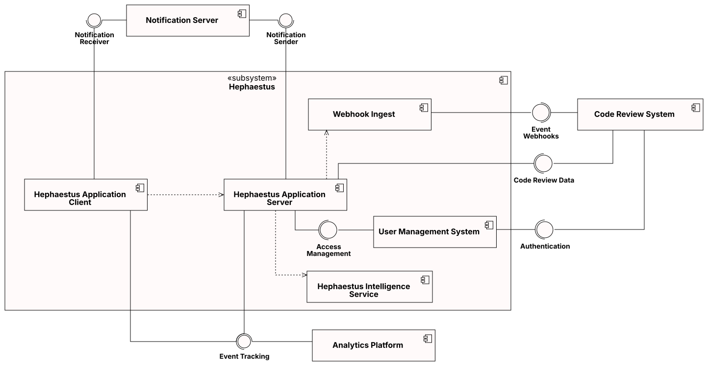
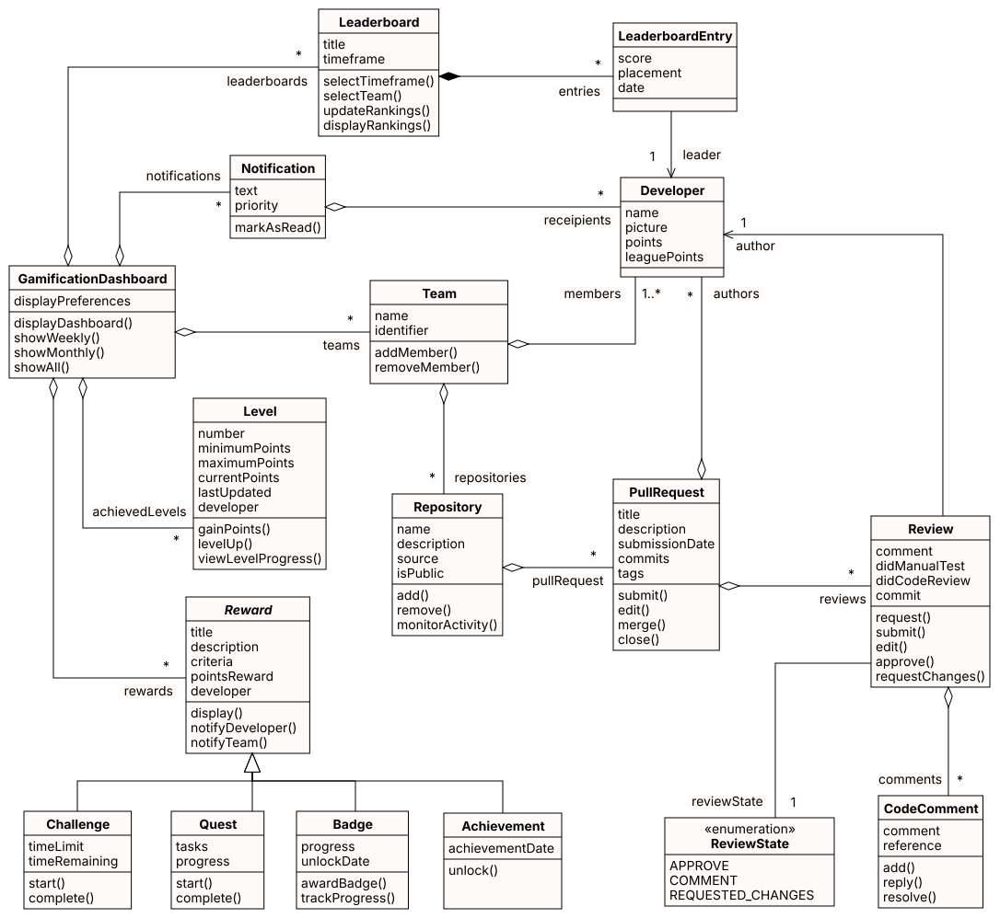
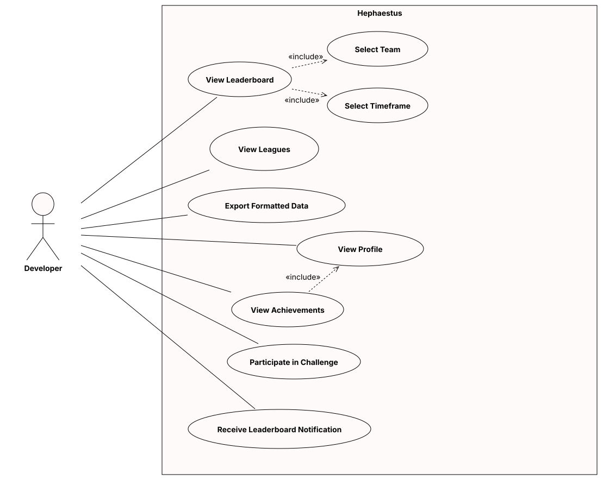
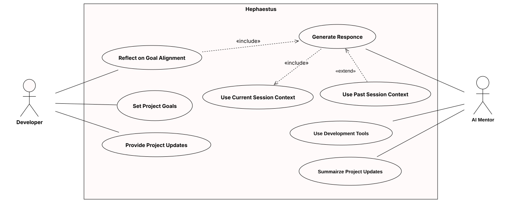
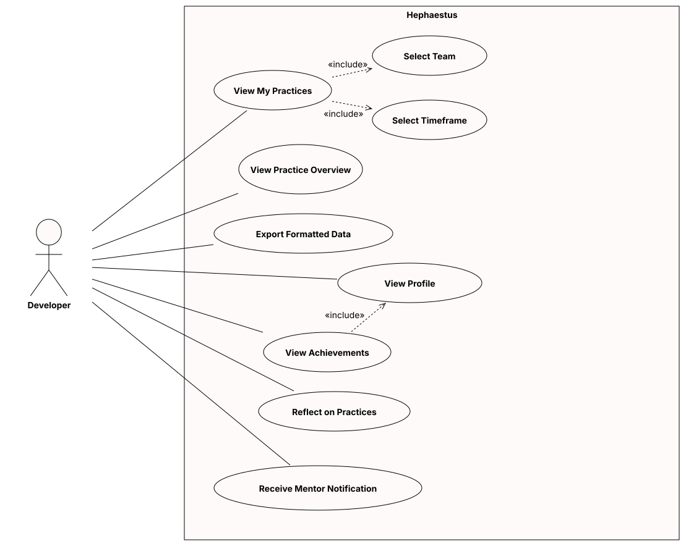
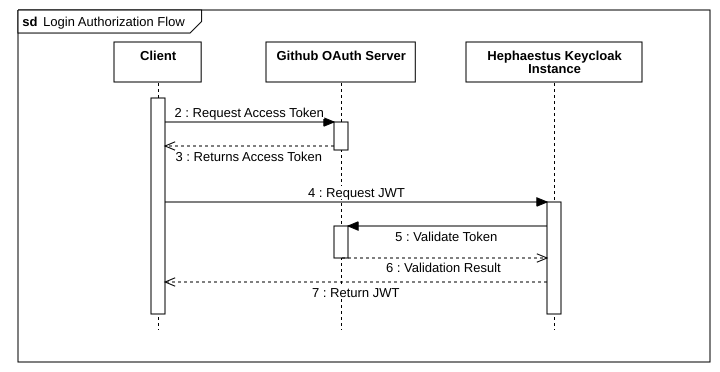
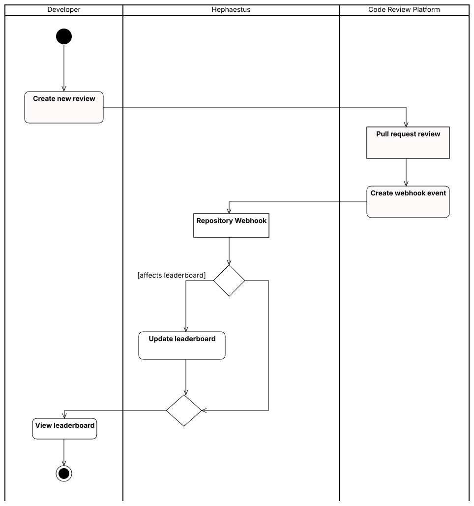

Hephaestus follows an architecture-first approach. All diagrams originate from a shared StarUML project that you can [download as `hephaestus-system-model.mdj`](/files/hephaestus-system-model.mdj).

:::tip Update the source of truth
Open the `.mdj` file in StarUML, adjust the relevant diagram, then export the SVG back into `docs/contributor/img/system-design`. Keep filenames stable so existing embeds stay intact.
:::

## Top-level architecture

The platform is intentionally layered. Internally we distinguish between:

- **Application Server** - Spring Boot, integrates with Git providers, manages the leaderboard, exposes the primary REST API, and runs the Pi mentor agent in-process (streaming to clients via SSE).
- **Webhook Server** - same image as Application Server, activated with `SPRING_PROFILES_ACTIVE=prod,webhook` so only the inbound webhook receiver beans load. Restart-independent from Application Server; publishes to the same NATS JetStream streams that the sync consumer reads. See ADR 0008.
- **User Management** - Hephaestus-native auth: Spring Security `oauth2Login` federates to GitHub / gitlab.lrz.de, then issues a cookie-session JWT (ADR 0017). Accounts + federated identity links live in the application database.

Externally we integrate with code hosting (GitHub and GitLab), Slack/email notifications, and the analytics stack used for anonymised usage metrics. Data enters through webhooks, gets enriched via API calls, and surfaces in the React client.

## Gamification model

The analysis object model maps GitHub webhook payloads to Hephaestus entities. Its core classes — review, pull request, developer — mirror GitHub data, while leaderboard, reward and dashboard classes extend the model for competitions. These are names on the diagram, not a guide to the Java packages.

The original webhook events contain redundant fields, so we normalise them into dedicated entities. Around that core we layer abstractions for leaderboards, rewards, and dashboards that keep gamification state cohesive and queryable.

## AI mentor architecture

The mentor runs on the Pi runtime, in-process on the application server, streaming to clients over SSE.
[Unified Pi runtime](./unified-pi-runtime.mdx) is the source of truth for its structure.

## User interaction flows

These use case diagrams model the primary developer interactions with the platform, from leaderboard browsing to mentor sessions.

We model the developer as the primary actor: configuring workspaces, reviewing pull requests, receiving mentor guidance, and engaging with competitions. The diagrams capture how a user moves between dashboards, mentor sessions, and notifications across a typical sprint.

The combined journey map highlights how onboarding, weekly rituals, and review feedback interleave across gamification and mentoring features.

## Core workflows

### Login and authorisation

The login flow uses GitHub (and optionally gitlab.lrz.de) OAuth directly. On success the server mints a short-lived ES256 cookie-session JWT; the SPA reads `GET /user` (no token in the browser).

### New review activity

Webhook events arrive at the `webhook-server` container (the application-server image running under `SPRING_PROFILES_ACTIVE=prod,webhook`), which verifies the signature/token and publishes to NATS JetStream. The application-server's sync consumer reads the stream, enriches the data, and recalculates leaderboard standings in real time. The two containers are restart-independent — see ADR 0008.

These workflows highlight the two critical loops: authenticating via GitHub (producing application + mentor tokens) and streaming review events through ingest → enrichment → leaderboard updates. Keeping these diagrams current avoids surprises when we extend integrations.
