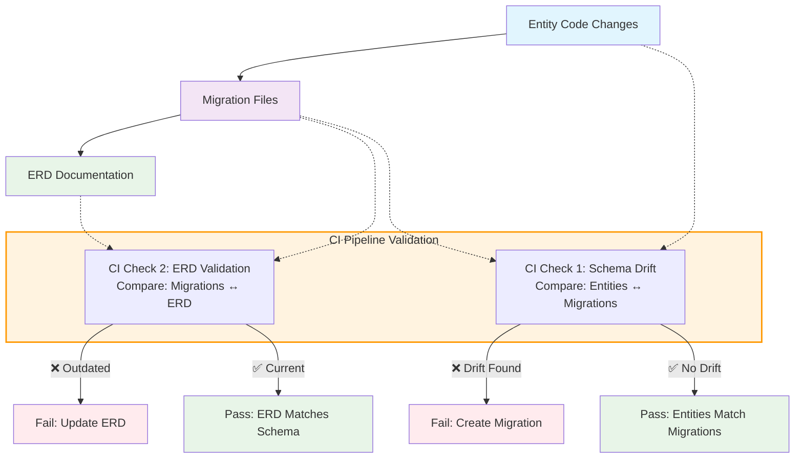

# Database Migration Guide

## Quick Start

**Essential workflow for creating database migrations:**

1. **Create/modify JPA entities** with proper annotations

2. **Generate migration:**

```bash
npm run db:draft-changelog
```

3. **VALIDATE & edit** the generated `changelog_new.xml` (critical!)

4. **Rename and move** the file:

```bash
# Use the changeset ID from the XML file as filename
mv server/application-server/src/main/resources/db/changelog_new.xml \
   server/application-server/src/main/resources/db/changelog/1749286026779_changelog.xml
```

5. **Update documentation:**

```bash
npm run db:generate-erd-docs
```

6. **Commit and create PR:**

```bash
git add . && git commit -m "Add migration for user entity changes"
```

```{danger}
**⚠️ ALWAYS VALIDATE**: Generated migrations can contain data-destructive operations! See [validation checklist](#validation-checklist) below.
```

## Why Migrations?

Database migrations ensure schema changes are versioned, reviewable, and safely deployable across all environments. Without them, team members would have inconsistent database states leading to errors and deployment issues.

## Development Workflow

### 1. Prototyping Phase

- Modify JPA entities as needed
- Use `spring.jpa.hibernate.ddl-auto=update` (default) for automatic schema updates
- Test locally without creating migrations

### 2. Production-Ready Phase

When ready to share changes:

```bash
# Generate migration from your entity changes
npm run db:draft-changelog
```

### 3. Validate Generated Migration

**This is the most critical step** - generated migrations often contain errors:

#### Validation Checklist

- [ ] **No data loss**: Check for `dropColumn` + `addColumn` pairs (should be `renameColumn`)
- [ ] **Correct author**: Replace "user (generated)" with your GitHub username
- [ ] **Clean sequences**: New sequences start at `1`, not current DB values
- [ ] **No system objects**: Remove any `pg_*` or `information_schema*` tables
- [ ] **Correct order**: Columns before indexes before constraints

#### Common Issues to Fix

```xml
<!-- ❌ Data loss pattern -->
<dropColumn tableName="user" columnName="first_name"/>
<addColumn tableName="user">
    <column name="firstName" type="VARCHAR(255)"/>
</addColumn>

<!-- ✅ Safe rename -->
<renameColumn tableName="user"
              oldColumnName="first_name"
              newColumnName="firstName"/>
```

### 4. Finalize Migration

```bash
# Rename using changeset ID from the XML
mv server/application-server/src/main/resources/db/changelog_new.xml \
   server/application-server/src/main/resources/db/changelog/1749286026779_changelog.xml

# Update documentation
npm run db:generate-erd-docs

# Commit changes
git add . && git commit -m "Add migration for user entity changes"
```

## Examples

### Adding a New Field

**1. Modify Entity:**

```java
@Entity
public class User {
    // ...existing fields...
    @NonNull
    private String email;  // ← New field
}
```

**2. Generate & Validate Migration:**

```bash
npm run db:draft-changelog
```

Then review `changelog_new.xml`, fix author, validate content.

**3. Expected Migration:**

```xml
<changeSet author="yourusername" id="1749286026779-1">
    <addColumn tableName="user">
        <column name="email" type="VARCHAR(255)">
            <constraints nullable="false"/>
        </column>
    </addColumn>
</changeSet>
```

### Creating a New Entity

**1. Create Entity:**

```java
@Entity
@Table(name = "notification")
public class Notification {
    @Id
    @GeneratedValue(strategy = GenerationType.IDENTITY)
    private Long id;

    @NonNull
    private String message;

    @ManyToOne
    @JoinColumn(name = "user_id")
    private User user;
}
```

**2. Generate migration and follow the same validation process.**

## Best Practices

- **One logical change per migration**
- **Test migrations on fresh database**
- **Keep changeset IDs descriptive**
- **Always validate generated content**
- **Update ERD documentation after moving migration files**

## Advanced Topics

### Manual Migration Editing

For complex data transformations:

```xml
<changeSet author="yourusername" id="1234567890123-1">
    <!-- Add new column -->
    <addColumn tableName="user">
        <column name="status_new" type="VARCHAR(50)"/>
    </addColumn>

    <!-- Convert data -->
    <sql>
        UPDATE user SET status_new = CASE
            WHEN status = '1' THEN 'ACTIVE'
            WHEN status = '0' THEN 'INACTIVE'
            ELSE 'UNKNOWN'
        END;
    </sql>

    <!-- Replace old column -->
    <dropColumn tableName="user" columnName="status"/>
    <renameColumn tableName="user"
                  oldColumnName="status_new"
                  newColumnName="status"/>
</changeSet>
```

### CI Pipeline Integration

The CI pipeline validates database consistency with **two independent checks**:

#### 1. Schema Drift Detection

- **What it checks**: JPA entity code ↔ committed migrations
- **Purpose**: Ensures entity changes have corresponding migrations  
- **Failure scenario**: You modified entities but didn't create/commit migrations
- **Fix**: Run `npm run db:draft-changelog` and commit the generated migration

#### 2. ERD Documentation Validation  

- **What it checks**: Committed migrations ↔ committed ERD documentation
- **Purpose**: Ensures documentation reflects the actual migration-based schema
- **Failure scenario**: Migrations were updated but ERD documentation wasn't regenerated
- **Fix**: Run `npm run db:generate-erd-docs` and commit the updated ERD

#### Key Understanding



**Important**: ERD documentation always reflects the **migration-based schema**, not entity code changes. This ensures the ERD shows the actual database state that would be created in production.

## Resources

- [Liquibase Documentation](https://docs.liquibase.com/home.html)
- [Spring Data JPA Reference](https://docs.spring.io/spring-data/jpa/docs/current/reference/html/)
- [Jakarta Persistence Guide](https://jakarta.ee/specifications/persistence/)
