# Database Migration Guide

## ⚡ Quick Reference

**Already know the basics? Here's the essential workflow:**

```bash
# 1. Create/modify JPA entities with @NonNull annotations
# 2. Generate migration file
npm run db:draft-changelog

# 3. Edit changelog_new.xml:
#    - Change author from "(generated)" to your GitHub username
#    - Use changeset ID as filename (e.g., 1749286026779_changelog.xml)
#    - Move to server/application-server/src/main/resources/db/changelog/
#    - Ensure no data loss patterns (see validation section below)
#    - Fix any issues that were wrongly generated by the liquibase:diff command 

# 4. Update documentation
npm run db:generate-erd-docs

# 5. Commit and create PR to develop branch
```

```{warning}
**🚨 CRITICAL**: Always validate your generated migration! Look for data-loss patterns like `dropColumn` + `addColumn` (should be `renameColumn`), redundant default values, and incorrect sequence start values. See [Migration Validation](#migration-validation-critical-issues-to-check) section below.
```

---

## 🎯 What You'll Learn

This guide will teach you everything you need to know about database schema management in Hephaestus. By the end, you'll understand:

- **Why** we use database migrations instead of just changing code
- **How** to safely evolve database schemas during development
- **When** to generate migrations and update documentation
- **What** to do when things go wrong

## 🤔 Why Database Migrations?

Imagine you're working on a team project where everyone has their own copy of the database. Without migrations:

- 👨‍💻 Alice adds a new table column locally
- 👩‍💻 Bob pulls Alice's code but his database doesn't have the new column
- 💥 Bob's application crashes with "column doesn't exist" errors
- 😤 The team spends hours debugging environment issues

**Database migrations solve this by:**

- 📝 Recording every schema change as a versioned script
- 🔄 Ensuring everyone's database stays in sync
- 📋 Making schema changes reviewable like code changes
- 🚀 Enabling safe production deployments

## 🔧 How It Works: The Big Picture

```mermaid
graph TD
    A[🏗️ Change JPA Entity] --> B[🖥️ Test Locally with Hibernate]
    B --> C[✅ Ready for PR?]
    C -->|No| A
    C -->|Yes| D[🔄 Create Migration File]
    D --> E[✏️ Edit & Finalize Migration]
    E --> F[📁 Move to Changelog Directory]
    F --> G[📊 Update ERD Documentation]
    G --> H[✍️ Commit & Create PR]
    H --> I[🤖 CI Validates Migration]
    I -->|❌ Failed| J[🔧 Fix Issues]
    J --> D
    I -->|✅ Passed| K[🎉 Merge to Develop]
```



## 🚀 Quick Start for New Contributors

### Step 1: Understand the Two Development Modes

We use **two different approaches** depending on what you're doing:

#### 🏗️ **Development Mode** (Default)

_Configuration: `spring.jpa.hibernate.ddl-auto=update`_

- **When**: Prototyping, learning, experimenting
- **How**: Hibernate automatically updates your local database schema
- **Pro**: Fast iteration, no migration complexity
- **Con**: Changes aren't captured for teammates

#### 🚢 **Production Mode**

_Configuration: `spring.jpa.hibernate.ddl-auto=none`_

- **When**: Preparing code for production
- **How**: All changes go through Liquibase migrations
- **Pro**: Safe, reviewable, reproducible
- **Con**: Slower development cycle

```{tip}
**Start in Development Mode** for rapid prototyping, then switch to Production Mode when you're ready to share changes with the team.
```

### Step 2: Your Development Workflow

#### Phase 1: Rapid Development 🏃‍♂️

```bash
# 1. Modify your JPA entities (e.g., add @NonNull, new @Entity)
# 2. Start your application - Hibernate auto-updates the schema (no migration needed)
# 3. Test your changes
# 4. Iterate quickly
```

#### Phase 2: Preparing for Production 🎯

```bash
# 1. Generate initial migration draft
npm run db:draft-changelog

# 2. Review and edit the generated changelog_new.xml file
#    - Update author from "(generated)" to your GitHub username
#    - Verify the changes match your entity modifications

# 3. Rename file using the timestamp from the changeset ID
#    Example: 1749286026779_changelog.xml

# 4. Move file to the correct directory
#    server/application-server/src/main/resources/db/changelog/

# 5. Update ERD documentation (IMPORTANT: do this after moving the file!)
npm run db:generate-erd-docs

# 6. Commit and create PR
```

```{warning}
The migration is **not complete** after running `npm run db:draft-changelog`. You must manually edit, rename, and move the file before it can be used! Always validate the generated migration content, see [Migration Validation](#migration-validation-critical-issues-to-check) section below.
```

## 📚 Deep Dive: Available Commands

### Command Cheat Sheet

| Command                           | When to Use               | What It Does                                               | Duration    |
| --------------------------------- | ------------------------- | ---------------------------------------------------------- | ----------- |
| `npm run db:draft-changelog`      | 🚀 **Before every PR**    | Creates `changelog_new.xml` file (requires manual editing) | ~30 seconds |
| `npm run db:generate-erd-docs`    | 📊 **During development** | Updates documentation only                                 | ~10 seconds |

```{important}
**"Generate migration"** means creating a `changelog_new.xml` file that you must review, edit, rename, and move to the correct directory. It's not ready to use immediately!
```

### 🔍 What Happens Under the Hood

#### Migration Generation Process

```mermaid
sequenceDiagram
    participant D as Developer
    participant S as Script
    participant DB as Database
    participant L as Liquibase

    D->>S: npm run db:draft-changelog
    S->>DB: Stop & backup current data
    S->>DB: Start fresh database
    S->>L: Apply existing migrations
    S->>L: Compare JPA entities vs schema
    L->>S: Generate changelog_new.xml
    S->>DB: Restore original data
    S->>D: 📄 Review and edit required
    D->>D: Edit author name, review changes
    D->>D: Rename file using changeset ID
    D->>D: Move to changelog directory
    D->>D: Update ERD documentation
```



### 📁 Understanding the Generated Files

When you run migration commands, you'll see these files:

#### 1. Migration File: `changelog_new.xml`

```xml
<?xml version="1.1" encoding="UTF-8" standalone="no"?>
<databaseChangeLog xmlns="http://www.liquibase.org/xml/ns/dbchangelog" xmlns:ext="http://www.liquibase.org/xml/ns/dbchangelog-ext" xmlns:pro="http://www.liquibase.org/xml/ns/pro" xmlns:xsi="http://www.w3.org/2001/XMLSchema-instance" xsi:schemaLocation="http://www.liquibase.org/xml/ns/dbchangelog-ext http://www.liquibase.org/xml/ns/dbchangelog/dbchangelog-ext.xsd http://www.liquibase.org/xml/ns/pro http://www.liquibase.org/xml/ns/pro/liquibase-pro-latest.xsd http://www.liquibase.org/xml/ns/dbchangelog http://www.liquibase.org/xml/ns/dbchangelog/dbchangelog-latest.xsd">
    <changeSet author="felixdietrich (generated)" id="1749286026779-1">
        <addColumn tableName="issue">
            <column name="short_description" type="varchar(255)"/>
        </addColumn>
    </changeSet>
</databaseChangeLog>
```

**🎯 What you need to do:**

1. **Review**: Make sure it matches your entity changes
2. **Update author**: Replace `(generated)` with your GitHub username
3. **Rename**: Use the changeset ID as filename → `1749286026779_changelog.xml`
4. **Move**: Place in `server/application-server/src/main/resources/db/changelog/`
5. **Update ERD**: Run `npm run db:generate-erd-docs` after moving the file

#### 2. ERD Documentation: `dev/database/schema.mmd`


This auto-generates a visual diagram of your database structure that appears in the documentation.

## 🛠️ Step-by-Step Examples

### Example 1: Adding a New Field

Let's say you want to add an `email` field to the `User` entity.

#### Step 1: Modify Your Entity

```java
@Entity
public class User {
    // ... existing fields ...

    @NonNull
    private String email;  // ← New field

    // ... getters/setters ...
}
```

#### Step 2: Test Locally

```bash
# Start your application - Hibernate will add the column automatically
# Test your changes to make sure everything works
```

#### Step 3: Generate Migration

```bash
npm run db:draft-changelog
```

You'll see output like:

```console
🚀 Starting changelog diff generation...
✅ Changelog diff generated at 'src/main/resources/db/changelog_new.xml'
```

#### Step 4: Review Generated Migration

```xml
<changeSet author="felixdietrich (generated)" id="1749286026779-1">
    <addColumn tableName="user">
        <column name="email" type="VARCHAR(255)">
            <constraints nullable="false"/>
        </column>
    </addColumn>
</changeSet>
```

#### Step 5: Finalize Migration

```bash
# 1. Edit the author field: Replace "(generated)" with your GitHub username
# 2. Use the changeset ID as filename: 1749286026779_changelog.xml
# 3. Move to changelog directory
mv server/application-server/src/main/resources/db/changelog_new.xml \
   server/application-server/src/main/resources/db/changelog/1749286026779_changelog.xml

# 4. Update documentation
npm run db:generate-erd-docs
```

### Example 2: Creating a New Entity

#### Step 1: Create Entity

```java
@Entity
@Table(name = "notification")
public class Notification {
    @Id
    @GeneratedValue(strategy = GenerationType.IDENTITY)
    private Long id;

    @NonNull
    private String message;

    @ManyToOne
    @JoinColumn(name = "user_id")
    private User user;

    // ... constructors, getters, setters ...
}
```

#### Step 2: Generate Everything

```bash
# Generate migration first
npm run db:draft-changelog

# Edit and move the migration file (manual step)
# Then update documentation
npm run db:generate-erd-docs
```

#### Step 3: Review Generated Files

The migration will include:

- `createTable` for the notification table
- `addForeignKeyConstraint` for the user relationship
- Updated ERD showing the new entity and relationship

## 🚨 Troubleshooting Common Issues

```{important}
**Before debugging generation issues**: Check the [Migration Validation](#migration-validation-critical-issues-to-check) section below for common problems with **generated migration content** that can cause data loss or deployment failures.
```

This section covers issues with the migration generation **process**. For issues with migration **content**, see the validation guide below.

### Issue 1: "No differences found"

**Problem**: You modified entities but migration generation says "no differences found"

**Causes & Solutions**:

```bash
# ✅ Check 1: Are you in the right directory?
cd /path/to/Hephaestus
npm run db:draft-changelog

# ✅ Check 2: Did you annotate your entity properly?
# Make sure you have these annotations:
# @Entity
# @Table(name = "your_table")
# public class YourEntity {
#     @Id
#     private Long id;
# }

# ✅ Check 3: Did you rebuild after entity changes?
cd server/application-server
mvn compile
```

### Issue 2: "PostgreSQL connection failed"

**Problem**: Scripts can't connect to the database

**Solutions**:

```bash
# ✅ Check Docker status
docker ps | grep postgres

# ✅ Reset Docker Compose
cd server/application-server
docker compose down
docker compose up -d postgres

# ✅ Clear data directory if corrupted
rm -rf server/application-server/postgres-data
```

### Issue 3: "Migration file already exists"

**Problem**: `changelog_new.xml` already exists from previous run

**Solution**:

```bash
# Review the existing file first
cat server/application-server/src/main/resources/db/changelog_new.xml

# If it's from a previous attempt, you can safely remove it
rm server/application-server/src/main/resources/db/changelog_new.xml

# Then run migration generation again
npm run db:draft-changelog
```

### Issue 4: CI Pipeline Failures

**Problem**: Your PR fails with "Database schema changes detected"

**What CI is checking**:

```mermaid
graph TD
    A[🔍 CI Starts] --> B[📋 Apply all migrations]
    B --> C[🔄 Generate ERD from actual schema]
    C --> D[📊 Compare with committed ERD]
    D -->|Different| E[❌ Fail: ERD out of sync]
    D -->|Same| F[✅ Pass: Everything in sync]
    E --> G[💡 Run: npm run db:generate-erd-docs]
    G --> H[📝 Commit updated ERD]
```



**Fix Steps**:

```bash
# 1. Update ERD to match your migration
npm run db:generate-erd-docs

# 2. Commit the updated documentation
git add docs/dev/database/schema.mmd
git commit -m "Update database ERD documentation"

# 3. Push to your PR branch
git push
```

## 🔍 Migration Validation: Critical Issues to Check

```{danger}
**⚠️ Critical**: The `mvn liquibase:diff` command (used by our scripts) can generate incorrect or incomplete changelogs. **Always validate** your generated migrations before committing!
```

Our migration scripts use Liquibase's diff functionality under the hood to compare your JPA entities with the database schema. While powerful, this process has known limitations that can create problematic migrations if not carefully reviewed.

### 🚨 Most Common Problems & How to Spot Them

#### 1. **False Column Renames = Data Loss**

**The Problem**: Liquibase sees renamed fields as separate drop+add operations, which **destroys data**.

**Example**: You rename `firstName` to `first_name` in your entity:

```xml
<!-- ❌ DANGEROUS: This will delete all existing first names! -->
<changeSet author="you" id="123-1">
    <dropColumn tableName="user" columnName="firstName"/>
    <addColumn tableName="user">
        <column name="first_name" type="VARCHAR(255)"/>
    </addColumn>
</changeSet>
```

**✅ How to Fix**:

```xml
<!-- ✅ SAFE: This preserves data -->
<changeSet author="you" id="123-1">
    <renameColumn tableName="user"
                  oldColumnName="firstName"
                  newColumnName="first_name"/>
</changeSet>
```

**🔍 How to Check**: Look for consecutive `<dropColumn>` and `<addColumn>` operations on the same table.

#### 2. **Redundant Default Value Operations**

**The Problem**: Liquibase repeatedly tries to add default values that already exist.

**Example**:

```xml
<!-- ❌ This may appear even when default already exists -->
<changeSet author="you" id="123-2">
    <addDefaultValue tableName="user"
                     columnName="created_at"
                     defaultValueComputed="CURRENT_TIMESTAMP"/>
</changeSet>
```

**🔍 How to Check**:

- Look for `addDefaultValue` operations on timestamp columns
- Verify in your database if the default already exists: `\d+ user` in psql
- Remove redundant default value statements

#### 3. **Incorrect Sequence Start Values**

**The Problem**: Generated sequences use current database values instead of proper initial values.

**Example**:

```xml
<!-- ❌ Uses current sequence value (bad for fresh installs) -->
<changeSet author="you" id="123-3">
    <createSequence sequenceName="user_id_seq" startValue="1847"/>
</changeSet>

<!-- ✅ Should start at 1 for new installations -->
<changeSet author="you" id="123-3">
    <createSequence sequenceName="user_id_seq" startValue="1"/>
</changeSet>
```

**🔍 How to Check**: Review any `<createSequence>` elements and ensure `startValue="1"` for new sequences.

#### 4. **Dangerous Index Operations**

**The Problem**: Liquibase may try to drop and recreate primary key indexes, causing failures.

**Example**:

```xml
<!-- ❌ This will likely fail in production -->
<changeSet author="you" id="123-4">
    <dropIndex tableName="user" indexName="user_pkey"/>
    <createIndex tableName="user" indexName="user_pkey">
        <column name="id"/>
    </createIndex>
</changeSet>
```

**🔍 How to Check**:

- Remove any operations on primary key indexes (`*_pkey`)
- Only include index operations for custom indexes you actually need
- Verify index changes are intentional

#### 5. **Wrong Dependency Order**

**The Problem**: Generated changesets try to create indexes/constraints before the columns exist.

**Example**:

```xml
<!-- ❌ BAD ORDER: Index created before column -->
<changeSet author="you" id="123-5">
    <createIndex tableName="user" indexName="idx_user_email">
        <column name="email"/>
    </createIndex>
    <addColumn tableName="user">
        <column name="email" type="VARCHAR(255)"/>
    </addColumn>
</changeSet>
```

**✅ Correct Order**:

```xml
<changeSet author="you" id="123-5">
    <!-- Column first -->
    <addColumn tableName="user">
        <column name="email" type="VARCHAR(255)"/>
    </addColumn>
    <!-- Index second -->
    <createIndex tableName="user" indexName="idx_user_email">
        <column name="email"/>
    </createIndex>
</changeSet>
```

**🔍 How to Check**: Verify that columns are created before any indexes or constraints that reference them.

#### 6. **System Objects in Migration**

**The Problem**: Diff includes PostgreSQL system tables or views you don't control.

**Example**:

```xml
<!-- ❌ System objects shouldn't be in your migration -->
<changeSet author="you" id="123-6">
    <createTable tableName="pg_stat_statements">
        <!-- PostgreSQL system table -->
    </createTable>
    <createView viewName="information_schema_tables">
        <!-- System view -->
    </createView>
</changeSet>
```

**🔍 How to Check**: Remove any tables/views starting with:

- `pg_*` (PostgreSQL system objects)
- `information_schema*` (SQL standard system views)
- Objects you didn't create in your JPA entities

### ✅ Step-by-Step Validation Process

#### Step 1: Quick Scan for Red Flags

```bash
# Check for dangerous patterns in generated migration
cat server/application-server/src/main/resources/db/changelog_new.xml | grep -E "(dropColumn|addDefaultValue|startValue|pg_|information_schema)"

# If this returns results, review each one carefully!
```

#### Step 2: Validate Data Preservation

```bash
# For any dropColumn operations, verify they're not actually renames
grep -A5 -B5 "dropColumn" changelog_new.xml

# Look for corresponding addColumn operations
grep -A5 -B5 "addColumn" changelog_new.xml
```

#### Step 3: Test Migration on Clean Database

```bash
# Start completely fresh database
cd server/application-server
docker compose down
rm -rf postgres-data
docker compose up -d postgres

# Apply your migration to ensure it works
mvn liquibase:update

# Start application to verify entities work
./mvnw spring-boot:run
```

#### Step 4: Compare Entity vs Generated Schema

```bash
# Check that your JPA annotations match the generated schema
psql -h localhost -U hephaestus -d hephaestus -c "\d+ user"

# Verify column types, constraints, and indexes match your entities
```

### 🛠️ Common Fixes for Generated Migrations

#### Fix 1: Convert Drop+Add to Rename

```xml
<!-- Replace this pattern: -->
<dropColumn tableName="user" columnName="old_name"/>
<addColumn tableName="user">
    <column name="new_name" type="VARCHAR(255)"/>
</addColumn>

<!-- With this: -->
<renameColumn tableName="user"
              oldColumnName="old_name"
              newColumnName="new_name"/>
```

#### Fix 2: Remove Redundant Operations

```xml
<!-- Remove redundant default values -->
<!-- Remove unnecessary index operations -->
<!-- Remove system objects -->
```

#### Fix 3: Reorder Dependencies

```xml
<!-- Move all addColumn operations to the top -->
<!-- Move all createIndex operations to the bottom -->
<!-- Move all addForeignKeyConstraint operations last -->
```

### 📋 Pre-Commit Checklist

Before moving your `changelog_new.xml` file to the changelog directory:

- [ ] **No data loss**: No `dropColumn` without corresponding data migration
- [ ] **Clean sequences**: Start values are `1` for new sequences
- [ ] **No system objects**: Only your application tables/views
- [ ] **Correct order**: Columns before indexes before constraints
- [ ] **No redundant defaults**: Timestamp defaults aren't duplicated
- [ ] **Author updated**: Changed from "(generated)" to your GitHub username
- [ ] **Tested on clean DB**: Migration applies successfully to fresh database

### 🎯 When to Ask for Help

Ask a senior team member to review your migration if it includes:

- Any `dropColumn` operations (potential data loss)
- Complex foreign key changes
- Multiple table modifications in one changeset
- Sequence or index modifications
- Anything you're not 100% confident about

```{tip}
**Remember**: It's much easier to fix migration issues before they're merged than after they're deployed to production!
```

## 🎓 Advanced Topics

### Manual Migration Editing

Sometimes you need to customize the generated migration:

#### When to Edit Manually

- Converting data types with data transformation
- Complex data migrations
- Performance-critical changes

#### Example: Converting String to Enum

```xml
<changeSet author="your-username" id="1234567890123-1">
    <!-- Add new enum column -->
    <addColumn tableName="user">
        <column name="status_new" type="VARCHAR(50)"/>
    </addColumn>

    <!-- Convert existing data -->
    <sql>
        UPDATE user
        SET status_new = CASE
            WHEN status = '1' THEN 'ACTIVE'
            WHEN status = '0' THEN 'INACTIVE'
            ELSE 'UNKNOWN'
        END;
    </sql>

    <!-- Drop old column and rename new one -->
    <dropColumn tableName="user" columnName="status"/>
    <renameColumn tableName="user"
                  oldColumnName="status_new"
                  newColumnName="status"/>
</changeSet>
```

### Understanding the CI Pipeline

The CI pipeline ensures database integrity:

1. **Validation**: All migrations apply cleanly
2. **Verification**: Schema matches generated ERD
3. **Documentation**: ERD reflects actual database state

```{tip}
If CI fails, it will show you exactly which command to run to fix the issue. The error messages are designed to be copy-pasteable.
```

## 📖 Command Reference

### Development Commands

```bash
# Quick ERD update during development
npm run db:generate-erd-docs

# Generate migration before PR
npm run db:draft-changelog
```

### Direct Script Usage

```bash
# Use script directly for more control
./scripts/db-utils.sh help
./scripts/db-utils.sh generate-erd
./scripts/db-utils.sh draft-changelog
```

### Maven Commands (Advanced)

```bash
cd server/application-server

# Apply pending migrations
mvn liquibase:update

# Generate changelog diff
mvn liquibase:diff

# Rollback to previous version (careful!)
mvn liquibase:rollback -Dliquibase.rollbackCount=1
```

## 🎯 Best Practices Checklist

### ✅ Before Creating a PR

- [ ] Generated migration reflects your entity changes
- [ ] Migration file is properly named with timestamp
- [ ] Author field contains your GitHub username
- [ ] Migration is in the correct directory
- [ ] ERD documentation is updated
- [ ] Local application starts successfully with migrations

### ✅ Migration Quality

- [ ] One logical change per changeset
- [ ] Descriptive changeset IDs
- [ ] No manual SQL unless absolutely necessary
- [ ] Foreign keys and constraints are properly defined
- [ ] Column types match JPA annotations

### ✅ Testing

- [ ] Fresh database setup works
- [ ] Existing database update works
- [ ] No data loss during migration
- [ ] Application starts and functions correctly

## 📚 Additional Resources

- [Liquibase Documentation](https://docs.liquibase.com/home.html)
- [Jakarta Persistence Guide](https://jakarta.ee/specifications/persistence/)
- [Spring Data JPA Reference](https://docs.spring.io/spring-data/jpa/docs/current/reference/html/)

---

```{note}
Remember: Database migrations are about **safety and collaboration**. Take time to understand what you're doing rather than rushing through the steps. Your future self (and your teammates) will thank you!
```
