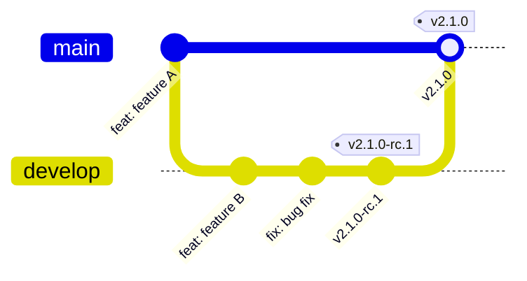
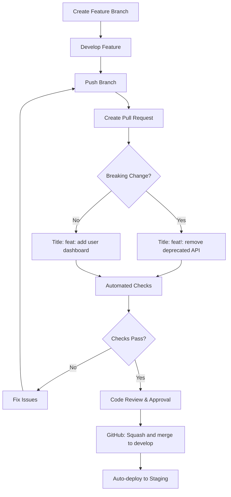
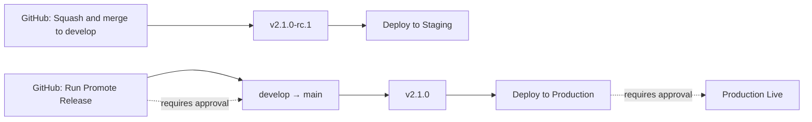

# Release Management

Two-branch workflow with semantic versioning and automated deployments.

## Workflow

## Branch Strategy

| Branch    | Releases      | Deploys To | Purpose            |
| --------- | ------------- | ---------- | ------------------ |
| `develop` | `v2.1.0-rc.1` | Staging    | Release candidates |
| `main`    | `v2.1.0`      | Production | Stable releases    |

## Release Process

### Pull Request Workflow

#### PR Requirements
- **Title format**: Must follow conventional commit format (only title matters, not individual commits)
- **Breaking changes**: Use `!` in title (e.g., `feat!: breaking API change`)
- **Merge method**: Always use "Squash and merge" in GitHub
- **Code review**: Required before merge

#### PR Automation
- **Title validation**: Enforces conventional commit format
- **Size labeling**: Auto-applies XS/S/M/L/XL/XXL based on lines changed
- **Auto-assignment**: PR author automatically assigned
- **Component labeling**: Auto-labels based on changed files

### Development

1. Create feature branch and develop
2. Push to GitHub and create PR with conventional title
3. Auto-deploys to test servers via secondary system

### Staging Release

1. **GitHub**: Squash and merge PR to `develop`
2. Triggers `v2.1.0-rc.1` release automatically  
3. Auto-deploys to staging environment

### Production Release

1. **GitHub**: Run "Promote Release" workflow (requires approval)
2. Fast-forwards `develop` to `main`
3. Triggers `v2.1.0` release automatically
4. Auto-deploys to production (requires approval)

## Commit Types

| Type        | Bump  | Description             | Example                             |
| ----------- | ----- | ----------------------- | ----------------------------------- |
| `feat:`     | Minor | New feature             | `feat: add dashboard`               |
| `fix:`      | Patch | Bug fix                 | `fix: resolve login bug`            |
| `feat!:`    | Major | Breaking change         | `feat!: breaking API change`        |
| `docs:`     | Patch | Documentation           | `docs: update API guide`            |
| `style:`    | Patch | Code formatting         | `style: fix indentation`            |
| `refactor:` | Patch | Code refactoring        | `refactor: extract helper function` |
| `perf:`     | Patch | Performance improvement | `perf: optimize query`              |
| `test:`     | None  | Tests                   | `test: add unit tests`              |
| `build:`    | Patch | Build system            | `build: update vite config`      |
| `ci:`       | None  | CI/CD changes           | `ci: update workflow`               |
| `chore:`    | Patch | Maintenance             | `chore: update dependencies`        |
| `revert:`   | Patch | Revert changes          | `revert: undo feature X`            |

## Scopes

| Scope                  | Description                | Example                                          |
| ---------------------- | -------------------------- | ------------------------------------------------ |
| `webapp`               | Angular web application    | `feat(webapp): add user profile`                 |
| `webapp-react`         | React web application      | `fix(webapp-react): resolve routing issue`       |
| `application-server`   | Java backend service       | `feat(application-server): add new API endpoint` |
| `intelligence-service` | Python AI service          | `perf(intelligence-service): optimize analysis`  |
| `webhook-ingest`       | Webhook processing service | `fix(webhook-ingest): handle invalid payloads`   |
| `docs`                 | Documentation              | `docs(docs): update setup guide`                 |
| `deps`                 | Dependencies               | `chore(deps): update React to v19`               |
| `config`               | Configuration files        | `feat(config): add new environment variable`     |

**Note:** Scopes are optional but recommended for clarity in multi-component projects.

## Automation

## Manual Operations

### Emergency Deployment

For bypassing normal release flow during incidents:

1. **GitHub Actions** → "Deploy to Production" or "Deploy to Staging"
2. Specify exact image tag or commit SHA
3. Requires approval via protected environment

### Hotfix Process

1. Create hotfix branch from `main`
2. Push branch and create PR to `main` with conventional title
3. **GitHub**: Squash and merge → immediate release (requires approval)

## Best Practices

### ✅ Critical DO's

- **Use conventional commits** - Required for automated versioning ([Conventional Commits)](https://www.conventionalcommits.org/en/v1.0.0/))
- **Test in staging first** - Never skip RC phase except for hotfixes
- **Group related features** - Bundle logically related changes in one RC

### ❌ Critical DON'Ts

- **Never push directly to `develop`/`main`** - Always use PRs
- **Never manually edit version numbers** - Breaks semantic-release
- **Never deploy without approval** - Production requires human validation

## Version Sync

Single `update_version.sh` script updates:

- Node.js packages (`webapp*/package.json`)
- Java services (`pom.xml`)
- Python services (`pyproject.toml`)
- OpenAPI specs
- Configuration files
