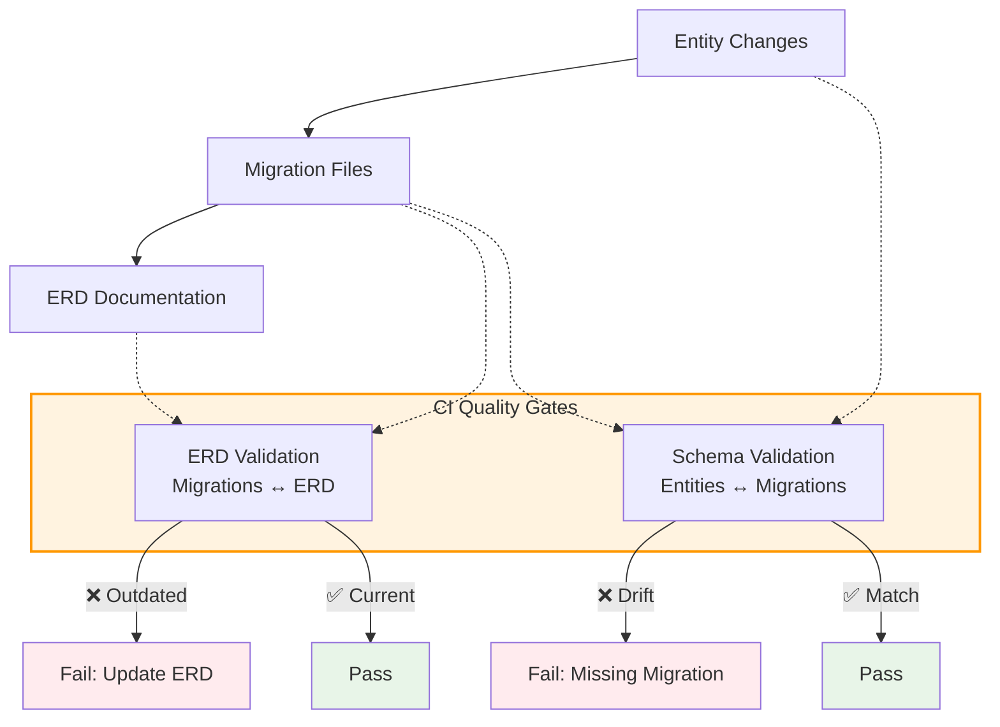

## Quick Start

**Essential workflow for creating database migrations:**

1. **Create/modify JPA entities** with proper annotations

2. **Generate migration:**

   ```bash
   npm run db:draft-changelog
   ```

3. **VALIDATE & edit** the generated `changelog_new.xml` (critical!)

4. **Rename and move** the file:

   ```bash
   # Use the changeset ID from the XML file as filename
   mv server/application-server/src/main/resources/db/changelog_new.xml \
      server/application-server/src/main/resources/db/changelog/1749286026779_changelog.xml
   ```

5. **Update documentation:**

   ```bash
   npm run db:generate-erd-docs
   ```

6. **Update intelligence service database models**:

   ```bash
   npm run db:generate-models:intelligence-service
   ```

7. **Commit and create PR** - CI will validate your changes

:::danger
**Always validate migrations.** Generated changelogs can contain data-destructive operations. Follow the [validation checklist](#validation-checklist) before committing.
:::

## CI Pipeline Validation

The CI pipeline runs two critical database checks:

### 1. Database Schema Validation (`database-schema-validation`)

- **Purpose**: Ensures JPA entities match committed migrations
- **Process**:
  - Applies all committed migrations to fresh database
  - Compares resulting schema with JPA entities
  - Fails if schema drift detected (missing migrations)
- **Failure**: Creates `changelog_new.xml` showing required migration

### 2. Database Documentation Validation (`database-documentation-validation`)

- **Purpose**: Ensures ERD documentation reflects actual migration-based schema
- **Process**:
  - Applies committed migrations to fresh database
  - Generates ERD from migration-based schema
  - Compares with committed ERD documentation
- **Failure**: ERD documentation is outdated

### 3. Intelligence Service Model Validation

- **Purpose**: Ensures SQLAlchemy models in intelligence service stay synchronized
- **Process**:
  - Applies all committed migrations to fresh database
  - Generates SQLAlchemy models using `sqlacodegen`
  - Compares with committed models in `server/intelligence-service/app/db/models_gen.py`
- **Failure**: Fails if models are outdated

## Why Migrations?

Database migrations ensure schema changes are versioned, reviewable, and safely deployable across all environments. Without them, team members would have inconsistent database states leading to errors and deployment issues.

## Development Workflow

### 1. Entity Changes

- Modify JPA entities with proper annotations
- Test locally (uses `spring.jpa.hibernate.ddl-auto=update`)

### 2. Create Migration

- Generate migration: `npm run db:draft-changelog`
- **Critical**: Validate and edit the generated `changelog_new.xml`
- Rename and move to proper location
- Update ERD documentation: `npm run db:generate-erd-docs`
- Update intelligence service database models: `npm run db:generate-models:intelligence-service`

### 3. Common Validation Issues

**Data Loss Prevention:**

```xml
<!-- ❌ Causes data loss -->
<dropColumn tableName="user" columnName="first_name"/>
<addColumn tableName="user">
    <column name="firstName" type="VARCHAR(255)"/>
</addColumn>

<!-- ✅ Safe rename -->
<renameColumn tableName="user"
              oldColumnName="first_name"
              newColumnName="firstName"/>
```

**Author Field:**

- Replace "user (generated)" with your GitHub username

**Sequence Values:**

- New sequences should start at `1`, not current database values

### Validation Checklist

Use this quick checklist before committing migrations:

- Review generated XML for destructive operations and prefer non-destructive changes (e.g., `renameColumn` instead of `dropColumn`).
- Replace the default Liquibase `author` with your GitHub username.
- Ensure new sequences start at `1` and existing sequences keep their original values.
- Regenerate ERD documentation (`npm run db:generate-erd-docs`).
- Update intelligence service models (`npm run db:generate-models:intelligence-service`).

## Examples

### Adding New Field

```java
@Entity
public class User {
    // ...existing fields...
    @NonNull
    private String email;  // New field
}
```

Generated migration:

```xml
<changeSet author="yourusername" id="1749286026779-1">
    <addColumn tableName="user">
        <column name="email" type="VARCHAR(255)">
            <constraints nullable="false"/>
        </column>
    </addColumn>
</changeSet>
```

### CI Validation Process



## Resources

- [Liquibase Documentation](https://docs.liquibase.com/home.html)
- [Spring Data JPA Reference](https://docs.spring.io/spring-data/jpa/docs/current/reference/html/)
- [Jakarta Persistence Guide](https://jakarta.ee/specifications/persistence/)

## Intelligence Service Integration

The intelligence service (Python/FastAPI) uses **auto-generated SQLAlchemy models** that reflect the current database schema. These models must stay synchronized with migrations:

### When to Update Models

- **After any database migration** that affects tables used by the intelligence service (currently all tables, but may change in future)
- **Before committing migration changes** to ensure consistency
- **When CI fails** with model-related errors

### Model Generation Process

```bash
# Generate SQLAlchemy models from current schema
npm run db:generate-models:intelligence-service
```

This command:

1. Applies all committed migrations to ensure up-to-date schema
2. Generates SQLAlchemy models using `sqlacodegen`
3. Updates `server/intelligence-service/app/db/models_gen.py`

### Critical Files

- `server/intelligence-service/app/db/models_gen.py` - Auto-generated models
- `server/intelligence-service/app/db/service.py` - Database service using models
- `server/intelligence-service/scripts/generate_db_models.py` - Generation script

:::note
**SQLAlchemy models are disposable artifacts**—they are regenerated from the schema, not manually edited. The database migrations remain the source of truth.
:::
