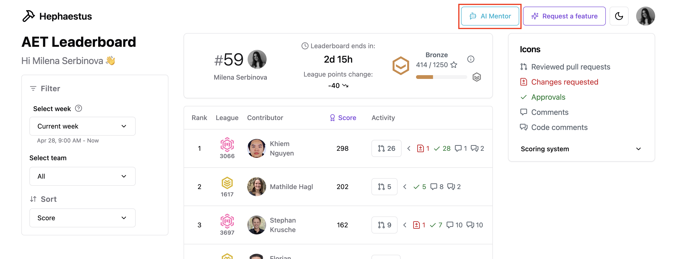
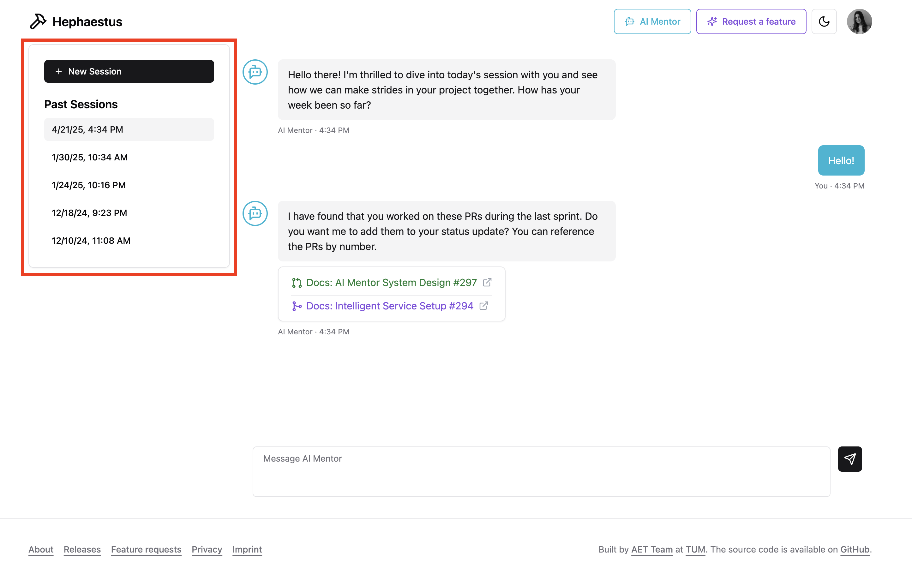
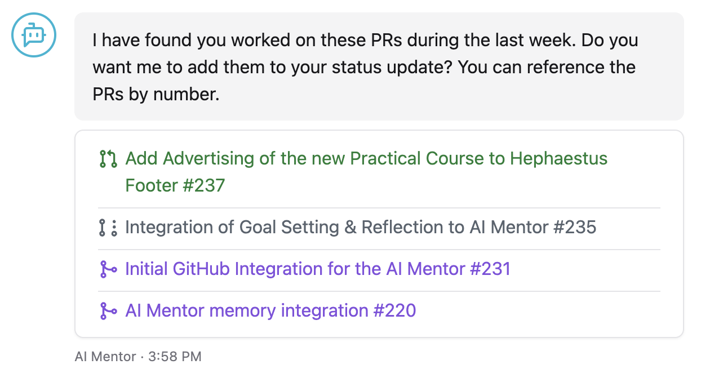
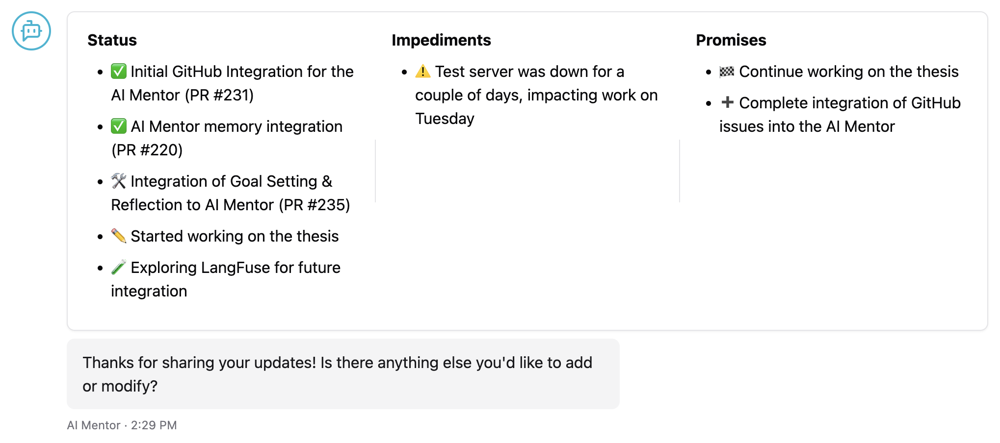

Hephaestus AI Mentor supports students during software engineering projects. It streamlines self-reflection, tracks development progress, and keeps teams focused on their goals. Regular check-ins guided by the mentor help address common issues such as poor planning or rushed work.

## Chat flow

### Getting started

Open the AI Mentor from the top navigation bar. Click the button to launch the chat interface.

 to begin your first session. The mentor automatically kicks off the conversation.

Your past sessions appear in the session history on the left. Select any entry to revisit and review it.

:::note
You can start a new session at any time by clicking . If the previous session is unfinished, AI Mentor will not have full context and may provide less tailored support.
:::

For a visual walkthrough of the onboarding flow, watch the demonstration video below:

<iframe src="https://live.rbg.tum.de/w/artemisintro/59978?video_only=1&t=0" allowfullscreen="1" frameborder="0" width="600" height="350" style={{marginBottom: '25px'}}>
        A tutorial video demonstrating the initial interaction with the AI Mentor (TUM-Live).
</iframe>

### Goal setting and alignment

During the first session, the mentor helps you define goals and outline current project objectives. Later sessions revisit these goals, offer insights, suggest adjustments, and prompt self-reflection to reduce stress throughout the project.

### PR overview

AI Mentor pulls information from the GitHub repositories you work on. It reviews pull requests (PRs) active in the past week and displays them in an interactive interface linked directly to GitHub.

Select the PRs that are relevant for the current week's progress summary. The mentor uses your selection later in the session to support reflection.

### Status updates

Throughout the reflective session, AI Mentor guides you through reviewing the past week—what you worked on, challenges you faced, and plans for the next week.

### Session summary

After the status update, AI Mentor generates a draft stand-up summary. Review it, make corrections, and suggest changes as needed.

To see the AI Mentor in action, explore this video tutorial:

<iframe src="https://live.rbg.tum.de/w/artemisintro/59979?video_only=1&t=0" allowfullscreen="1" frameborder="0" width="600" height="350" style={{marginBottom: '25px'}}>
        A tutorial video demonstrating the initial interaction with the AI Mentor (TUM-Live).
</iframe>