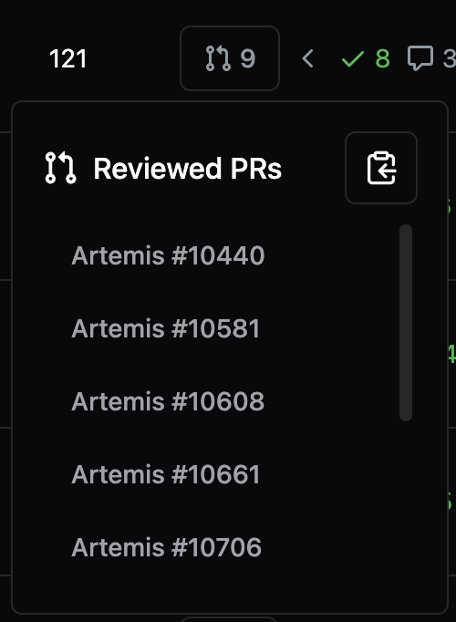
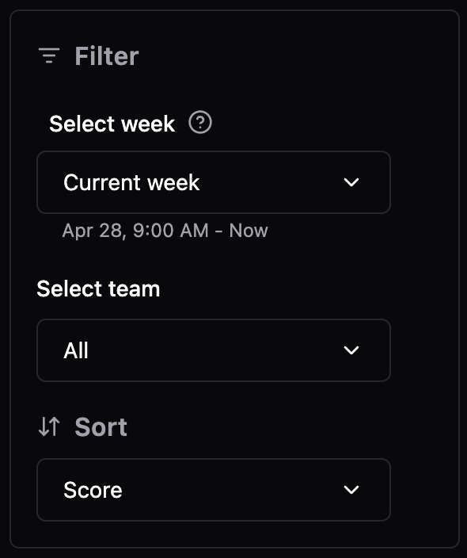

## Overview

Hephaestus provides weekly leaderboards that track and rank contributors based on their code review activities within selected repositories of your organization.
A scoring system is used to evaluate contributions. The leaderboards are calculated in real-time and typically last for one week.

## Accessing the Leaderboard

To access the leaderboard, log in to Hephaestus using your GitHub account. Upon successful login, you will be directed to the leaderboard landing page. You can return to the leaderboard at any time by clicking the Hephaestus logo in the top-left corner.

<iframe height="450px" width="600px" src="https://live.rbg.tum.de/w/artemisintro/59981?video_only=1&t=0" title="Embedded Video" frameborder="0" allow="accelerometer; autoplay; clipboard-write; encrypted-media; gyroscope; picture-in-picture; web-share" allowfullscreen></iframe>

## Understanding the Leaderboard

The main page displays an overview card summarizing your current rank and league details, including:
- Your rank in the currently selected leaderboard
- The time remaining until the current leaderboard ends
- Your potential change in league points based on the current score and position
- Your current league and progress towards the next league

:::tip
Clicking your rank scrolls the leaderboard to your entry.
:::

The leaderboard table includes the following columns:
- Rank
- Contributor
- Leaderboard Score
- Activity

Selecting a contributor's row opens their profile page, offering a detailed view of their activity and contributions.

To view the Pull Requests reviewed by a specific contributor, click the button in their `Activity` column. A modal will appear listing these Pull Requests. Clicking on a Pull Request title navigates you directly to it on GitHub. The modal includes a "Copy" button in the top-right corner, allowing you to copy a formatted list of the reviewed Pull Requests to your clipboard. This feature simplifies sharing activity summaries with your team, for instance, during regular meetings or for documentation purposes.

## Customizing the Leaderboard

You can review leaderboards from previous weeks in addition to the current one. Select a past time period using the dropdown menu; typically, the last four weeks are accessible. The exact time frame for the selected leaderboard is shown beneath the dropdown.

Additionally, a second filter allows you to select specific teams within your organization, enabling you to focus on team performance or view your ranking within your team.

:::note
Your individual rank appears only when you view a leaderboard for a team you belong to. Selecting a different team hides your personal ranking.
:::

Finally, you can sort the leaderboard by different criteria. While the default sorting is by leaderboard score, you can also sort by league points to better understand overall progress across leagues.

<!-- TODO: admin part of the leaderboard -->